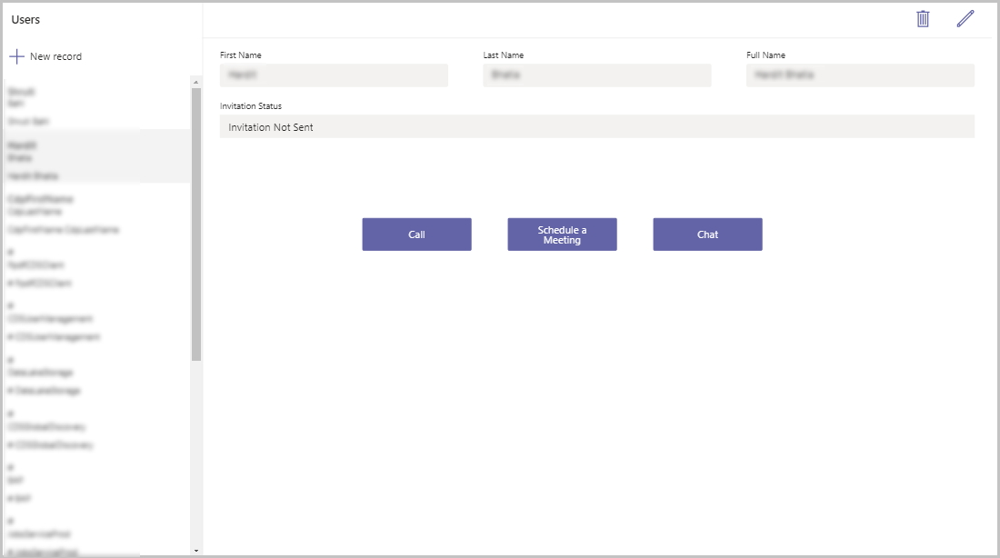
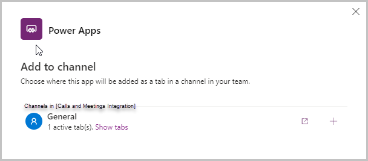
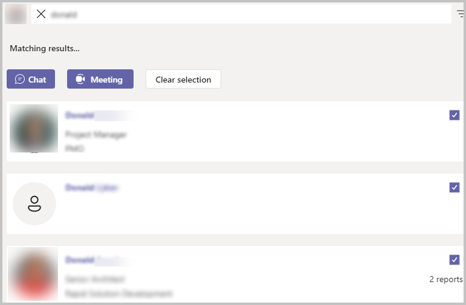

# Integrate with calls and meetings

Apps in Microsoft Teams drive collaboration by enabling users to do work where they communicate and collaborate. Many apps require a “back and forth” communication or passing items between people. For example, in the Inspection sample app for Teams, managers create inspection forms, users complete the inspection, and reviewers review the inspections.

Power Apps in Teams can leverage deep integration with other Teams capabilities to make apps collaborative. In this article, we'll learn how we can integrate Power Apps with Teams to make calls or schedule meetings with other users within the organization.

## Prerequisites

To complete this lesson, we'd need the ability to create apps within Teams that will be available as part of select Microsoft 365 subscriptions.

## Log in into Teams

Log in into Teams using either the Desktop app or the web app

## Create a new team

In this section, we'll create a new Teams team, and then create an app within that team. Skip this section if you already have a team that you want to use.

1. To create a new team, select the Teams tab > select **Join or create a team** on the bottom-left side of the screen > select **Create Team** > select **From Scratch** > select **Public**, and give the team a name such as "Calls and Meetings Integration". And then, select **Create**.

1. If you have any members in your organization you'd like to add to the team for testing purposes, add them in the pop-up, and then select **Add**.

1. Select **Close**.

The new team gets created and is listed under the Teams tab

## Create a new app

Well create an app with a gallery of users and buttons on each of the display forms to either call, chat or schedule a meeting with a user from the list.

1. Open Teams app.

1. Select **Power Apps** from the left-pane.

1. Select **+ New app** under **Recent apps**.

1. Select the team created earlier, and select **Create** to open the app in Power Apps Studio.

1. Enter a name for the app, such as "Integrate with calls and meetings".

1. Select **Save**.

    The app shows a default gallery

1. Select the gallery, and search for users in the **Add a data source** search box.

1. Select **Users** from the list of data sources.

    The list of users shows in the gallery on the left-side of the screen. The right-side of the screen shows details of the selected user record.

1. Select the app from the left-pane, and update the **OnStart** property of the app with the following formula:

    ```powerapps-dot
    Set(gblIsHostClientWeb,Param("hostClientType")="web")
    ```

    > [!NOTE]
    > This formula checks if the user is accessing Teams from a web browser, desktop, or a mobile app.

1. Select **Screen1** from the Tree view.

1. Select **+** (Insert) > **Button** to add a button.

1. Move the button to the details pane on the right-side of the screen.

1. Set the following properties of the button.

    | Property | Value  |
    |----------|--------|
    | Text     | "Call" |
    | Width    | 150    |
    | Height   | 45     |
    | X        | 500    |
    | Y        | 300    |

    Copy the following formula in the **OnSelect** property of the button:

    ```powerapps-dot
    If(
        gblIsHostClientWeb,
        Launch(
            "https://teams.microsoft.com/l/call/0/0?users="&BrowseGallery1.Selected.'Primary Email',
            {},
            LaunchTarget.New
        ),
        Launch(
            "msteams://teams.microsoft.com/l/call/0/0?users="&BrowseGallery1.Selected.'Primary Email',
            {},
            LaunchTarget.New
        )
    )
    ```

    > [!NOTE]
    > - If the user is accessing Teams using a web browser, this will launch the call window in the browser itself because of `https://` protocol identifier. If the user is accessing Teams using the Teams desktop or mobile app, then it launches the call window in the Teams app itself because of `msteams://` instead.
    > - The format to launch a call through a deep-link is:
    > `https://teams.microsoft.com/l/call/0/0?users=\<user1\>,\<user2]`. More information: [Generate a deep link to a call](/microsoftteams/platform/concepts/build-and-test/deep-links#generate-a-deep-link-to-a-call)

1. Add another button with the following properties:

    | Property | Value               |
    |----------|---------------------|
    | Text     | "Schedule a Meeting" |
    | Width    | 150                 |
    | Height   | 45                  |
    | X        | Button1.X + 200     |
    | Y        | Button1.Y           |

1. Copy the following formula in the **OnSelect** property of the new button:

    ```powerapps-dot
    If(
        gblIsHostClientWeb,
        Launch(
            "https://teams.microsoft.com/l/meeting/new?subject=New%20Meeting&attendees="&BrowseGallery1.Selected.'Primary Email',
            {},
            LaunchTarget.New
        ),
        Launch(
            "msteams://teams.microsoft.com/l/meeting/new?subject=New%20Meeting&attendees="&BrowseGallery1.Selected.'Primary Email',
            {},
            LaunchTarget.New
        )
    )
    ```

1. Add a third button with the following properties

    | Property | Value               |
    |----------|---------------------|
    | Text     | "Chat"              |
    | Width    | 150                 |
    | Height   | 45                  |
    | X        | Button1.X + 200     |
    | Y        | Button1.Y           |

1. Copy the following formula in the **OnSelect** property of the new button:

    ```powerapps-dot
    If(
        gblIsHostClientWeb,
        Launch(
            "https://teams.microsoft.com/l/chat/0/0?users="&BrowseGallery1.Selected.'Primary Email'&"&topicName=&message=Hi!",
            {},
            LaunchTarget.New
        ),
        Launch(
            "msteams://teams.microsoft.com/l/chat/0/0?users="&BrowseGallery1.Selected.'Primary Email'&"&topicName=&message=Hi!",
            {},
            LaunchTarget.New
        )
    )
    ```

    The screen should appear as shown below

    

## Save and publish the app

1. Select **Save** on the top-right side of the screen to save the app.

1. Select **Publish** to publish the app.

1. Select **Next** in the pop-up.

1. Under **Add to Channel**, make sure the channel under which the app should be shown is listed and shows as "1 active tab(s)" and not "0 active tab(s)".

    

1. Select **Save and Close**.

## Test the app

1. Run the app in the preview mode.

1. Select a user from the list on the left.

1. If you don't have a user showing up in the list, share the app with another colleague/user. Once that user logs in into the app, they'll show up in this list of users.

1. Select the user from the list.

1. Test the options. 

The call button launches a new call. The meeting button creates a meeting invitation with the selected person

## See chat, call, and meeting integration in action

For an example of chat, call, and meeting integration in action, check out the [Profile +](profile-app.md) sample app for Teams.

When opened from within a Team, the app displays the other members of the team. You can select the **Select people to connect with** and select one or more people, then start a call or chat with the selected people, or schedule a meeting.



### See also

- [Boards (preview) sample app](boards.md)
- [Bulletins sample app](bulletins.md)
- [Employee ideas sample app](employee-ideas.md)
- [Get connected (preview)](get-connected.md)  
- [Inspection sample apps](inspection.md)  
- [Issue reporting sample apps](issue-reporting.md)
- [Milestones sample app](milestones.md)
- [Perspectives (preview) sample app](perspectives.md)
- [Profile+ (preview) sample app](profile-app.md)
- [Customize sample apps](customize-sample-apps.md)
- [Sample apps FAQs](sample-apps-faqs.md)

[!INCLUDE[footer-include](../includes/footer-banner.md)]
