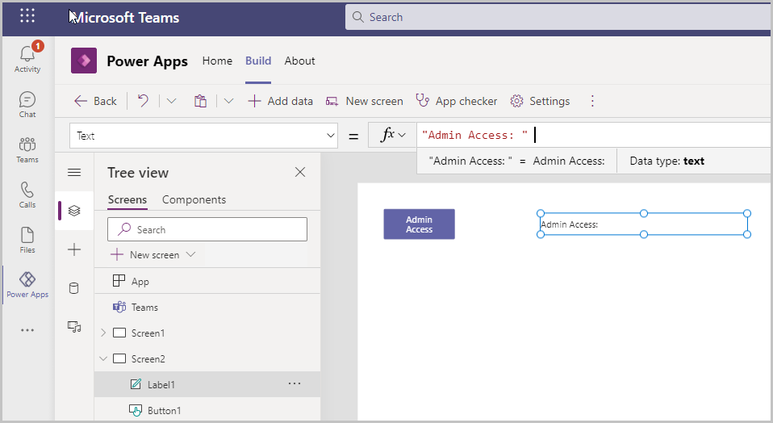
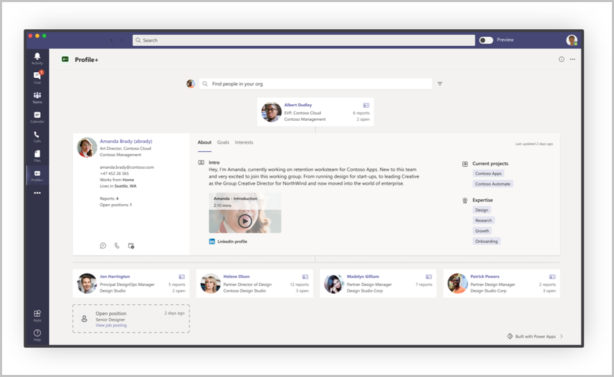

# Integrate with Azure Active Directory

In this topic we will learn how we can integrate Power Apps with Azure AD.

Integration with Active Directory enables many deep capabilities within your organization hierarchy, the people in your organizations, and groups. For example, you can get information about a person, their job title, department, or photo. You can also get information about the users’ organization hierarchy, such as their manager.

It can also be used to grant access to app functionality based on their role or group membership, and can therefore be used to control security to sensitive data or functionality.

In this topic we will create a Power Apps app with a button called admin access on it and the visibility of the button will depend on whether the user is a member of the admin group or not.

## Prerequisites

To complete this lesson, we would need the ability to create apps within Microsoft Teams which will be available as part of select Microsoft 365 subscriptions. We will also need access to Azure AD to create the admin group and assign members to it.

## Login into Microsoft Teams

Login into Microsoft teams using either the Desktop app or the web app

## Create a new Team

In this section we will create a new Microsoft Teams team and then create an app within that team (If you already have a team you can use, then you can skip this section)

1.  To create a new team, select the Teams tab and then select **Join or create a team** on the left bottom of the screen -\> then select Create Team -\> From Scratch -\> Public and give the team a name – Azure AD Integration for our example and select Create

2.  The next pop up that shows up is the is the Add members to the Team – if you have any members in your organization you would like to add to the team for testing purposes, select and add them here and select the Add button

3.  The member gets added to the team

4.  Select Close

5.  The new team gets created and is listed under the Teams tab

## Create a new Azure Group

1.  Open a browser window and go to portal.azure.com

2.  Login with the same account you are logged in into Teams with

3.  On the top Search bar enter Groups and open Groups

4.  List of all groups in your organization will show up

5.  Select **+New Group** to create a new group

6.  Setup the group with the following values

    a.  Group Type = Microsoft 365

    b.  Group name = Admin Access

    c.  Group email address gets automatically populated

    d.  Group description = Group for users with Admin Access

7.  Select Create

8.  The group gets created

9.  Now, on the Group overview screen, there would be a GUID populated in the
    Object Id field

10. Copy that and save it in a notepad file or somewhere handy

## Create a new App

We will create a simple app with a button that will only show up if the user is
a member of the team we created above

1.  Open Teams apps

2.  Select the Power Apps icon in the left navigation menu

3.  Select the +New App button under Recent apps

4.  Select the team we just created and select Create

5.  The app gets created and the app studio opens allowing us to make edits to the app

6.  Enter a Name for the app – Integrate with AD and select Save

7.  Select the Database View from the left navigation menu and select +Add data

8.  Then select Connectors and -\> See all connectors

9.  Search for Azure AD and select to add that as a connection

10. Select Connect

11. Sign in into the account screen will popup

12. Sign in and select Accept

13. Azure AD gets added as a connector

14. Select the Tree View

15. Select **+New** screen to add a new screen to the app

16. Select the **+** (Insert) icon on the left navigation menu

17. Select Button – a button gets added to the screen

18. Select the Text property of the button and update the Button Text to “Admin
    Access”

19. Select the **+** (Insert) to add a label to the screen

20. Add the Text – “Admin level: “ to the Text property of the label



21. Now select App from the tree view and open the OnStart property

22. On the OnStart property, type in the following formula

```
If(
    !IsEmpty(
        AzureAD.CheckMemberGroups(
            User().Email,
            ["37443d6a-399b-4939-a50e-bbe8fbc3351c"]
        ).Value
    ),
    Set(varAdmin,true),
    Set(varAdmin,false)
)
```

NOTE: the GUID highlighted in red should be replaced with the GUID you copied in step #9 of [Create a new Azure Group](#create-a-new-azure-group) section

23. Select the three dots next to App and select Run OnStart

24. Select the three dots next to Settings on the top ribbon and select to view variables

25. varAdmin is set to False

26. Select Screen 2 from the Tree view and update the Text formula for the label to "Admin Level: " & varAdmin

27. The label will currently show as Admin level: false on the screen

28. We will now control the visibility of the Admin Access button so that it only shows up when the User is an admin (for example, belongs to the Admin Access group in Azure AD)

29. Select the button and set the Visible property to varAdmin

30. The button does not show up anymore since we do not have admin access

## Testing the integration

1.  Now go back to portal.azure.com

2.  Select the group we created

3.  Select Members under Manage from the left navigation menu

4.  Select +Add members to add members to the group

5.  Select your user from the list of users under Add members to add to the
    group

6.  Select Select

7.  Your user (and any other users selected) get added to the group

8.  Now, go back to Teams

9.  Select the Tree view

10. Select App -\> Run OnStart

11. The admin access button is now visible on Screen 2 and the label says admin level true since we are now members of the Admin Access group

## See Active Directory integration in action:

You can see an example of Active Directory integration in the Profile + Power Apps template app for Microsoft Teams.



Office 365 Users connector is used to retrieve the user profile, including name, photo, manager, and other details. Office 365 Groups connector is also used to retrieve the people who report to a selected user.