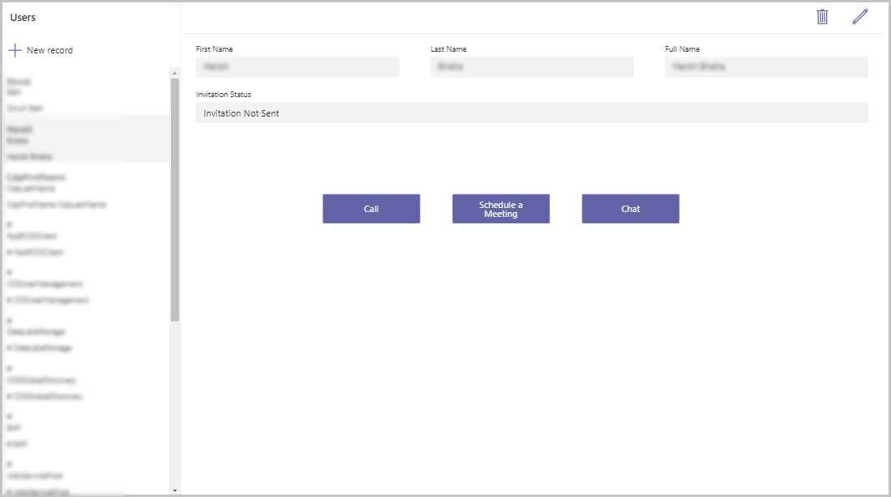
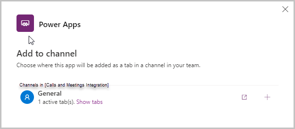
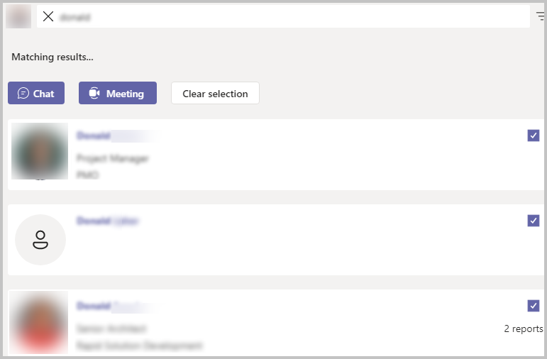

# Integrate with calls/meetings

Microsoft Teams apps drive collaboration by enabling users to do work where they communicate and collaborate. Many apps require a “back and forth” communication or passing items between people.

For example, in the Inspection Power Apps template for Microsoft Teams, managers create inspection forms, users complete the inspection, and reviewers review the inspections.

Power Apps in Teams can leverage deep integration with other Teams capabilities to make apps collaborative.

In this topic we will learn how we can integrate Power Apps with Teams to make calls or schedule meetings with other users within the organization.

## Prerequisites

To complete this lesson, we would need the ability to create apps within Microsoft Teams which will be available as part of select Microsoft 365 subscriptions.

## Log in into Microsoft Teams

Log in into Microsoft teams using either the Desktop app or the web app

## Create a new Team

In this section we will create a new Microsoft Teams team and then create an app within that team (If you already have a team you can use, then you can skip this section)

1.  To create a new team, select the Teams tab and then select **Join or create a team** on the left bottom of the screen -\> then select **Create Team** -\> **From Scratch** -\> **Public** and give the team a name – Calls and Meetings Integration for our example and select Create
    
2.  The next pop up that shows up is the is the Add members to the Team – if you have any members in your organization you would like to add to the team for testing purposes, select and add them here and select the Add button
    
3.  The member gets added to the team

4.  **Select Close**

5.  The new team gets created and is listed under the Teams tab

## Create a new App

We will create a simple app with a Gallery of users and buttons on each of the display forms to either call, chat or schedule a meeting with a user from the list

1.  Open Teams apps
2.  Select the Power Apps icon in the left navigation menu
3.  Select the **+New App** button under Recent apps
4.  Select the team we just created and select Create
5.  The app gets created and the app studio opens allowing us to make edits to
    the app
6.  Enter a Name for the app – Integrate with calls and meetings and select Save
7.  The app shows a default gallery
8.  Select the Gallery and search for Users in the Add a data source search box
9.  Select Users from the list of data sources
10.  The list of users shows in the gallery on the left side of the screen
11.  The right side of the screen shows details of the selected User record
12.  Now, select App and update the OnStart property of the app with the following formula

```
Set(gblIsHostClientWeb,Param("hostClientType")="web")
```

(NOTE: This is to check if the user is accessing Teams from a web browser or
any other client like the Teams desktop app or the Teams mobile app on
Android and iOS)

1. Select Screen1 from the Tree view

2. Select the right side of the screen and select the **+** (Insert) option and add a new button to the screen

3. Move the button to the details pane on the right side of the screen

4. Set the following properties of the button

| Property | Value  |
|----------|--------|
| Text     | "Call" |
| Width    | 150    |
| Height   | 45     |
| X        | 500    |
| Y        | 300    |

Use this code in the OnSelect property of the button:
```
If(
    gblIsHostClientWeb,
    Launch(
        "https://teams.microsoft.com/l/call/0/0?users="&BrowseGallery1.Selected.'Primary Email',
        {},
        LaunchTarget.New
    ),
    Launch(
        "msteams://teams.microsoft.com/l/call/0/0?users="&BrowseGallery1.Selected.'Primary Email',
        {},
        LaunchTarget.New
    )
)
```

(NOTE: If the user is accessing Teams via a web browser, this will launch the call window in the browser itself because of https://. If the user is accessing Teams via the Teams desktop/mobile app, then it launches the call window in the Teams app itself because of msteams://)

NOTE: The format to launch a call via a deep-link is:

```
[https://teams.microsoft.com/l/call/0/0?users=\<user1\>,\<user2](https://teams.microsoft.com/l/call/0/0?users=%3cuser1%3e,%3cuser2)\>
```

For more information, see: [https://docs.microsoft.com/microsoftteams/platform/concepts/build-and-test/deep-links\#generate-a-deep-link-to-a-call](https://docs.microsoft.com/microsoftteams/platform/concepts/build-and-test/deep-links#generate-a-deep-link-to-a-call)

1.  Add a 2nd button with the following properties

| Property | Value               |
|----------|---------------------|
| Text     | "Schedule a Meeting" |
| Width    | 150                 |
| Height   | 45                  |
| X        | Button1.X + 200     |
| Y        | Button1.Y           |

2. Use this code in the OnSelect property of the 2nd button

```
If(
    gblIsHostClientWeb,
    Launch(
        "https://teams.microsoft.com/l/meeting/new?subject=New%20Meeting&attendees="&BrowseGallery1.Selected.'Primary Email',
        {},
        LaunchTarget.New
    ),
    Launch(
        "msteams://teams.microsoft.com/l/meeting/new?subject=New%20Meeting&attendees="&BrowseGallery1.Selected.'Primary Email',
        {},
        LaunchTarget.New
    )
)
```

(NOTE: If the user is accessing Teams via a web browser, this will launch the meeting window the user is accessing Teams via the Teams desktop/mobile app, then it launches the meeting window in the Teams app itself because of msteams://)

3.  Add a third button with the following properties

| Property | Value               |
|----------|---------------------|
| Text     | "Chat"              |
| Width    | 150                 |
| Height   | 45                  |
| X        | Button1.X + 200     |
| Y        | Button1.Y           |

4. Use this code in the OnSelect property of the 2nd button

```
If(
    gblIsHostClientWeb,
    Launch(
        "https://teams.microsoft.com/l/chat/0/0?users="&BrowseGallery1.Selected.'Primary Email'&"&topicName=&message=Hi!",
        {},
        LaunchTarget.New
    ),
    Launch(
        "msteams://teams.microsoft.com/l/chat/0/0?users="&BrowseGallery1.Selected.'Primary Email'&"&topicName=&message=Hi!",
        {},
        LaunchTarget.New
    )
)
```

(NOTE: If the user is accessing Teams via a web browser, this will launch the chat window in the browser itself because of https://. If the user is accessing Teams via the Teams desktop/mobile app, then it launches the chat window in the Teams app itself because of msteams://)

5.  The screen should appear as shown below



## Save and Publish the App

1.  Select **Save** on the top right to save the app

2.  Select the Publish button on the top right to Publish the app

3.  Select Next on the popup

4.  Under Add to Channel, make sure the Channel under which the app should be shown is listed and shows as 1 active tab(s) and not 0 active tab(s).



1.  Select Save and Close to complete the publishing of the app

2.  The app gets published

## Testing the app

1.  Run the App in preview mode

2.  Select a User from the list on the left

3.  If you do not have a user showing up in the list, share the app with another
 colleague/user and once that user logs in into the app, they will show up in the list of users here

4.  Select the User from the list

5.  Test the options

6.  The call button launches a new call

7.  The meeting button creates a meeting invitation with the selected person

## See chat, call, and meeting integration in action

For an example of chat, call, and meeting integration in action, check out the **Profile +** template Power App for Microsoft Teams (aka.ms/teamsprofileplus).

When opened from within a Team, the app displays the other members of the team. You can select the **Select people to connect with**  button and select one or more people, then start a call or chat with the selected people, or schedule a meeting.


