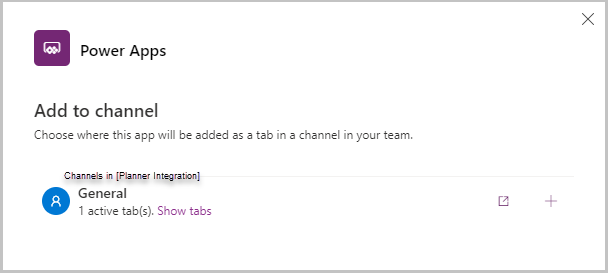
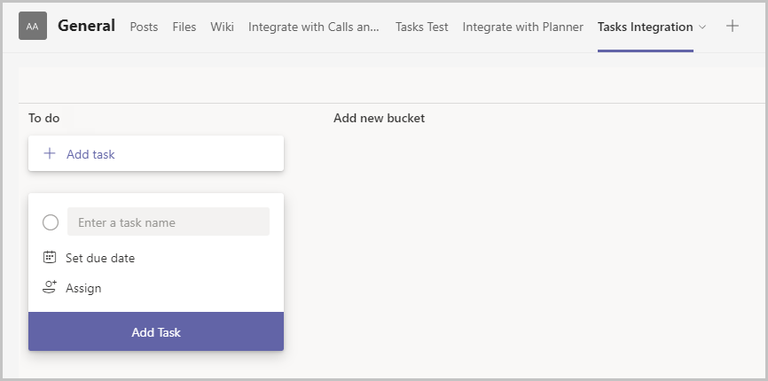
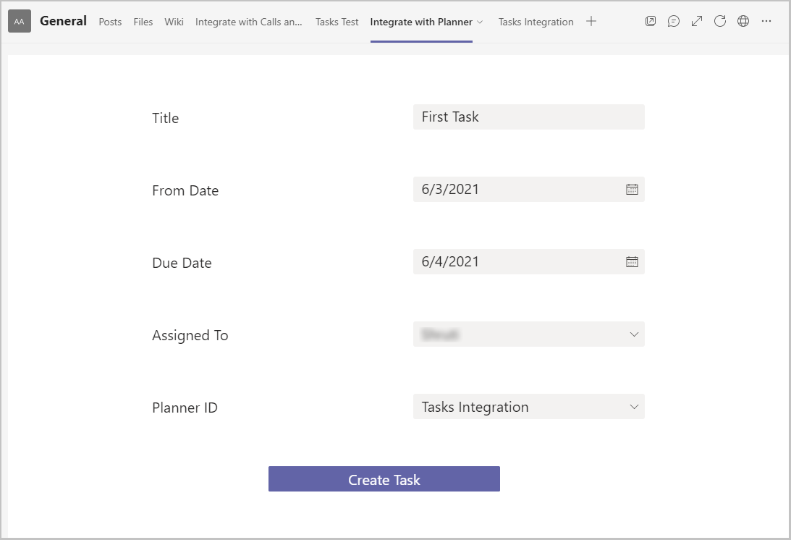
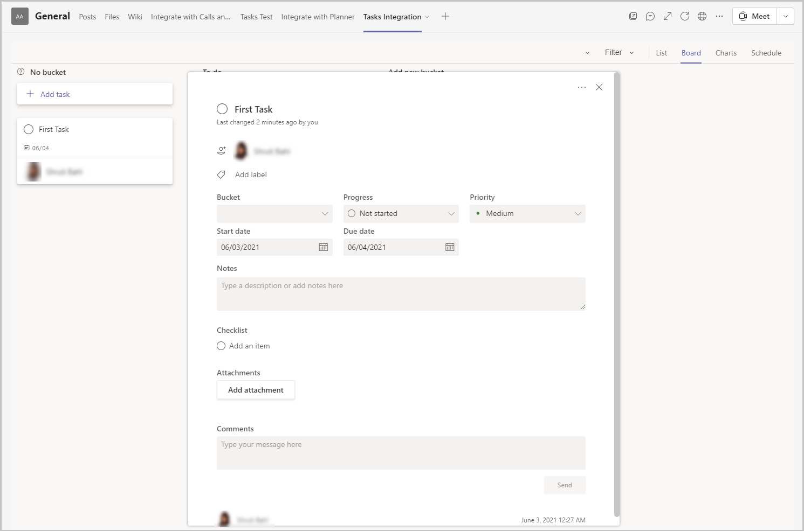

#  Integrate your Microsoft Teams Power App with Microsoft Planner

In this topic we will learn how we can integrate Power Apps with Microsoft Planner to create and assign tasks to users within the organization.

Power Apps in Microsoft Teams enable collaboration between people and groups. Employees already use Teams to work, communicate and collaborate. Teams apps have deep integration with other Teams capabilities. For example, in Microsoft Teams you can assign tasks to Team members using Microsoft Planner in your Teams channel. Apps that require follow up by others in your Team, such as to address issues reported in the Issue Reporting app, can leverage Planner in the Teams channel and create Tasks where users already manage their tasks.

## Prerequisites

To complete this lesson, we would need the ability to create apps within Microsoft Teams which will be available as part of select Microsoft 365 subscriptions. We will also need the ability to connect to Microsoft Planner.

## Login into Microsoft Teams

Login into Microsoft teams using either the Desktop app or the web app

## Create a new Team

In this section we will create a new Microsoft Teams team and then create an app within that team (If you already have a team you can use, then you can skip this section)

1.  To create a new team, select the Teams tab and then select **Join or create a team** on the left bottom of the screen -\> then select **Create Team** -\> **From Scratch** -\> **Public** and give the team a name – Planner Integration for our example and select Create

2.  The next pop up that shows up is the is the Add members to the Team – if you have any members in your organization you would like to add to the team for testing purposes, select and add them here and select the Add button

3.  The member gets added to the team

4.  Select Close

5.  The new team gets created and is listed under the Teams tab

## Create a new App

We will create a simple app five fields capturing details that will be used to create a Task in Microsoft Planner

1.  Open Teams apps

2.  Select the Power Apps icon in the left navigation menu

3.  Select the +New App button under Recent apps

4.  Select the team we just created and select Create

5.  The app gets created and the app studio opens allowing us to make edits to
    the app

6.  Enter a Name for the app – Integrate with Planner and select Save

7.  The app shows a default gallery

8.  Select the database option from the left navigation menu to connect to the
    Planner

9.  Select +Add data and then select Connectors

10. Enter Planner in the search box to look for the Planner connector

11. Select Planner

12. Establish connection with the Planner by signing into it if needed

13. Planner gets added as a data connection to the app

14. Select to open the Tree view

15. Add a new screen by selecting **+New screen** and then select **Blank layout**.

16. Add the following five controls

    a. Title (text input)

    | Property | Value           |
    | -------- | --------------- |
    | Name     | Title           |
    | Type     | Text box        |
    | X        | Screen2.Width/2 |
    | Y        | 135             |
    | Width    | 320             |
    | Height   | 35              |

    b. From Date (date picker)
    
    | Property | Value           |
    | -------- | --------------- |
    | Name     | FromDate        |
    | Type     | Date picker     |
    | X        | Screen2.Width/2 |
    | Y        | 235             |
    | Width    | 320             |
    | Height   | 35              |
    
    3. Due Date (date picker)

    | Property | Value           |
    | -------- | --------------- |
    | Name     | DueDate        |
    | Type     | Date picker     |
    | X        | Screen2.Width/2 |
    | Y        | 335             |
    | Width    | 320             |
    | Height   | 35              |
    
    4. Assigned To (combo box)

    | Property | Value           |
    | -------- | --------------- |
    | Name     | AssignedTo      |
    | Type     | Combo box       |
    | X        | Screen2.Width/2 |
    | Y        | 435             |
    | Width    | 320             |
    | Height   | 35              |
    
    5. Planner ID (combo box)

    | Property | Value                                            |
    | -------- | ------------------------------------------------ |
    | Name     | PlannerID                                        |
    | Type     | Combo box                                        |
    | Items    | Planner.ListGroupPlans(Param("groupID")).value   |
    | X        | Screen2.Width/2                                  |
    | Y        | 535                                              |
    | Width    | 320                                              |
    | Height   | 35                                               |

17. Add the following five labels

    1.  Title

    | Property | Value       |
    |----------|-------------|
    | Name     | Label_Title |
    | X        | 365         |
    | Y        | 135         |
    | Width    | 320         |
    | Height   | 35          |

    2.  From Date

    | Property | Value          |
    |----------|----------------|
    | Name     | Label_FromDate |
    | X        | 365            |
    | Y        | 235            |
    | Width    | 320            |
    | Height   | 35             |

    3.  Due Date
    
    | Property | Value          |
    |----------|----------------|
    | Name     | Label_DueDate  |
    | X        | 365            |
    | Y        | 335            |
    | Width    | 320            |
    | Height   | 35             |

    4.  Assigned To

    | Property | Value             |
    |----------|-------------------|
    | Name     | Label_AssignedTo  |
    | X        | 365               |
    | Y        | 435               |
    | Width    | 320               |
    | Height   | 35                |

    5.  Planner ID

    | Property | Value             |
    |----------|-------------------|
    | Name     | Label_PlannerID   |
    | X        | 365               |
    | Y        | 535               |
    | Width    | 320               |
    | Height   | 35                |

18. Add a button to the bottom of the screen with the following properties

    | Property | Value             |
    |----------|-------------------|
    | Name     | Button_CreateTask   |
    | X        | 526               |
    | Y        | 635               |
    | Width    | 320               |
    | Height   | 35                |

19.  Use this code in the OnSelect property of Button_CreateTask

```
Planner.CreateTaskV3(
    Param("groupId"),
    PlannerID.Selected.id,
    Title.Value,
    {
        startDateTime: FromDate.Value,
        dueDateTime: DueDate.Value,
        assignments: AssignedTo.Selected.'User Name'
    }
)
```

(NOTE: On selecting the Create Task button, it will use the parameters provided in the formula to figure out the Team for which the task is being created, the planner within the team the task is to be created, the Title from the text box captured on the screen, the From and Due dates captured on the screen)

19. You can either delete Screen1 from the tree view or move Screen2 up above Screen1

## Save and Publish the App

1.  Select **Save** on the top right to save the app

2.  Select the Publish button on the top right to Publish the app

3.  Select Next on the popup

4.  Under Add to Channel, make sure the Channel under which the app should be shown is listed and shows as at least 1 active tab(s) and not 0 active tab(s).



1.  Select Save and Close to complete the publishing of the app

2.  The app gets published

## Testing the app

1.  Open the Team under which the app is created

2.  Click on the + Add a tab button to add a tab

3.  Search for Tasks by Planner to add a planner tab to the Team

4.  Enter Tab name under Create a new plan – say Tasks Integration – and select
    Save

5.  The tab gets added to the Team



1.  Run the App in preview mode or from within the Team

2.  Populate the columns with appropriate values



1.  Select the Create Task button

2.  Navigate to the Planner tab for which the task is being created – in our example, navigate to the Tasks Integration Planner

3.  A new task with the details should be added to the list



## See Planner integration in action:

To see an example of Planner integration, check out the Issue Reporting sample Power App for Microsoft Teams. You can install the app in your Team at https://aka.ms/TeamsIssueReporting.

Issue Reporting makes it easy for users to report issues. These issues are created in Microsoft Planner and assigned for follow-up.

This integration can be easily extended to add logic to automatically assign the Planner Tasks or provide notifications when an issue task is created (insert link to extending Planner integration).
