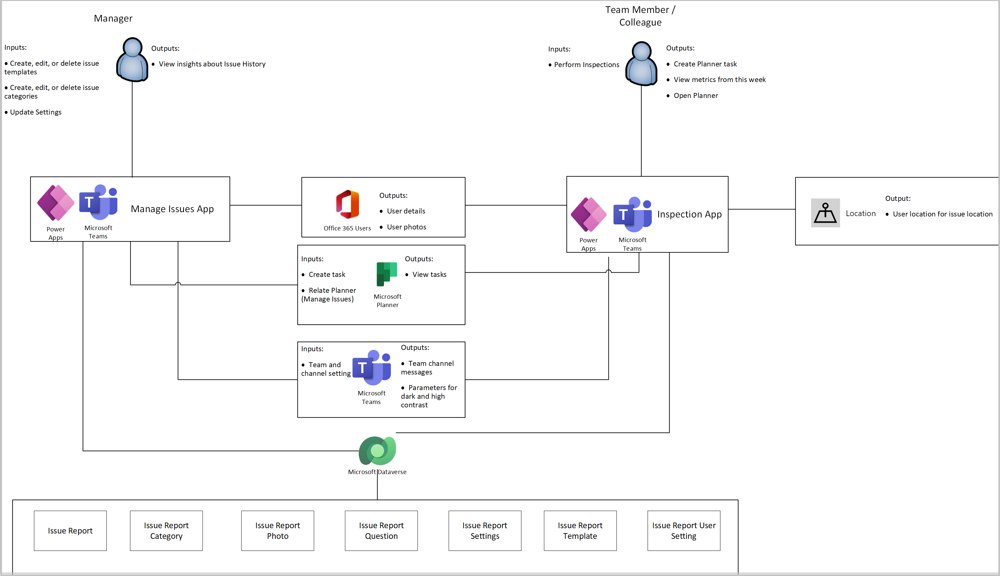
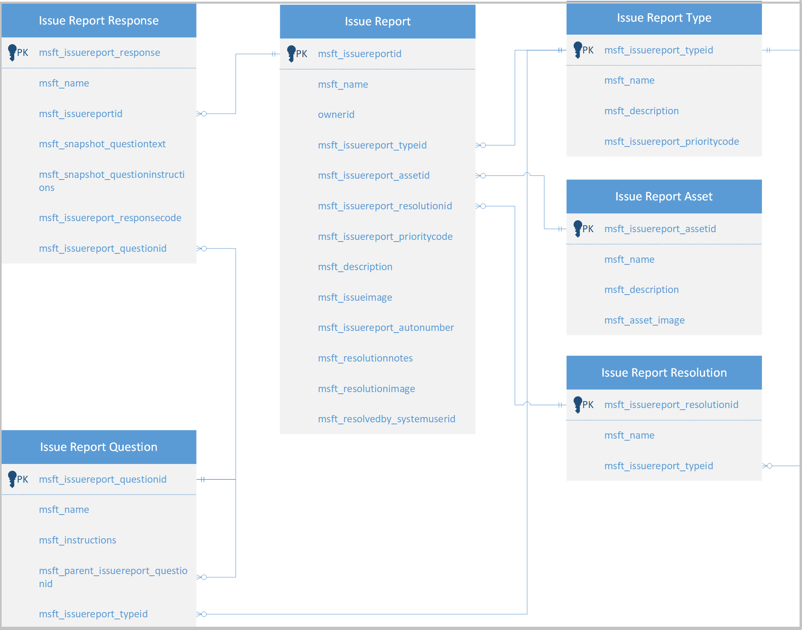

# Understand Issue Reporting sample app architecture

In this article, you'll learn about the collections and global variables used by the [Manage Issues](issue-reporting.md#manage-issues-app) and [Issue Reporting](issue-reporting.md#issue-reporting-app) apps, and understand how to use them effectively. If you want to learn more about how to install, and use the Issue Reporting sample app instead, go to [Issue Reporting sample app](issue-reporting.md).

## Prerequisites

To understand and use information in this article, you'll need to know about different controls, features, and capabilities of canvas apps.

- [Create and update a collection in a canvas app](../maker/canvas-apps/create-update-collection.md)
- [Collect, Clear, and ClearCollect functions in Power Apps](../maker/canvas-apps/functions/function-clear-collect-clearcollect.md)
- [Understand canvas-app variables in Power Apps](../maker/canvas-apps/working-with-variables.md)
- [Add and configure a canvas-app control in Power Apps](../maker/canvas-apps/add-configure-controls.md)
- [Add a screen to a canvas app and browse between screens](../maker/canvas-apps/add-screen-context-variables.md)

You'll also need to know about how to [install](use-sample-apps-from-teams-store.md), and [use](issue-reporting.md) Issue Reporting sample app.

## Architecture Model

The following diagram illustrates the way that users and systems interact with data in the Issue Reporting solution

### Connectors

The following connectors are used in the Issue Reporting app:

- **Microsoft Dataverse** - used to read and write data in Dataverse.
- **Office 365 Users** - used to read Microsoft 365 user profile data.
- **Location** - Used to capture the user's location for Planner tasks.
- **Microsoft Planner** - Used to create tasks for issues.

## Data model

The following diagram explains the data model used by the Issue Reporting sample app.

### Tables

The section describes the tables contained in the Issue Reporting solution, along with their purpose.

| Table                       | Description                                                  |
| --------------------------- | ------------------------------------------------------------ |
| Issue Report                | Issues refer to a problem  or trouble being faced by the Users. Information such as the Name, Issue  category, issue template, Planner Task ID, due date, assigned user, and  description are stored in the **Issue reports** table.     An issue can be related only to a single Category and Template. |
| Issue  Report Category      | Categories  are used to group similar issues. Details such as the Name, Category  Icon, Planner Bucket ID are stored in the **Issue Report Categories** table. A  Category can have multiple Issues and Issue Templates associated to it. |
| Issue Report Template       | Issue  templates have predefined questions that must be answered by the users while  creating an issue that helps us in understanding it better. Details such as  the Due Date, Category the user to whom the tasks should be assigned, the  primary contact information are stored in the **Issue Report Templates** table.  There can be multiple questions and issues related to an Issue template. |
| Issue  Report Questions     | Questions  are part of the Issue Templates that help in explaining the issue in a  better way. Details such as the Issue template and the sequence are stored in  the **Issue Report Questions** table. There can be multiple questions in an Issue  template. |
| Issue Report Settings       | Settings  are used to store configurations for the app, including the Team and Planner IDs for where to log issues as Planner Tasks. |
| Issue  Report User Settings | User settings are used to store user  preferences pertaining to seeing the Power Apps splash screen every time they  log in to the app. There is one record for each user. |

## Manage Issues app

This section explains collections, and global variables used by the [Manage Issues](issue-reporting.md#manage-issues-app) app.

### Collections

Manage Issues app uses following collections.

| Collection Name                      | Description                                                  | Screen Used                                                  |
| ------------------------------------ | ------------------------------------------------------------ | ------------------------------------------------------------ |
| colIcons                             | Used to collect the icons used in the app.                   | OnStart property of the App                                  |
| colUserSettings                      | Used to collect User Settings Dataverse record  if it exists. | OnStart property of the App                                  |
| colLocalization                      | Used to build a Localization Collection based on the User Language. | OnStart property of the App                                  |
| colDataverseDataverseIssueCategories | Used to collect Dataverse Issue report  categories.          | OnStart property of the App                                  |
| colDataverseDataverseIssueTemplates  | Used to collect Dataverse Issue report templates.            | OnStart property of the App                                  |
| colPlannerBuckets                    | To collect the list of Planner Buckets in a particular  plan based on the Plan and Team IDs. | OnStart property of the App                                  |
| colPlannerTasks                      | To collect the list of Planner Tasks in a particular plan  based on the Plan and Team IDs. | OnStart property of the App                                  |
| colDataverseIssueReports             | Collection to collect Dataverse Issue report categories.     | OnStart property of the App                                  |
| colStats                             | Collection to collect the stats of the planner tasks.        | OnVisible property of the Insights screen                    |
| colUserProfiles                      | Used to collect User details from Office 365.                | Issue templates screen |
| colDataverseIssueAssignments         | Used to store  information about the User to whom Issue has been assigned. | OnSelect property of the Save button while creating a new  Issue template. |
| colAppTemplateCounting               | Collection used to count the number of  issues based on their completion status. | Issue Templates Screen                       |
| colDataverseIssueQuestions           | To collect the questions for a particular issue template.    | OnSelect property of the Save button while creating a new  Issue template |
| colQuestionsToDelete                 | To collect the questions to be deleted from the Issue  template. | OnSelect property of the Save button while creating a new  Issue template |

### Global Variables

Manage Issue app uses following global variables.

| Variable  Name                  | Type    | Description                                                  |
| ------------------------------- | ------- | ------------------------------------------------------------ |
| gblAppLoaded                    | Boolean | To check whether the App is loaded.                |
| gblAppContext                   | Boolean | To check the context of where the app is running.             |
| gblUserLanguage                 | Text    | To check the logged in User’s Language.                       |
| gblThemeDark                    | Boolean | To check whether the Teams theme is set to Dark.              |
| gblThemeHiCo                    | Boolean | To check whether the Teams theme is set to High Contrast.     |
| gblParamTeamId                  | Text    | To set the Group ID from Planner.                             |
| gblParamChannelId               | Text    | To set the Channel ID from Planner.                           |
| gblAppManager                   | Boolean | To check the User team role.                                  |
| gblRecordSettings               | Record  | To check Teams settings for current team and channel ID.      |
| gblRecordUserSettings           | Record  | Variable to use the  Oldest Record in case multiple records exist. |
| gblPadding                      | Record  | Used to set padding values in the app.                        |
| gblToday                        | Date    | Variable to set the current date as a date/time value.        |
| gblDropdownPlanner              | Table   | To store the Group plans based on the Team ID.                |
| gblSettingPlannerPlanId         | Text    | Variable to get the Planner Plan ID from the parameters.      |
| gblSettingTeamId                | Text    | Variable to get the Team ID from the parameters.              |
| gblSettingSharePointLocation    | Text    | Variable to get the SharePoint locations from the  parameters. |
| gblAppHeader                    | Record  | Variable used to set the app header settings based on the  localized language. |
| gblAppSetting_inputMobileOnWeb  | Boolean | Variable to Scale fonts for mobile-oriented apps, running  in desktop. |
| gblAppSetting_inputMobile       | Boolean | Variable to Scale fonts for mobile-oriented apps.             |
| gblAppSetting_inputScaleFontsby | Number  | Use this variable for scaling all fonts by a fixed amount.    |
| gblAppColors                    | Record  | Variable to set the Color value in the app.                   |
| gblAppSizes                     | Record  | Variable to set the Color value in the app.                   |
| gblAppStyles                    | Record  | Variable to set the Styling values in the app.                |
| gblRecordCategory               | Record  | Variable used to store the Issue category record that is  being created/edited. |
| gblRecordTemplate               | Record  | Variable used to store the Issue template record that is  being created/edited. |

### App OnStart

This section explains the collections, variables, and execution details used on start of the app.

##### OnStart Collections

The following collections are used during start of the app.

| Collection name                | Description                                                  |
| ------------------------------ | ------------------------------------------------------------ |
| colLocalization                | Collection of localized text based on user's  language.      |
| colUserSettings                | Collection of the user Settings from **Project User Settings** table. |
| colIcons                       | Collection of stock icons used in the app.                   |
| colCdsDataverseIssueCategories | Used to collect Report Issue  Categories.                    |
| colCdsDataverseIssueTemplates  | Used to collect Report Issue Templates.                      |
| colPlannerBuckets              | Used to store the list of Buckets on Planner                 |
| colPlannerTasks                | Used to store the list of Planner tasks.                     |

##### OnStart Variables

| Variable name           | Description                                                  |
| ----------------------- | ------------------------------------------------------------ |
| gblAppLoaded            | Global variable to check if the app has  loaded completely.  |
| gblAppContext           | Global variable to check the context of  where the app is running. |
| gblUserLanguage         | Global variable to store the user's  language.               |
| gblThemeDark            | Global variable to store if Teams is running  in dark mode.  |
| gblThemeHiCo            | Global variable to store if Teams is running  in contrast mode. |
| gblAppManager           | Global variable to check whether a User team  role is assigned. |
| gblParamTeamId          | Global variable to set the Group ID from  Planner.            |
| gblParamChannelId       | Global variable to set the Channel ID from  Planner.          |
| gblRecordSettings       | Global variable used to set the Team and  Channel ID to the **Employee Ideas Settings** table. |
| gblRecordUserSettings   | Variable to use the Oldest Record in case  multiple records exist. |
| gblSettingPlannerPlanId | Global Variable to store the Planner Plan ID  from the settings record. |
| gblSettingTeamId        | Global variable to store Team's ID from the  Settings record. |
| gblPadding              | Global variable to set the padding values.                    |
| gblAppHeader            | Global variable to store the app header  settings.           |
| gblAppLoaded            | Global variable to check if the app has  loaded completely.  |
| gblToday                | Global variable to store the present day's  date.            |
| gblUserFirstName        | Global variable to store the User's first  name.             |
| gblDropdownPlanner      | Variable to store the group plans from  planner.             |

##### OnStart execution details

1. When a user accesses the app, **gblAppLoaded** is set to false. The user’s language code is stored in **gblUserLanguage**, with English - US being the default one. The gblAppContext where the app is running.

2. If the value of gblAppContext is true, it means the app is being accessed from within Teams. If False, the **gblAppLoaded** is set to true indicating the app is loaded completely.

3. The user’s language code is stored in **gblUserLanguage**, with English - US being the default one.

4. The user’s language is then used to collect localized text used throughout the app (for example, label and button text) in **colLocalization** collection.

5. The user’s Teams theme/mode is checked to see if the theme is default, dark or high contrast. The **gblThemeDark** and **gblThemeHiCo** variables are set accordingly.

6. The Group ID and Channel ID received from Parameters are stored in the **gblParamTeamId** and **gblParamChannelId** variables, respectively.

7. The user team role is stored in the **gblAppManager** variable used to enable it for Studio.

8. The gblRecordSettings variable is used to store the App settings from the **Issue Report Settings** table using the Group and Channel IDs stored in the **gblParamTeamId** and **gblParamChannelId** variables.

9. In there are no available settings, the details are fetched using the Microsoft Team connector and updated to the **Issue Report Settings** table.

10. User details from **Issue Report User Settings** table are collected in **colUserSettings**. If no records exist, a new Issue Report User Settings record is created. If there are multiple Issue Report User Settings records exist, the oldest record is selected and stored in the gblRecordUserSettings variable.

11. The Planner and Team IDs from the Parameters are fetched from the **gblRecordSettings** variable and are stored in the **gblSettingPlannerPlanId** and **gblSettingTeamId** variables.

12. Predefined padding values are stored in the **gblPadding** variable and the present day’s date is stored in the **gblToday** variable.

13. The stock icons are collected in **colIcons** collection. The gblAppHeader variable is used to set the app header settings based on the user’s language.

14. The issue categories from the Issue Report Categories and templates are stored in the **colDataverseIssueCategories** and **colDataverseIssueTemplates** respectively. 

15. The planner buckets and tasks are collected **colPlannerBuckets** and **colPlannerTasks** collections using the values of **gblSettingPlannerPlanId** and **gblSettingTeamId** variables.

16. The group plans are collected in the **gblDropdownPlanner** which is fetched using the value of **gblSettingTeamId variable.**

17. After all the details are collected and stored, the value of **gblAppLoaded** is set to true indicating the app is loaded completely.

### Insights screen

This section explains the collections, variables, and execution steps used in the Insights screen.

##### Insights collections

The following collection is used on the Insights screen

| Collection name | Description                                            |
| --------------- | ------------------------------------------------------ |
| colStats        | Collection to collect the stats  of the planner tasks. |

##### Insights variables

The following variables are used on the Insights screen

| Variable name                | Description                                                  |
| ---------------------------- | ------------------------------------------------------------ |
| gblToday                     | Global variable to store the present day's  date.            |
| varStatInProgress            | Variable to store the list of  tasks that are 50% complete. |
| varStatNotStarted            | Variable to store the list of  tasks that are not started (0% complete). |
| varStatNewIssues             | Variable to store the list of  tasks that are created on the present day. |
| varStatCompletedLastWeek     | Variable to store the list of  tasks that are completed last week. |
| varStatAverageResolutionTime | Variable to store the average  resolution time of tasks (in hours). |

### First run experience

This section explains the variables and execution details used in the first run experience.

##### First run experience variables

| Variable name          | Description                                                  |
| ---------------------- | ------------------------------------------------------------ |
| locShowSetup           | Local variable to indicate if the current  run of the app is the first run for the user. |
| locShowPowerAppsPrompt | Local variable to indicate either to show or  hide the splash screen. |
| locShowRestricted      | Variable that controls the display of the  restricted access to the app for the users who are not team owners. |
| locShowSetupPlanner    | Variable that controls the display of the  Planner setup dialog. |
| locDropdownsLoaded     | Variable to check whether the Planner  dropdown is loaded completely. |

##### First run experience execution details

1. The Planner setup dialog is displayed when the value of the **locShowSetupPlanner** variable is true**. The gblDropdownPlanner** stores the Group Plans available using the Team ID.

2. On visible of Insights screen a dialog pop-up appears if either **locShowSetup** or **locShowPowerAppsPrompt** is true, if not the app proceeds with loading the Insights data.

3. **LocShowSetup** is set to true/false depending upon Issue report settings records that get created when the app runs for the first time. So if the app runs for the first time it creates a report setting record when the user completes the first run experience. 

4. If it’s the first time when the user is running the app, then **locShowSetup** is set to ‘True’ and hence the app shows the first run dialog.

5. if the **locShowSetup** is true then the first run dialog appears briefing about the app.

6. When the user continues with the first run dialog, in the background it creates an Issue report setting record.

7. Also if it’s a first run, the app also shows the splash screen based upon the boolean variable **locShowPowerAppsPrompt**

8. **LocShowPowerAppsPrompt** is set to true or false based upon the Issue report setting that gets created during the first run.

9. If the user checks **Do not show again** the **Display Splash (PowerApps)** is set to "No" at project settings record which there by sets **locShowPowerAppsPrompt** to false in the next run and hides the splash screen.

### Issue templates screen

This section explains the collections, variables, and execution details  used in the issue template screen.

#### Displaying the list of issue categories and templates

This section explains the collections, variables, and execution steps used when the list of issue categories and templates is displayed.

##### Issue category and template display collections

The following collections are used when issue category and template lists are displayed.

| Collection name             | Description                                                  |
| --------------------------- | ------------------------------------------------------------ |
| colDataverseIssueCategories | Collection of issue categories from the **Issue Category** table. |
| colDataverseIssueTemplates  | Collection of issue templates for  categories.               |

##### Issue category and template variables

The following variables are used when issue category and template lists are displayed.

| Variable name                  | Description                                                  |
| ------------------------------ | ------------------------------------------------------------ |
| locSortCampaigns               | Local variable used to sort the categories  in ascending and descending orders. |
| locSortTemplateList_Title      | Used to store the title of the Issue  Template.               |
| locSortTemplateList_NotStarted | Used to store the number of issues that are  not started.   |
| locSortTemplateList_InProgress | Used to store the number of issues that are  in progress.   |
| locSortTemplateList_Done       | Used to store the number of issues that are  completed.     |
| gblRecordCategory              | Global variable to store the category that  is being created/edited. |

##### Issue category and template execution details

1. The **galCategory** gallery displays the list of existing Issue categories from the **Issue Category** table that is stored in the **colDataverseIssueCategories** collection.

2. The categories can be searched based on their names and can be sorted in ascending or descending orders by selecting the Sort category icon.

3. Selecting on the Sort category icon updates the value of Boolean variable **locSortCampaigns** thus sorting the list of issue categories.

4. Selecting on any of the Category will enable the user to edit the category details, the **galTemplateList** displays the list of issue templates and under the selected category with the Title, Number of Not Started, In Progress and completed issues.

5. Users can edit and create issue templates by selecting on the Edit and **Add Issue template** buttons, respectively.

6. Clicking on the Edit button next to the Category title can be used to edit existing categories.

#### Adding a new category

This section explains the collections, variables, and execution details used when adding a category.

##### Category creation collections

The following collections are used when creating a category.

| Collection name             | Description                                    |
| --------------------------- | ---------------------------------------------- |
| colPlannerBuckets           | Used to store the list of Buckets on  Planner. |
| colIcons                    | Collection of stock icons used in the app.     |
| colDataverseIssueCategories | Used to collect Report Issue Categories.       |

##### Category creation variables

The following variables are used when creating a category.

| Variable name               | Description                                                  |
| --------------------------- | ------------------------------------------------------------ |
| locScreenModeViewCategory   | Variable to check whether an existing  category is being viewed. |
| locScreenModeCreateCategory | Variable to check whether an existing  category is being created. |
| locDisplayDialog            | Used to display a background dialog to  restrict user's from selecting background options. |
| locSelectIcon               | Variable to control the visibility of the  Icon picker gallery. |
| locFieldCategoryIcon        | Used to store the selected icon while  creating a new Issue category. |
| gblRecordCategory           | Global variable to store the category that  is being created/edited. |
| gblSettingTeamId            | Global variable to store Team's ID from the  Settings record. |
| gblSettingPlannerPlanId     | Global Variable to store the Planner Plan ID  from the settings record.locBlockUserInput. |
| locRecordPlannerBucket      | Variable used to create a new bucket in  Planner.            |
| locRecordDataverseCategory  | Variable used to create new category record  linked to a bucket. |

##### Category creation execution variables

1. A new category can be added from the **Issue templates screen**. Upon selection of the **Add Category** button, the **locScreenModeCreateCategory** variable is set to true thus enabling the user to enter the title and icon of the new category.

2. The **galCategory** gallery will be In a disabled state when a new category is being added, The display mode is controlled by the **locScreenModeViewCategory** variable.

3.  The category name can be entered in the title field. Selecting the update icon button would set the values of **locDisplayDialog** and **locSelectIcon** to true thus displaying the **conDialogIcon** container and blocking the user from accessing the other options.

4. The **galIcons** gallery will display the list of stock icons stored in the **colIcons** collection. Selecting any one of the icons would store it in the **locFieldCategoryIcon** variable and update the values of **locDisplayDialog** and **locSelectIcon** variables to false.

5. Once the title and icon are selected the Save button is enabled, clicking on which would set the value of **locBlockUserInput** to true blocking the user from making any changes while the app is being saved and a new bucket is created using the **locRecordPlannerBucket** variable and is collected in the **colPlannerBuckets** collection

6.  The category is updated to the **Issue Report Categories** table using the **locRecordDataverseCategory** variable.

7. The same is collected in the **colDataverseIssueCategories** collection. The **locScreenModeViewCategory** variable is set to true and **locBlockUserInput** is set to false thus displaying the list of categories with the new one being selected.

### Editing a category

This section explains the collections, variables, and execution details used when creating a category.

##### Category edit collections

The following collections are used when a category is edited.

| Collection name            | Description                                                  |
| -------------------------- | ------------------------------------------------------------ |
| colDataverseIssueReports   | Collection to store Active issue reports.                     |
| colAppTemplateCounting     | Collection used to count the number of  issues based on their completion status. |
| colDataverseIssueTemplates | Used to collect the issue templates for a  category.          |

##### Category edit variables

The following variables are used when a category is edited.

| Variable name               | Description                                                  |
| --------------------------- | ------------------------------------------------------------ |
| locScreenModeViewCategory   | Variable to check whether an existing  category is being viewed. |
| locScreenModeCreateCategory | Variable to check whether an existing  category is being created. |
| locDisplayDialog            | Used to display a background dialog to  restrict user's from selecting background options. |
| locFieldCategoryIcon        | Used to store the selected icon while  creating a new Issue category. |
| gblRecordCategory           | Global variable to store the category that  is being created/edited. |
| gblSettingTeamId            | Global variable to store Team's ID from the  settings record. |
| gblSettingPlannerPlanId     | Global Variable to store the Planner Plan ID  from the settings record. |
| locBlockUserInput           | Local variable used to block the User Input  by displaying a dialog while something is being saved. |
| locHasPlannerOnlyTasks      | Local variable that stores whether the  category has any associated planner tasks or not. |
| locRecordPlannerOnlyTasks   | Local variable that stores the record  details of the selected category and the associated planner task details. |

##### Category edit execution details

1. An existing category can be edited from the **Issue templates** screen. Selecting any of the category in the **galCategory** gallery will lookup the **Issue Report Categories** table and set the value of gblCategory to the selected category.

2. The **colDataverseIssueReports** collects the Active Issue reports, the **colAppTemplateCounting** collection is used to get the count of the issues and the planner tasks are collected in the **colPlannerTasks** collection.

3. The count of not started, in progress and completed tasks are collected from the **colDataverseIssueTemplates** collection.

4. **LocHasPlannerOnlyTasks** stores whether the category has any associated planner tasks or not.

5. The value of the **locScreenModeViewCategory** is set to true thus displaying the **conTemplateList** container and the edit button.

6. Clicking on the edit button will set the **locScreenModeEditCategory** to true thus disabling the **galCategory** and **galTemplateList** galleries.

7. User can only update the Category icon by selecting the “Update Icon” button would set the values of **locDisplayDialog** and **locSelectIcon** to true thus displaying the **conDialogIcon** container and blocking the user from accessing the other options.

8. The **galIcons** gallery will display the list of stock icons stored in the **colIcons** collection. Selecting any one of the icons would store it in the **locFieldCategoryIcon** variable and update the values of **locDisplayDialog** and **locSelectIcon** variables to false.

9. Once the Icon is updated, the save button will be enabled clicking on which will update the category details **Issue Report Categories** table and in the **colDataverseIssueCategories** collection.

10. The **locScreenModeViewCategory** variable is set to true and **locBlockUserInput** is set to false thus displaying the list of categories with the edited one being selected.

#### Deleting a category

This section explains the collections, variables, and execution details used when deleting a category

##### Category deletion collections

The following collection is used when a category is deleted.

| Collection name             | Description                              |
| --------------------------- | ---------------------------------------- |
| colDataverseIssueCategories | Used to collect Report Issue Categories. |

##### Category deletion variables

the following variables are used when a category is deleted

| Variable name             | Description                                                  |
| ------------------------- | ------------------------------------------------------------ |
| locScreenModeEditCategory | local variable that indicates a category Is  being edited.   |
| locDisplayDialog          | used to display a background dialog to  restrict user's from selecting background options. |
| locDisplayDialogDelete    | variable to control the visibility of the  Delete Dialog.    |
| locDeleteChecked          | variable to control the "I  Understand" checkbox value.      |
| gblRecordCategory         | global variable to store the category that  is being created/edited. |
| locScreenModeViewCategory | local variable that indicates a category Is  being viewed and not edited. |

##### Category deletion execution details

1. An existing category can be deleted when it is being edited from the Issue template screen.

2. Selecting the edit button will set the **locScreenModeEditCategory** variable to true thus displaying the delete button.

3. Selecting the delete button will update the values of **locDisplayDialog** and **locDisplayDialogDelete** variables to true thus displaying the delete confirmation dialog.
4. Users must check the **I Understand** checkbox in order to enable the delete button (controlled by the **locDeleteChecked** variable).

5. Selecting the delete button will remove the selected category (referred by **gblRecordCategory**) from the **colDataverseIssueCategories** collections and **Issue Report Categories** table.

6. The first item in the **galCategory** is set to the **gblRecordCategory** variable**.**

7. The value of **locScreenModeViewCategory** is set to true thus displaying the first category in the **galCategory** collection.

#### Adding a new issue template

This section explains the collections, variables, and execution details used when an issue template is created.

##### Issue template creation collections

The following collections are used when an issue template is created.

| Collection name              | Description                                                  |
| ---------------------------- | ------------------------------------------------------------ |
| colDataverseIssueQuestions   | Used to collect the issue template  questions.                |
| colUserProfiles              | Used to collect Office 365 User Profiles.                     |
| colDataverseIssueAssignments | Used to store information about the User to  whom Issue has been assigned. |
| colDataverseIssueTemplates   | Used to collect the issue templates for a  category.          |

##### Issue template creation variables

The following variables are used when an issue template is created.

| Variable name               | Description                                                  |
| --------------------------- | ------------------------------------------------------------ |
| locScreenModeCreateTemplate | local variable to indicate an issue template  is being created. |
| gblRecordTemplate           | global variable to store the template record  that is being edited/created. |
| locDisplayDialog            | used to display a background dialog to  restrict user's from selecting background options. |
| locDisplayAssignmentSelect  | Used to control the visibility of the User  Assignment container. |
| locUserPrincipalName        | used to store the username of the searched  user.            |
| locBlockUserInput           | variable to control the visibility of a  dialog that prevents users from making any changes when the app is being  saved. |

##### Issue template creation execution details

1. A new Issue template can be added from the **Issue templates screen** when a category is being viewed. On selection of the “+ Add Issue template” button the values of the **locScreenModeCreateTemplate** variable is set to true thus displaying **conTemplateForm** and **conTemplateQuestionHelp** container.

2. Users can enter the title, select the number of due days, and select the user to whom the issues created under this template would be assigned to.

3. Selecting the user search box will set the **locDisplayDialog** and **locDisplayAssignmentSelect** variables to true this displaying the **conAssignUser** container.

4. Users can be selected from the **galAssignUser** gallery based on the search results.

5. The input given is stored in the **locUserPrincipalName** variable and the same is used to collect the user profile details in the **colUserProfiles** collection.

6. Issue questions can be added by selecting the “+ Add Question” button. Selecting which a blank question is displayed in the galQuestionList gallery.

7. Users can enter the required questions that are stored in the **colDataverseIssueQuestions** collection**.** A single-issue template can have multiple questions.

8. Selecting the user search box will set the **locDisplayDialog, locSelectPrimaryContact, and **locDisplayAssignmentSelect** variables to true this displaying the **conAssignUser** container.

9. Users can be selected from the **galAssignUser** gallery based on the search results.

10. The input given is stored in the **locSelectPrimaryContact** variable and the same is used to collect the user profile details in the **colDataverseIssueAssignments** collection.

11. Once all the details are filled, selecting the Save button will create the template in the **Issue Report Templates** table and **colDataverseIssueTemplates** collection.

12. The newly added questions that are stored in the **colDataverseIssueQuestions** collection are updated to the **Issue Report Questions** table.

13. The value of the **locScreenModeViewCategory** is set to true thus displaying the parent category.

#### Editing an issue template

 This section explains the collections, variables, and execution details used when editing an issue template.

##### Issue template edit collections

The following collections are used when an issue template is edited.

| Collection name              | Description                                                  |
| ---------------------------- | ------------------------------------------------------------ |
| colDataverseIssueQuestions   | Used to collect the issue template questions.                 |
| colDataverseIssueAssignments | Used to store information about the User to  whom Issue has been assigned. |
| colQuestionsToDelete         | Used to collect the questions that are to  be deleted from the issue template. |

##### Issue template edit variables

The following variables are used when an issue template is edited.

| Variable name             | Description                                                  |
| ------------------------- | ------------------------------------------------------------ |
| locScreenModeEditTemplate | Local variable that indicates a template is  being edited.  |
| gblRecordTemplate         | Global variable to store the template record  that is being edited/ created |
| locScreenModeViewTemplate | Local variable that indicates a template is  being viewed.  |
| locSequenceCurrent        | Local variable to set the current sequence  number of the question. |
| locSequenceNew            | Local variable to set the new sequence  number of the question. |

##### Issue template edit execution variables

1. An existing Issue template can be updated from the “Issue templates screen”. Selecting the **Edit** button will set the **gblRecordTemplate** to the selected template.

2. The Issue questions and the Task Assignment details are stored in the **colDataverseIssueQuestions**  and **colDataverseIssueAssignments** tables.

3. Required details can be updated, new questions can be added, and existing ones can be deleted.

4. Selecting the delete button next to the question will remove the question from the **galQuestionList** gallery and add it to the **colQuestionsToDelete** collection.

5. The sequence of the Issue template questions can be updated by selecting the up and down arrows present next to the Question.

6. The up arrow button is disabled for the first question and the down arrow button is disabled for the last question in the gallery (The display mode is controlled by the value of **msft_sequence** field).

7. The questions in the **colDataverseIssueQuestions** collection are rearranged by comparing the values of **locSequenceCurrent** and **locSequenceNew** variables.

8. Once the required details are updated, selecting the save button will update the template in the **Issue Report Templates** table and **colDataverseIssueTemplates** collection.

9. The newly added questions and the deleted questions that are stored in the **colDataverseIssueQuestions and colQuestionsToDelete** collection are updated to the **Issue Report Questions** table.

10. The value of the **locScreenModeViewCategory** is set to true thus displaying the parent category.

#### Duplicating an Issue Template

This section explains the collections, variables, and execution details used when an issue template is duplicated. 

##### Issue template duplication collections

The following collection is used when an issue template is duplicated.

| Collection name            | Description                                   |
| -------------------------- | --------------------------------------------- |
| colDataverseIssueQuestions | Used to collect the issue template questions. |

##### Issue template duplication variables

| Variable name              | Description                                                  |
| -------------------------- | ------------------------------------------------------------ |
| locRecordDuplicateTemplate | variable that indicates an issue template is  being duplicated. |

#####  Issue template duplication execution details

1. An existing Issue template can be duplicated from the **Issue Templates** screen. Selecting the duplicate button will set the value in **gblRecordTemplate** to the **locRecordDuplicateTemplate** variable.

2. The questions from **colDataverseIssueQuestions** are copied to and a new Issue template record. The title of the newly created Issue template will be appended by “(copy)”.

#### Deleting an issue template

This section explains the collections, variables, and execution details used when an issue template is deleted. 

##### Issue template deletion collections

The following collection is used when an issue template is deleted.

| Collection name            | Description                                           |
| -------------------------- | ----------------------------------------------------- |
| colDataverseIssueTemplates | Used to collect the issue templates for a  category. |

##### Issue template deletion variables

The following variables are used when an issue template is deleted.

| Variable name             | Description                                                  |
| ------------------------- | ------------------------------------------------------------ |
| locDisplayDialog          | used to display a background dialog to  restrict user's from selecting background options. |
| locDisplayDialogDelete    | variable to control the visibility of the  Delete Dialog.    |
| locDeleteChecked          | variable to control the "I  Understand" checkbox value.      |
| locScreenModeViewCategory | local variable that indicates a category Is  being viewed and not edited. |

#####  Issue template deletion execution details

1. An existing Issue template can be deleted from the **Issue templates** screen. Selecting the delete button will set the value in **locDisplayDialog and locDisplayDialogDelete** to true thus displaying the delete confirmation dialog.

2. Users must check the **I Understand** checkbox in order to enable the **Delete** button (controlled by the **locDeleteChecked** variable).

3. Selecting the delete button will remove the selected category (referred by **gblRecordCategory**) from the **colDataverseIssueTemplates** collections and **Issue Report Template** table.

4. The first item in the **galCategory** is set to the **gblRecordCategory** variable**.**

5. The value of **locScreenModeViewCategory** is set to true thus displaying the first category in the **galCategory** collection.

### About Screen

##### About screen execution details

1. Selecting the “Customize using Power Apps button” on the **conAbout_Header** container opens Power Apps tool link in Microsoft Teams.

2. There are help links available in the galAbout_HelpLinks gallery.

  - Selecting the “Learn how to customize this app” button takes to an external link that explains on how to make customizations on the app.

  - Selecting the “Send us your ideas” button takes to an external link where ideas can be posted for the Milestones app.

  - Selecting the “Engage with community” button takes to the Power Apps Community.

3. The **conAbout_AppVideo** container contains the video link that provides an overview of the Milestones app.

4. The gallery **galAbout_OtherApps** contains the links to other Microsoft apps. 

- Selecting the “View app” button takes to the app page in the Microsoft Teams app store.

- Selecting the “App Overview” button takes to the App overview video on YouTube.

- The **conAbout_Version** gives information about the app versioning.

5. The **conAbout_Version** gives information about the app versioning.

### Settings Screen 

This section explains the variables and execution details used by the settings screen.

##### Settings screen variables

| Collection name         | Description                                                  |
| ----------------------- | ------------------------------------------------------------ |
| locBlockUserInput       | Local variable used to block the User Input  by displaying a dialog while something is being saved. |
| gblRecordSettings       | Global variable used to update the **Issue Report Settings** table. |
| gblDropdownPlanner      | Variable to store the group plans from  planner.             |
| gblSettingPlannerPlanId | Variable to get the Planner Plan ID from the  parameters.    |

##### Settings screen execution details

1. The users have the feasibility to update whether only team owners will be able use and manage this app and select the planner instance where the issues will be stored.

2. The list of Planner instances in the dropdown are from the **gblDropdownPlanner** variable.

3. The **Save** button is enabled when the dropdown value selected, or the team owner restricted value is different from the value stored in the variable **gblRecordSettings** (which is set on start of the app).

4. In case the values of **gblSettingPlannerPlanId** and **gblSettingTeamId** are not blank, The Planner buckets and tasks are updated in the **colPlannerBuckets** and **colPlannerTasks** collections, respectively.
5. On selection of the save button, the details are updated in the **Issue Report Settings** table using the **gblRecordSettings** variable and the app will take the user to the **About** screen.

## Issue Reporting app

This section explains the collections and global variables used in the Issue Reporting app.

### Collections

The following collections are used in the Issue Reporting app.

| Collection Name              | Description                                                  | Screen Used                                                  |
| ---------------------------- | ------------------------------------------------------------ | ------------------------------------------------------------ |
| staticLocalizations          | Used for localization of text.                               | All screens                                                  |
| colIcons                     | Used to collect the icons used in the app.                    | OnStart property of the App                                  |
| colDataverseIssueCategories  | Used to collect Dataverse Issue report categories.            | OnStart property of the App                                  |
| colDataverseIssueTemplates   | Used to collect Dataverse Issue report templates.             | OnStart property of the App                                  |
| colSaveDataCheck             | Used to check device offline capabilities.                    | Temp save data screen                                        |
| colSavedData                 | Used to save a session’s data.                                | Temp  save data screen                                       |
| colUserProfiles              | To store the User details (Profile ID, Email, User Photo,  and Display Name). | Temp  save data screen                                       |
| colDataverseIssueQuestions   | Used to store the session questions from the local device.    | Temp  save data screen                                       |
| colDataverseIssueAssignments | Used to store the session assignments from the local  device. | Temp  save data screen                                       |
| colPlannerBuckets            | To collect the list of Planner Buckets in a particular  plan based on the Plan and Team IDs. | OnStart property of the App                                  |
| colPlannerTasks              | To collect the list of Planner Tasks in a particular plan  based on the Plan and Team IDs. | Items property of the Week at glance gallery on the  Insights screen. |
| colDataverseIssueReports     | To store the list of issues based on the Planner Task ID.     | OnSelect property of the View Issues button on the  Insights screen. |
| colStats                     | Used to collect the stats of the  planner tasks.              | Items property of the Week at glance gallery on the  Insights screen |
| colMyIssues                  | Used to store the issues assigned for the user.               | OnSelect property of the View Issues button on the  Insights screen. |
| colUserProfileStaging        | Used to store the UserID of the User.                         | OnSelect property of the View Issues button on the  Insights screen |

### Global Variables

The following global variables are used in the Issue Reporting app.

| Variable  Name                  | Type    | Description                                                  |
| ------------------------------- | ------- | ------------------------------------------------------------ |
| gblAppLoaded                    | Boolean | To check whether the App is loaded.                |
| gblAppContext                   | Boolean | To check the context of where the app is running.             |
| gblUserLanguage                 | Text    | To check the logged in User’s Language.                       |
| gblParamTeamId                  | Text    | To set the Group ID from Planner.                             |
| gblParamChannelId               | Text    | To set the Channel ID from Planner.                           |
| gblRecordSettings               | Record  | To check Teams settings for current team and channel ID.      |
| gblPadding                      | Record  | Used to set padding values in the app.                        |
| gblAppBoundaryWidth             | Number  | Variable used to set the boundary width based on the  client type. |
| gblToday                        | Date    | Variable to set the current date as a date/time value.        |
| gblUserFirstName                | Text    | Variable to get the First Name of the User.                   |
| gblPlannerPlanId                | Text    | Variable to get the Planner ID from app settings.             |
| gblPlannerGroupId               | Text    | Variable to get the Team ID from app settings.                |
| gblSettingSharePointLocation    | Text    | Variable to get the SharePoint locations from the  parameters. |
| gblAppSetting_inputMobileOnWeb  | Boolean | Variable to Scale fonts for mobile-oriented apps, running  in desktop. |
| gblAppSetting_inputMobile       | Boolean | Variable to Scale fonts for mobile-oriented apps.             |
| gblAppSetting_inputScaleFontsby | Number  | Use this variable for scaling all fonts by a fixed amount.    |
| gblThemeDark                    | Boolean | To check whether the Teams theme is set to Dark.              |
| gblThemeHiCo                    | Boolean | To check whether the Teams theme is set to High Contrast.     |
| gblAppColors                    | Record  | Variable to set the Color value in the app.                   |
| gblAppSizes                     | Record  | Variable to set the Color value in the app.                   |
| gblAppStyles                    | Record  | Variable to set the Styling values in the app.                |
| gblAppEnabledSaveData           | Boolean | Variable to check whether the app is enabled to store  data locally. |
| gblRecordCategory               | Record  | Variable to fetch the Record Category based on Guid.          |
| gblRecordTemplate               | Record  | Variable used to store the Issue template record that is  being created/edited. |
| gblSessionValue_Location        | Text    | Used to set the cached location.                              |
| gblSessionValue_Description     | Text    | Used to set the cached Description.                           |

### OnStart 

This section explains the collections, variables, and execution details used on start of the Issue Reporting app.

##### OnStart Collections

The following collections are used when the issue Reporting app starts.

| **Collection name**         | **Description**                                        |
| --------------------------- | ------------------------------------------------------ |
| staticLocalizations         | Collection of localized text based on user's language. |
| colIcons                    | Collection of stock icons used in the app.             |
| colDataverseIssueCategories | Used to collect Report Issue Categories.               |
| colDataverseIssueTemplates  | Used to collect Report Issue Templates.                |

#####  OnStart Variables

The following variables are used when the Issue Reporting app starts.

| **Variable name**   | **Description**                                              |
| ------------------- | ------------------------------------------------------------ |
| gblAppLoaded        | Global variable to check if the app has  loaded completely.  |
| gblAppContext       | Global variable to check the context of  where the app is running. |
| gblUserLanguage     | Global variable to store the user's  language.               |
| gblParamTeamId      | Global variable to set the Group ID from Planner.            |
| gblParamChannelId   | Global variable to set the Channel ID from Planner.          |
| gblRecordSettings   | Global variable used to set the Team and Channel ID to the **Employee Ideas Settings** table. |
| gblPlannerPlanId    | Global variable to store the Planner ID.                     |
| gblPlannerGroupId   | Global variable to store the Team ID.                        |
| gblPadding          | Global variable to set the padding values.                   |
| gblAppBoundaryWidth | Global variable to store the app's width based on the host client type (Desktop/Web). |
| gblToday            | Global variable to store the present day's date.             |
| gblUserFirstName    | Global variable to store the User's first  name.             |

#####  OnStart execution details

1. When a user accesses the app, **gblAppLoaded** is set to false. The user’s language code is stored in **gblUserLanguage**, with English - US being the default one. The **gblAppContext** where the app is running.

2. The user’s language is then used to collect localized text used throughout the app (for example, label and button text) in **staticLocalizations** collection.

3. The Group ID and Channel ID received from Parameters are stored in the **gblParamTeamId** and **gblParamChannelId** variables, respectively.

4. The issue report settings record is fetched using **gblParamTeamId** and **gblParamChannelId** variables and stored in **gblRecordSettings** variable.

5. The Planner and Team IDs are stored in **gblPlannerPlanId** and **gblPlannerGroupId** variables.

6. Predefined padding values and app boundary width are stored in the **gblPadding** and **gblAppBoundaryWidth** variables.

7. The present day’s date and time values are stored in the **gblToday** variable and the User’s firstname is stored in the **gblUserFirstName** variable.

8. Once all the required information is set and collected, The value of **gblAppLoaded** variable changes to true.

### Insights Screen

This section explains the collections, variables, and execution details used on the Insights screen.

##### Insights screen collections

The following collections are used on the insights screen.

| **Collection name**      | **Description**                                         |
| ------------------------ | ------------------------------------------------------- |
| colPlannerTasks          | Collection of localized text based  on user's language. |
| colDataverseIssueReports | Collection to store Active issue  reports.              |
| colStats                 | Collection to collect the stats of  the planner tasks.  |

##### Insights screen variables

The following variables are used on the Insights screen

| **Variable name**               | **Description**                                              |
| ------------------------------- | ------------------------------------------------------------ |
| locRefreshDataverseIssueReports | Used to refresh the colDataverseIssueReports  collection.    |
| gblUserFirstName                | Global variable to store the User's first  name.             |
| varTasksLast7Days               | Used to store the list of all planner tasks  data from the last 7 days. |
| varResolved                     | Used to store the list of resolved planner  tasks in the last 7 days. |
| varCompletionTimeAverage        | Used to calculate the average time that a  team has taken to complete the issues in the last 7 days. |
| varCreated                      | Used to calculate the number of issues  created in the last 7 days. |

##### Insights screen execution details

1. The value stored in the gblUserFirstName variable is used to greet the user is greeted with a welcome message on the Insights screen.

2. The locRefreshDataverseIssueReports variable is set to true when the insight screen is visible that will refresh the data in the **colDataverseIssueReports** collection. The planner tasks are stored in the **colPlannerTasks** based on the value of the **gblPlannerPlanId** variable**.**

3. The percentage completion of the planner tasks is collected from the **colPlannerTasks** collection and stored in the **colStats** collection.

4. The **galIssuesReported** gallery displays the completed, In Progress and not started issues based on the data stored in the **colStats** collection.

5. Selecting View Issues button will display the list of issues assigned to the logged in user.

6. The **galWeekAtGlance** gallery displays the below information.

   -    List of issues completed by the team in the last 7 days (stored in the **varResolved** variable).

   -    The average completion time of the issues in the 7 days (stored in the **varCompletionTimeAverage** variable).

   -    The total number of reported issues in the last 7 days (stored in the **varCreated** variable)

### Issue Stats screen         

This section explains the collections, variables, and execution steps used in the issue stats screen.

##### Issue stats collections

The following collection is used in the issue stats screen.

| **Collection name** | **Description**                                              |
| ------------------- | ------------------------------------------------------------ |
| colMyIssues         | Collection to store the issues assigned to  the logged in user. |

#####  Issue stats variables

The following variables are used in the issue stats screen.

| **Variable name** | **Description**                          |
| ----------------- | ---------------------------------------- |
| gblPlannerGroupId | Global variable to store the Team ID.    |
| gblPlannerPlanId  | Global variable to store the Planner ID. |

##### Issue stats execution details

1. The Issue stats screen displays the list of not started, in progress and completed issues.

2. The **galNotStarted** gallery displays the list of issues from the **colMyIssues** collection where the percentage completion is 0.

3. The **galInProgress** gallery displays the list of issues from the **colMyIssues** collection where the percentage completion is 50.

4. The **galCompleted** gallery displays the list of issues from the **colMyIssues** collection where the percentage completion is 100.

5. The issues can be searched based on the name and description.

6. Each issue has a link that allows the user to view the issue in Planner. The Planner details are retrieved from the **gblPlannerGroupId** and **gblPlannerPlanId** variables.

 

### Template selection screen    

This section explains the collections and execution details used in the template selection screen.

##### Template selection collections

| **Collection name**         | **Description**                                              |
| --------------------------- | ------------------------------------------------------------ |
| colDataverseIssueTemplates  | Used to store Issue templates from the **Issue Report Templates** table. |
| colDataverseIssueCategories | Used to store Issue categories from the  **Issue Report Categories** table. |

##### Template selection execution details

1. The template selection screen displays the available issue categories and the related issue templates.

2. The galCategories gallery displays the list of Issue categories available in the colDataverseIssueCategories collection.

3. The galTemplates gallery displays the list of Issue templates available in the colDataverseIssueTemplates collection.

4. The issue templates are filtered based on the selected issue categories.

### Creating an Issue

 This section explains the collections, variables, and execution details used when creating an issue.

##### Issue creation collections

The following collections are used when an issue is created.

| **Collection name**          | **Description**                                              |
| ---------------------------- | ------------------------------------------------------------ |
| colDataverseIssueTemplates   | Used to store Issue templates from the **Issue Report Templates** table. |
| colDataverseIssueCategories  | Used to store Issue categories from the  **Issue Report Categories** table. |
| colPlannerBuckets            | Used to store the list of Buckets on Planner.                |
| colDataverseIssueQuestions   | Used to collect the issue template questions.                |
| colDataverseIssueAssignments | Used to store information about the User to  whom Issue has been assigned. |

##### Issue creation variables

The following variables are used when an issue is created.

| **Variable name**       | **Description**                                              |
| ----------------------- | ------------------------------------------------------------ |
| locSavingRecord         | Variable used to prevent user from making changes  while the app is being saved displaying a label. |
| gblPlannerPlanId        | Global variable to store the Planner ID.                     |
| gblPlannerGroupId       | Global variable to store the Team ID.                        |
| locPlannerBucketExists  | Local variable to check if a planner bucket  exists.         |
| gblRecordCategory       | Global variable to store the category that  is being created/edited. |
| gblRecordTemplate       | Global variable to store the issue template  that is being created/edited. |
| gblToday                | Global variable to store the present day's  date.            |
| locNewTask              | Local variable to store information of a  newly created task. |
| locRecordPlannerTask    | Local variable used to create a planner task  based on the provided input. |
| locPlannerBucketForTask | Variable to store the bucket in which a task  should be created. |
| locDueDate              | Local variable to store the Due date of the  Planner task.   |
| locTaskId               | Local variable to store the ID of the  Planner task.         |

##### Issue creation execution details

1. Users can create a new issue by selecting the “Report an Issue” button on the Insights screen. Selecting which the user is taken to the Issue report screen.

2. Selecting the **Select an Issue** button will take the users to the “Template selection screen.”

3. Users can select from the list of Issue categories and corresponding templates from the **galTemplates** and **galCategories** gallery.

4. Selecting the **Assign** button will take the users to the “Assignment Selection Screen.”

5. The **galCategories** gallery displays the list of Issue categories available in the **colDataverseIssueCategories** collection.

6. Location details can be manually entered by the user or checking the GPS option stores the longitude and latitude details in the location field.

7. The galQuestions gallery displays the list of issue questions from the **colDataverseIssueQuestions** collection. Users can provide their answers and submit the issue.

8. Selecting the **Back to home** button takes the user back to the Insights screen.

9. Selecting the **Submit an Issue** button will check if there is an existing bucket in the **colPlannerBuckets** collection. If not, a new bucket is created and is updated in Dataverse.

10. If none of the fields are blank a new task is created with the user provided input (stored in **locNewTask**).

11. The due date is calculated based on the value stored in the **gblToday** variable.

12. Based on the values stored in **locNewTask**, A Planner task is created, the title, user assignment, description, issue start, and due dates are updated to the Issue Reports. 

13. Once the Issue and the corresponding task are created, the User is taken to the Issue Submission screen where a success message is displayed.

###  Issue Submission Screen

 This section explains the collections, variables, and execution details used in the issue submission screen.

##### Issue submission collections

The following collections are used in the issue submission screen.

| **Collection name**          | **Description**                                              |
| ---------------------------- | ------------------------------------------------------------ |
| colDataverseIssueQuestions   | Used to collect the issue template questions.                |
| colDataverseIssueAssignments | Used to store information about the User to  whom Issue has been assigned. |

##### Issue submission variables

The following variables are used in the issue submission screen.

| **Variable name** | **Description**                                              |
| ----------------- | ------------------------------------------------------------ |
| gblUserFirstName  | Global variable to store the User's  first name.             |
| locDueDate        | Local variable to store the Due  date of the Planner task.   |
| gblRecordTemplate | Global variable to store the  template record that is being created/edited. |
| gblPlannerGroupId | Global variable to store the Team  ID.                       |
| gblPlannerPlanId  | Global variable to store the  Planner ID.                    |
| locTaskId         | Local variable to store the ID of  the Planner task.         |

#### Issue submission execution details

1. The user is taken to the Issue submission screen on selection of the **Submit Issue** button while creating an Issue.

2. A message stating successful creation of the Issue is displayed with the user’s first name stored in the **gblUserFirstName variable** and due date of the issue stored in the **locDueDate** is displayed to the user.

3. Selecting the **Return to Home** button takes the user to the “Insights screen” along with clearing the **colDataverseIssueQuestions** and **colDataverseIssueAssignments** collections and sets the **gblRecordTemplate** value to blank.

4. Selecting the **View In Planner** button will take to Planner and display the created using the group, plan, and task IDs stored in the **gblPlannerGroupId**, **gblPlannerPlanId, and **locTaskId** variables.

### See also

- [Issue reporting sample apps](issue-reporting.md)
- [Customize sample apps](customize-sample-apps.md)
- [Sample apps FAQs](sample-apps-faqs.md)
- [Use sample apps from the Microsoft Teams store](use-sample-apps-from-teams-store.md)