# Deploy Issue reporting app as broad distribution app

The Issue reporting sample app for Microsoft Teams is designed to make it easy to capture issues with your equipment, facility, or store.

The app addresses the following personas:

- Issue Reporter&mdash;this user submits issue reports and creates tasks.

- Issue Manager&mdash;this user creates issue types and oversees the issue reporting process, including analyzing created issues.

- Issue Resolver (indirectly)&mdash;issues logged in Issue reporting create tasks in Microsoft Planner, from where issue resolvers can resolve the issues.

You want everyone at in your org, department, or a certain location to be able to report issues. These are people outside of the Teams team. We'll share the issue reporting app with them.

The people responsible for managing the issue queue will use the manage issues app. This subgroup should be added as members of the team where the app is installed.

Finally, you've the persona who is assigned to fix the issue. Since all issues are tracked in Microsoft Planner, you want to make sure they have access to the Planner board.

## Prerequisites

You must be an owner of the Team in which the app is installed to share the app.

## Action required to share an app with colleagues for broad distribution

1. [Share the app with colleagues](#share-app-with-colleagues)
1. [Grant security permissions to the tables used in the app](#grant-permissions-to-the-tables)

> [!NOTE]
> Apps are installed in a Team in Teams. People who develop and extend the app or managers who create or manage the issue forms should use the app in a Team. For people who log issues or users who aren't managers, sharing the app with colleagues outside of the team will enable them to use the app without having to be a member of the Team.

## Share app with colleagues

This process begins by opening the app in the **Power Apps** app. You may have Power Apps pinned to your Teams app bar.

1. In Teams, select **…** (ellipsis) from the left-pane.

1. Enter **Power Apps** in the search field.

    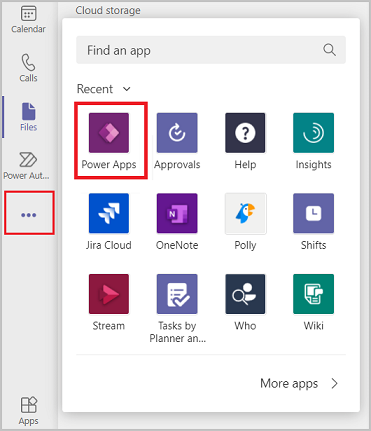

1. Select the Power Apps app from the list to open the app. Power Apps will open inside of teams.

1. We recommended that you “pop out” Power Apps so that if you need to navigate somewhere else in Teams you won’t lose your app configuration. To pop out the Power Apps app, right-click on the Power Apps logo, and select **Pop out app**.

    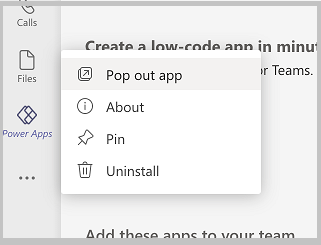

1. Now that you've loaded the Power Apps app, select **Build**.

    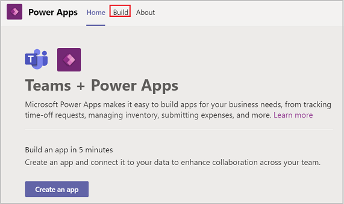

1. This screen will show all the teams that have Power Apps installed in them. Select the team that contain the app you want to share. Select **Share with colleagues**.

    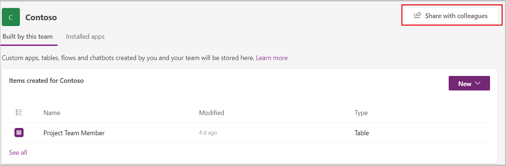

1. Enter an AD security group or a different team with which you'd like to share access to the app.

1. Set the **on/off** toggle to **on** for Issue reporting.

    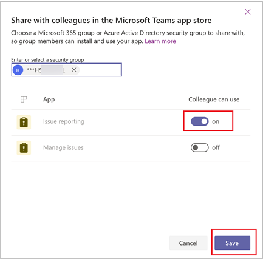

1. Select **Save**.

## Managing table permissions

Understanding and assigning permissions to tables are vital to ensure proper security of your shared data. Here are the four permissions available for use.

- **Full Access** - Allows end users to see and edit all records in the table.

    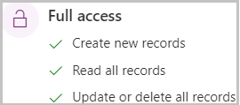

- **Collaborate** – Allows end users to see all records, but they can only edit their own records.

    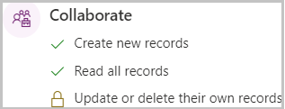

- **Reference** – Provides a read-only view of data for end users.

    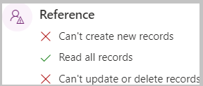

- **Private** – Allows end users to only view and edit their own data.

    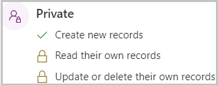

## Grant permissions to the tables

By default, all of the table permissions for colleagues not in the Team are set to **none.** If you leave it that way, colleagues that you share the app with won't be able to use the app, as they won’t have permission to the tables in the app. Follow these steps to set permissions for the tables in the app for colleagues outside of the team:

1. In Teams, open the **Power Apps** app.

1. Select the **Build** tab.

1. Select the team that contain the app you want to share.

1. Select **Installed apps.** This will show all apps installed in the Team.

1. Select **See All** in the **Issue reporting** tile.

    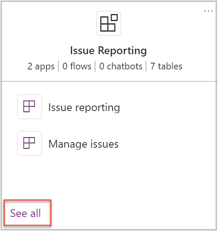

1. Select **Tables** from the solution components bar.

   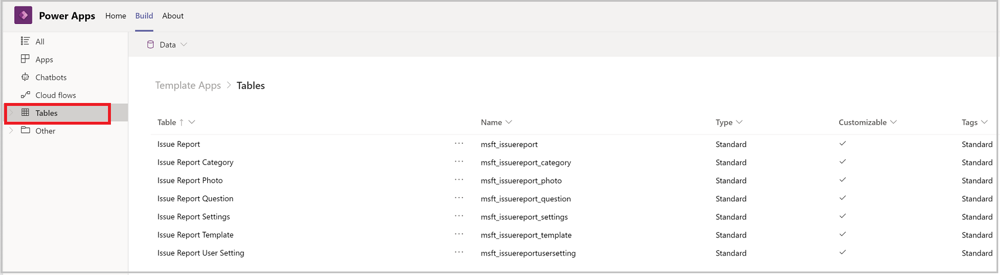

1. Select the tables listed individually then **Manage Permissions.**

1. Select the security group with which the app was shared. The initial permission will show none. Select the desired permission and select **Save.**

1. Repeat step 8 for each additional table in the app.

The following table lists recommended table permissions:

| Table                     | Permission                                                                                                                                                                                                                               |
|---------------------------|------------------------------------------------------------------------------------------------------------------------------------------------------------------------------------------------------------------------------------------|
| Issue Report              | Colleagues outside of the team need to submit issues, we'll give colleagues Collaborate permission on the Issue Report table.                                                                                                          |
| Issue Report Category     | Colleagues outside of the team need to select categories but not edit them, we'll give "collaborate" permission on the Issue Report Category table.                                                                                      |
| Issue Report Photo        | Issue report photo isn't actively used in the app, but is there if you'd like to extend the app add photos to issues. If you select to use photos, you'd want to give "collaborate" permissions to colleagues outside of the team. |
| Issue Report Question     | Colleagues outside of the team should see questions but shouldn't be able to modify question data, so you should give reference permission to colleagues outside of the team.                                                           |
| Issue Report Settings     | Colleagues outside of the team should be able to read issue report settings, but they shouldn't be able to modify issue report setting data, so you'd want to give reference permissions to colleagues outside of the team.         |
| Issue Report Template     | Colleagues outside of the team should be able to read issue report templates, but they shouldn't be able to modify the data, so you'd want to give reference permissions to colleagues outside of the team.                         |
| Issue Report User Setting | Colleagues outside of the team should be able to create and modify their own user setting records for Issue reporting, so you should give them collaborate permission on Issue Report User Setting.                                      |

## Rename the app

In a large organization, you might have multiple people sharing the same template app with colleagues. If multiple departments are using Issue reporting, you can make it easier for your colleagues to find the app by renaming it.

1. Open **Issue reporting** in Power Apps in Teams.

2. From the designer, in the upper right corner select the app name.

   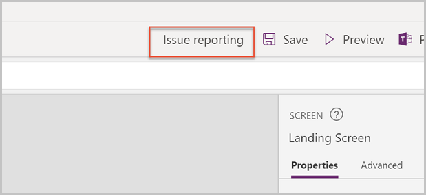

3. Enter a new name for the app. For example, you may want to rename the app
   **Helpdesk** for IT helpdesk issues.

4. Save and publish the app

## Accessing shared apps

So now that you've shared Issue reporting with colleagues outside of your
team, here's how they'll acquire the app.

1. In Teams, select the **…** (ellipsis) button on left-pane.

1. Select **More apps**.

1. Select **Built for your org**.

1. When the app information screen appears, select **Add** to add the app to the main teams app menu.

    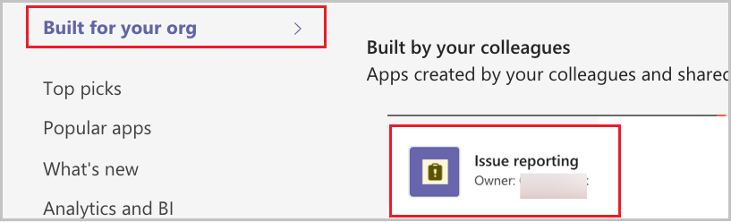

1. After adding the app to the Teams app menu, select the icon for the app to open it full screen in Teams.

1. If you want to make the app always appear in the app menu so you can easily find it, right-click on the Issue reporting button on the app menu and select **Pin**.

    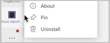

1. If you'd prefer to add the app to another team, select the drop-down by the **Add** button and select **Add to a team**.

    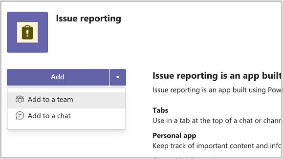

## Limitation

Currently, Teams apps can only be shared with a single Azure Active Directory group.

### See also

- [Understand Issue reporting sample app architecture](issue-reporting-architecture.md)
- [Customize issue reporting app](customize-issue-reporting.md)
- [Sample apps FAQs](sample-apps-faqs.md)
- [Use sample apps from the Teams store](use-sample-apps-from-teams-store.md)

[!INCLUDE[footer-include](../includes/footer-banner.md)]