# Issue Reporting

[!INCLUDE [cc-beta-prerelease-disclaimer.md](../includes/cc-beta-prerelease-disclaimer.md)]

In this tutorial, learn about the **Manage Issues** and **Issue Reporting** apps, and how to use them effectively.

## Overview

**Issue Reporting** consists of two different apps, one app for reporting the issues, and another app for managing issues.

- [Manage Issues app](#manage-issues-app)

    Manage Issues app is used by team managers to:

    - Configure the app experience, including the channel in which Teams messages and Planner tasks are created by the app.
    - Create, review, edit, or delete issue template forms to collect information when a user reports an issue.
    - Review team issues, report on issue history, and efficiently manage issue resolution.

- [Issue Reporting app](#issue-reporting-app)

    Issue Reporting app is used by employees to:

    - Log issues with the information required to resolve the issue.
    - Modify existing issues and assist with resolution
    - To get a high-level view of the issues and team issues.

## Prerequisites

Before using this app:

- Find the app in Teams store.
- Install the app.
- Set up the app for the first use.

For details about the above steps, go to [Use sample apps from the Teams store](use-sample-apps-from-teams-store.md).

## Manage Issues app

This app provides the following capabilities:

- [Configure the app](#configure-the-app)
- [Edit the app configuration](#edit-the-app-configuration)
- [Add a new issue category](#add-a-new-issue-category)
- [Update a category icon](#update-a-category-icon)
- [Update a category title](#update-a-category-title)
- [Delete a category](#delete-a-category)
- [Add a new issue template](#add-a-new-issue-template)
- [Edit an issue template](#edit-an-issue-template)
- [Delete an issue template](#delete-an-issue-template)
- [Review an issue report](#review-an-issue-report)
- [View issue tasks in Planner](#view-issue-tasks-in-planner)

### Configure the app

Steps for App configuration:

1. Sign in to Teams.

1. Select the team.

1. Select the **Manage Issues** tab in Teams.

1. Select the *Channel* where the messages will be posted.

1. Select the *Tasks* (Planner) instance to integrate the app with Planner.

1. Select **Continue**.

    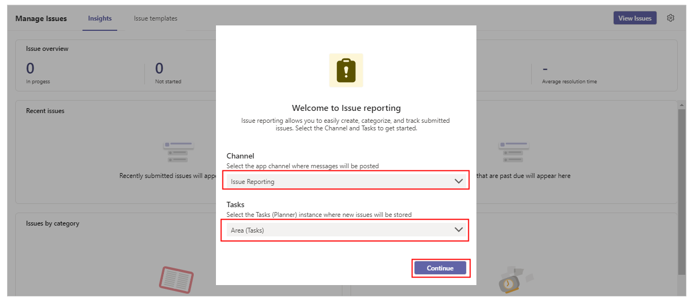

1. Follow the steps provided on the page (Steps 1 and 2) to get the SharePoint site URL. And then, paste the URL in *Step 3* input box.

1. Select **Let's go**.

    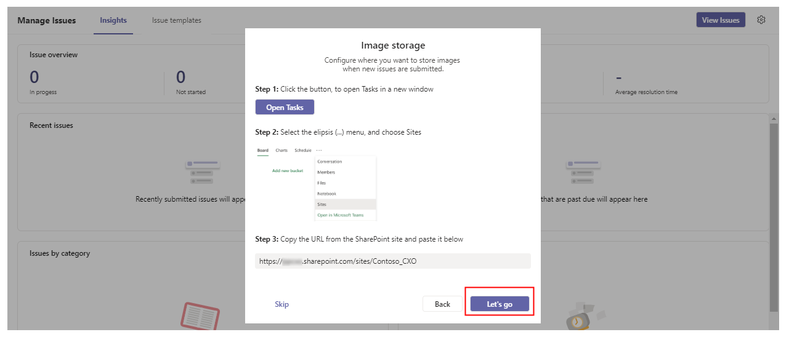

### Edit the app configuration

To edit the app configuration:

1. Select **Manage Issues** tab in Teams.

1. Select **Insights** tab on the *Manage Issues* screen.

1. Select **Settings**.

    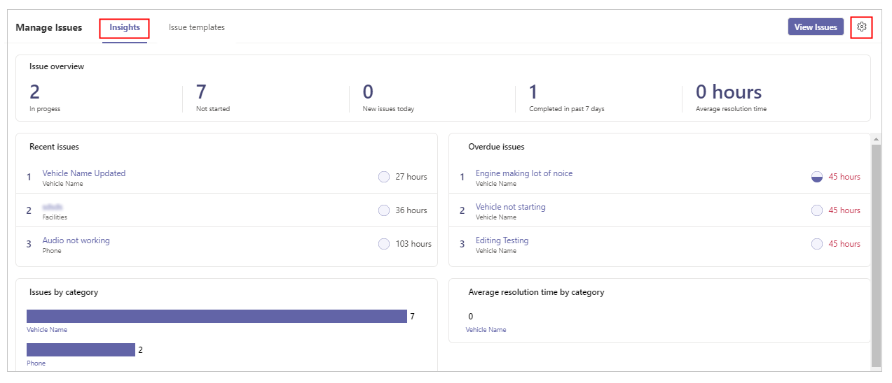

1. Make the required changes.

1. Select **Save**.

    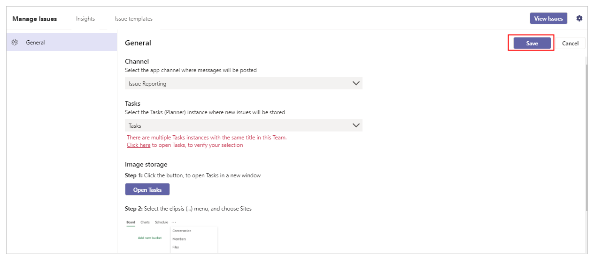

### Add a new issue category

To add a new issue category:

1. Select **Manage Issues** tab in Teams.

1. Select **Issue templates** tab in *Manage Issues* screen.

1. Select **Add category** from the left-pane inside the app.

1. Enter *Title*.

1. Select **Update icon** and update the icon.

1. Select **Save**.

    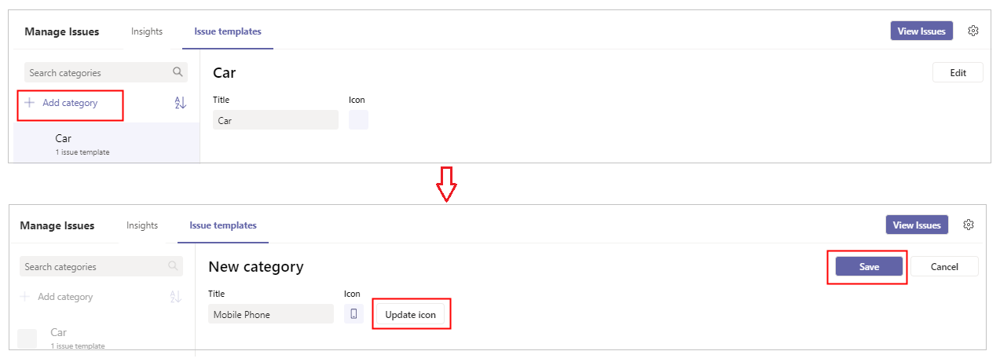

### Update a category icon

To update a category icon:

1. Select **Manage Issues** tab in Teams.

1. Select **Issue templates** tab in *Manage Issues* screen.

1. Select **Edit**.

1. Select **Update icon** and update the icon as required.

1. Select **Save**.

    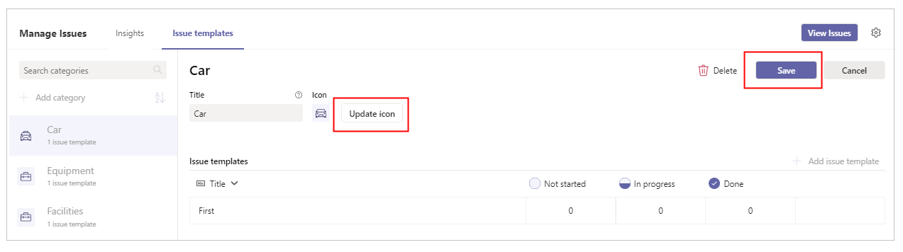

### Update a category title

To update a category title:

1. Select **Tasks** (Planner).

1. Select the required category.

1. Rename the category.

    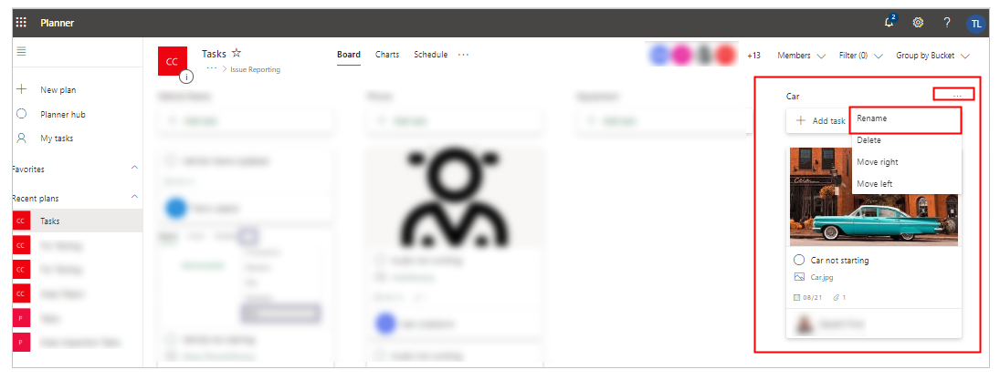

1. Sign in to Teams.

1. Select **Manage Issues** tab in teams.

1. Select **Issue templates** tab.

1. Open the category that you updated in Tasks (Planner) earlier.

1. Select **Update title** to reflect the updated category title in the app.

    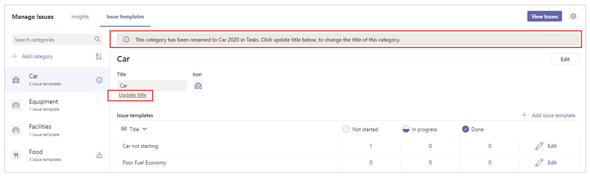

    > [!NOTE]
    > The notification bar shows a notification about the title update in Tasks.

### Delete a category

To delete a category:

1. Select **Manage Issues** tab in Teams.

1. Select **Issue templates** tab in the *Manage Issues* screen.

1. Select the required category.

1. Select **Edit**.

1. Select **Delete**.

1. Select the checkbox next to **I understand**.

1. Select **Delete**.

    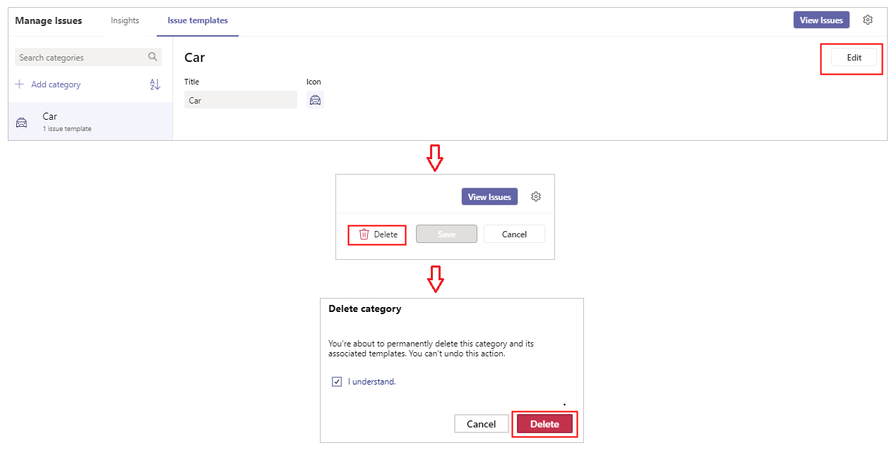

### Add a new issue template

To add a new issue template:

1. Select **Manage Issues** tab in Teams.

1. Select **Issue templates** tab in the *Manage Issues* screen.

1. Select a category to add the new issue template.

1. Select **Add issue template**.

    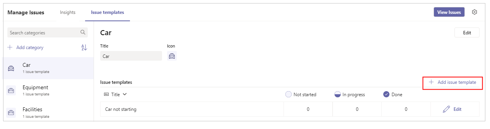

1. Enter the details:

    - *Title*
    - *Due within*
    - *Auto assign issue to*
    - *Issue questions*
    - *Additional help*
    - *Primary contact*
    - *Supporting information*

    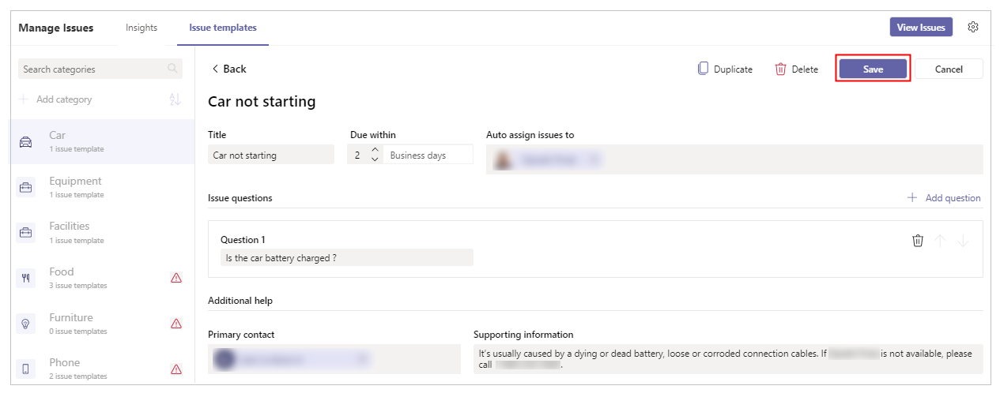

1. Select **Save**.

### Edit an issue template

To edit an issue template:

1. Select **Manage Issues** tab in Teams.

1. Select **Issue templates** tab in the *Manage Issues* screen.

1. Select the required category.

1. Select **Edit** for the required issue template.

    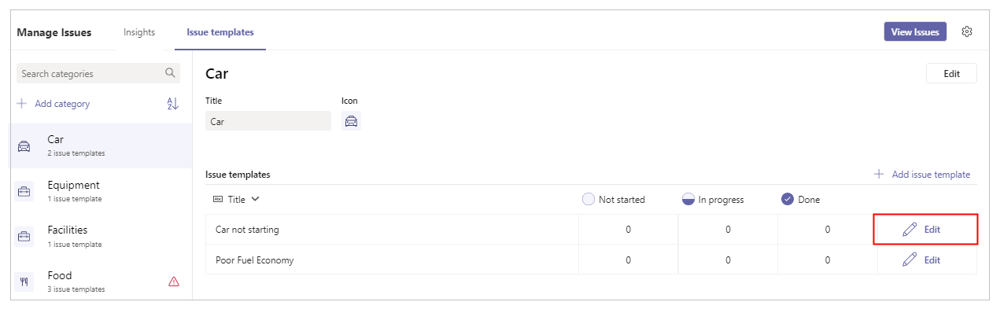

1. Edit the issue template as required.

1. Select **Save**.

    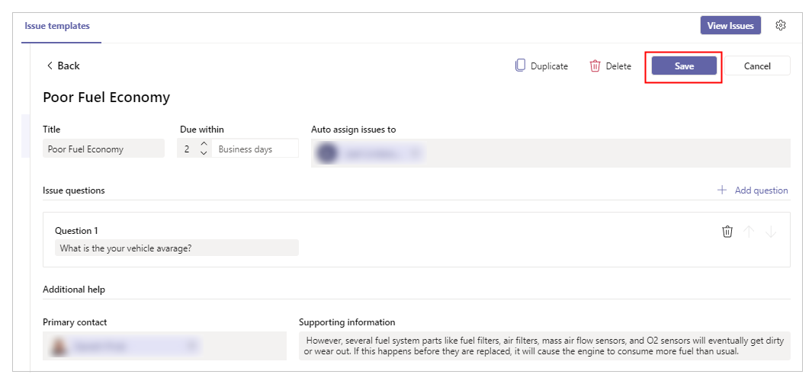

### Delete an issue template

To delete an issue template:

1. Select **Manage Issues** tab in Teams.

1. Select **Issue templates** tab in the *Manage Issues* screen.

1. Select the required category.

1. Select **Edit** for the required issue template.

1. Select **Delete**.

1. Select the checkbox next to **I understand**.

1. Select **Delete**.

    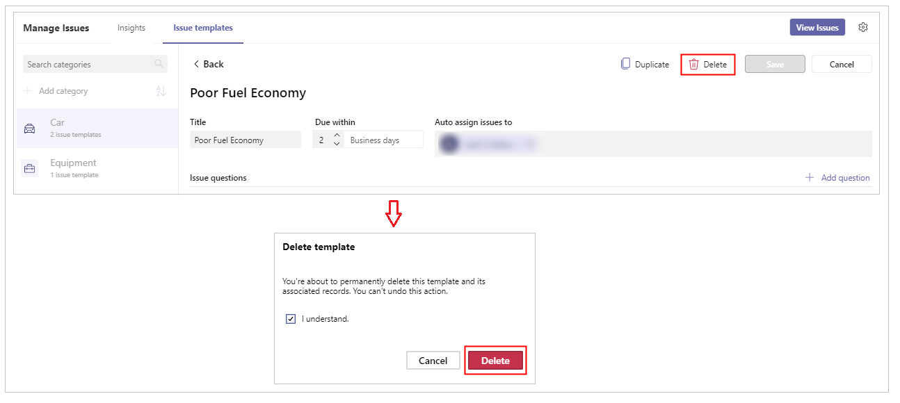

### Review an issue report

To review an issue report:

1. Select **Manage Issues** tab in Teams.

1. Select **Insights** tab.

    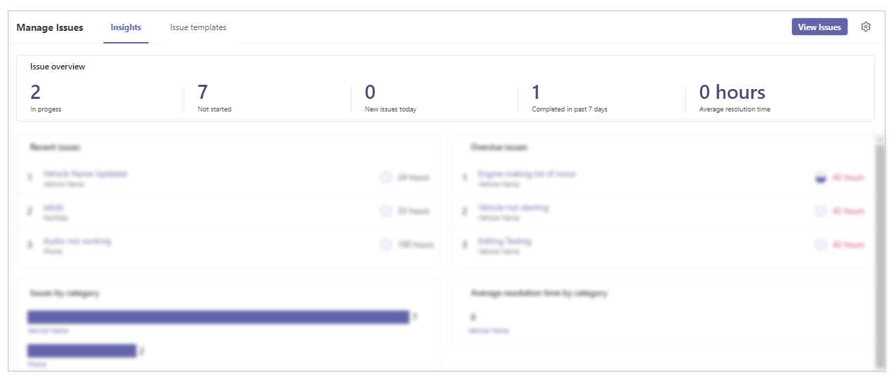

### View issue tasks in Planner

To view issue tasks in Planner

1. Select **Manage Issues** tab in Teams.

1. Select **Insights** tab.

1. Select **View Issues**.

    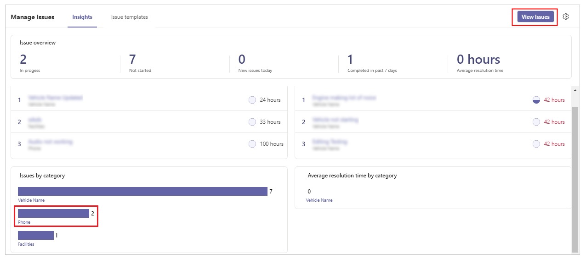

## Issue Reporting app

Issue reporting app provides the following capabilities:

- [Submit a new issue](#submit-a-new-issue)
- [View an issue task in Planner](#view-an-issue-task-in-planner)
- [Review and edit existing issues in Planner](#review-and-edit-existing-issues-in-planner)

### Submit a new issue

To Submit a new issue:

1. Select **Issue Reporting** tab in Teams.

1. Select **Report an issue**.

1. Select issue type.

1. Enter issue details.

    > [!NOTE]
    > Some of the issue details are automatically filled.

1. Select **Submit issue**.

    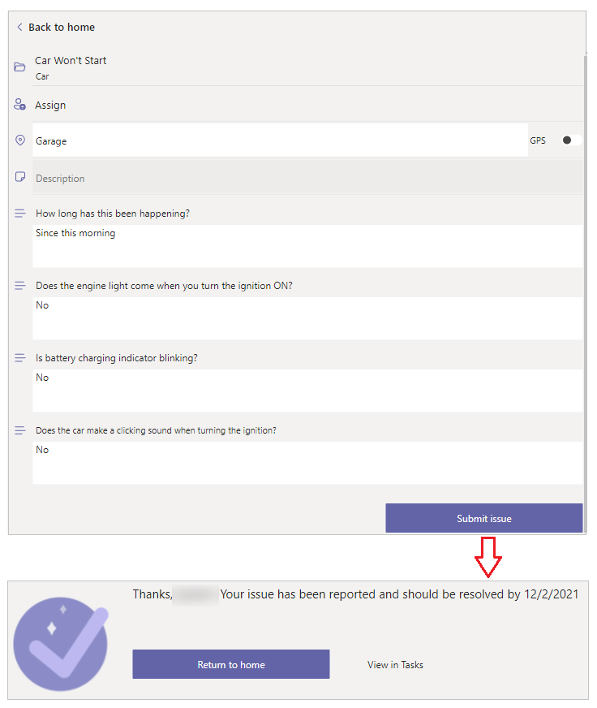

### View an issue task in Planner

To view an issue task in Planner:

1. Select **Issue Reporting** tab in Teams.

1. Select **View issues**.

    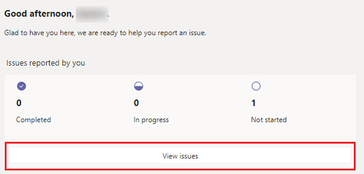

1. Select **View in Tasks**.

    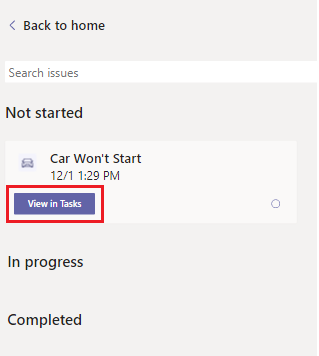

This action opens Planner with the selected issue task.

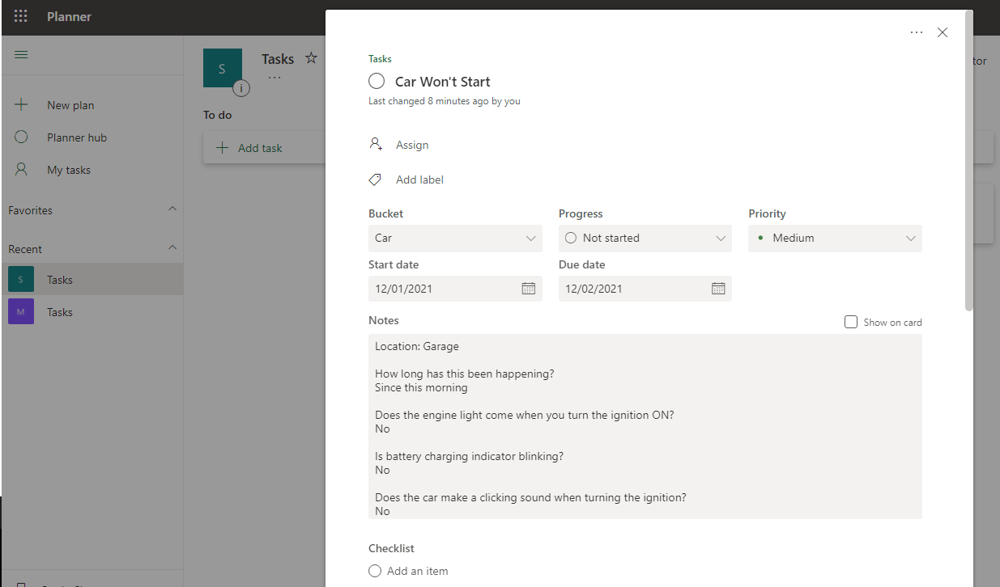

### Review and edit existing issues in Planner

To review and edit existing issues in Planner:

1. Go to Tasks (Planner).

1. Select the issue task.

1. Edit the task.

    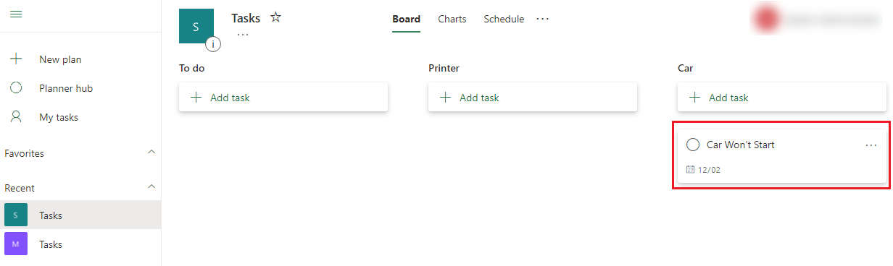

### See also

- [Inspection](inspection.md)
- [Employee Ideas](employee-ideas.md)
