# Issue Reporting

In this tutorial, learn about the **Manage Issues** and **Issue Reporting** apps, and how to use them effectively.

## Overview

**Issue Reporting** consists of two different apps, one app for reporting the issues, and another app for managing issues.

- Manage Issues

    Manage Issues app is used by team managers to:

    - Configure the app experience, including the channel in which Teams messages and Planner tasks are created by the app.
    - Create, review, edit, or delete issue template forms to collect information when a user reports an issue.
    - Review team issues, report on issue history, and efficiently manage issue resolution.

- Issue Reporting

    Issue Reporting app is used by employees to:

    - Log issues with the information required to resolve the issue.
    - Modify existing issues and assist with resolution
    - To get a high-level view of his/her issues and team issues.

## Prerequisites

Before using this app:

- Find the app in Teams store.
- Install the app.
- Set up the app for the first use.

For details about the above steps, go to [Use sample apps from the Teams store](use-sample-apps-from-teams-store.md).

## Manage Issues app

This app provides the following capabilities:

- Configure the app
- Edit the app configuration
- Add a new issue category
- Update a category icon
- Update a category title
- Delete a category
- Add a new issue template
- Edit an issue template
- Delete an issue template
- Review an issue report
- View issue tasks in Planner

### Configure the app

Steps for App configuration:

1. Sign in to Teams.

1. Select the team.

1. Select the **Manage Issues** tab in Teams.

1. Select the *Channel* where the messages will be posted.

1. Select the *Tasks* (Planner) instance to integrate the app with Planner.

1. Select **Continue**.

    

1. Follow the steps provided on the page (Steps 1 and 2) to get the SharePoint site URL. And then, paste the URL in *Step 3* input box.

1. Select **Let's go**.

    

### Edit the app configuration

To edit the app configuration:

1. Select **Manage Issues** tab in Teams.

1. Select **Insights** tab on the *Manage Issues* screen.

1. Select **Settings**.

    

1. Make the required changes.

1. Select **Save**.

    

### Add a new issue category

To add a new issue category:

1. Select **Manage Issues** tab in Teams.

1. Select **Issue templates** tab in *Manage Issues* screen.

1. Select **Add category** from the left-pane inside the app.

1. Enter *Title*.

1. Select **Update icon** and update the icon.

1. Select **Save**.

    

### Update a category icon

To update a category icon:

1. Select **Manage Issues** tab in Teams.

1. Select **Issue templates** tab in *Manage Issues* screen.

1. Select **Edit**.

1. Select **Update icon** and update the icon as required.

1. Select **Save**.

    

### Update a category title

To update a category title:

1. Select **Tasks** (Planner).

1. Select the required category.

1. Rename the category.

    

1. Sign in to Teams.

1. Select **Manage Issues** tab in teams.

1. Select **Issue templates** tab.

1. Open the category that you updated in Tasks (Planner) earlier.

1. Select **Update title** to reflect the updated category title in the app.

    

    > [!NOTE]
    > The notification bar shows a notification about the title update in Tasks.

### Delete a category

To delete a category:

1. Select **Manage Issues** tab in Teams.

1. Select **Issue templates** tab in the *Manage Issues* screen.

1. Select the required category.

1. Select **Edit**.

1. Select **Delete**.

1. Select the checkbox next to **I understand**.

1. Select **Delete**.

    

### Add a new issue template

To add a new issue template:

1. Select **Manage Issues** tab in Teams.

1. Select **Issue templates** tab in the *Manage Issues* screen.

1. Select a category to add the new issue template.

1. Select **Add issue template**.

    

1. Enter the following:

    - *Title*
    - *Due within*
    - *Auto assign issue to*
    - *Issue questions*
    - *Additional help*
    - *Primary contact*
    - *Supporting information*

    

1. Select **Save**.

### Edit an issue template

To edit an issue template:

1. Select **Manage Issues** tab in Teams.

1. Select **Issue templates** tab in the *Manage Issues* screen.

1. Select the required category.

1. Select **Edit** for the required issue template.

    

1. Edit the issue template as required.

1. Select **Save**.

    

### Delete an issue template

Steps to delete issue template

>   1. Go to **Manage Issues** tab in Teams 

>   2. Click on “Issue templates” tab in the manage issues screen

>   3. Select required category

>   4. Go to the Issue templates section

>   5. Click on "Edit" button present on the right side

>   7. Click on "Delete" button

>   8. Select checkbox “I understand” to re-confirm

>   9. Click on “Delete” button

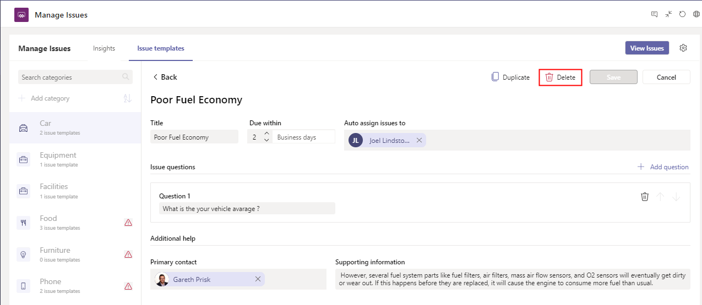

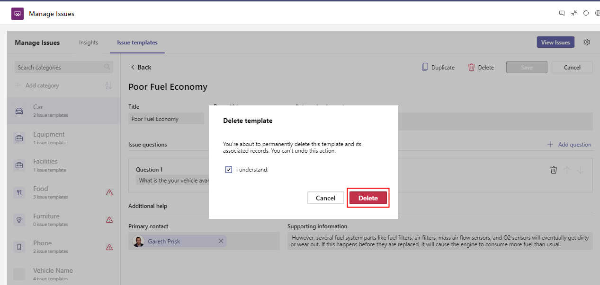

### Review an issue report

Steps to review issue report :

>   1. Go to **Manage Issues** tab in Teams

>   2. Click on “Insights” tab

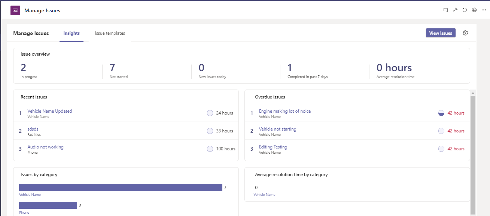

### View issue tasks in Planner

Steps to see issue tasks in planner :

>   1. Go to **Manage Issues** tab in Teams

>   2. Click on “Insights” tab

>   3. Click on “View Issues” button

>   4. User gets navigated to the planner app to see the tasks list

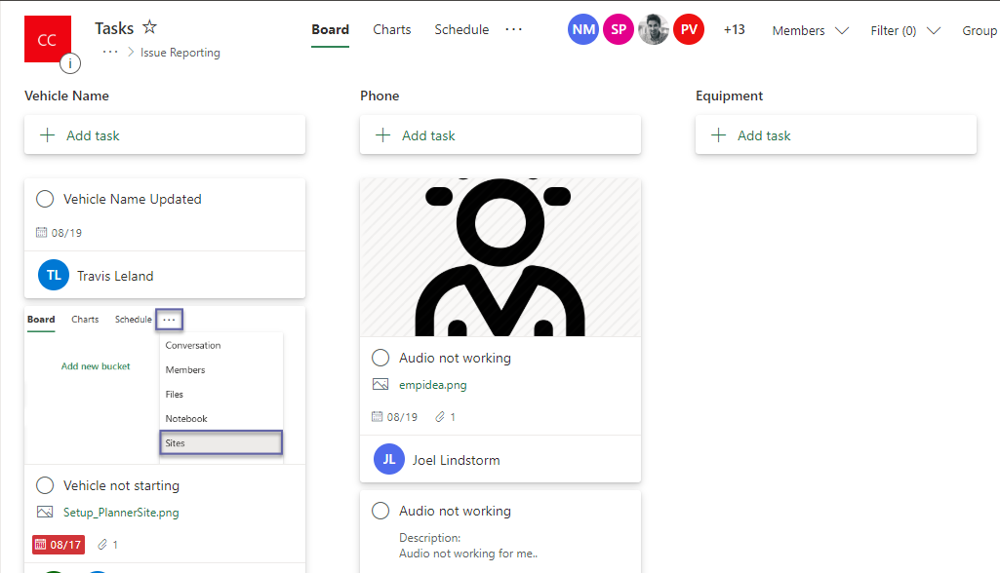

Likewise, you can select an issue category to see the related tasks list in Planner:

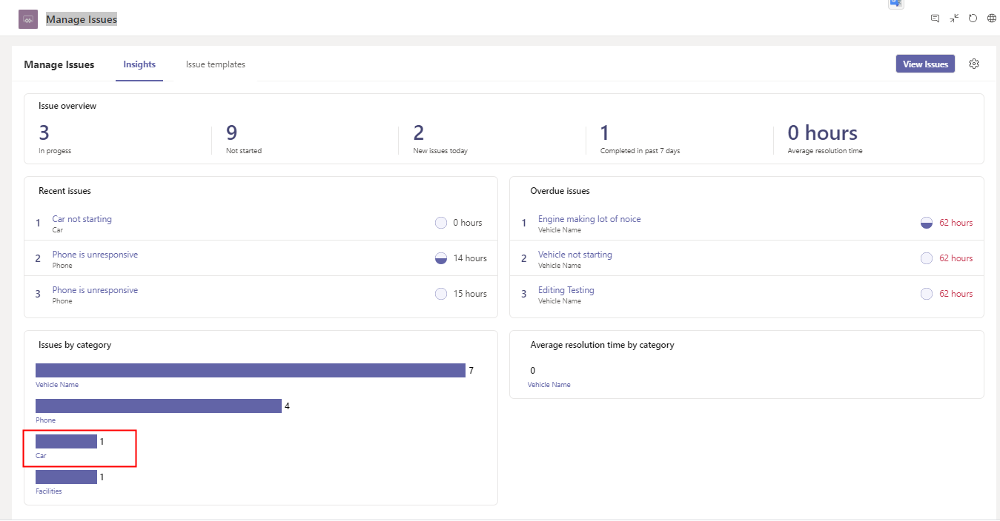

## Issue Reporting app

Issue reporting app provides the following capabilities:

- Create a new issue
- View an issue task in Planner
- Review and edit existing issues in Planner

### Create a new issue

>   Steps to report an issue :

>   1. Go to **Issue Reporting** tab in Teams

>   2. Click on “Report an issue" button

>   3. Select relevant issue type

>   4. Issue details auto-fills based on the selected issue type

>   5. Fill out the other details

>   6. Click on "Submit issue" button

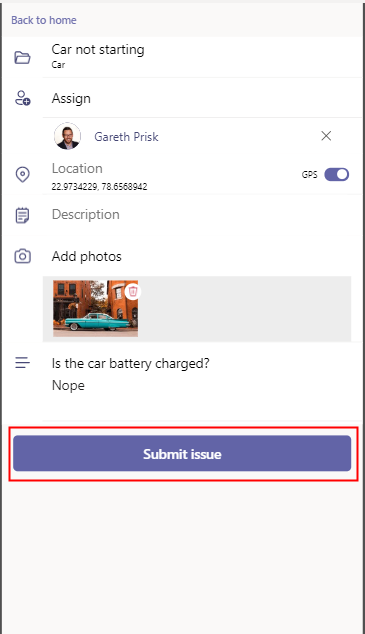

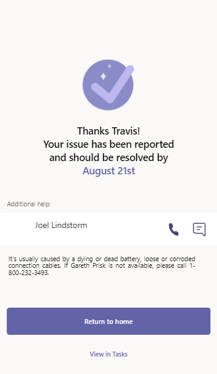

### View an issue task in Planner

>   Steps to view task in planner :

>   1. Go to **Issue Reporting** tab in Teams

>   2. Click on “View issues"

>   3. Click on “View in Tasks”

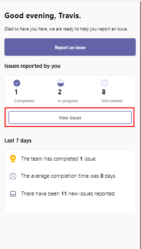

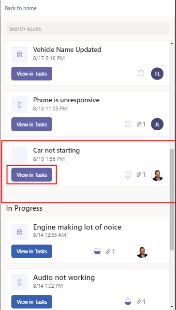

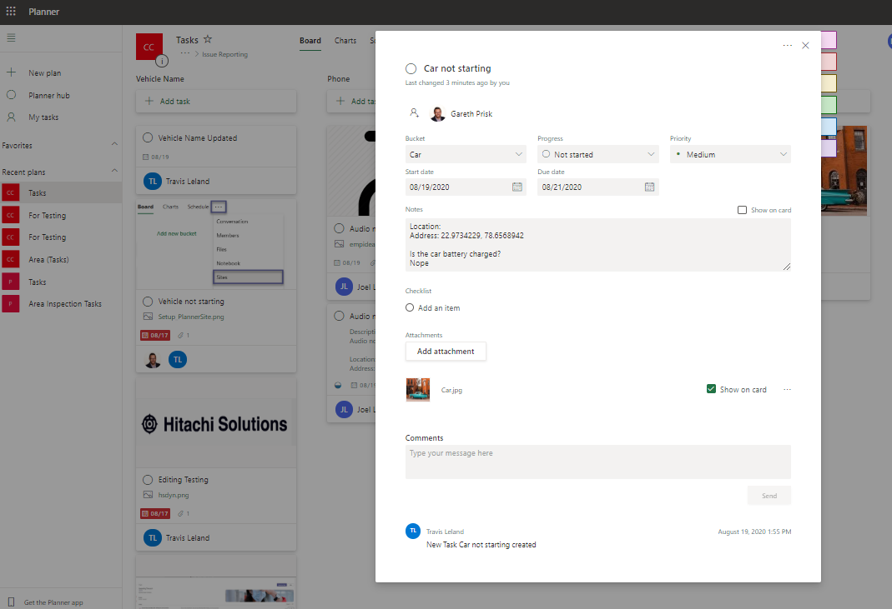

### Review and edit existing issues in Planner

>   Steps to modify issues in planner:

>   1. Go to the Tasks (Planner)

>   2. Select the desired issue tasks

>   3. Make the desired changes in the issue tasks

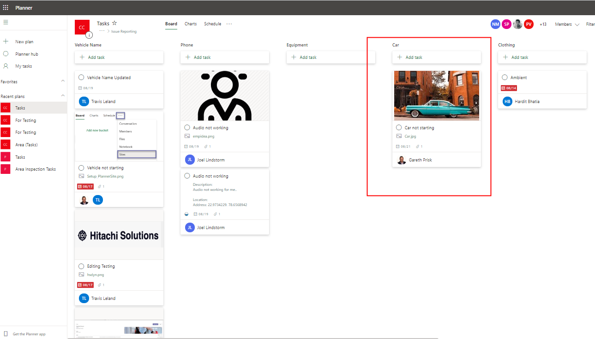

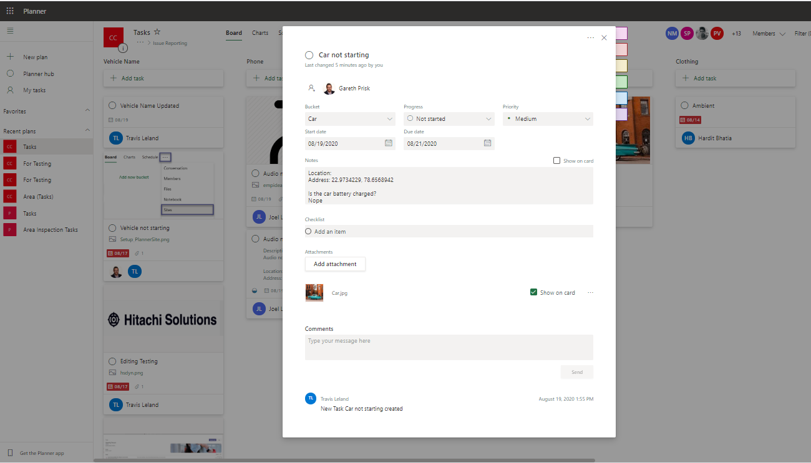
