# Issue Reporting

In this tutorial, learn about the **Manage Issues** and **Issue Reporting** apps, and how to use them effectively.

## Overview

**Issue Reporting** consists of two different apps, one app for reporting the issues, and another app for managing issues.

- Manage Issues

    Manage Issues app is used by team managers to:

    - Configure the app experience, including the channel in which Teams messages and Planner tasks are created by the app.
    - Create, review, edit, or delete issue template forms to collect information when a user reports an issue.
    - Review team issues, report on issue history, and efficiently manage issue resolution.

- Issue Reporting

    Issue Reporting app is used by employees to:

    - Log issues with the information required to resolve the issue.
    - Modify existing issues and assist with resolution
    - To get a high-level view of his/her issues and team issues.

## Prerequisites

Before using this app:

- Find the app in Teams store.
- Install the app.
- Set up the app for the first use.

For details about the above steps, go to [Use sample apps from the Teams store](use-sample-apps-from-teams-store.md).

## Manage Issues app

This app provides the following capabilities:

- Configure the app
- Edit the app configuration
- Add a new issue category
- Update category icon
- Update category title
- Delete a category
- Add a new issue template
- Edit an issue template
- Delete an issue template
- Review an issue report
- View issue tasks in Planner

### Configure the app

Steps for App configuration:

1. Sign in to Teams.

1. Select the team.

1. Select the **Manage Issues** tab in Teams.

3.  User will be prompted to choose Channel and Tasks (Planner)

4.  Click on the "Continue" button

5.  Follow the steps provided on the page to get the SharePoint URL

6.  Click on "Let's go" button

    

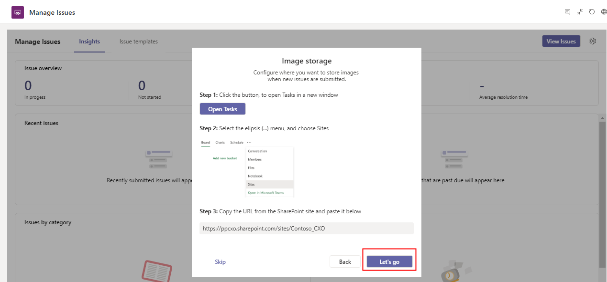

 ### Edit the app configuration

>   Steps to update app configuration:

1.  Go to **Manage Issues** tab in Teams

2.  Click on “Insights” tab in the manage issues page

3.  Click on the setting icon

4.  Make the required changes

5.  Click on "Save" button

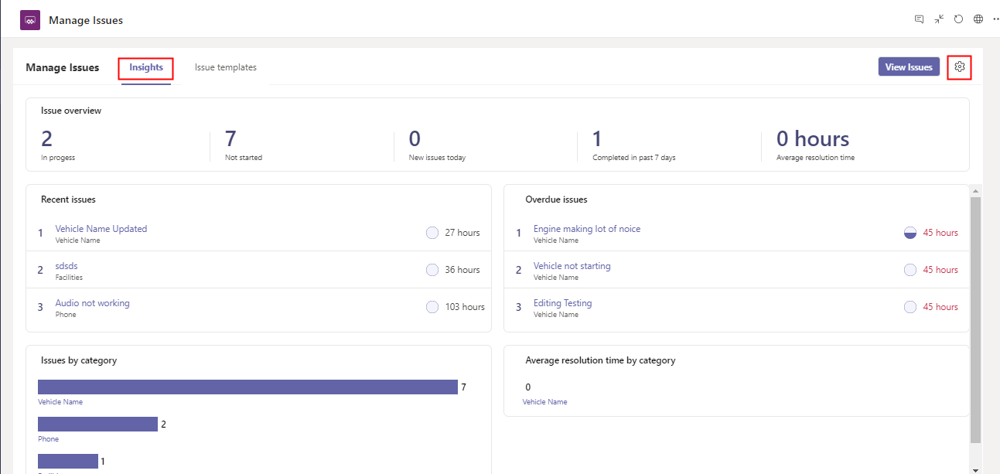

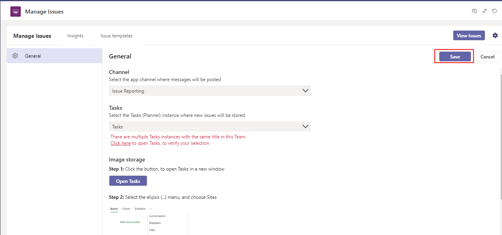

### Add a new issue category

>   Steps to add Issue category:

1.  Go to **Manage Issues** tab in Teams

2.  Click on “Issue templates” tab in manage issues screen

3.  Click on the “Add category” button

4.  Fill in the category title and click on “Update icon” to select the desired
    category icon

5.  Click on “Save” button

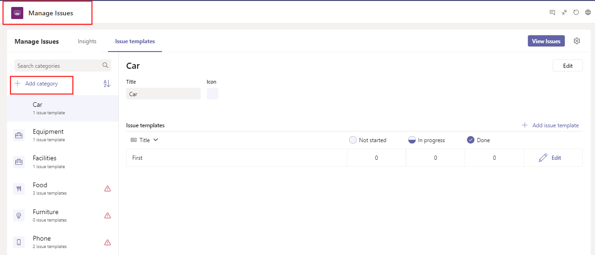

### Update category icon

Steps to update category icon:

1.  Go to **Manage Issues** tab in Teams

2.  Click on “Issue templates” tab in manage issues screen

3.  Click on “Edit” button

4.  Click on “Update icon” and select the requird icon

5.  Click on “Save” button

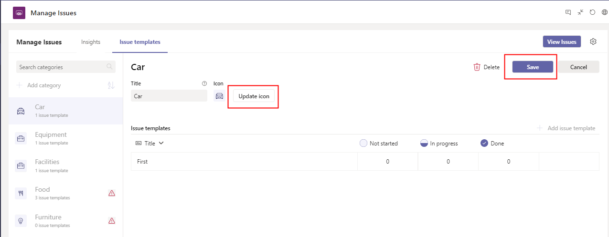

### Update category title

>   Steps to update category title :  
>     
>   1. Go to the Tasks (Planner) tab in teams  
>   2. Go the required category  
>   3. Rename category  
>   4. Login into the team with a valid-user  
>   5. Go to the **Manage Issues** tab  
>   6. Go to the “Issue templates” tab  
>   7. Open the category which got updated in planner tasks  
>   8. Observe the info in the notification bar and click on “Update title” to
>   reflect the category updated title in the app

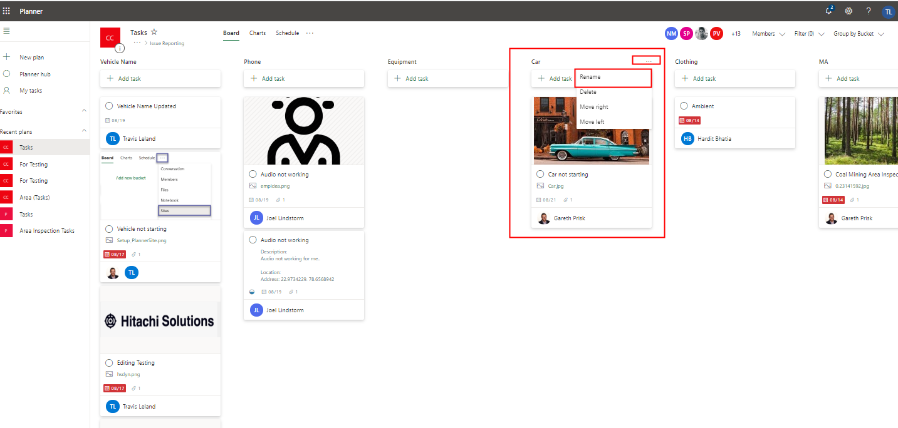

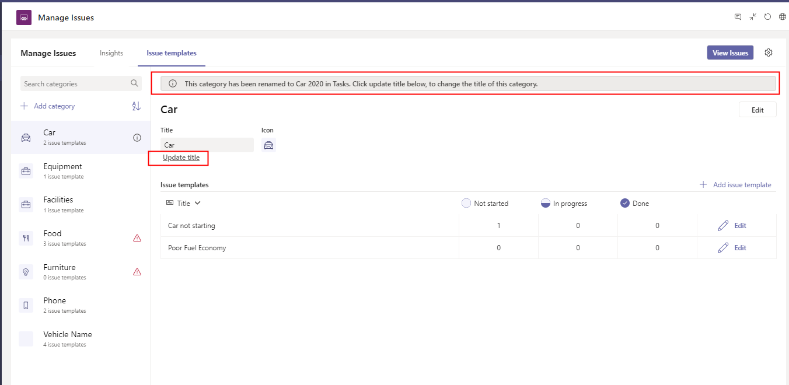

### Delete a category

>   Steps to delete category

1.  Go to **Manage Issues** tab in Teams

2.  Click on “Issue templates” tab in the manage issues screen

3.  Select the required category

4.  Click on “Edit” button

5.  Click on “Delete” button

6.  Click on “I understand” checkbox in the confirmation popup

7.  Click on “Delete”

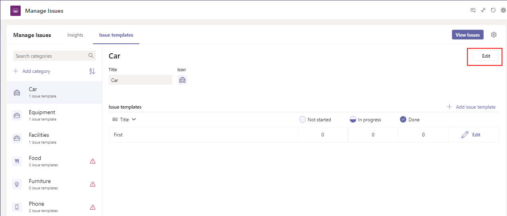

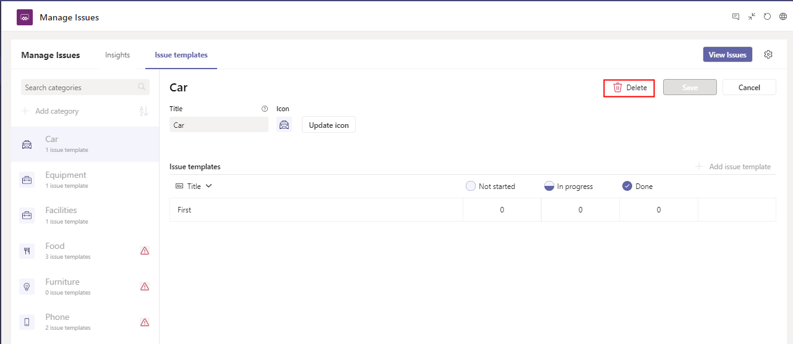

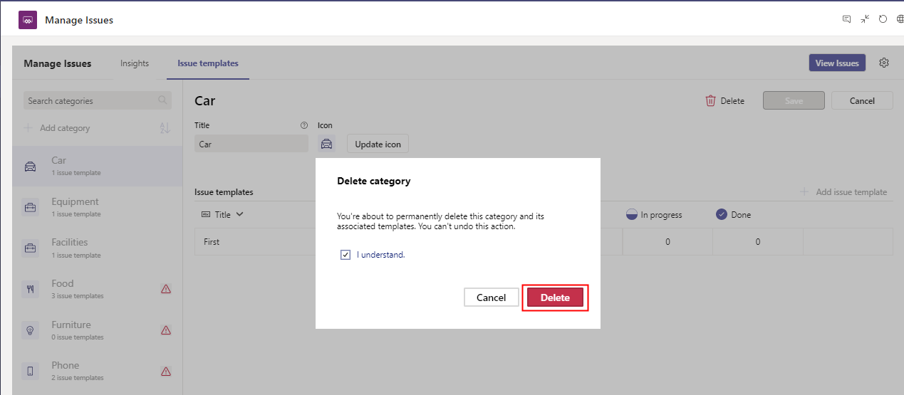

### Add a new issue template

>   Steps to add new issue template

>   1. Go to **Manage Issues** tab in Teams

>   2. Click on “Issue templates” tab in the manage issues screen

>   3. Select category to add new issue template

>   4. Click on "Add issue template"

>   5. Fill the required details such as Title, Due within, Auto assign issues
>   to, Additional help, Supporting information

>   6. Add Issue questions (Click on "Add question" to add)

>   7. Click on "Save" button

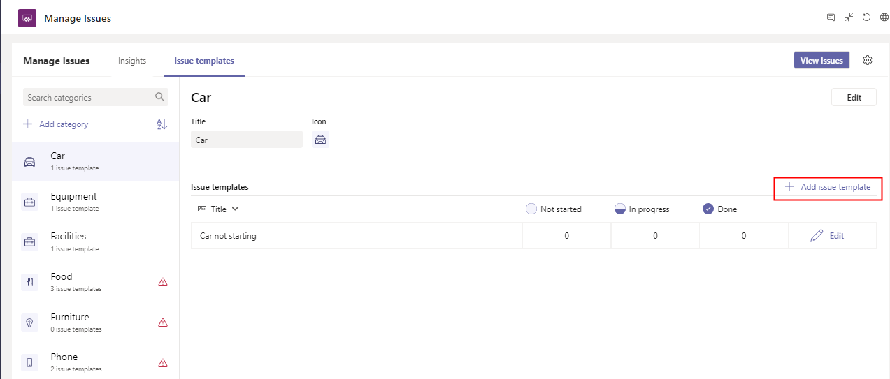

### Edit an issue template

Steps to edit issue template

>   1. Go to **Manage Issues** tab in Teams 

>   2. Click on “Issue templates” tab in the manage issues screen

>   3. Select required category

>   4. Go to the Issue templates section

>   5. Click on "Edit" button present on the right side

>   6. Make the required changes

>   7. Click on "Save" button

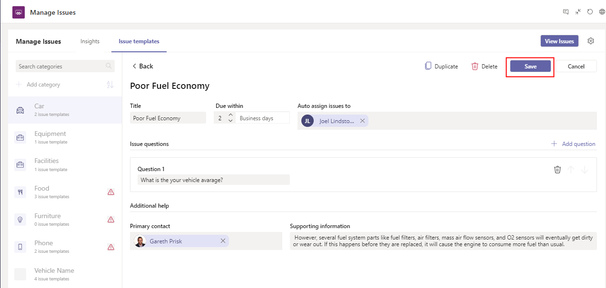

### Delete an issue template

Steps to delete issue template

>   1. Go to **Manage Issues** tab in Teams 

>   2. Click on “Issue templates” tab in the manage issues screen

>   3. Select required category

>   4. Go to the Issue templates section

>   5. Click on "Edit" button present on the right side

>   7. Click on "Delete" button

>   8. Select checkbox “I understand” to re-confirm

>   9. Click on “Delete” button

### Review an issue report

Steps to review issue report :

>   1. Go to **Manage Issues** tab in Teams

>   2. Click on “Insights” tab

### View issue tasks in Planner

Steps to see issue tasks in planner :

>   1. Go to **Manage Issues** tab in Teams

>   2. Click on “Insights” tab

>   3. Click on “View Issues” button

>   4. User gets navigated to the planner app to see the tasks list

Likewise, you can select an issue category to see the related tasks list in Planner:

## Issue Reporting app

Issue reporting app provides the following capabilities:

- Create a new issue
- View an issue task in Planner
- Review and edit existing issues in Planner

### Create a new issue

>   Steps to report an issue :

>   1. Go to **Issue Reporting** tab in Teams

>   2. Click on “Report an issue" button

>   3. Select relevant issue type

>   4. Issue details auto-fills based on the selected issue type

>   5. Fill out the other details

>   6. Click on "Submit issue" button

### View an issue task in Planner

>   Steps to view task in planner :

>   1. Go to **Issue Reporting** tab in Teams

>   2. Click on “View issues"

>   3. Click on “View in Tasks”

### Review and edit existing issues in Planner

>   Steps to modify issues in planner:

>   1. Go to the Tasks (Planner)

>   2. Select the desired issue tasks

>   3. Make the desired changes in the issue tasks

