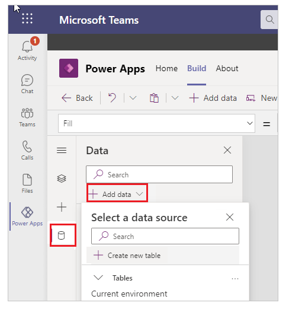
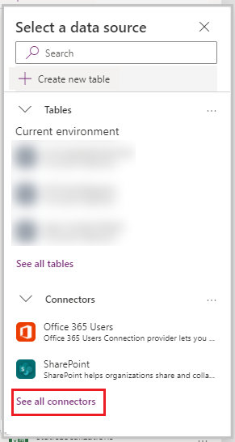
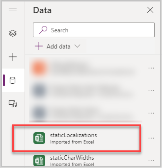
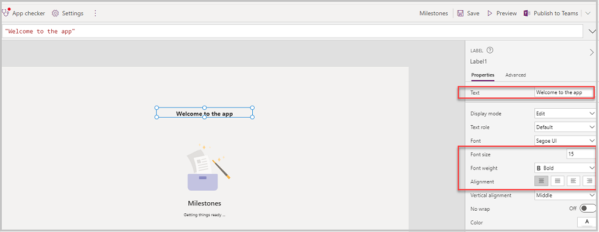

# Localize sample apps

The sample apps for Microsoft Teams have been localized to support eight different languages so that they can be used by people with different languages. Depending on the user’s language, you can see the text in an app in the appropriate language, if that language has been included in the app localization.

For example, consider that you use the Russian language. Russian isn't a language included in the standard localization; however, you can still use the app in Russian&mdash;if you add that language and localize the app labels.

This article covers the approach used for localization of the sample apps for Teams, and how to extend it to add support for another language (such as Russian). In this example, we'll use the [Milestones app](milestones.md); but this same approach is used consistently across all of the Teams template Power Apps, and you can follow the same approach for localization of your own canvas apps.

## Prerequisites

To complete this lesson, we'd need the ability to create Power Apps within Teams, which is available as part of select Microsoft 365 subscriptions.

## Understanding localization in Power Apps

In canvas apps, text labels and other visual text components can be localized by loading a static Excel data source to your app containing the localized value for each text string in each language. For more information about this process, see [Language function](maker/canvas-apps/functions/function-language.md).

For example, Milestones app contains an Excel data source called **StaticLocalizationsjon** with three columns&mdash;"OOBTextID", "LanguageTag", and "LocalizedText".

-   **OOBTextID** is the identifier of the text that is to be localized.

-   **LanguageTag** is the identifier of the language in which the text is to be localized. Language tag is a standard abbreviated text defining a language and the country its being used in (for example, "en-US" means "English-United States").

-   **LocalizedText** is the text in the appropriate language that needs to be displayed.

Here's an example with localized text for each text ID.

| **OOBTextID**                         | **LanguageTag** | **LocalizedText**                     |
|---------------------------------------|-----------------|---------------------------------------|
| lblLoadingText\_AppLoading\_\_locText | en-US           | Getting things ready ...              |
| lblLoadingText\_AppLoading\_\_locText | de-DE           | Dinge fertig machen ...               |
| lblLoadingText\_AppLoading\_\_locText | es-ES           | Preparando las cosas ...              |
| lblLoadingText\_AppLoading\_\_locText | fr-FR           | Préparer les choses ...               |
| lblLoadingText\_AppLoading\_\_locText | it-IT           | Preparare le cose ...                 |
| lblLoadingText\_AppLoading\_\_locText | ja-JP           | 準備をする..。                        |
| lblLoadingText\_AppLoading\_\_locText | nl-NL           | Dingen klaarmaken ...                 |
| lblLoadingText\_AppLoading\_\_locText | pt-BR           | Preparando as coisas ...              |
| lblLoadingText\_AppName\_\_locText    | en-US           | Milestones                            |
| lblLoadingText\_AppName\_\_locText    | de-DE           | Meilensteine                          |
| lblLoadingText\_AppName\_\_locText    | es-ES           | Hitos                                 |
| lblLoadingText\_AppName\_\_locText    | fr-FR           | Jalons                                |
| lblLoadingText\_AppName\_\_locText    | it-IT           | Passaggi fondamentali                 |
| lblLoadingText\_AppName\_\_locText    | ja-JP           | マイルストーン                        |
| lblLoadingText\_AppName\_\_locText    | nl-NL           | Mijlpalen                             |
| lblLoadingText\_AppName\_\_locText    | pt-BR           | Etapas                                |
| lblLoadingText\_BuiltWith\_\_locText  | en-US           | Built with Microsoft Power Platform   |
| lblLoadingText\_BuiltWith\_\_locText  | de-DE           | Erstellt mit Microsoft Power Platform |
| lblLoadingText\_BuiltWith\_\_locText  | es-ES           | Creada con Microsoft Power Platform   |
| lblLoadingText\_BuiltWith\_\_locText  | fr-FR           | Créé avec Microsoft Power Platform    |
| lblLoadingText\_BuiltWith\_\_locText  | it-IT           | Creata con Microsoft Power Platform   |
| lblLoadingText\_BuiltWith\_\_locText  | ja-JP           | Microsoft Power Platform でビルド     |
| lblLoadingText\_BuiltWith\_\_locText  | nl-NL           | Gebouwd met Microsoft Power Platform  |
| lblLoadingText\_BuiltWith\_\_locText  | pt-BR           | Criado com o Microsoft Power Platform |

> [!NOTE]
> The above table is from the master file that contains localized text for all the screens in the app. However, it's been filtered to show only the rows relevant to earlier discussions.

## How to use Excel as a static data source in your app

Static data is data loaded into Power Apps from Excel. This data isn't editable in the app. If you want to add a static data source to your app, perform the following steps.

1. In Teams, right-click on **Power Apps**, and pop out the app.

1. Select the **Build** tab.

1. Open the desired app to edit in Studio. In this example, we'll use **Milestones** app.

1. Select the **Data** tab.

1. Select **Add data**.

    

1. Select **Connectors**.

1. Select **See all connectors**.

    

1. Select **Import from Excel**.

1. Select the **LocalizationMilestones_AllLanguages** file, and select **Open**.

1. On the right of the screen, you're asked to choose a table. Select the table **staticLocalizations**, and select **Connect**. The table gets added as a data source and can be used in the app.

    

## Adding a new language to your app

Now that you understand how localization is handled in Power Apps, if you want to add an additional language to the app, you don’t have to update every text control in the app. The text formulas are built to dynamically display the appropriate localized copy of text strings based on the user’s language.

To add Russian, you would first add Russian translation to the spreadsheet for each **OOBTextID**. In this example, we'll show how we can add localized text for the text on the first page of the app.

1. Open **LocalizationMilestoes_AllLanguages.xlsx** file.

1. Add the following rows to the Excel:

    | OOBTextID                             | LanguageTag | LocalizedText                                 |
    |---------------------------------------|-------------|-----------------------------------------------|
    | lblLoadingText\_AppName\_\_locText    | ru-RU       | Вехи                                          |
    | lblLoadingText\_BuiltWith\_\_locText  | ru-RU       | Создано на платформе Microsoft Power Platform |
    | lblLoadingText\_AppLoading\_\_locText | ru-RU       | Готовимся ...                                 |

1. To add Russian text for all pages, we'd have to add rows for all the OOBTextIDs as they exist for any other language, then add **ru-RU** as the Language tag. and then add the Russian translation for each of those OOBTextIDs.

1. Save Excel file.

    > [!NOTE]
    > Since the Excel file already exists as a data source in the data sources list for the app, we'll have to remove the excel from the list of data sources and then readd it as shown above.

1. Update the app OnStart function **gblUserLanguage** to include the language that you added to the Excel file. In the example below we've added Russian:

    ```powerapps-dot
    //user language
    Set(gblUserLanguage,Switch(Left(Language(),2),"de","de-DE","en","en-US","es","es-ES","fr","fr-FR","it","it-IT","ja","ja-JP","nl","nl-NL",
    "pt","pt-BR",“ru-RU”,
    //default
    "en-US"));
    //build localization collection, with user's language
    ClearCollect(colLocalization,Filter(staticLocalizations,LanguageTag = gblUserLanguage));Collect(colLocalization,Filter(staticLocalizationsNewMessages,LanguageTag = gblUserLanguage));
    ```

1. Save and publish the app.

Since the formulas dynamically retrieve the localized content, there's no need to update the formulas to reflect the newly added language.

## Adding and localizing a new label

As an extension to the default Milestones app, we'll add a new label and learn how to localize it.
Let us add a label to the Loading screen:

1. Select **Insert**, and select label control.

    .

1. Update the Text and properties of the label.

    

    For now, we'll set the text to “Welcome to the app” until it's ready for localization.

1. Open the Excel file to add rows for this text.

1. Create eight rows in the Excel file with **OOBTextID** value **lblLoadingText_Welcome_locText**, and **LanguageTag** for the 8 rows:

    | en-US |
    |-------|
    | de-DE |
    | es-ES |
    | fr-FR |
    | it-IT |
    | ja-JP |
    | nl-NL |
    | pt-BR |

1. For the third column&mdash;**LocalizedText**, translate the text “Welcome to the app” in the 8 different languages:

    - en-US (US English)
    - de-DE (German)
    - es-ES (Spanish)
    - fr-FR (French)
    - it-IT (Italian)
    - ja-JP (Japanese)
    - nl-NL (Dutch)
    - pt-BR (Portuguese)

1. Update the spreadsheet with all the translated text as shown below.

    

1. Save the spreadsheet.

1. Go back to the app editor in Teams.

1. To refresh the Excel data source (since we updated it), select **Data** > **...** (ellipsis), and then select **Remove** next to the **staticLocalizations** Excel spreadsheet.

    

    Removing the table will cause some errors in the app. However, we'll readd the updated Excel file in the next steps.

1. Readd the spreadsheet as a connector, and select **staticLocalizations** table as the data source (make sure to select the correct excel file that was updated).

1. Select the label with the text “Welcome to the app”.

1. Open the **Text** property of the label and paste the following formula:

   ```powerapps-dot
   With({varDefault: "Welcome to the app";varOOBTextId: "lblLoadingText_Welcome_locText"};With({varLocalizedText: LookUp(colLocalization;OOBTextID = varOOBTextId;LocalizedText)};Coalesce(varLocalizedText;varDefault)))
   ```

1. To test the localization of the label we created, change the language of our user in Teams to one of the languages that is in our localization Excel spreadsheet. You can change your Teams language by selecting your photo in the upper-right corner, and then selecting settings.

1. Select Milestones to open the app and the **Welcome to the app** label has been localized to the language that was selected in the previous step. You can verify the same by going to the specific Team channel where the app was installed and playing the published app.

### See also

- [Boards (Preview) sample app](boards.md)
- [Bulletins sample app](bulletins.md)
- [Employee ideas sample app](employee-ideas.md)  
- [Inspection sample apps](inspection.md)  
- [Issue reporting sample apps](issue-reporting.md)
- [Milestones sample app](milestones.md)
- [Perspectives (Preview) sample app](perspectives.md)
- [Profile+ (Preview) sample app](profile-app.md)
- [Customize sample apps](customize-sample-apps.md)
- [Sample apps FAQs](sample-apps-faqs.md)

[!INCLUDE[footer-include](../includes/footer-banner.md)]