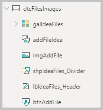
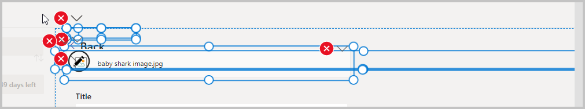
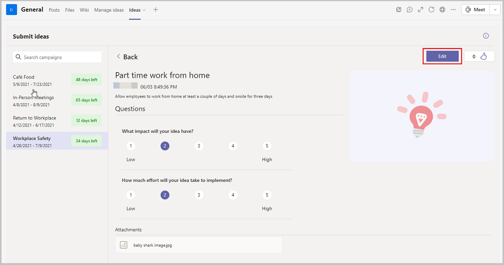
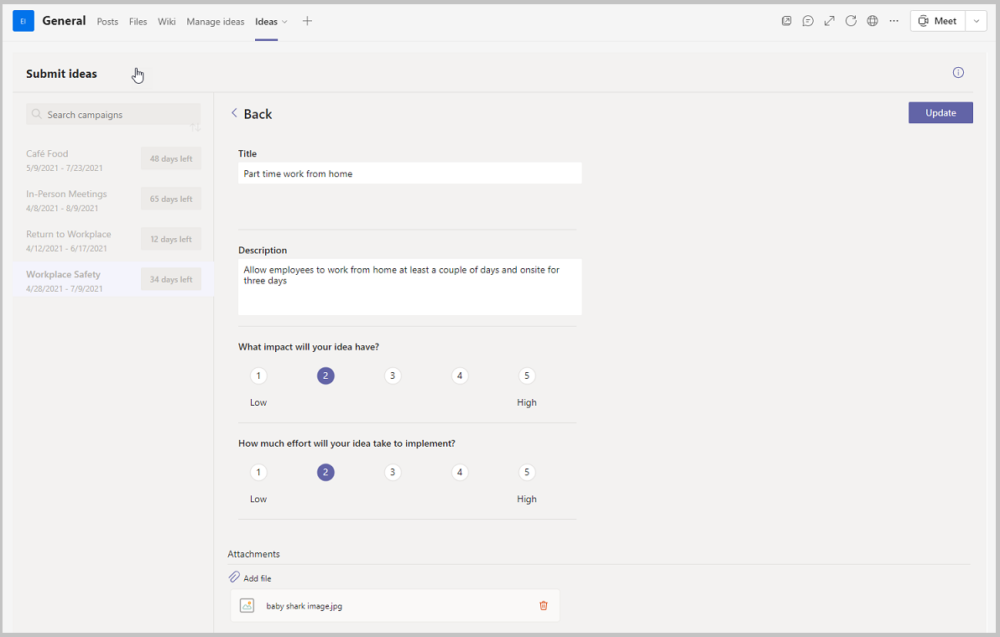

# Make ideas editable by original creator

The Employee Ideas sample app for Microsoft Teams provides a platform for employees to submit ideas for various campaigns (that is, categories for grouping ideas around common themes).

With the Ideas app, managers can set up campaigns, users can submit ideas, view other users’ ideas, and also vote for ideas that they like the best. The experience can be customized by the admin, or managers by editing campaigns, specifying justification questions that need to be answered by people submitting the ideas and also specify date threshold between which the campaign would be open for submitting ideas. The app also includes insights about who is submitting the greatest number of ideas and the most popular ideas during the week.

But what if a user wants to add more details about the idea after they submit the idea? The standard Employee Ideas app doesn't provide an edit button. But if you add an edit button, you'll want to be careful to limit which idea a user can edit, as you would likely not want someone editing ideas that were submitted by other people.

In this article, we'll learn how to enable the editing of an idea by the original creator of the idea.

> [!NOTE]
> Before starting with the steps in this article, read [Customize the Employee Ideas app](customize-employee-ideas.md).

Watch this video to learn about how to make ideas editable by original creator:
> [!VIDEO https://www.microsoft.com/videoplayer/embed/RWMToi]

## Prerequisites

To complete this tutorial, you'll need the ability to sign in to Microsoft Teams, which will be available as part of select Microsoft 365 subscriptions. You'll also need to have the [Employee Ideas sample app](employee-ideas.md) installed. This app can also be installed using <https://aka.ms/TeamsEmployeeIdeas>.

## Open Employee Ideas in Power Apps

To open the Employee Ideas app using Power Apps in Microsoft Teams:

1. Right-click on the Power Apps icon on the left-pane in Microsoft Teams.

1. Select the **Build** tab.

1. Select the team in which the Employee Ideas app is installed from the left-pane.

1. Select **Installed Apps**, and then select **Ideas** to open the app.

## Add an Edit button to the Campaign Details Screen

Next, let’s add a button to launch an edit screen when viewing ideas on the campaign details screen.

1. Select the Tree view and open up the **Campaign Summary Screen**.

1. Press down the **Alt** key on the keyboard, and select one of the campaigns from the bottom. This action opens the **Summary Detail Screen** with the list of ideas in the selected campaign.

1. Select **conCampaignIdeaControls** from the Tree view on the left-pane.

1. Select the **+** (Insert), and then select **Button** to add a new button to the container.

1. Update the properties of the Button to the following:

    | Property | Value |
    | - | - |
    | Name | btnCampaignIdeaControls_Edit |
    | Text | "Edit" |
    | ButtonType | "Primary" |
    | X | Parent.Width - btnCampaignIdeaControls_Share.Width - Self.Width-30 |
    | Y | (Parent.Height - Self.Height) / 2 |
    | Width | 96 |
    | Height | 32 |
    | Visible | !locCreateNewIdea And locVisibleCampaignIdea |

## Add a new screen

Next, add a screen that will be used to edit the idea selected when the edit button was selected.

1. Select the Tree view from the left-pane.

1. Select the **New screen** button to add a new screen.

1. Select **Blank layout**.

1. Rename the screen to "Edit Idea Screen".

1. Select the **Fill** property of the screen, and set the value to `gblAppStyles.Background.Fill` in the formula bar.

1. Go back to the **Campaign Details Screen**, and select the **Edit** button.

1. We need to get the details of the current Idea record and send to the edit screen. To do this, update the **OnSelect** property to the following

   ```powerapps-dot
   OnSelect = 
   
      Clear(colResponses);
   
      Collect(
   
      colResponses,
   
      {
   
      appRef: GUID(),
   
      msft_name: "Title",
   
      msft_snapshot_sequence: -2,
   
      msft_employeeidea_responsetypecode: 'Employee Idea Response Type'.'Text
      (Single Line)',
   
      msft_responsetext: gblRecordCampaignIdea.Title,
   
      msft_responserating: Blank(),
   
      msft_snapshot_ratinghightext: "",
   
      msft_snapshot_ratinglowtext: ""
   
      },
   
      {
   
      appRef: GUID(),
   
      msft_name: "Description",
   
      msft_snapshot_sequence: -1,
   
      msft_employeeidea_responsetypecode: 'Employee Idea Response Type'.'Text
      (Multiple Lines)',
   
      msft_responsetext: gblRecordCampaignIdea.Description,
   
      msft_responserating: Blank(),
   
      msft_snapshot_ratinghightext: "",
   
      msft_snapshot_ratinglowtext: ""
   
      }
   
      );
   
      Collect(
   
      colResponses,
   
      Filter(
   
      'Employee Idea Responses',
   
      Idea.msft_employeeideaid = gblRecordCampaignIdea.msft_employeeideaid
   
      )
   
      );
   
    Navigate('Edit Idea Screen')
   ```

### Add the header component

Employee Ideas app uses a header component to provide consistent menu experience between screens. We'll now copy this component to our new screen so that users can go to the other app screens when on our new screen.

1. Go to the **Campaign Detail Screen**.

1. Copy the **comHeader_CampaignDetail** container from that screen, and paste it on the new screen just added.

1. Rename the container to **comHeader_CampaignDetail_EditScreen**.

1. Select the **inputHeaderSettings** property of the **comHeader_CampaignDetail_EditScreen**, and paste the following formula:

    ```powerapps-dot
    {
    
    headerLabel: "Edit Idea",
    
    headerTooltip: "Edit Idea",
    
    headerWidth: 240,
    
    headerScreen: 'Edit Idea Screen'
    
    }
    ```

1. Select **inputHelpIcon** property from the functions list, and delete the contents from the formula bar.

1. Select **inputHelpScreen** property from the functions list, and delete the contents from the formula bar.

1. There's a chance that the Link button still shows up in the header though it does not really do anything. To remove the button:

    - Select the header component and go to **Components** tab in the Tree view.

    - Select the **btnHeaderExternalLink** control.

    - Select the **Visible** property of the control, and remove the last bracket - “)”, and re-add it.

Now when you go back to the screen, the visible property should have refreshed, and the Link button should no longer be visible.

### Add the left side navigation component

1. Go back to the **Campaign Detail Screen**, and copy the container **conCampaignDetailNav**.

1. Come back to the **Edit Idea Screen** and paste the copied container.

1. Update the following properties:

    | Property | Value |
    | - | - |
    | Name | conCampaignDetailNav_EditScreen |
    | X | 0 |

    This change will result in errors, and that is expected. We'll fix them in the next steps.

1. For the error on imgCampaignDetail_SortGallery_1 – DisplayMode formula, since we copied the formula from another screen, there was a variable that checked to see if it was a new idea. Since this screen is only used for edit, update the **DisplayMode** formula to:

    ```powerapps-dot
    If(
    
    locVisibleCampaignView,
    
    DisplayMode.Edit,
    
    locVisibleCampaignIdea,
    
    DisplayMode.Edit,
    
    DisplayMode.Disabled
    
    )
    ```

1. For the error on galCampaignDetailNav_1 – DisplayMode formula, since we copied the formula from another screen, there was a variable that checked to see if it was a new idea. As this screen is only used for edit, update the **DisplayMode** formula to

    ```powerapps-dot
    If(
    
    locVisibleCampaignView,
    
    DisplayMode.Edit,
    
    locVisibleCampaignIdea,
    
    DisplayMode.Edit,
    
    DisplayMode.Disabled
    
    )
    ```

## Add a new container for the Idea Details section

Now, we'll add a container that will include the idea details section on our idea edit screen.

1. Select the newly added **Edit Idea Screen**.

1. Select the **+** (Insert) button from the left-pane.

1. Select **Layout** > **Container**. A container gets added.

1. Set the following properties on this container.

    | Property | Value |
    | - | - |
    | Name | conIdeaEditPane |
    | X | 300 |
    | Y | comHeader_CampaignDetail_EditScreen.Y + comHeader_CampaignDetail_EditScreen.Height |
    | Width | Parent.Width - conCampaignDetailNav_1.Width |
    | Height | Parent.Height - Self.Y |

1. Add another container inside this new container using the steps above.

1. Set the following properties on this container

    | Property | Value |
    | - | - |
    | Name | conCampaignIdeaControls_EditScreen |
    | X | 0 |
    | Y | 0 |
    | Width | Parent.Width |
    | Height | 60 |

1. Go to the **Campaign Detail Screen**, and copy the controls – **btnCampaignIdeaControls_Edit**, **btnCampaignIdeaControls_Back**, and **imgCampaignIdeaControls_Back**.

1. Come back to the **Edit Idea Screen**, and select the container added earlier.

1. Paste the controls copied into this container.

1. Update the OnSelect property of btnCampaignIdeaControls_Back_1 to Navigate('Campaign Detail Screen').

1. Select **btnCampaignIdeaControls_Edit_1**, and update the following properties:

    | Property | Value |
    | - | - |
    | Text | “Update” |
    | Visible | true |
    | X | Parent.Width - Self.Width – 20 |
    | Y | (Parent.Height - Self.Height) / 2 |
    | Width | 96 |
    | Height | 32 |

1. We need to add a canvas to the new container added earlier (conIdeaEditPane). To add a canvas, add a new scrollable screen - **New screen** > **Scenarios** > **Scrollable**, and copy its canvas.

1. Go back to the **Edit Idea Screen**, and select the container **conIdeaEditPane**, and paste the canvas. The canvas gets pasted in the container.

1. Set the following properties for the canvas:

    | Property | Value |
    | - | - |
    | Name | canvasEditScreen |
    | X | 0 |
    | Y | conCampaignIdeaControls_EditScreen.Y + conCampaignIdeaControls_EditScreen.Height |
    | Width | Parent.Width |
    | Height | Parent.Height - Self.Y |

1. Go to the **Campaign Detail Screen**, and copy the **galIdeaResponses** gallery.

1. Come back to the **Edit Idea Screen**, and select the canvas added in the previous step.

1. Paste the gallery in the canvas. <br> An error may show up on the BorderThickness property of **shpIdeaResponseRating_Value_1**.

1. Set the properties on **galIdeaResponses**:

    | Property | Value |
    | - | - |
    | BorderThickness | If((ThisItem.appRefNo <> ThisItem.appRatingValue),1,0) |
    | X | 0 |
    | Y | 0 |

1. We want to make the edit experience is consistent with the new idea experience, so we'll update the **Items** property of **galIdeaResponseRating_1** to the following:

    ```powerapps-dot
    With(
    
    {varRecord: ThisItem},
    
    Table(
    
    {
    
    appRefNo: 1,
    
    appRef: varRecord.appRef,
    
    appRatingValue: varRecord.'Response Rating',
    
    appRatingTextLow: varRecord.'Rating Text (Low)',
    
    appRatingTextHigh: varRecord.'Rating Text (High)'
    
    },
    
    {
    
    appRefNo: 2,
    
    appRef: varRecord.appRef,
    
    appRatingValue: varRecord.'Response Rating',
    
    appRatingTextLow: varRecord.'Rating Text (Low)',
    
    appRatingTextHigh: varRecord.'Rating Text (High)'
    
    },
    
    {
    
    appRefNo: 3,
    
    appRef: varRecord.appRef,
    
    appRatingValue: varRecord.'Response Rating',
    
    appRatingTextLow: varRecord.'Rating Text (Low)',
    
    appRatingTextHigh: varRecord.'Rating Text (High)'
    
    },
    
    {
    
    appRefNo: 4,
    
    appRef: varRecord.appRef,
    
    appRatingValue: varRecord.'Response Rating',
    
    appRatingTextLow: varRecord.'Rating Text (Low)',
    
    appRatingTextHigh: varRecord.'Rating Text (High)'
    
    },
    
    {
    
    appRefNo: 5,
    
    appRef: varRecord.appRef,
    
    appRatingValue: varRecord.'Response Rating',
    
    appRatingTextLow: varRecord.'Rating Text (Low)',
    
    appRatingTextHigh: varRecord.'Rating Text (High)'
    
    }
    
    )
    
    )
    
    ```

1. Update the **OnSelect** Property of **imgIdeaResponseRating_Select_1**:

    ```powerapps-dot
    UpdateIf(
    
    colResponses,
    
    colResponses[@appRef] = ThisItem.appRef,
    
    {msft_responserating: ThisItem.appRefNo}
    
    );
    ```

1. We need to copy controls from **dtcFilesImages** from the **Campaign Detail Screen** to the canvas.

    

1. Select to expand the **Edit Idea Screen**.

1. Select **galIdeaResponses_2**, and then paste the copied controls. When you paste the controls, you'll also see a few errors:

    

1. All errors except one are related to visibility of the controls. You can select the error, and select **Edit In Formula Bar**.

1. Set the **Visible** property for all these controls to true.

1. There will be one error for **lbldeaFiles_Header_2** on the **Text** property.

1. Update the **Text** property to “Attachments”.

1. Update the **Y** property of **lbldeaFiles_Header_1** to "galIdeaResponses_1.Y + galIdeaResponses_1.Height + 20".

1. Select the **Delete** icon from the attachment section **imgIdeaFile_Delete_1**, and set the **OnSelect** property to `Remove(colFiles,ThisItem);Collect(colRemovedFiles,ThisItem)`.

1. Select the datacard that was added along with the canvas and update the following properties.

    | Property | Value |
    | - | - |
    | X | 0 |
    | Y | 0 |
    | Width | Parent.Width |
    | Height | galIdeaFiles_1.Y + galIdeaFiles_1.Height + 20 |

1. Select **galIdeaFiles_1** under the datacard.

1. Select the **OnSelect** property, and set it to `Launch(ThisItem.msft_file.Value)`.

1. Now we'll set the button to patch and update the selected idea. Select the **Update** button from the **Edit Idea Screen – Container 3**, and set the **OnSelect** property to the following formula:

    ```powerapps-dot
    UpdateContext({locSelectedIdea: gblRecordCampaignIdea.'Employee Idea'});
    
    Patch(
    
    'Employee Ideas',
    
    gblRecordCampaignIdea,
    
    {
    
    Title: LookUp(
    
    colResponses,
    
    Sequence = -2,
    
    msft_responsetext
    
    ),
    
    Description: LookUp(
    
    colResponses,
    
    Sequence = -1,
    
    msft_responsetext
    
    ),
    
    'Attachment Count': CountRows(
    
    Filter(
    
    colFiles,
    
    appIsNew
    
    )
    
    )
    
    }
    
    );
    
    ForAll(
    
    RenameColumns(
    
    Filter(
    
    colResponses,
    
    Sequence >= 0,
    
    !IsBlank('Employee Idea Response')
    
    ),
    
    "msft_employeeidea_responseid",
    
    "ResponseId"
    
    ),
    
    Patch(
    
    'Employee Idea Responses',
    
    LookUp(
    
    'Employee Idea Responses',
    
    'Employee Idea Response' = ResponseId
    
    ),
    
    {
    
    Instructions: ThisRecord.Instructions,
    
    Question: ThisRecord.msft_employeeidea_questionid,
    
    Sequence: ThisRecord.Sequence,
    
    'Response Type': ThisRecord.'Response Type',
    
    'Response Text': ThisRecord.'Response Text',
    
    'Response Rating': ThisRecord.'Response Rating',
    
    'Rating Text (Low)': ThisRecord.'Rating Text (Low)',
    
    'Rating Text (High)': ThisRecord.'Rating Text (High)'
    
    }
    
    )
    
    );
    
    ForAll(
    
    Filter(
    
    colFiles,
    
    appIsNew
    
    ),
    
    Patch(
    
    'Employee Idea Files',
    
    Defaults('Employee Idea Files'),
    
    {
    
    Idea: gblRecordCampaignIdea,
    
    Name: Text(ThisRecord.msft_name),
    
    File: {
    
    FileName: Text(ThisRecord.msft_name),
    
    Value: ThisRecord.appFileValue
    
    }
    
    }
    
    )
    
    );
    
    ForAll(
    
    colRemovedFiles,
    
    Remove(
    
    'Employee Idea Files',
    
    ThisRecord
    
    )
    
    );
    
    Set(
    
    gblRecordCampaignIdea,
    
    LookUp(
    
    'Employee Ideas',
    
    'Employee Idea' = locSelectedIdea
    
    )
    
    );
    
    ClearCollect(
    
    colResponses,
    
    Filter(
    
    'Employee Idea Responses',
    
    Idea.msft_employeeideaid = gblRecordCampaignIdea.msft_employeeideaid
    
    )
    
    );
    
    ClearCollect(
    
    colFiles,
    
    Filter(
    
    'Employee Idea Files',
    
    'Employee Idea Files'[@Idea].'Employee Idea' = gblRecordCampaignIdea.'Employee
    Idea'
    
    )
    
    );
    
    Set(
    
    gblRecordCampaignIdea,
    
    LookUp(
    
    'Employee Ideas',
    
    'Employee Idea' = locSelectedIdea
    
    )
    
    );
    
    Navigate(
    
    'Campaign Detail Screen',
    
    ScreenTransition.None,
    
    {
    
    locVisibleCampaignIdea: true,
    
    locVisibleCampaignView: false,
    
    locCreateNewIdea: false
    
    }
    
    )
    
    ## 
    ```

## Publish the Ideas app

All the changes to the Bulletins app are completed. The app can now be published by selecting the **Publish to Teams** button on the top-right.

## Test the app

Finally, let’s test the app and try editing an idea.

1. Sign in to Teams, and go to the team where the Ideas app is installed.

1. Select the **Ideas** tab on the top.

1. Select on one of the campaigns, for example **Workplace Safety**.

1. Open an idea that was created by your user – the idea should say who the idea was created by.

1. Verify that the **Edit** button shows up on the **Campaign Details Screen**.

    

1. Select the **Edit** button, and verify that the **Edit Idea** screen opens.

1. Verify that all the details are displayed on the screen.

    

1. Make some changes to the idea and then select the **Update** button.

1. Verify that you're taken back to the **Campaign Idea Details** screen and all the changes you made are saved, and viewable on this screen.

### See also

- [Understand Employee ideas app architecture](employee-ideas-architecture.md)
- [Customize sample apps](customize-sample-apps.md)
- [Sample apps FAQs](sample-apps-faqs.md)
- [Use sample apps from the Teams store](use-sample-apps-from-Teams-store.md)

[!INCLUDE[footer-include](../includes/footer-banner.md)]