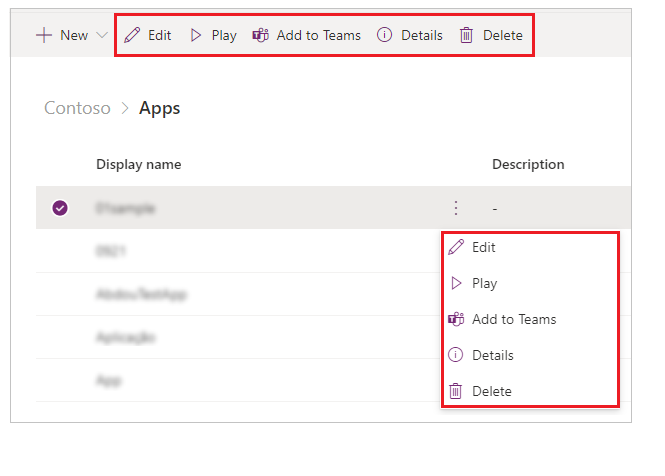
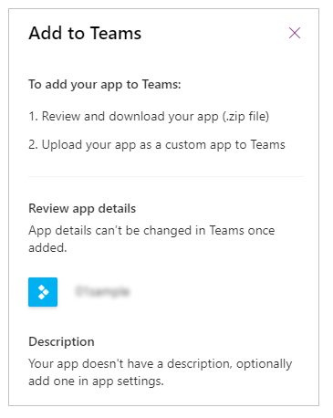
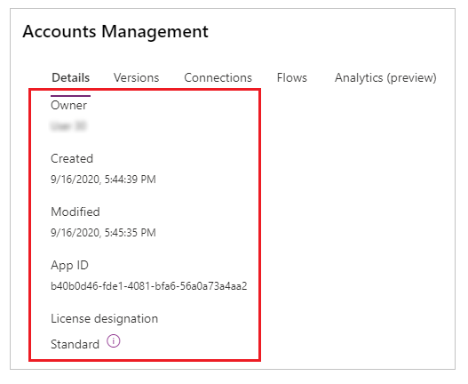
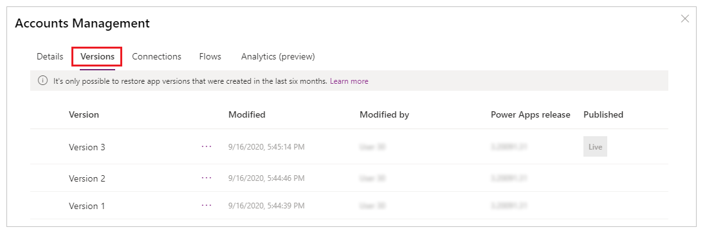
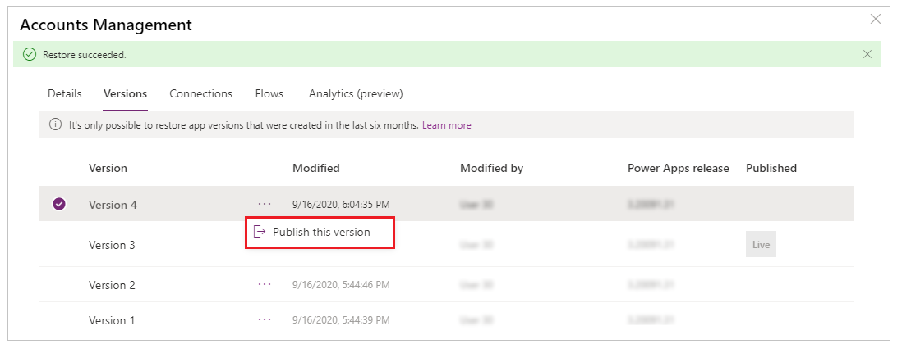
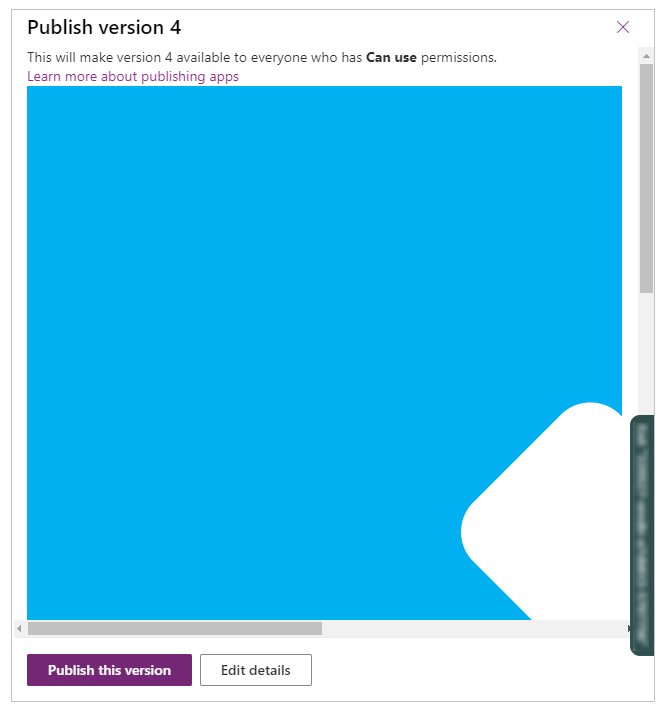
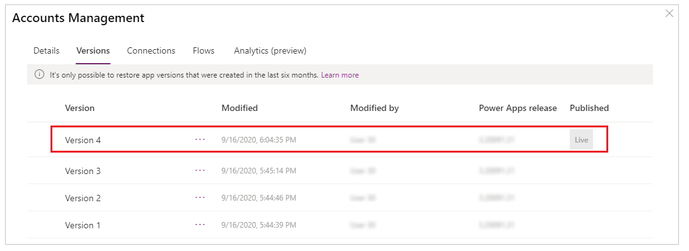
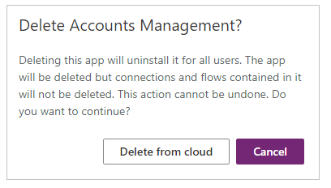

# Manage your apps in Teams

To manage an app, select **Apps** from the solution explorer. Then select the app that you want to manage, or select **Commands** (**…**) next to the app name, and then select commands from the drop-down menu.

## Edit an app

Select **Edit** to edit the app in Power Apps Studio. More information: [Edit a canvas app in Power Apps](../maker/canvas-apps/edit-app.md) and [Understanding Power Apps Studio](understand-power-apps-studio.md)

> [!TIP]
> Use this option if you want to rename an app, or change app icon and description. For detailed steps, go to [rename an app](#rename-an-app) or [change app icon and description](#change-app-icon-and-description).

## Add to Teams

Allows you to download the app, and then upload to Teams. To learn how to add an app to Teams, go to [Embed a canvas app in Teams](embed-teams-app.md).

## App details

The **Details** option shows the owner of the app, when the app was created and last modified, app ID and license designation.

## Restore an app

A canvas app can have multiple versions. You can restore an app to an available published version.

To restore an app to a specific version:

1. Select **Versions** from the [app details](#app-details) screen.

    

1. Select a version other than *Live* that you want to restore.

1. Select .

1. Select **Restore**.

    

    > [!NOTE]
    > The restored app becomes the latest version of the app. However, the latest version is not yet live. You must publish the restored version to make the restored version available to all users.

1. Select  for the restored version.

1. Select **Publish this version**.

    

1. Review the app preview and select **Publish this version** to confirm.

    

The **Versions** tab now shows the restored version as *Live*:

More information: [Restore an app](../maker/canvas-apps/restore-an-app.md)

## Delete an app

Select **Delete** to delete an app. When prompted, select **Delete from cloud** to delete the app.

For more information about deleting an app, go to [Delete an app](../maker/canvas-apps/delete-app.md).

## Rename an app

To rename an app:

1. [Edit the app](manage-your-apps.md#edit-an-app) in Power Apps Studio.
1. Select the app name from the top-right.
1. Update the name.

    

1. Select **Save**.

More information: [Edit app editor](understand-power-apps-studio.md?branch=teams-preview#app-name-editor)

## Change app icon and description

To change the app icon and description:

1. [Edit the app](manage-your-apps.md#edit-an-app) in Power Apps Studio.
1. Select **Settings**.
1. Update the icon and description.

    

1. Select **Save**.

More information: [Change app settings](understand-power-apps-studio.md?branch=teams-preview#settings)

### See also

[Publish and share your apps](publish-and-share-apps.md)

[!INCLUDE[footer-include](../includes/footer-banner.md)]