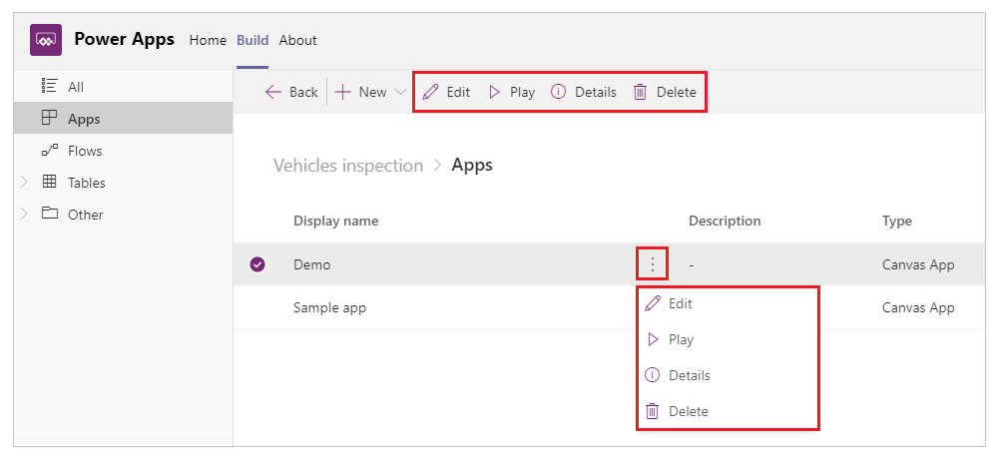
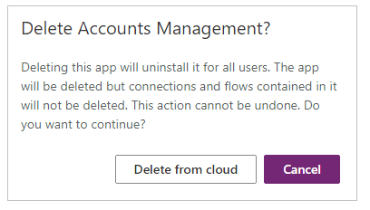
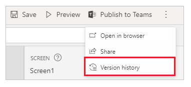
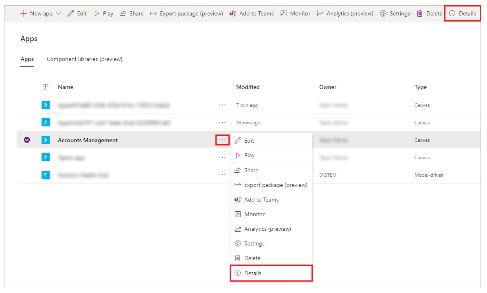
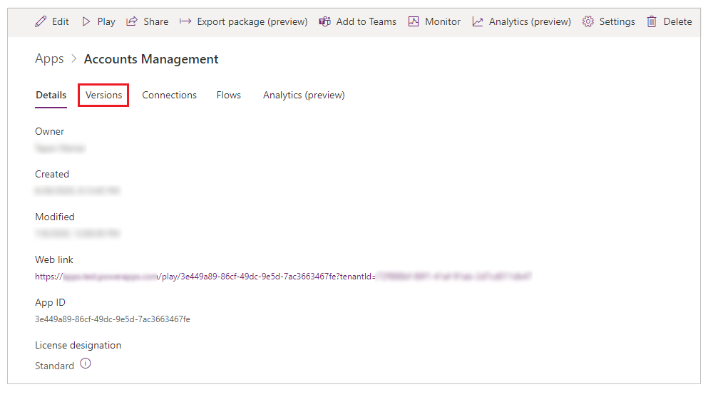
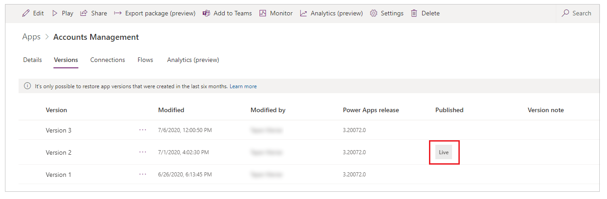
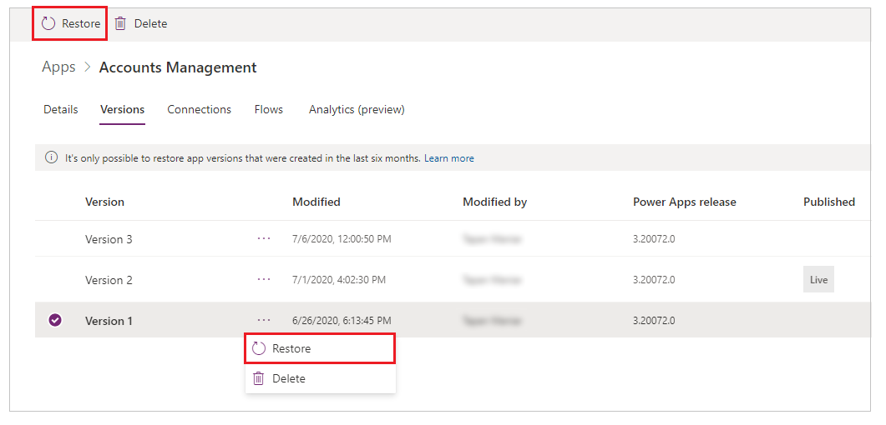
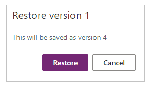
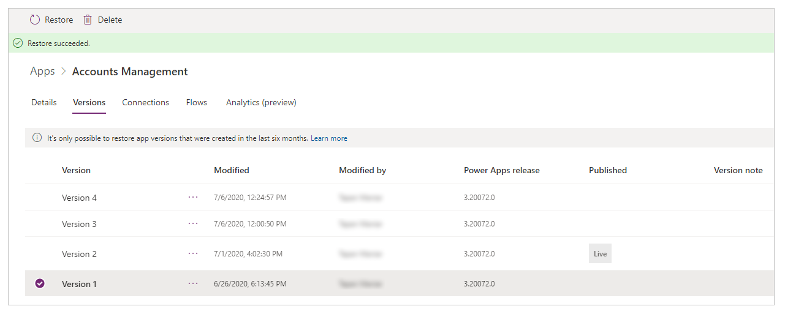

# Managing an app

To manage an app, select **Apps** from the solution explorer. And then, select the app that you want to manage, or select the *Commands* (…) option for the app, and then select the options from the drop-down menu.

## Edit an app

Select **Edit** an app to edit the app in Power Apps Studio. For more information about editing an app, go to [edit a canvas app in Power Apps](https://docs.microsoft.com/powerapps/maker/canvas-apps/edit-app). For more information about Power Apps Studio, go to *Understanding Power Apps Studio*.

## Play an app

Select **Play** to run an app’s latest [published](https://docs.microsoft.com/powerapps/maker/canvas-apps/save-publish-app) version. For more details about publishing an app, go to Publish an app.

## App details

The **Details** option shows you the app details such as the owner of the app, when the app was created and last modified, app ID, app licensing information
and the app’s *web link*.
 
> [!TIP]
> *Web link* of an app can be very useful when you want to run an app in the browser for testing or to launch an app from a browser or through another app (such as when using the [Launch() function](https://docs.microsoft.com/powerapps/maker/canvas-apps/functions/function-param)).

## Delete an app

Select **Delete** to delete an app. When prompted, select **Delete from cloud** to delete the app.

For more information about deleting an app, go to [Delete an app](https://docs.microsoft.com/powerapps/maker/canvas-apps/delete-app).

## Restore an app

A canvas app can have multiple versions. You can restore an app to an available published version.

To restore an app to a specific version:

1. Edit an app in Studio.

1. **Version history** from the top-right on the screen.

    

1. Select **Details**. You can also select *Commands (…)* and then select **Delete** from the drop-down menu instead.

    

1. Select **Versions.**

    

1. Select the app version that you want to restore. The currently published version available to users is marked as **Live**.

    

1. Select **Restore**. You can also select *Commands (…)* and then select **Restore** from the drop-down menu.

    

1. Select **Restore** to confirm.

    

The app version is now restored.

For more details about restoring an app, go to [Restore an app](https://docs.microsoft.com/powerapps/maker/canvas-apps/restore-an-app).
