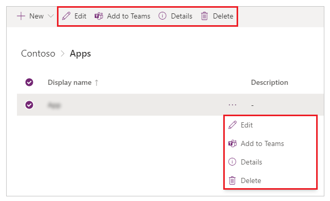

# Manage your apps

[!INCLUDE [cc-beta-prerelease-disclaimer.md](../includes/cc-beta-prerelease-disclaimer.md)]

To manage an app, select **Apps** from the solution explorer. Then select the app that you want to manage, or select **Commands** (**…**) next to the app name, and then select commands from the drop-down menu.

## Edit an app

Select **Edit** to edit the app in Power Apps Studio. More information: [Edit a canvas app in Power Apps](../maker/canvas-apps/edit-app.md) and [Understanding Power Apps Studio](understand-power-apps-studio.md)

## Play an app

Select **Play** to run the latest [published version](../maker/canvas-apps/save-publish-app.md) of the app. More information: [Publish an app](publish-and-share-apps.md)

## App details

**Details** shows you the information such as the owner of the app, when the app was created and last modified, app ID, app licensing information, and the app's web link.

> [!TIP]
> The web link for an app can be very useful when you want to run an app in the browser for testing, or open an app from a browser or through another app (such as when using the [Launch() function](../maker/canvas-apps/functions/function-param.md)).

## Delete an app

Select **Delete** to delete an app. When prompted, select **Delete from cloud**.

More information: [Delete an app](../maker/canvas-apps/delete-app.md)

## Restore an app

A canvas app can have multiple versions. You can restore an app to an available published version.

To restore an app to a specific version:

1. Edit the app in Power Apps Studio.

1. Select **Version history** from the upper-right corner of the screen.

    

1. Select **Details**.<!--You can also select *Commands (…)* and then select **Delete** from the drop-down menu instead. note from editor: No need to document every method, just tell the reader what to do.-->

    

1. Select **Versions**.

    

1. Select the app version that you want to restore. The currently published version that's available to users is marked as **Live**.

    

1. Select **Restore**.<!--You can also select *Commands (…)* and then select **Restore** from the drop-down menu.-->

    

1. Select **Restore** to confirm.

    

The app version is now restored.

More information: [Restore an app](../maker/canvas-apps/restore-an-app.md)

### See also

[Publish and share your apps](publish-and-share-apps.md)
