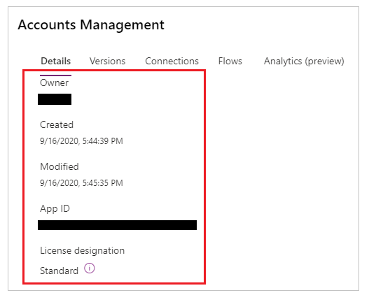
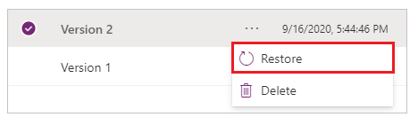

# Manage your apps

[!INCLUDE [cc-beta-prerelease-disclaimer.md](../includes/cc-beta-prerelease-disclaimer.md)]

To manage an app, select **Apps** from the solution explorer. And then, select the app that you want to manage, or select the *Commands* (**…**) option for the app, and then select the options from the drop-down menu.

## Edit an app

Select **Edit** an app to edit the app in Power Apps Studio. For more information about editing an app, go to [edit a canvas app in Power Apps](../maker/canvas-apps/edit-app.md). For more information about Power Apps Studio, go to [Understanding Power Apps Studio](understand-power-apps-studio.md).

## Play an app

Select **Play** to run an app’s latest [published](../maker/canvas-apps/save-publish-app.md) version. For more details about publishing an app, go to [Publish an app](publish-and-share-apps.md).

## App details

The **Details** option shows the owner of the app, when the app was created and last modified, app ID and license designation.

## Restore an app

A canvas app can have multiple versions. You can restore an app to an available published version.

To restore an app to a specific version:

1. Select **Versions** from the [app details](#app-details) screen.

    

1. Select a version other than *Live* that you want to restore.

1. Select .

1. Select **Restore**.

    

    > [!NOTE]
    > The restored app becomes the latest version of the app. However, the latest version is not yet live. You must publish the restored version to make the restored version available to all users.

1. Select  for the restored version.

1. Select **Publish this version**.

    

1. Review the app preview and select **Publish this version** to confirm.

    

The **Versions** tab now shows the restored version as *Live*:

For more details about restoring an app, go to [Restore an app](../maker/canvas-apps/restore-an-app.md).

## Delete an app

Select **Delete** to delete an app. When prompted, select **Delete from cloud** to delete the app.

For more information about deleting an app, go to [Delete an app](../maker/canvas-apps/delete-app.md).

### See also

[Publish and share your apps](publish-and-share-apps.md)
