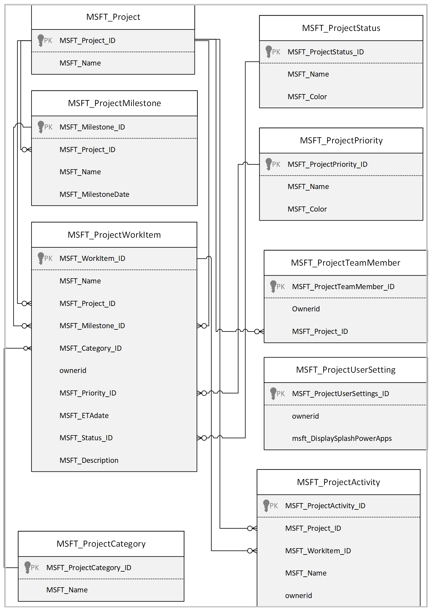

# Understand Milestones sample app architecture

In this article, you'll learn about the collections and global variables used by the [Milestones](milestones.md) app, and understand how to use them effectively. If you want to learn more about how to install, and use the Milestones sample app instead, go to [Milestones sample app](milestones.md).

## Prerequisites

To understand and use information in this article, you'll need to know about different controls, features, and capabilities of canvas apps.

- [Create and update a collection in a canvas app](../maker/canvas-apps/create-update-collection.md)
- [Collect, Clear, and ClearCollect functions in Power Apps](../maker/canvas-apps/functions/function-clear-collect-clearcollect.md)
- [Understand canvas-app variables in Power Apps](../maker/canvas-apps/working-with-variables.md)
- [Add and configure a canvas-app control in Power Apps](../maker/canvas-apps/add-configure-controls.md)
- [Add a screen to a canvas app and navigate between screens](../maker/canvas-apps/add-screen-context-variables.md)

You'll also need to know about how to [install](use-sample-apps-from-teams-store.md), and [use](milestones.md) Milestones sample app.

## Data Model  

## Architecture model

The following diagram illustrates the way that users and systems interact with
data in this solution.

### Connectors

Milestones app uses the following connectors:

-   Microsoft Dataverse to read and write data to Dataverse tables.

-   Office 365 Users to read user profile data.

## Tables

Milestones app includes the following tables:

| Table name           | Description                                                  |
| -------------------- | ------------------------------------------------------------ |
| Project              | A project denotes an individual or collaborative enterprise that is carefully planned to achieve a particular aim. Details such as name, when and by whom was it created or modified are stored under the Projects entity. A single project can have multiple milestones, work items, team members and activities associated to it. |
| Project Milestone    | A Project Milestone is a task that depicts an important achievement in a Project. Milestones should represent a sequence of events that incrementally build up until a Project is complete.  Details such as name, the project to which it is associated to and the date when the Milestone must be completed are stored under the Project Milestones entity. A milestone can only be part of a single project but can have multiple work items associated to it. |
| Project Work Item    | A work item indicates the type of work, what needs to be done and the date within which it must be completed. Details such as the name, description, to whom it has been assigned to, status, priority, and the target date define a work item. A work item can be a part of a single milestone and can have only one status, priority, category, and team member associated to it. It can, however, have multiple associated activities. |
| Project Status       | Status summarizes the overall status of a work item. Default status values include New, In Progress, Blocked and Completed. More statuses can be added from within the Settings section in the app. Each status has a name and an associated color. |
| Work Item Priorities | Priority represents the order of importance in which a work item must be completed when compared to the remaining work items. Default priorities include P0, P1, P2, and P3. More priorities can be added from within the Settings section in the app. Each priority has a name and an associated color. |
| Work Item Categories | Categories help in classifying work items. Default priorities include high, medium, and low. More categories can be added from within the Settings section in the app. Each category has a name and an associated color. |
| Project Team Members | Team Members are individuals who work on one or more work items in a Project. An individual who is part of multiple projects will have one team member record per project. |
| Project Activities   | Activities are used to provide updates made on work items of a project. A single work item can have multiple activities. Activities get created as work items are updated. An activity can also be created manually. |
| Project User Setting | User settings are used to store user preferences pertaining to seeing the Power Apps splash screen every time they log in to the app. There is one record for each user. |

### Collections 

| Collection Name              | Description                                                  | Screen Used                                                  |
| ---------------------------- | ------------------------------------------------------------ | ------------------------------------------------------------ |
| colLocalization              | Used to build a Localization Collection based on the User Language. | OnStart property of the app                                  |
| colWorkItems                 | Used to collect the Work items.                               |                                                              |
| colUserSettings              | Used to collect User Settings dataverse record if it exists.        | OnStart property of the app                                  |
| colWorkItemHeaderIcons       | Used to collect the header icons of Work Items.               | OnStart property of the app                                  |
| colProjectCoverColors        | Used to collect the project cover colors.                     | OnStart property of the app                                  |
| colStockImages               | Collection to collect the Stock Images used in the app.       | OnStart property of the app                                  |
| colNewProjectMilestones      | Used to collect the default information of a newly added milestone. | OnSelect Property of the Add Milestones Image on the Projects Screen |
| colProjectTeamMembers        | Used to collect the Team members who are part of a Project.   | OnVisible property of the Settings screen                    |
| colRemovedProjectTeamMembers | Used to collect the Team members who have been removed from the project. | OnSelect property of the Delete button under the Team Members settings |
| colRemovedProjectMilestones  | Used to collect the Milestones that have been removed from the project. | NA                                                           |
| colCategories                | Used to collect the Category information.                     | OnSelect Property of the Save button on the Settings screen  |
| colNewProjectTeamMembers     | Used to collect the Team members who are newly added to a Project. | OnSelect property of the Create button on the projects screen |
| colProjectMilestones         | Used to collect the Milestones information for a Project.     | OnSelect property of the Delete confirmation button          |
| colRemovedCategories         | Used to collect the Categories that are being removed.       | OnSelect Property of the Save button on the Settings screen  |
| colPriorities                | Used to collect the Priorities information.                   | OnSelect Property of the Save button on the Settings screen  |
| colRemovedPriorities         | Used to collect the Priorities that are being removed.       | OnSelect Property of the Save button on the Settings screen  |
| colStatuses                  | Used to collect the Status information.                       | OnSelect Property of the Save button on the Settings screen  |
| colRemovedStatuses           | Used to collect the Priorities that are being removed.       | OnSelect Property of the Save button on the Settings screen  |
| colRemoveWorkItems           | Used to collect the Work items that have been checked for deletion. | OnSelect property of the Delete button on the confirmation pop-up on the Projects screen. |
| colRemovedMilestones         | Used to collect the Team members who have been removed from the project. | OnSelect property of the Delete button under the Project details section on the settings page. |
| colWorkItemStatuses          | Used to collect the available statuses for work items.        | Items property of the Status combo box on the Project screen |

### Global Variables 

| Variable Name                   | Type    | Description                                                  |
| ------------------------------- | ------- | ------------------------------------------------------------ |
| gblAppLoaded                    | Boolean | To check whether the App is loaded.                |
| gblUserLanguage                 | Text    | To check the logged in Users Language.                        |
| colCharsWidth                   | Table   | Used to store character width for diff fonts, weights, sizes etc. |
| gblThemeDark                    | Boolean | To check whether the Teams theme is set to Dark.              |
| gblThemeHiCo                    | Boolean | To check whether the Teams theme is set to High Contrast.     |
| gblMobileWidth                  | Number  | Variable to set the width on mobile.                          |
| gblMobileMode                   | Boolean | Variable to check whether the app is running on mobile.       |
| gblAppSetting_inputMobileOnWeb  | Boolean | Variables to Scale fonts for mobile-oriented apps, running in desktop. |
| gblAppSetting_inputScaleFontsby | Number  | Use this variable for scaling all fonts by a fixed amount.    |
| gblAppContext                   | Boolean | To check the context of where the app is running.             |
| gblFirstRun                     | Boolean | To check whether the app is being run for the first time.     |
| gblRecordUserSettings           | Record  | Variable to use the Oldest Record in case multiple records exist. |
| gblAppSetting_inputMobile       | Boolean | Variables to Scale fonts for mobile-oriented apps.            |
| gblAppColors                    | Record  | Variable to set the Color value in the app.                   |
| gblAppSizes                     | Record  | Variable to set the Color value in the app.                   |
| gblAppStyles                    | Record  | Variable to set the Styling values in the app.                |
| gblProject                      | Record  | Variable to store a project record that is in context.       |

## App OnStart

This section explains app OnStart collections, variables, and execution details.

#### OnStart collections

Collections used during app OnStart:

| **Collection name**     | **Description**                                                     |
|-------------------------|---------------------------------------------------------------------|
| colLocalization         | Collection of localized text based on users language.               |
| colCharsWidth           | Collection of widths for each character used for auto width labels. |
| colStockImages          | Collection of stock project cover images.                           |
| colProjectCoverColors   | Collection of project cover colors.                                 |
| colWorkItemHeaderIcons  | Collection of header icons for work items.                          |
| colUserSettings         | Collection of the user Settings from Project User Settings table.   |

#### OnStart Variables

Variables used during app OnStart:

| **Variable name**                | **Description**                                                                           |
|----------------------------------|-------------------------------------------------------------------------------------------|
| gblAppLoaded                     | Global variable to check if the app has loaded completely.                              |
| gblUserLanguage                  | Global variable to store the user's language.                                            |
| gblThemeDark                     | Global variable to store if Teams is running in dark mode.                              |
| gblThemeHiCo                     | Global variable to store if Teams is running in contrast mode.                          |
| gblMobileWidth                   | Global variable to define the width of the app for mobile.                              |
| gblMobileMode                    | Global variable to store if the app is being accessed from a mobile device.             |
| gblAppSetting_inputMobileOnWeb   | Global variable to scale fonts for mobile-oriented apps, running in desktop.            |
| gblAppSetting_inputMobile        | Global variable to scale fonts for mobile-oriented apps.                                |
| gblAppSetting_inputScaleFontsBy  | Global variable for scaling all fonts by a fixed amount.                                |
| gblAppContext                    | Global variable to check the context of where the app is running.                       |
| gblFirstRun                      | Global variable to check whether the app is being run for the first time.               |
| gblRecordUserSettings            | Global variable to store the latest Project User Settings records for the current user. |

#### OnStart execution details

1.  When a user accesses the app, **gblAppLoaded** is set to false. The user's
    language code is stored in **gblUserLanguage**, with English - US being the
    default one.

2.  The user's language is then used to collect localized text used throughout
    the app (for example, label and button text) in **colLocalization**.

3.  The user's Microsoft Teams theme/mode is checked to see if the theme is default, dark
    or high contrast. The **gblThemeDark** and **gblThemeHiCo** variables are
    set accordingly.

4.  The stock images and cover colors are collected in **colStockImages** and
    **colProjectCoverColors** respectively. **colProjectCoverColors** has two
    sets of 14 colors. For each base, there are two colors. One is for default
    theme and the other is for dark theme. For example, \#F4B9B9 is the default
    mode equivalent of \#791818.

5.  User details from Project User Settings table are collected in
    **colUserSettings**. If no records exist, a new project user setting record
    is created and the variable **gblFirstRun** is set to true. This in turn
    controls the visibility of the splash dialog. If there are multiple project
    user setting records exist, the oldest record is selected and stored in the
    **gblRecordUserSettings** variable.

## Loading Screen

This section explains app loading screen collections, variables, and execution details.

### Navigating to Projects Screen

#### Variables involved

The following variables are used when the loading screen navigates to the projects screen:

| **Variable name**      | **Description**                                              |
| ---------------------- | ------------------------------------------------------------ |
| gblAppLoaded           | Global variable to check if the app has loaded completely.   |
| gblAppStyles           | Global variable to store styling properties for all controls (set on the OnVisible of the Loading Screen). |
| gblAppContext          | Global variable to check the context of where the app is running. |
| gblFirstRun            | Global variable to check whether the app is being run for the first time. |
| gblRecordUserSettings  | Global variable to store the latest Project User Settings records for the current user. |
| locShowFirstRun        | Local variable to indicate if the current run of the app is the first run for the user. |
| locShowPowerAppsPrompt | Local variable to indicate if the user has set the preference to see the Power Apps prompt to yes or no. |

#### Project screen navigation execution details

1. If **gblAppLoaded** is true (which means the apps OnStart has completed),
   **gblAppStyles** is not blank (which means the styling variable has been
   loaded), and **gblAppContext** is true (which means the app is being
   accessed from within Teams), then the user is navigated to the:
   1.  Mobile projects screen if the hostClientType (device being used to
       access the app) is an Android or iOS.

   2. Projects screen if the hostClientType is not Android of iOS. Two
      variables are passed while navigating to the Projects Screen:

     -  **locShowFirstRun**: If the current run is the first run of the app
         as indicated by **gblFirstRun**, this is set to true, if not, then
         false.

     -  **locShowPowerAppsPrompt:** If the latest Project User Settings
          record for the current user (stored in **gblRecordUserSettings**)
          has a value of Yes for Display Splash (Power Apps) column, then this
          is set to true, if not, then false.

2.  If **gblAppContext** is false, then the user is navigated to the Incorrect
    Context Screen.

## First run experience

This section explains the app's [first time run](milestones.md#open-the-milestones-app) experience, relevant collections, variables, and execution details.

#### First run experience variables

The following variables are used to control the first run experience

| **Variable name**       | **Description**                                                                         |
|-------------------------|-----------------------------------------------------------------------------------------|
| locShowFirstRun         | Local variable to indicate if the current run of the app is the first run for the user. |
| locShowPowerAppsPrompt  | Local variable to indicate either to show or hide the splash screen.                    |

#### First run experience execution details

1.  When either **locShowFirstRun** or **locShowPowerAppsPrompt** is true, the
    container **conDialogWelcome** becomes visible.

2.  If **locShowFirstRun** is true, the container **conDialogFirstRun** becomes
    visible and gives an overview of the app.

3.  Select **Continue** sets **locShowFirstRun** to false that hides the
    **conDialogFirstRun** container. If **locShowPowerAppsPrompt** is true, the
    container **conDialogSplash_PowerApps** becomes visible showing the splash
    screen.

4.  Checking **Do not show again** and then selecting **Got it** updates the **Display Splash**
    **(PowerApps)** column in the **Project User Settings** record for the current user
    to **No**, which sets **locShowPowerAppsPrompt** to false in subsequent runs and
    hides the splash screen. Also, both **locShowPowerAppsPrompt** and
    **locShowFirstRun** are set to false so the user can continue with the app.

5.  Select **Got it** without checking the **Do not show again** checkbox simply sets
    both **locShowPowerAppsPrompt** and **locShowFirstRun** to false so the user
    can continue with the app. In subsequent runs, the splash screen is
    displayed to users until they check the Do not show again checkbox.

6.  The **All Projects** gallery  and work items will be visible once the
    user selects **continue**.

### Project Screen

This section explains the collections, variables, and execution details used in the project screen.

#### Viewing projects variables

The following variables are used when a user views projects in Milestones.

| **Variable name**     | **Description**                                                                          |
|-----------------------|------------------------------------------------------------------------------------------|
| locAddProject         | Local variable to control the visibility of the conAddProject container.                 |
| gblProject            | Global variable to store the selected project.                                           |
| locProjectSortOrder   | Local variable to control the sorting order of the list of projects.                     |
| locExpandProjectList  | Local variable used to control the visibility of the Project list (expand and collapse). |

#### Viewing projects execution details

1.  Projects are displayed in various screens of the app in various containers
    as mentioned below:

2.  **conProjectList** on the Projects Screen

3.  **conProjectList_About** on the About Screen

4.  **conProjectList_Settings** on the Settings Screen

5.  The galleries that list projects from the Projects table are:

    - **galProjects** on the Projects Screen

    - **galProjects_About** on the About Screen

    - **galProjects_Settings** on the Settings Screen

6.  Select a project sets the variable **gblProject** to the selected project
    and also collects the work items of the selected project in the
    **colWorkItems** collection.

7.  Select the + New project button on any of the above-mentioned screens updates
    the **locAddProject** variable to true and **locShowProjectTeamAssignment**
    variable (to learn about how this variable is used, go to Create a new
    project section) to false thus displaying the new project creation screen.

8.  The find projects text box is used to search for projects that contain the
    entered text in their name.

9.  Select the sort icon updates **locProjectSortOrder** which is used to sort
    the list of projects based on project name. Select the icon toggles the sort
    order from ascending to descending and vice versa.

10. Select the menu icon updates the **locExpandProjectList** variable by
    toggling its value from true to false and vice versa. This, in turn, expands, and collapses the project list section.

### Displaying and updating the project cover

This section explains the variables and execution details used when viewing or updating the cover image of a project.

#### Project cover update variables

The following variables are used when a user views or updates the project cover image.

| **Variable name**         | **Description**                                                                |
|---------------------------|--------------------------------------------------------------------------------|
| gblProject                | Global variable to store the selected project.                                 |
| locVisibleCoverSelection  | Local variable used to control the visibility of the Project covers container. |
| locCoverImageSelected     | Local variable to check if a cover image was selected.                         |
| locCoverColorSelected     | Local variable to check if a cover color was selected.                         |
| locCoverChanged           | Local variable to check if a project cover was changed.                        |
| locCustomImageSelected    | Local variable to check if a custom image was uploaded for project cover.      |

#### Project cover update execution details

1.  The project cover is part of the **conProjectHeader** container that
    displays the selected projects name, the cover image (if any) and
    cover color (if there's no cover image) which is fetched by using the
    **gblProject** variable.

2.  selectThe gallery **galProjectColors** presents the user with a list of
    colors based on the Microsoft Teams theme. This is achieved by filtering the
    **colProjectCoverColors** collection based on the Teams theme.

3.  If the selected project has a color defined, that color is denoted with a
    tick mark (**imgColorSelected**). The visibility of this icon is set to
    ThisItem.IsSelected. Because of the Default property of **galProjectColors**
    (described below), the selected projects cover color is selected by default.

4.  The default property of the gallery **galProjectColors** is used to select
    the cover color of **gblProject**. It is set as follows:
    1.  If the Teams theme is dark, Cover Color Dark of **gblProject** is looked
        up. If this is blank, it means there's no project cover color.
    
    2.  If the Teams theme is not dark, Cover Color of **gblProject** is looked
        up. If this is blank, it means there's no project cover color.
    
5.  Selecting a color sets **locCoverImageSelected** to false,
    **locCoverColorSelected** to true, and **locCoverChanged** to true.

6.  The gallery **galProjectCovers** displays a list of stock project cover
    images. It also allows users to upload a custom image using an add picture
    control (**addProjectCoverImage**).

7.  Selecting a custom image sets **locCoverChanged** to true and
    **locCustomImageSelected** to true.

8.  Selecting a stock image sets **locCoverImageSelected** to true,
    **locCoverColorSelected** to false, **locCoverChanged** to true, and
    **locCustomImageSelected** to true.

9.  If the selected project has one of the stock images as its cover, that stock
    image is highlighted by setting the fill color of
    **btnProjectCoverBackground**.

10. Select Done updates the project cover in the following way:

    -  If **locCoverImageSelected** is true and **locCustomImageSelected** is
        also true, it means that a custom image was selected by the user. So,
        Cover Photo is updated with the uploaded image and Cover Icon, Cover
        Color, Cover Color Dark are all set to blank.

    -   If **locCoverImageSelected** is true and **locCustomImageSelected** is
        false, it means that a stock image was selected by the user. So, Cover
        Icon is updated with the stock image and Cover Photo, Cover Color, Cover
        Color Dark are all set to blank.

    -   If **locCoverColorSelected** is true, it means that a cover color was
        selected by the user. So, Cover Photo and Cover Icon are both set to
        blank. The Cover Color and Cover Color Dark are updated per the
        following logic:

        1.  If the current Teams theme is dark, the color selected from
            **galProjectColors** is set as Cover Color Dark. If the current
            Teams theme is not dark, the color selected from
            **galProjectColors** is used to look up the corresponding dark mode
            color in **colProjectCoverColors** and this color is then set as
            Cover Color Dark. This is because if the Teams theme is not dark,
            **galProjectColors** is populated with default theme colors.

        2.  If the current Teams theme is not dark, the color selected from
            **galProjectColors** is set as Cover Color. If the current Teams
            theme is dark, the color selected from **galProjectColors** is used
            to look up the corresponding default mode color in
            **colProjectCoverColors** and this color is then set as Cover Color.
            This is because if the Teams theme is dark, **galProjectColors** is
            populated with dark theme colors.

### Displaying milestone/team status

This section explains the collections, variables, and execution details used when viewing milestone and status data

#### Milestone display collections

The following collection is used when viewing milestones.

| **Collection name**  | **Description**                     |
|----------------------|-------------------------------------|
| colWorkItemStatuses  | - collection of work item statuses. |

#### Milestone display variables

The following variables are used when viewing milestones.

| **Variable name**            | **Description**                                                           |
|------------------------------|---------------------------------------------------------------------------|
| locShowProjectStatusOptions  | Used to control the visibility of the Project Status option gallery.      |
| locProjectStatusSelection    | Local variable to check what selection has been made by the user.         |
| locCompletionStatus          | Local variable to store the status that pertains to work item completion. |

#### Milestone display execution details

1.  There are four project status options available:

2.  Team Status that shows the list of team members along with the number of
    work items assigned to them based on their statuses.

3.  Milestone Status that shows the list of milestones along with the number of
    work items related to them based on their statuses.

4.  The items property of the **galMilestones** gallery is set to the milestones
    of the selected project **gblProject**.

5.  There are 13 images in the app used to denote different milestone percentage
    completions (0, 10, 20, 30, 40, 50, 60, 70, 80, 90, 95, 99, 100). The
    appropriate image is shown based on the percentage completion calculated by
    dividing number of work items for the milestone in Done status (which is the
    first status in **colWorkItemStatuses**, stored in **locCompletionStatus** in
    the OnVisible of Projects Screen) by the total number of work items for that
    milestone.

6.  The four labels under the milestone name display the count of work items in the first four statuses from **colWorkItemStatuses**.
    
7.  The items property of the **galTeamMembers** gallery is set to the Project
    Team members of the selected project **gblProject**.

8.  The user photo for each team member is displayed using
    Office365Users.UserPhotoV2 function. If there's no photo, a person icon is shown by default.
    
9.  The down arrow button next to the option label is used toggle between the Team Status and Milestone Status options. Select the arrow updates the value of **locShowProjectStatusOptions** variable toggling the value from true to false and vice versa controlling the visibility of the
    **galProjectStatusOptions** gallery.

### Displaying the list of work items 

This section explains the collections, variables, and execution details used for viewing work items.

#### Work item display collections

These following collections are used when viewing work items.

| **Collection name** | **Description**                                                     |
|---------------------|---------------------------------------------------------------------|
| colWorkItems        | Collection of all work items for the selected project.              |
| colCharsWidth       | Collection of widths for each character used for auto width labels. |

#### Work item display variables

The following variables are use when viewing work items.

| **Variable name**      | **Description**                                                                                                  |
|------------------------|------------------------------------------------------------------------------------------------------------------|
| gblProject             | Global variable to store the selected project.                                                                    |
| locSortWorkItemBy      | Local variable to define the sort by column.                                                                      |
| locWorkItemSortOrder   | Local variable to define the sort order.                                                                          |
| locShowSearchWorkItem  | Local variable to control visibility of work item search box.                                                     |
| locFilterWorkItems     | Local variable to control visibility of work item filter dialog.                                                  |
| locApplyFilter         | Local variable to control if selected filters should be applied to work items.                                    |
| locBackNavigation      | Local variable to capture if navigation to Projects Screen is by going back from About Screen or Settings Screen. |

#### Work item display execution details

1.  Select a project in the projects gallery results in two things (these are
    defined in the OnSelect of **galProjects**):

    -   First, the selected project gets stored in **gblProject**.

    -   Second, all Project Work Items that look up to this project get added to
        a collection **colWorkItems**.

2.  The above steps also happen in the OnVisible of the Project Screen so that
    the list of work items for the first project in **galProjects** is displayed
    without the need to select on the project when a user is navigated to the
    Projects Screen for the first time. Loading of work items does not happen in
    subsequent navigation to the Projects Screen by going back from About
    Screen or Settings Screen. This is controlled by **locBackNavigation**.

3.  The default sort by column (**locSortWorkItemBy**) is set to **eta**
    (Target) and the default sort order (**locWorkItemSortOrder**) is set to
    true (that is, Ascending). These are set in the OnVisible property of the
    **Projects Screen**.

4.  There are 7 buttons that are headers for the work items gallery
    (**galWorkItems**) – Work Item, Milestone, Category, Priority, Assigned to,
    Target, and Status. Select any of these updates the **locSortWorkItemBy**
    variable to define the appropriate sort by column and also toggles the sort
    order from ascending to descending or vice versa by updating
    **locWorkItemSortOrder**.

5.  The sort order is indicated by a down arrow image (**imgSortWorkItem**).
    Based on the sort by column, its X position changes. This prevents using one
    image per header. Based on the sort order, its **ImageRotation** property
    changes. This prevents using one image for ascending order and one for
    descending order.

6.  The headers and their associated labels within the work items gallery have
    their visibility based on the width of the container width. For example, the
    visibility of the status header (**btnStatusSort**) is (Projects Screen.Size
    = ScreenSize.ExtraLarge \|\| Projects Screen.Size = ScreenSize.Large) &&
    Self.Width \> 75

7.  The labels for milestone, category, priority, and status within the work
    items gallery have their width set to a formula that allows the width of
    these labels to change based on their respective text.

8.  **imgWorkItemAssignedTo** shows the image of the team member to whom a work
    item is assigned to and **imgWorkItemAssignedToDefault** shows the default
    image if the team member to whom a work item is assigned to, does not have
    an image

9.  Select the search icon sets **locShowSearchWorkItem** to true. This makes
    the search box and an X icon visible. Typing in the search box does a search
    on **colWorkItems** using the Name field. Select the X icon sets
    **locShowSearchWorkItem** to false and hides the search box.

10. Select the filter icon sets **locFilterWorkItems** to true to show the
    filter dialog and sets **locApplyFilter** to filter to not apply filters
    until the user has confirmed.

11. **conFilterWorkItems** is the container that has all controls used for
    filtering the gallery of work items. There are five combo boxes, one each for
    Milestones, Categories, Priorities, Team Members, and Statuses. They are all
    multi-select. Once the values have been selected, selecting **Apply** sets
    **locApplyFilter** to true which in turn filters the work items gallery.

### Deleting work items 

This section explains the collections, variables, and execution details used when deleting work orders.

#### Work item deletion collections

The following collections are used when deleting work items.

| **Collection name** | **Description**                                        |
|---------------------|--------------------------------------------------------|
| colWorkItems        | Collection of all work items for the selected project. |
| colRemoveWorkItems  | Collection of work items to be deleted.                |

#### Work item deletion variables

The following variables are used when deleting variables.

| **Variable name**         | **Description**                                                      |
|---------------------------|----------------------------------------------------------------------|
| locDeleteWorkItems        | Local variable to control visibility of work item deletion dialog.   |
| locResetWorkItemCheckbox  | Local variable to reset checkbox to select a work item for deletion. |

#### Deleting work items execution details

1.  Select the checkbox in work item gallery header selects the checkbox for all
    work items within the gallery. This is controlled by setting the default
    value of the checkbox within the gallery to **chkSelectAllWorkItems.Value**.

2.  The Reset property of the checkbox within the gallery is set to
    **locResetWorkItemCheckbox**. This variable is used to clear the checkbox
    when the user decides to cancel the deletion or when the user selects a
    project from the projects gallery.

3.  The delete icon remains disabled until at least one work item is selected.
    Once enabled, select the **delete** icon sets **locDeleteWorkItems** to true that makes the delete work item dialog visible.

4.  On the delete dialog, select **I understand** checkbox enables the delete
    button. The delete button first collects all items from the gallery that
    have the checkbox checked into a collection **colRemoveWorkItems**. Then
    **colRemoveWorkItems** is used to delete all the selected work items. And
    finally, **colWorkItems** is populated again with the list of work items
    related to the selected project (**gblProject**).

### Editing a work item

This section explains the collections, variables, and execution details used when editing work items.

#### Work item editing collections

The following collections are used when editing a work item.

| **Collection name**  | **Description**                                        |
|----------------------|--------------------------------------------------------|
| colWorkItems         | Collection of all work items for the selected project. |
| colWorkItemStatuses  | Collection of work Item statuses.                      |

#### Work item editing variables

The following variables are used when editing work items.

| **Variable name**    | **Description**                                                                 |
|----------------------|---------------------------------------------------------------------------------|
| locEditWorkItem      | Local variable used to control the visibility of the conEditWorkItem container. |
| locSelectedWorkItem  | Local variable to store the work item that is selected.                        |
| locNewWorkItem       | Local variable that denotes to the work item that was updated.                |

#### Work item editing execution details

1.  Select a work item in the gallery of work items (**galWorkItems**) displays
    the **conEditWorkItem** container whose visible property is controlled by
    the **locEditWorkItem** variable.

2.  SelectSelect the Done button updates the details of the selected work item
    **locSelectedWorkItem**. The updated work item is stored in
    **locNewWorkItem**. The work items for **gblProject** are collected again in
    **colWorkItems**.

3.  When one or more work item fields are updated, a record is created in the
    Project Activities table to record what the update was.

### Creating a new project

This section explains the collections, variables, and execution details used when creating a new project.

#### Project creation collections

The following collections are used when creating a project.

| **Collection name**       | **Description**                                          |
|---------------------------|----------------------------------------------------------|
| colNewProjectMilestones   | Collection of milestones for a new project.              |
| colProjectCoverColors     | Collection of project cover colors.                      |
| colNewProjectTeamMembers  | Collection of team members for the project to be created |

#### Project creation variables

The following variables are used when creating a project.

| **Variable name**             | **Description**                                                                                                    |
|-------------------------------|--------------------------------------------------------------------------------------------------------------------|
| locAddProject                 | - Local variable to control the visibility of the conAddProject container.                                         |
| locMilestoneColorPicker       | - Local variable to control the visibility of the galMilestoneColorPicker.                                         |
| locShowProjectTeamAssignment  | - Local variable to control the visibility of the project team assignment controllers (visible after Select Next). |
| locShowUsersGallery           | - Local variable to control the visibility of the user gallery galAddTeamMembers.                                  |
| galAddTeamMembers             | - local variable to store the selected user's name.                                                                 |
| locNewProject                 | - local variable to store the newly created project.                                                               |

#### Project creation execution details

1.  A New Project can be created by Select the + New Project button on the
    **conProjectList** container.
2.  Select the **+ New Project** button sets **locAddProject** to true thus
    displaying the **conAddProject** container. It also adds 3 milestones by
    default to **colNewProjectMilestones** and adds the current user as a team
    member to **colNewProjectTeamMembers**.

3.  The gallery **galAddMilestones** displays the list of milestones using
    **colNewProjectMilestones**.
4.  Select the color button (**btnMilestoneColor**) sets
    **locMilestoneColorPicker** to true thus displaying the
    **galMilestoneColorPicker** gallery that has a list of cover colors
    (**colProjectCoverColors**).
5.  Select the desired color updates the milestone color and sets
    **locMilestoneColorPicker** value to false.
6.  Select the close button sets **locMilestoneColorPicker** to false thus
    hiding the **galMilestoneColorPicker** gallery.
7.  Select the trash can icon next removes the milestone from
    **colNewProjectMilestones**.
8.  Select + Add a Milestone creates a new milestone and adds it to
    **colNewProjectMilestones** along with resetting the **galAddMilestones**
    gallery. The control is reset so the gallery scrolls down to the newly added
    milestone (the Default property of **galAddMilestones** helps achieve this
    behavior).
9.  Select the close button sets **locShowProjectTeamAssignment** and
    **locAddProject** to false hence hiding the **conAddProject** container.
10.  Once the required details are filled, Select the Next button sets
     **locShowProjectTeamAssignment** to true and **locAddProject** to false thus
     displaying the team member assignment section.
11.  The search box can be used to search for team members. As soon as an input
     it provided, the value of the **locShowUsersGallery** is set to false thus
     hiding the user gallery and displaying the results based on the provide
     input.
12.  Selecting a new user updates **locUserPrincipalName** and adds the selected
     user to **colNewProjectTeamMembers**.
13.  Select the delete icon removes the user from **colNewProjectTeamMembers**.
14.  Select the back button sets the **locShowProjectTeamAssignment** to false
     thus hiding the user assignment fields.
15.  Select the create button sets **locShowProjectTeamAssignment** to true and
     **locAddProject** to false. It also creates a new Project record and
     associated Project Milestone and Project Team Member records.

### Creating a new work item

This section explains the collections, variables, and execution details used when creating a new work item.

#### Work item creation collections

The following collections are used when creating work items.

| **Collection name** | **Description**                                        |
|---------------------|--------------------------------------------------------|
| colWorkItems        | Collection of all work items for the selected project. |

#### Work item creation variables

The following variables are used when creating work items.

| **Variable name** | **Description**                                                          |
|-------------------|--------------------------------------------------------------------------|
| gblProject        | Global variable to store the selected project.                           |
| locAddWorkItem    | Local variable to control the visibility of the conAddProject container. |
| locNewWorkItem    | Local variable to store the newly created work item.                     |

#### Work item creation execution details

1.  Select the **+ New Work** Item button sets **locAddWorkItem** to true that
    displays the **conAddWorkItem** container.

2.  Once all the details are entered selecting the **Create** button creates a new work
    item and sets **locAddWorkItem** to false thus hiding the **conAddWorkItem**
    container.

3.  The newly created work item is stored in **locNewWorkItem** and is added to
    **colWorkItems**.

4.  A new update also gets automatically created to log the creation of the work
    item.

## About screen

This section explains the collections and execution details used by processes in the about screen

#### Detailed steps

1.  Selecting the back button on the **conNavigtion_About** container navigates
    back to the Project Screen.

2.  Selecting the Customize using Power Apps button on the **conHeader_About**
    container opens Power Apps tool link in Microsoft Teams.

3.  There are help links available in the **galAbout_HelpLinks** gallery.

4.  Select the Learn how to customize this app button navigates to an external
    link that explains on how to make customizations on the app.

5.  Select the Send us your ideas button navigates to an external link where
    ideas can be posted for the Milestones app.

6.  Select the Engage with community button navigates to the Power Apps
    Community.

7.  The **conAbout_AppVideo** container contains the video link that provides
    an overview of the Milestones app.

8.  The gallery **galAbout_OtherApps** contains the links to other Microsoft
    apps.

9.  Select the View app button navigates to the app page in the Microsoft Teams
    app store.

10. Select the App Overview button navigates to the App overview video on
    YouTube.

11. The **conAbout_Version** gives information about the app versioning.

## Project Settings screen

This section explains the collections, variables, and execution details used by processes on the setting screen.

### Displaying the list of milestones for a project

This section explains the collections, variables, and execution details used when milestones are viewed.

#### Milestone display collections

The following collections are used when displaying milestones on the settings screen.

| **Collection name**   | **Description**                                        |
|-----------------------|--------------------------------------------------------|
| colProjectMilestones  | Collection of all milestones for the selected project. |

#### Milestone display variables

The following variables are used when displaying milestones on the settings screen.

| **Variable name**           | **Description**                                                                     |
|-----------------------------|-------------------------------------------------------------------------------------|
| gblProject                  | Global variable to store the selected project.                                      |
| locDefaultProjectMilestone  | Local variable to store the default milestone used to reset the milestones gallery. |

#### Milestone display execution details

1.  Milestones of the selected project (**gblProject**) on the Projects Screen
    get added into **colProjectMilestones** in the **OnVisible** of the Settings
    Screen.

2.  The first milestone from **colProjectMilestones** is stored in
    **locDefaultProjectMilestone** so it is the milestone that is selected by
    default.

3.  Select any other project in **galProjects_Settings** stores the selected
    project in **gblProject**. Then all milestones that look up to this project
    get added to **colProjectMilestones**.

### Editing milestones

This section explains the collections, variables, and execution details used when milestones are edited.

#### Milestone edit collections

The following collections are used when editing milestones from the settings screen.

| **Collection name**    | **Description**                                        |
|------------------------|--------------------------------------------------------|
| colProjectMilestones   | Collection of all milestones for the selected project. |
| colProjectCoverColors  | Collection of project cover colors.                    |

#### Milestone edit variables

The following variables are used when editing milestones from the settings screen.

| **Variable name**            | **Description**                                                       |
|------------------------------|-----------------------------------------------------------------------|
| gblProject                   | Global variable to store the selected project.                        |
| locEditMilestoneColorPicker  | Local variable to control the visibility of the color picker.         |
| locSettingsChanged           | Local variable to store if a project setting has been changed or not. |

#### Milestone edit execution details

1.  Select the color sets **locEditMilestoneColorPicker** to **true** displays the color picker gallery **galEditProjectMilestoneColorPicker**.
    
2.  The Default property of **galEditProjectMilestoneColorPicker** is set to the
    color of the milestone based on the current Teams theme. This makes the tick
    mark icon visible on the current milestone color as its visibility is set to
    ThisItem.IsSelected.

3.  Select **galEditProjectMilestoneColorPicker** sets
    **locEditMilestoneColorPicker** to false and **locSettingsChanged** to true.

4.  Select the **Save** button saves all the changes on the Settings Screen.
    Specifically, for milestones, the existing milestones are filtered based on
    the condition that their ID field is not blank (which means they are
    existing records in the **Project Milestones** table) and are updated using a
    Patch statement.

5.  Updating milestone colors happens in the following way:

    1.  If the current Teams theme is dark, the dark mode colors are presented
        to the user. So, Color column is updated by doing a lookup to
        **colProjectCoverColors** to find the default mode equivalent of the
        color selected by the user. The Color Dark column is updated with
        the color selected by the user.

    2.  If the current Teams theme is default, the default mode colors are
        presented to the user. So, Color column is updated with the color
        selected by the user. The Color Dark column is updated by doing a lookup
        to **colProjectCoverColors** to find the dark mode equivalent of the
        color selected by the user.

### Adding milestones

This section details the collections, variables, and execution details used when milestones are added.

#### Milestone creation collections

The following collections are used when a milestone is added from the settings screen.

| **Collection name**    | **Description**                                       |
|------------------------|-------------------------------------------------------|
| colProjectMilestones   | Collection of all milestones for the selected project. |
| colProjectCoverColors  | Collection of project cover colors.                   |

#### Milestone creation variables

The following variables are used when a milestone is added from the settings screen.

| **Variable name**           | **Description**                                                                     |
|-----------------------------|-------------------------------------------------------------------------------------|
| gblProject                  | Global variable to store the selected project.                                      |
| locDefaultProjectMilestone  | Local variable to store the default milestone used to reset the milestones gallery. |

#### Milestone creation execution details

1.  Select the **+ New Milestone** button adds a new milestone to
    **colProjectMilestones**. It also updates **locDefaultProjectMilestone**
    with this new milestone. The **Reset** function is then called on
    **galEditMilestones** to scroll it to the most recently added milestone.

2.  Select the **Save** button saves all the changes on the Settings Screen.
    Specifically, for milestones, new milestones are filtered based on the
    condition that their ID field is blank (which means they do not exist in the
    Project Milestones table) and are created using a Patch statement.

3.  The colors for the new milestones get set in the following way:

    -   If the current Microsoft Teams theme is dark, the dark mode colors are presented
        to the user. So, **Color** column is updated by doing a lookup to
        **colProjectCoverColors** to find the default mode equivalent of the
        color selected by the user. The **Color Dark** column is updated with
        the color selected by the user.

    -   If the current Microsoft Teams theme is default, the default mode colors are
        presented to the user. So, **Color** column is updated with the color
        selected by the user. The Color Dark column is updated by doing a lookup
        to **colProjectCoverColors** to find the dark mode equivalent of the
        color selected by the user.

### Deleting milestones

This section explains the collections, variables, and execution details used when milestones are deleted.

#### Deleting milestone collections

The following collections are used when milestones are deleted.

| **Collection name**    | **Description**                                                                 |
|------------------------|---------------------------------------------------------------------------------|
| colProjectMilestones   | Collection of all milestones for the selected project.                           |
| colProjectCoverColors  | Collection of project cover colors.                                             |
| colRemovedMiletones    | Collection of a milestone on select of delete icon with respect to a milestone. |

#### Deleting milestones variables

The following variables are used when milestones are deleted.

| **Variable name**  | **Description**                                                    |
|--------------------|--------------------------------------------------------------------|
| gblProject         | Global variable to store the selected project.                     |
| locDeleteSettings  | Local variable to control visibility of milestone deletion dialog. |
| locSettingType     | Local variable to define the type of the setting.                  |

#### Deleting milestones execution details

1.  Select the **delete** icon sets **locDeleteSettings** to true that makes the
    delete milestone dialog visible and adds the milestone that needs to be
    deleted to **colRemovedMiletones**.

2.  On the delete dialog, checking the **I understand** checkbox enables the delete
    button. The delete button removes the selected milestone from the
    **colProjectMilestones** and removes the selected milestone from the **Project**
    **Milestones** table if the selected milestone has an ID (which means it is an
    existing record in the Project Milestones table).

### Managing team members

This section explains the collections, variables, and execution details when a team member is added, edited, or removed.

#### Managing team member collections

The following collections are used when a team member is added, edited, or removed.

| **Collection name** | **Description**                                        |
|---------------------|--------------------------------------------------------|
| colWorkItems        | Collection of all work items for the selected project. |

#### Managing team member variables

The following variables are used when a team member is added, edited, or removed.

| **Variable name**          | **Description**                                                                                           |
|----------------------------|-----------------------------------------------------------------------------------------------------------|
| gblProject                 | Global variable to store the selected project.                                                          |
| locDeleteProject           | Local variable to control the visibility of the deletion warning screen.                                |
| locProjectToDelete         | Local variable to store the project being deleted.                                                      |
| locTempNewSelectedProject  | Local variable to temporarily store the new project to be selected once the current project is deleted. |

#### Managing team member execution details

1.  Select the Delete project button sets **locDeleteProject** to true thus
    displaying **conWarning_Project** container.

2.  Checking the **I Understand** checkbox enables the delete button.

3.  Selecting **Cancel** sets **locDeleteProject** to false thus closing the warning
    dialog.

4.  Selecting **Delete** results in the following actions:

    -   The project to be deleted is first stored in **locProjectToDelete**.

    -   The first project in the list of projects excluding the project being
        deleted is stored in **locTempNewSelectedProject** which in turn is used
        to update **gblProject**.

    -   Once **gblProject** is updated, its work items are collected in
        **colWorkItems**.

    -   The project stored in **locProjectToDelete** is then used to delete all
        related records that is, milestones, work items, activities, team members.

    -   Once all related records are deleted, the project itself is deleted.

### Deleting a Project

This section explains the collection, variables, and execution details used when a project is deleted.

#### Project deletion collections

The following collections are used when a project is deleted.

| **Collection name**           | **Description**                           |
|-------------------------------|-------------------------------------------|
| colProjectTeamMembers         | Collection of all project team members.   |
| colRemovedProjectTeamMembers  | Collection of team members to be removed. |

#### Project deletion variables

The following variables are used when a project is deleted.

| **Variable name**             | **Description**                                                                                                                |
|-------------------------------|--------------------------------------------------------------------------------------------------------------------------------|
| gblProject                    | Global variable to store the selected project.                                                                                 |
| locShowProjectTeamAssignment  | Local variable to control the visibility of the project team assignment controllers (visible after selecting Next). |
| locShowUsersGallery           | Local variable to control the visibility of the user gallery galAddTeamMembers.                                                |
| galAddTeamMembers             | Local variable to store the selected user's name.                                                                              |

#### Project deletion execution details

1.  Team members of the selected project (**gblProject**) on the **Projects Screen**
    get added into **colProjectTeamMembers** in the **OnVisible** of the **Settings**
    **Screen**.

2.  Select any other project in **galProjects_Settings** stores the selected
    project in **gblProject**. Then all milestones that look up to this project
    get added to **colProjectTeamMembers**.

3.  Entering a search text sets **locShowUsersGallery** to false and hides the
    user gallery and displays the results based on the provided input.

4.  Selecting a user updates **locUserPrincipalName** and adds the selected
    user to **colProjectTeamMembers**.

5.  Select the **delete** icon adds the team member to
    **colRemovedProjectTeamMembers** if they have an ID (which means they are
    existing records) and removes it from **colProjectTeamMembers**.

6.  Select **Save** removes all records that are in **colRemovedProjectTeamMembers**
    from the **Project Team Members** table. All records in
    **colProjectTeamMembers** with a blank ID are created as new records in
    Project Team Members table and are related to the selected project
    **gblProject**.

## Settings screen

This section explains the collections, variables, and execution details used by the processes in the settings screen

### Displaying and editing categories

This section explains the collections, variables, and execution details used when a category is displayed or edited.

#### Category edit collections

The following collections are used when a category is viewed or edited.

| **Collection name**    | **Description**                       |
|------------------------|---------------------------------------|
| colCategories          | Collection of categories.           |
| colProjectCoverColors  | Collection of project cover colors. |

#### Category edit variables

The following variables are used when a category is viewed or edited.

| **Variable name**       | **Description**                                                           |
|-------------------------|---------------------------------------------------------------------------|
| locCategoryColorPicker  | Local variable used to show and hide color picker when editing the color. |
| locSettingsChanged      | Local variable to store if a project setting has been changed or not.     |

#### Category edit execution details

1.  Select the color sets **locCategoryColorPicker** to true, displaying the
    color picker gallery **galCategoryColorPicker**.

2.  The Default property of **galCategoryColorPicker** is set to the color of
    the category based on the current Teams theme. This makes the tick mark icon
    visible on the current category color as its visibility is set to
    ThisItem.IsSelected.

3.  Select **galCategoryColorPicker** sets **locCategoryColorPicker** to false
    and **locSettingsChanged** to true.

4.  Select the Save button saves all the changes on the Settings Screen.
    Specifically, for categories, the existing categories are filtered based on
    the condition that their ID field is not blank (which means they are
    existing categories) and are updated using a Patch statement.

5.  Updating category color happens in the following way:

    1.  If the current Teams theme is dark, the dark mode colors are presented
        to the user. So, Color column is updated by doing a lookup to
        **colProjectCoverColors** to find the default mode equivalent of the
        color selected by the user. The Color Dark column is updated with
        the color selected by the user.

    2.  If the current Teams theme is default, the default mode colors are
        presented to the user. So, Color column is updated with the color
        selected by the user. The Color Dark column is updated by doing a lookup
        to **colProjectCoverColors** to find the dark mode equivalent of the
        color selected by the user.

### Adding categories

This section explains the collections, variables, and execution details used when a category is added from the settings screen.

#### Category creation collections

The following collections are used when a category is created.

| **Collection name** | **Description**           |
|---------------------|---------------------------|
| colCategories       | Collection of categories. |

#### Variables involved

The following variables are used when a category is created.

| **Variable name**          | **Description**                                                                     |
|----------------------------|-------------------------------------------------------------------------------------|
| locSettingsChanged         | Local variable to store if a project setting has been changed or not.               |
| locGlobalSetting           | Local variable to store the global setting that was updated.                        |
| locGalleryDefaultCategory  | Local variable used to set the default category value on the galCategories gallery. |
| galAddTeamMembers          | Local variable to store the selected user's name.                                   |
| locCoverChanged            | Local variable to check if a project cover was changed.                             |
| locCustomImageSelected     | Local variable to check if a custom image was uploaded for project cover.           |

#### Category creation execution details

1.  Select Add adds a new category to **colCategories** and updates
    **locSettingsChanged** to true indicating an update has been made on the
    Settings screen thus enabling the save button.

2.  The gallery **galCategories** is reset using the Reset function to scroll
    the gallery to the newly added category.

3.  Select the Save button creates new records in the Project Work Item
    Categories table for every record in **colCategories** with a blank ID.

### Deleting categories 

This section explains the collections, variables, and execution details used when a category is deleted from the settings screen.

#### Category deletion collections

The following collections are used when deleting a category.

| **Collection name**   | **Description**                         |
|-----------------------|-----------------------------------------|
| colCategories         | Collection of categories.               |
| colRemovedCategories  | Collection of categories to be removed. |

#### Category deletion variables

The following variables are used when deleting a category.

| **Variable name**   | **Description**                                                          |
|---------------------|--------------------------------------------------------------------------|
| locSettingsChanged  | Local variable to store if a project setting has been changed or not.    |
| locDeleteSettings   | Local variable to control the visibility of the deletion warning screen. |
| locSettingType      | Local variable to determine what record is being deleted.                |

#### Category deletion execution details

1.  Select the delete icon adds the selected priority record to
    **colRemovedCategories** and updates **locDeleteSettings** to true thus
    displaying **conWarning_Settings** container.

2.  Checking the I Understand checkbox enables the Delete button.

3.  Select Cancel sets **locDeleteSettings** to false thus closing the warning
    dialog.

4.  Select Delete removes the selected category from **colCategories** and from
    the Project Work Item Categories table if it has an ID (which means it is an
    existing category).

### Displaying and editing priorities

This section describes the collections, variables, and execution details used when a priority is viewed or edited.

#### Priority  collections

The following collections are used when a priority is viewed or edited.

| **Collection name**    | **Description**                     |
|------------------------|-------------------------------------|
| colPriorities          | Collection of priorities.           |
| colProjectCoverColors  | Collection of project cover colors. |

#### Priority variables

The following variables are used when a priority is viewed or edited.

| **Variable name**       | **Description**                                                           |
|-------------------------|---------------------------------------------------------------------------|
| locPriorityColorPicker  | Local variable used to show and hide color picker when editing the color. |
| locSettingsChanged      | Local variable to store if a project setting has been changed or not.     |

#### Priority execution details

1.  Select the color sets **locPriorityColorPicker** to true thus displaying the
    color picker gallery **galPriorityColorPicker**.

2.  The Default property of **galPriorityColorPicker** is set to the color of
    the priority based on the current Teams theme. This makes the tick mark icon
    visible on the current priority color as its visibility is set to
    ThisItem.IsSelected.

3.  Select **galPriorityColorPicker** sets **locPriorityColorPicker** to false
    and **locSettingsChanged** to true.

4.  Select the **Save** button saves all the changes on the Settings Screen.
    Specifically, for priorities, the existing priorities are filtered based on
    the condition that their ID field is not blank (which means they are
    existing priorities) and are updated using a Patch statement.

5.  Updating priority color happens in the following way:

    1.  If the current Teams theme is dark, the dark mode colors are presented
        to the user. So, Color column is updated by doing a lookup to
        **colProjectCoverColors** to find the default mode equivalent of the
        color selected by the user. The Color Dark column is updated with
        the color selected by the user.

    2.  If the current Teams theme is default, the default mode colors are
        presented to the user. So, **Color** column is updated with the color
        selected by the user. The **Color Dark** column is updated by doing a lookup
        to **colProjectCoverColors** to find the dark mode equivalent of the
        color selected by the user.

### Adding priorities

This section explains the collections, variables, and execution details used when adding priorities.

#### Adding priorities collections

The following collections are used when adding priorities.

| **Collection name** | **Description**           |
|---------------------|---------------------------|
| colPriorities       | Collection of priorities. |

#### Adding priorities variables

The following variables are used when adding priorities.

| **Variable name**          | **Description**                                                                     |
|----------------------------|-------------------------------------------------------------------------------------|
| locSettingsChanged         | Local variable to store if a project setting has been changed or not.               |
| locGlobalSetting           | Local variable to store the global setting that was updated.                        |
| locGalleryDefaultPriority  | Local variable used to set the default priority value on the galPriorities gallery. |

#### Adding priorities execution details

1.  Selecting **Add** adds a new priority to the **colPriorities** and updates
    **locSettingsChanged** to true indicating an update has been made on the
    Settings screen thus enabling the save button.

2.  The gallery **galPriorities** is reset using the **Reset** function to scroll
    the gallery to the newly added priority.

3.  Selecting the **Save** button creates new records in the Project Work Item
    Priorities table for every record in **colPriorities** with a blank ID.

### Deleting priorities 

This section explains the collections, variables, and execution details used when deleting priorities.

#### Priority deletion collections

The following collections are used when deleting priorities.

| **Collection name**   | **Description**                           |
|-----------------------|-------------------------------------------|
| colPriorities         | - collection of priorities.               |
| colRemovedPriorities  | - collection of priorities to be removed. |

#### Priority deletion variables

The following variables are used when deleting priorities. 

| **Variable name**   | **Description**                                                          |
|---------------------|--------------------------------------------------------------------------|
| locSettingsChanged  | Local variable to store if a project setting has been changed or not.    |
| locDeleteSettings   | Local variable to control the visibility of the deletion warning screen. |
| locSettingType      | Local variable to determine what record is being deleted.                |

#### Priority deletion execution details

1.  Select the **delete** icon adds the selected priority record to
    **colRemovedPriorities** and updates **locDeleteSettings** to true thus
    displaying **conWarning_Settings** container.

2.  Checking the **I Understand** checkbox enables the Delete button.

3.  Select Cancel sets **locDeleteSettings** to false thus closing the warning
    dialog.

4.  Select **Delete** removes the selected priority from **colPriorities** and from
    the Project Work Item Priorities table if it has an ID (which means it is an
    existing priority).

### Displaying and editing statuses

This section explains the collections, variables, and execution details used when viewing or editing statuses.

#### Status display and edit collections

The following collections are used when statuses are viewed or edited.

| **Collection name**    | **Description**                     |
|------------------------|-------------------------------------|
| colStatuses            | Collection of statuses.             |
| colProjectCoverColors  | Collection of project cover colors. |

#### Status display and edit variables

The following variables are used when statuses are viewed or edited.

| **Variable name**     | **Description**                                                           |
|-----------------------|---------------------------------------------------------------------------|
| locStatusColorPicker  | Local variable used to show and hide color picker when editing the color. |
| locSettingsChanged    | Local variable to store if a project setting has been changed or not.     |

#### Status display and edit execution details

1.  Select the color sets **locStatusColorPicker** to true thus displaying the
    color picker gallery **galStatusColorPicker**.

2.  The Default property of **galStatusColorPicker** is set to the color of the
    status based on the current Teams theme. This makes the tick mark icon
    visible on the current status color as its visibility is set to
    ThisItem.IsSelected.

3.  Select **galStatusColorPicker** sets **locStatusColorPicker** to false and
    **locSettingsChanged** to true.

4.  Select the Save button saves all the changes on the Settings Screen.
    Specifically, for statuses, the existing statuses are filtered based on the
    condition that their ID field is not blank (which means they are existing
    statuses) and are updated using a patch statement.

5.  Updating priority color happens in the following way:

    -   If the current Teams theme is dark, the dark mode colors are presented
        to the user. So, **Color** column is updated by doing a lookup to
        **colProjectCoverColors** to find the default mode equivalent of the
        color selected by the user. The **Color Dark** column is updated with
        the color selected by the user.

    -   If the current Teams theme is default, the default mode colors are
        presented to the user. So, **Color** column is updated with the color
        selected by the user. The **Color Dark** column is updated by doing a lookup
        to **colProjectCoverColors** to find the dark mode equivalent of the
        color selected by the user.

### Adding statuses

this section explains the collections, variables, and execution details used when status values are added.

#### Adding statuses collections

The following collections are used when a status is added.

| **Collection name** | **Description**         |
|---------------------|-------------------------|
| colStatuses         | Collection of statuses. |

#### Adding statuses variables

The following variables are used when a status is added.

| **Variable name**        | **Description**                                                                   |
|--------------------------|-----------------------------------------------------------------------------------|
| locSettingsChanged       | Local variable to store if a project setting has been changed or not.             |
| locGlobalSetting         | Local variable to store the global setting that was updated.                      |
| locGalleryDefaultStatus  | Local variable used to set the default priority value on the galStatuses gallery. |

#### Adding statuses execution details

1.  Selecting **Add** adds a new status to **colStatuses** and updates
    **locSettingsChanged** to true indicating an update has been made on the
    Settings screen thus enabling the save button.

2.  The gallery **galStatuses** is reset using the **Reset** function to scroll the
    gallery to the newly added status.

3.  Select the Save button creates new records in the **Project Work Item Statuses**
    table for every record in **colStatuses** with a blank ID.

### Deleting statuses 

This section explains the collections, variables, and execution details used when a status is deleted.

#### Collections involved

The following collections are used when a status is deleted.

| **Collection name** | **Description**                       |
|---------------------|---------------------------------------|
| colStatuses         | Collection of statuses.               |
| colRemovedStatuses  | Collection of statuses to be removed. |

#### Variables involved

The following variables are used when a status is deleted.

| **Variable name**   | **Description**                                                          |
|---------------------|--------------------------------------------------------------------------|
| locSettingsChanged  | Local variable to store if a project setting has been changed or not.    |
| locDeleteSettings   | Local variable to control the visibility of the deletion warning screen. |
| locSettingType      | Local variable to determine what record is being deleted.                |

#### Deleting statuses execution details

1.  Select the delete icon adds the selected priority record to
    **colRemovedStatuses** and updates **locDeleteSettings** to true thus
    displaying **conWarning_Settings** container.

2.  Checking the I Understand checkbox enables the Delete button.

3.  Select Cancel sets **locDeleteSettings** to false thus closing the warning
    dialog.

4.  Select Delete removes the selected status from **colStatuses** and from the
    Project Work Item Statuses table if it has an ID (which means it is an
    existing status).

### See also

- [Customize Milestones sample app](customize-milestones.md)
- [Milestones sample app](milestones.md)
- [Customize sample apps](customize-sample-apps.md)
- [Sample apps FAQs](sample-apps-faqs.md)
- [Use sample apps from the Microsoft Teams store](use-sample-apps-from-teams-store.md)