# Deploy Milestone apps as broad distribution app

The Milestones sample app is designed to make it easy to manage project work items based on Milestones, and track them through the completion.

The app addresses the following personas:

- **Project creator**: This user sets up the project and defines the milestones, project members, and work items.

- **Project reviewer**: This user reviews project work item status, and progress through project milestones.

- **Project team member**: This user completes, and updates the work items.

When using the app, the creator and reviewer should be members of the team in which the app is installed. For project team members and people outside of the project team, we want to share the app with them without them having to be a member of the team where the app is installed. In this article, we'll walk through the process of sharing the milestones app for broad distribution.

## Prerequisites

You must be an owner of the Microsoft Teams team in which the app is installed to share the app.

## Steps to share an app with colleagues for broad distribution

To share an app with colleagues for broad distribution, the following actions are required:

1. Share the app with colleagues.
1. Grant security permissions to the tables used in the app.

## Sharing App with colleagues

This process begins by opening the app in **Power Apps** in Teams. You can also right-click on the Power Apps logo, and pin the app to the Teams app bar.

1. In Teams, select the **…** button from the left pane.

1. Type **Power Apps** in the search field.

    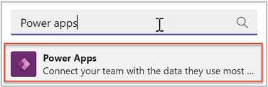

1. Select the Power Apps from the list to open the app. Power Apps will open in Teams.

1. We recommended that you “pop out” Power Apps so that if you need to navigate somewhere else in Teams you won’t lose your app configuration. To pop out the Power Apps app, right-click on the Power Apps logo and select **Pop out app**.

    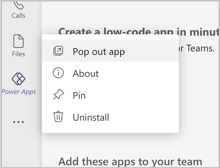

1. Right-click on the **Power Apps** logo, and select **Pin** to lock the app to the side menu so it's easy to get to in the future.

1. Now that you've loaded the Power Apps app, select **Build**.

    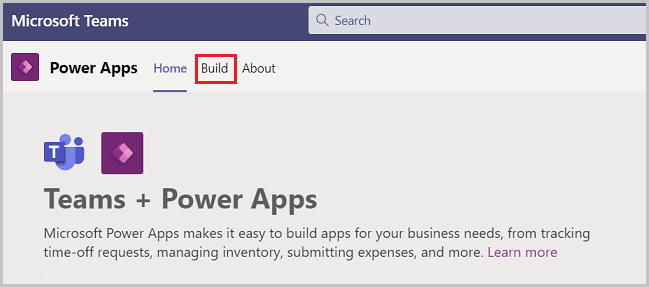

1. This screen will show all the teams that have Power Apps installed in them. Select the team that contain the app you want to share. Select **Share with colleagues**.

    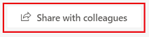

1. Enter an Azure Active Directory security group, or a different team with that you'd like to share access to the app.

1. Set the **On/Off** toggle to **On** for Milestones.

    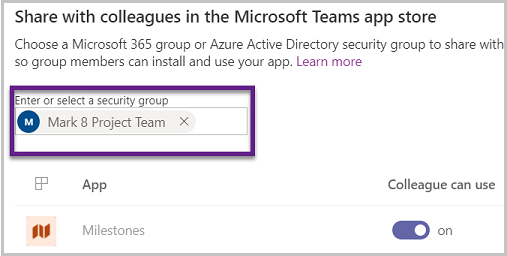

## Understanding table permissions

Understanding and assigning permissions to tables are vital to ensure proper security of your shared data. Here are the four permissions available for use.

- **Full Access** – Allows end users to see and edit all records in the table.

    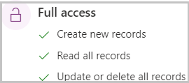

- **Collaborate** – Allows end users to see all records, but they can only edit their own records.
    
    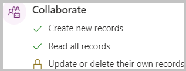
    
- **Reference** – Provides a read-only view of data for end users.

    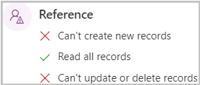

- **Private** – Allows end users to only view and edit their own data.

    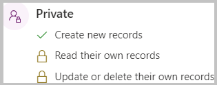

## Grant permissions to the tables

By default, all of the table permissions for colleagues not in the Team are set to **None.** If you leave it that way, colleagues that you share the app with won't be able to use the app, as they won’t have permission to the tables in the app.

Follow these steps to set permissions for the tables in the app for colleagues outside of the team:

1. In Teams, open the **Power Apps** app.

1. Select the **Build** tab.

1. Select the team that contain the app you want to share.

1. Select **Installed apps.** You'll see all apps installed in the Team.

1. Select **See All** in the **Milestones** tile.

    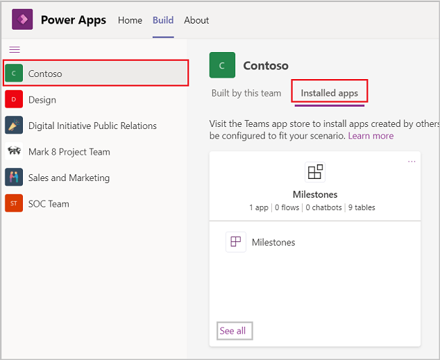

1. Select **Tables** from the solution components bar.

    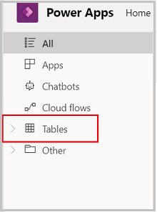

1. Select the tables listed individually then **Manage Permissions.**

1. Select the security group with which the app was shared. The initial permission will show none. Select the permission you want, and select **Save**.

1. Repeat previous steps for each additional table in the app.

The following table lists recommended table permissions for broad distribution of Milestones app:

| Table                      | Permission                                                                                                                                                                                                                      |
|----------------------------|---------------------------------------------------------------------------------------------------------------------------------------------------------------------------------------------------------------------------------|
| Color                      | We want users to be able to read color records so that the app can display the appropriate colors on work item categories and milestones, so they should have reference privilege on the **Color** table.                           |
| Project                    | We want colleagues outside of the team to be able to complete work items, but projects should be read only, so we should give them reference privilege on the **Project** table.                                                    |
| Project Milestone          | We want colleagues outside of the team to be able to view the project milestones for projects to which they have been assigned, but not modify them, so we should give them reference privilege on the **Project Milestone** table. |
| Project Team Member        | Colleagues outside of the team will be project team members, but they shouldn't add or remove project team members from projects, so we should give them reference privilege on the **Project Team Member** table.                 |
| Project User Setting       | Colleagues outside of the team need to be able to set their preferences, so they'll need collaborate privilege on **Project User Setting** table so that they can edit their **Project User Setting** record.                 |
| Project Work Item          | Colleagues outside of the team need to be able to update the work items to which they've been assigned, so we should give them collaborate privilege on the **Project Work Item** table.                                          |
| Project work Item Category | Colleagues outside of the team shouldn't be able to modify work item categories, so we should give them reference privilege on the **Project Work Item Category** table.                                                           |
| Project Work Item Priority | Colleagues outside of the team shouldn't be able to modify work item priority, so we should give them reference privileges on the **Project Work Item Priority** table.                                                            |
| Project Work Item Status   | Colleagues outside of the team should be able to associate statuses with work items, but not modify the status options. So we should give them reference privilege on **Project Work Item Status** table.                           |

## Access shared apps

Now that you've shared Milestones with colleagues outside of your team, here's how they'll acquire the app.

1. In Teams, select the ellipses (…) button on left pane.

1. Select **More apps**.

1. Select **Built for your org**.

1. When the app information screen appears, select **Add** to add the app to the main teams app menu.
    
    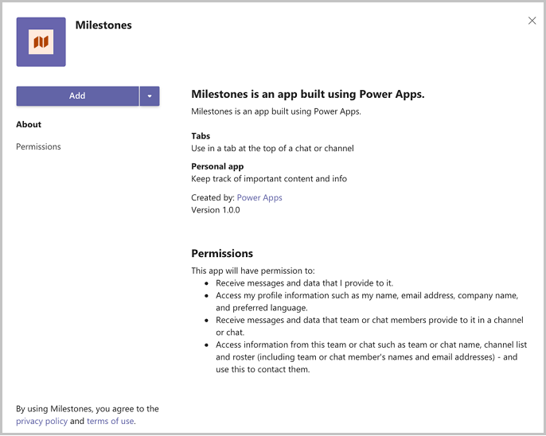
    
1. After adding the app to the Teams app menu, select the icon for the app to open it full screen in Teams.

1. If you want to make the app always appear in the app menu so you can easily find it, right-click on the Milestones button on the app menu and select **Pin**.

   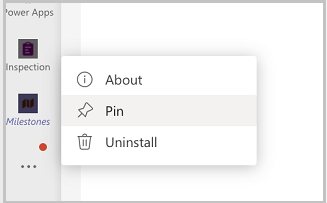

1. If you would prefer to add the app to another team, select the drop-down located by the **Add** button and select **Add to a team**.

   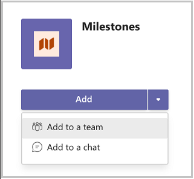

## Limitations

Currently, Teams apps can only be shared with a single Azure Active Directory group.

### See also

- [Customize Milestones sample app](customize-milestones.md)
- [Use Milestones apps from teams store](milestones.md)
- [Understand Milestones sample app architecture](milestones-architecture.md)
- [Customize sample apps](customize-sample-apps.md)
- [Sample apps FAQs](sample-apps-faqs.md)
- [Use sample apps from the Microsoft Teams store](use-sample-apps-from-teams-store.md)

[!INCLUDE[footer-include](../includes/footer-banner.md)]