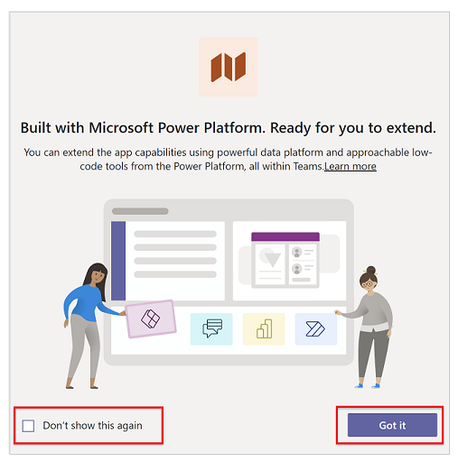
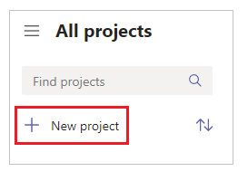
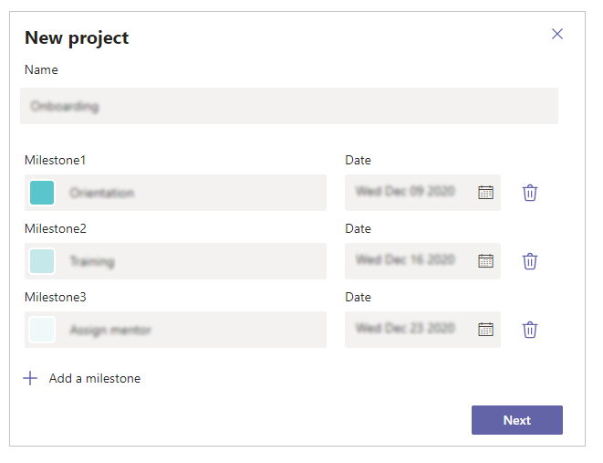
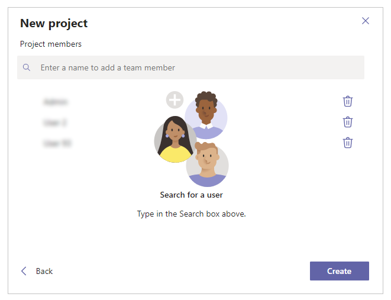
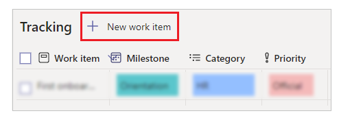
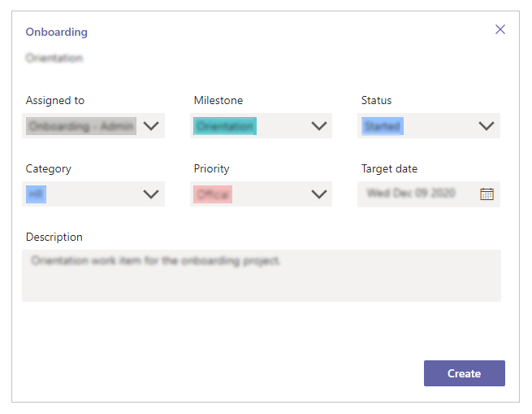
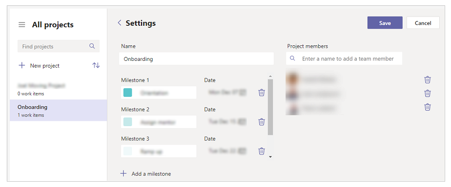
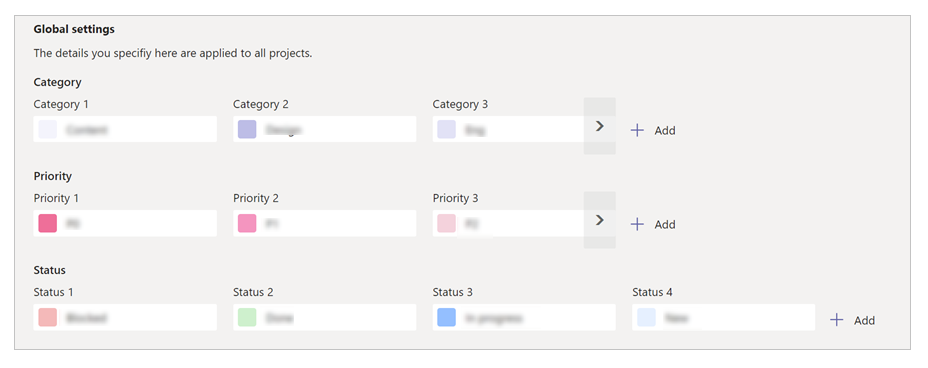
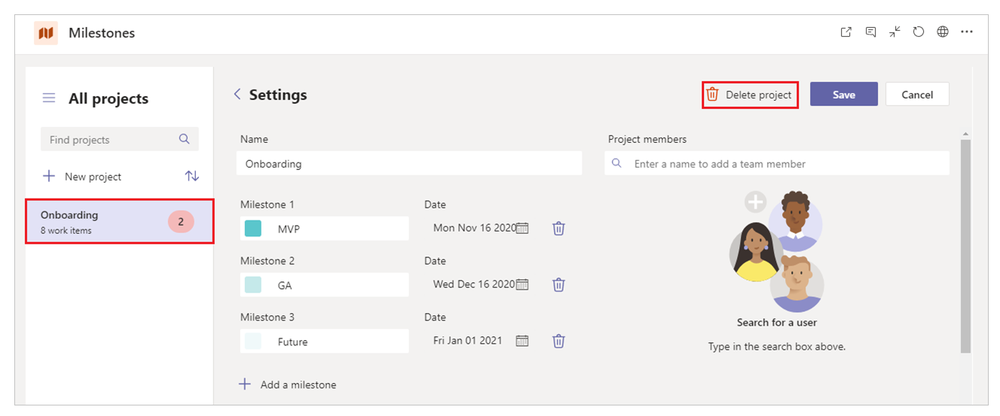

# Milestones sample app 

In this tutorial, you'll learn about configuring, and using the **Milestones** sample app.

## Overview

The Milestones sample app for Microsoft Teams provides a simple way to keep track of your projects and initiatives.

Benefits of using the Milestones app:

- Managers can easily set up projects, and work items.
- Assign work items to employees.
- Classify work items by milestones.
- Configure work item categories, priorities, and status options.

> [!NOTE]
> - Before you can use this app, you may be asked for your permissions to use the connection. More information: [Allow connections in sample apps](use-sample-apps-from-teams-store.md#step-1---allow-connections)
> - This app is available in three different Teams themes: Default, Dark and High contrast. When you [change the theme in Teams](https://support.microsoft.com/en-us/office/change-settings-in-teams-b506e8f1-1a96-4cf1-8c6b-b6ed4f424bc7), the app automatically updates to match the selected theme. More information: [Get the Teams theme using the Teams integration object](use-teams-integration-object.md#get-the-teams-theme)

## Prerequisites

Before using this app:

1. Find the app in Teams store.
2. Install the app.
3. Set up the app for the first use.

For details about the above steps, go to [Use sample apps from the Teams store](use-sample-apps-from-teams-store.md).

## Open the Milestones app

To open the Milestones app:

1. Sign-in to Teams.

1. Select the Team.

1. Select the channel where you installed the **Milestones** app.

1. Select the **Milestones** tab.

1. Select **Allow** if the app asks for your permissions to use the connectors.

1. You can learn more about extending this app's capabilities on the splash screen. Select **Got it** to close the screen, and go to the app. To hide this message while opening this app again, select **Don't show this again** before you select **Got it**.

    

## Understand the Milestones interface

The Milestones app gives you easy access to your projects, work items,
activities, and project milestones.

1. **Search for projects** - search for projects to display in the list on the left pane inside the app.

1. **Select theme** - allows managers to select a theme, or add a custom header image/color.

1. **Customize** - shows additional information about the app.

1. **App settings** - provides access for managers to change app settings, such as update project category, priority, and status.

1. **New project** - create a new project.

1. **Sort projects** - sorts the list of projects in ascending, or descending order based on project start date.

1. **View team status of work items by owner** - color coded counts display the number of work items by milestone. Select the drop down to toggle to user summary view, showing work items by user.

1. **Projects list** - shows all projects, or the results of the search term entered in the find projects search box. Overdue work item count is displayed if the project has any overdue work items.

1. **Project work items** - create, read, update, and delete work items associated with the project.

1. **Project properties** - update project properties, such as modifying or deleting projects or updating milestones and team members associated with the project.

   

## Create a new project

To create a new project:

1. Open the **Milestones** app.

1. Select **New Project** from the left pane.

    

1. Enter **Name**.

1. Enter milestones as required.
      To add additional milestones, select **Add a milestone**.

    

1. Select **Next**.

1. Add team members to the project.

1. Select **Create** to create the project.

    

## Add theme to your project

Once your project is created, select the image button to select an existing image, choose a color, or upload a custom image as the project theme.

## Add work items to a project

To add work items to a project:

1. Open the **Milestones** app.

1. Select a project from the left pane.

1. Select **New work item**.

    

1. Add the work item details: *Name*, *Description*, values for *Assigned to*, *Milestone*, *Status*, *Category*, *Priority*, and *Target date*.

1. Select **Create**.

    

## Edit an existing project

To edit project details:

1. Open **Milestones** app.

1. Select a project from the left pane.

1. Select **Settings** ().

1. Update project details.

1. Select **Save**.

    

## Work with category, priority, and status

You can change the options and color coding for options used for priority,
status, and category.

1. Open **Milestones** app.

1. Select **Settings** ().

1. In the **Global settings** area, select the color for the option you want to change to select a new color.

    

    - To rename, select the name of the category, priority, or status that you wish to change, and enter a new name.

    - To add, select **Add** next to the category, priority, or status. And then, select the color, and enter the name.

    - To delete:
    
        - Select the field.
        - Select **Delete** (). 
        - Select **I understand** checkbox.
        - Select **Delete** to permanently delete the selection.

1. When finished, select **Save** to save your changes.

## Delete an existing project

To delete an existing project:

1. Open **Milestones** app.

1. Select **Settings** ().

1. Select the project that you want to delete from the list of projects on the left pane.

1. Select **Delete project**.

    

1. Select **I understand** checkbox.
   
1. Select **Delete** to permanently delete the project.

### See also

- [Deploy Milestones sample app broad distribution app](milestones-broad-distribution.md)
- [Customize Milestones sample app](customize-milestones.md)
- [Understand Milestones sample app architecture](milestones-architecture.md)
- [Customize sample apps](customize-sample-apps.md)
- [Sample apps FAQs](sample-apps-faqs.md)
- [Use sample apps from the Microsoft Teams store](use-sample-apps-from-teams-store.md)

[!INCLUDE[footer-include](../includes/footer-banner.md)]