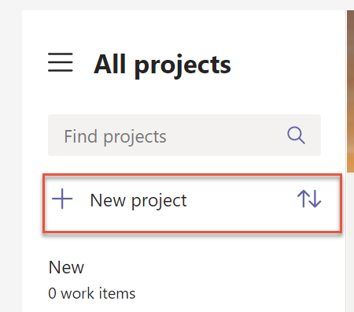
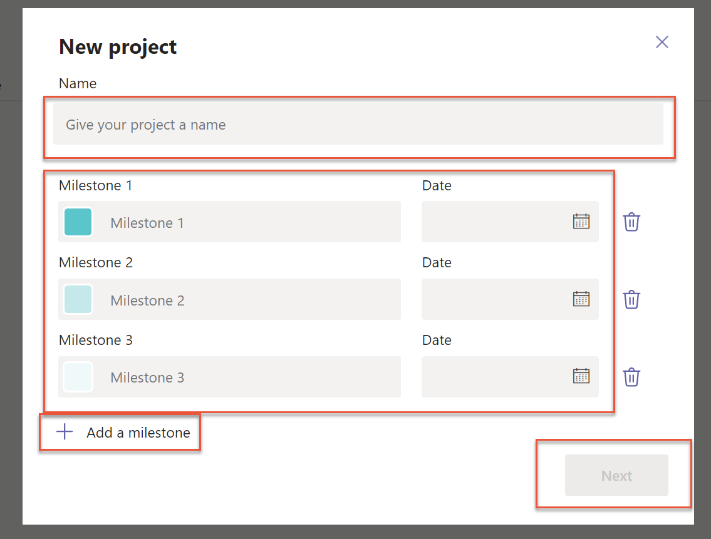
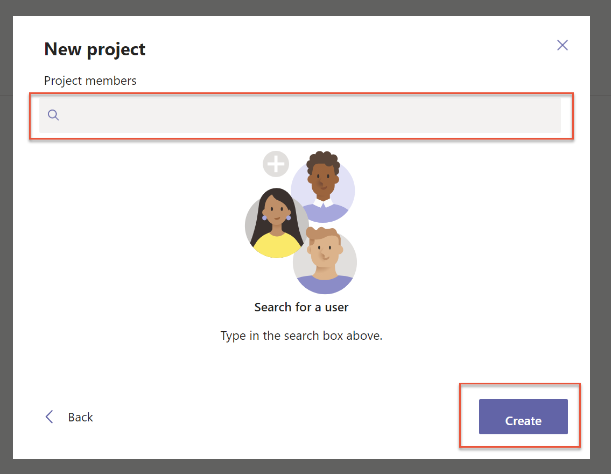
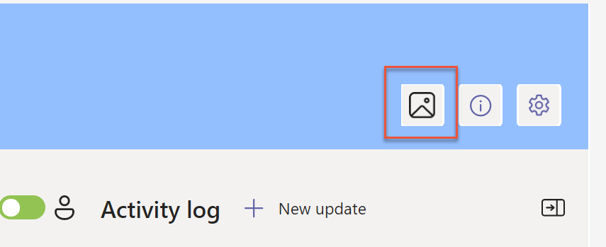
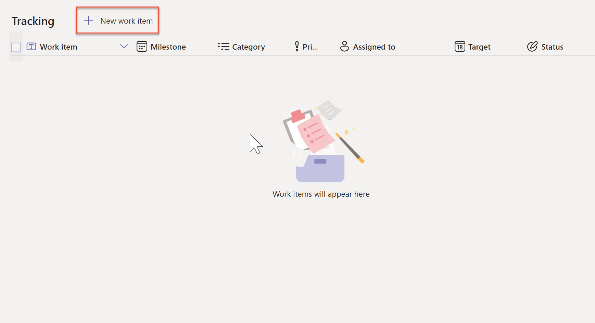
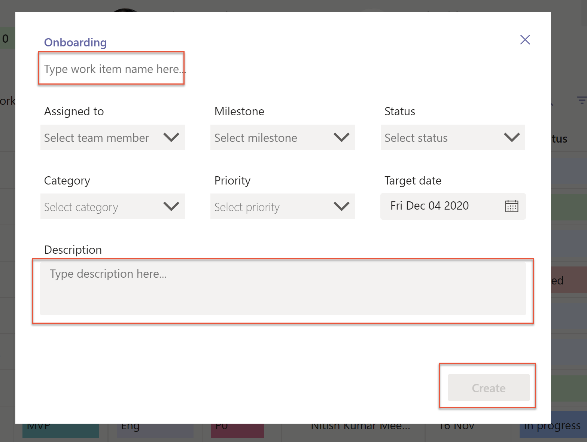
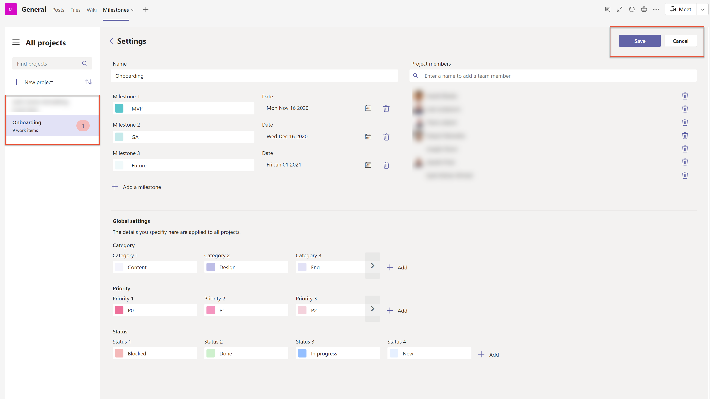

# Milestones sample app

In this tutorial, you'll learn about configuring, and using the **Milestones** sample app.

## Overview

The Milestones sample app for Microsoft Teams provides a simple way to keep track of your projects and initiatives.

Benefits of using the Milestones app:

- Managers can easily set up projects, and work items.
- Assign work items to employees.
- Classify work items by milestones.
- Configure work item categories, priorities, and status options.

## Prerequisites

Before using this app:

1. Find the app in Teams store.
2. Install the app.
3. Set up the app for the first use.

For details about the above steps, go to [Use sample apps from the Teams store](use-sample-apps-from-teams-store.md).

## Open the Milestones app

To open the Milestones app:

1. Sign in to Teams.

1. Select the Team.

1. Select the channel where you installed the **Milestones** app.

1. Select the **Milestones** tab.

1. Select **Allow** if the app asks for your permissions to use the connectors.

1. You can learn more about extending this app capabilities on the splash screen. Select **Got it** to close the screen, and go to the app. To hide this message while opening this app again, select **Don't show this again** before you select **Got it**.

    

## Understand the Milestones interface

The Milestones app gives you easy access to your projects, work items,
activities, and project milestones The following are the available options from the main Milestones screen.

1. **Search for projects** - search for projects to display in the list on the left pane inside the app.

1. **New project** - create a new project.

1. **Projects list** - shows all projects, or the results of the search term entered in the find projects search box. Overdue work item count is displayed if the project has any overdue work items.

1. **Sort projects** - sorts the list of projects in ascending, or descending order based on project start date.

1. **Select theme** - allows managers to select a theme, or add a custom header image/color.

1. **App information** - shows additional information about the app.

1. **App settings** - provides access for managers to change app settings, such as rename projects, or update project category, priority, and status.

1. **View team status of work items by owner** - color coded counts display the number of work items by team member.

1. **Project work items** - create, read, update, and delete work items associated with the project.

1. **Team/Milestone toggle** - toggle between user summary view, and milestone status view.

1. **New activity** - add an update to the activity log.

1. **Activity log** - view activity log, including manually added items, and system generated notifications.

1. **Expand/collapse the activity log** - expands, or collapses the activity log on screen.

1. **Customize** - open the app inside Power Apps Studio for customization.

Create a new project
--------------------

Follow these steps to create a new project:

1.  Click **New Project**

2.  Enter **Name**

3.  Enter Milestones

4.  If you want to add additional milestones, click **Add a milestone**

5.  Click **Next**

6.  Add team members to the project

7.  Click **Create** to create the project

Add theme to project
--------------------

Once your project is created, click the image button to select an image or a
color for your project theme. You can select a standard image or upload a custom
image.

Add work items to a project
---------------------------

Use the following steps to add work items to your project:

1.  Click **New work item**

2.  Populate the **Name, Description** and other fields for the work item

3.  Click **Create** to save the work item

Edit a project
--------------

To edit project details follow these steps:

1.  Click **Settings**

2.  Select the project you want to edit

3.  Update project details

4.  To save changes, click **Save**

5.  To cancel making changes, click **Cancel**

Changing category, priority, and status values
----------------------------------------------

You can change the options and color coding for options used for priority,
status, and category.

1.  Click the **Settings** gear

2.  In the **Global settings** area, click the color for the option you want to
    change to select a new color

3.  To rename a category, click the name of the category that you wish to change
    and enter a new name

4.  To add an additional option, click **Add** and then select the desired color
    and enter the name

5.  To delete an option, select the field, then click the **Delete** icon

6.  When finished, click **Save** to save your changes
