# Notify manager on completion of inspection

The Inspections sample app allows users to create and perform inspections in the app. There are three apps - one per persona to perform, manage, and review Inspections. The three apps are&mdash;Inspections, Manage Inspections and Review Inspections.

Let’s say you're using inspections to investigate a report of a problem in an area. And for unresolved issues, you want to notify the manager of the person responsible for the area so that they can provide the employee with coaching. In this article, we'll learn how to send a notification to the manager of the person responsible for the location being inspected.

The outcome is that the Inspection app can be used to verify that employees are maintaining an area, and provide notification to management if there are issues. For example, the store manager may want to know if the supervisor of the electronics section of a store is properly maintaining the area of their store and if an issue is found, send their manager an email.

> [!NOTE] Before you begin, read [Customize the Inspection app](customize-inspections.md).

## Prerequisites

To complete this lesson, we'd need the ability to log in into Microsoft Teams that will be available as part of select Microsoft 365 subscriptions, and will also need to have the Inspections sample app for Microsoft Teams installed. This app can be installed from https://aka.ms/TeamsInspection.

## Login into the Manage Inspections app

1. Login into Teams, and select Power Apps from the left-pane.

1. Select **Build** tab from the top.

1. Select **Manage Inspections** to open the app in the editor.

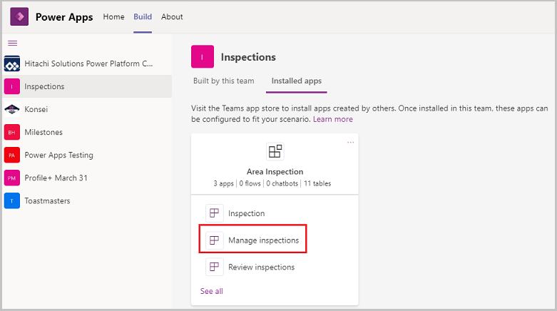

### Add a new field to the Locations table

Next, we'll add a responsible person column to the location table so we can choose the responsible person for the area.

1. On the Home screen, select **See more** under the **Recent apps** section.

    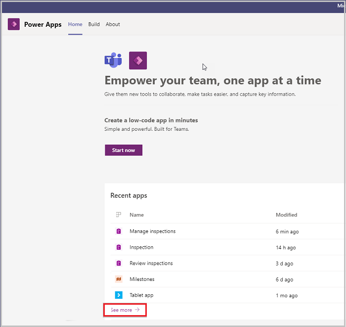

1. Go to the **Installed apps** tab, and select **See all**.

    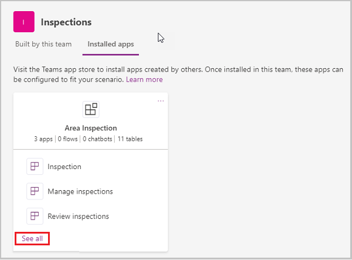

1. Select **Area Inspection Location**.

    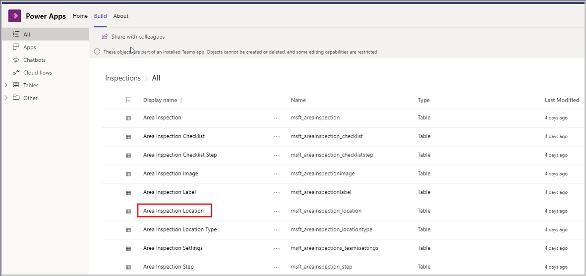

1. Select **Add Column** on the top-left.

1. Enter the following column details, and then select **Done** to create the **Responsible User** column.

   - Display name – **Responsible User**
   - Data type – **Lookup**
   - Related table – **User**

    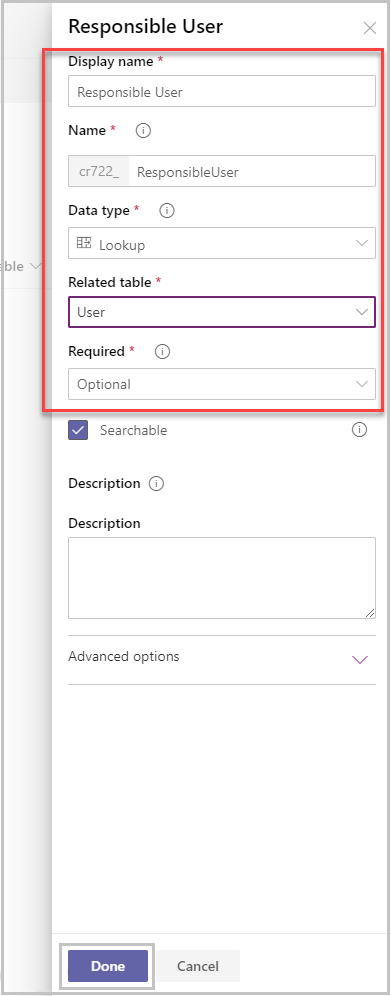

    > [!NOTE] Users must log in to the app one time before they can be selected from the user table.

1. On the **Build** tab under Installed apps, select **Manage Inspections**.

1. Select **Area Inspection Locations** from the left-pane, and then select **Edit**.

    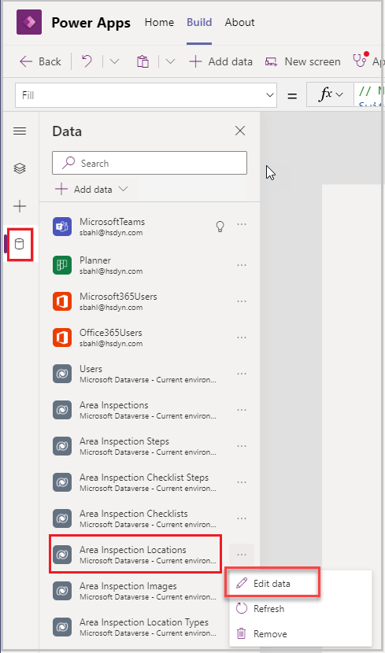

    The **Responsible User ID** column gets added to the **Area Inspection Locations** table.

1. Update the **Area Inspection Location** with the Responsible User values.

    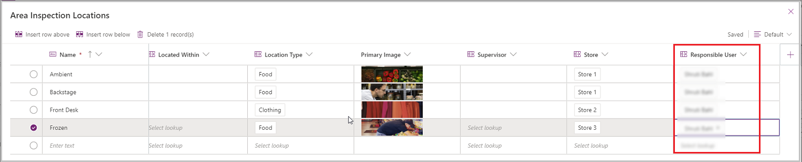

### Add Responsible User field on the Items Screen on Locations table

Now that we've added the responsible user to the location, we'll now display it on the Items screen.

1. The Responsible User field needs to be added to the Display, Edit, and New sections of the Items Screen. The controls for each of these are all on the same screen but their visibility is controlled by variables. Open the **Items Screen** by selecting it in the Tree view and select the container **conAreaDetails**.

1. Press down the **Ctrl** key, and select the label **Title**.

    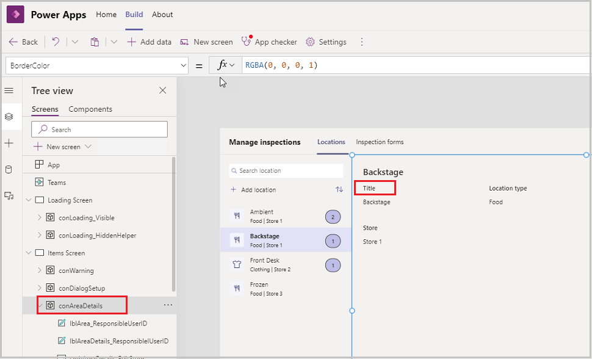

1. Copy the Title label control by highlighting it, and selecting **Ctrl + C** to copy it.

1. Use **Ctrl + V** to paste the label.

1. Update the properties of the new label

    | Property | Value |
    | - | - |
    | Text | “Responsible User” |
    | X | `txtArea_EditTitle.X+txtArea_EditTitle.Width+20` |
    | Y | `If(gblEditLocation \|\| gblAddLocation, 107+150, 61+90)`

1. Rename control to **lblAreaDetails_ResponsibleIUser**.

1. Copy and paste the label that says Backstage and update the properties:

    | Property | Value |
    | - | - |
    | Text | `gblLocation.'Responsible User'.'Full Name'` |
    | X | `txtArea_EditTitle.X+txtArea_EditTitle.Width+20` |
    | Y | `If(gblEditLocation \|\| gblAddLocation, 136+150, 91+90)` |

1. Rename control to **lblArea_ResponsibleUser**.

    The screen then looks like this.

    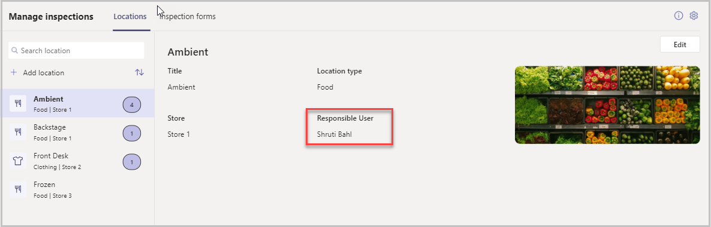

1. Press **Alt** key, and select the **Edit** label on the top-right of the **Items** screen. The Title label is same as created above.

1. Copy and paste the textbox that says **Ambient**, and update the properties:

    | Property | Value |
    | - | - |
    | Default | `If(gblAddLocation, "", gblLocation.'Responsible User'.’Full Name’)` |
    | X | `txtArea_EditTitle.X+txtArea_EditTitle.Width+20` |
    | Y | `If(gblEditLocation \|\| gblAddLocation, 136+150, 91+90)` |
    | Hint Text | "Full Name" |
1. Rename control to **txtArea_EditResponsibleUser**.

    The screen then looks like this.

    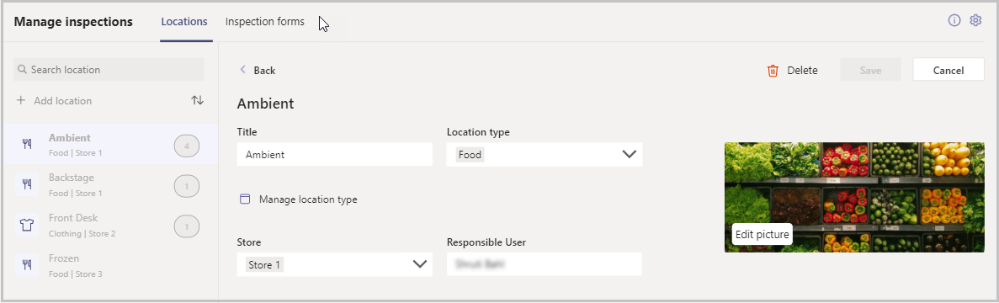

1. Now, press **Alt** key, and select **Cancel** on the top-right. And then press **Alt** key, and select the **Add location** button on the top-left of the **Items** screen.

    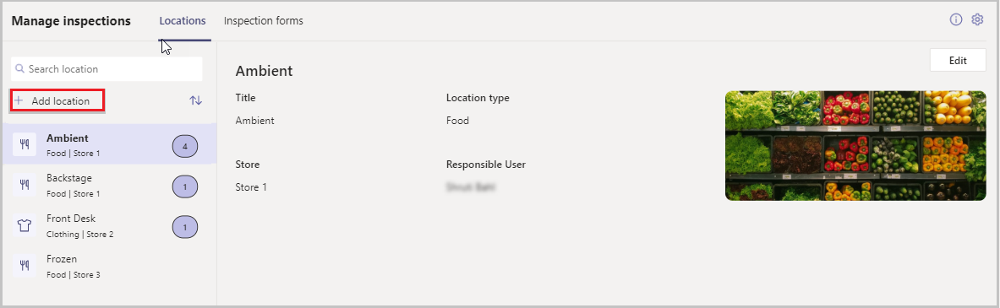

1. Verify that the Responsible User label and the textbox show up while adding a new Location.

    The screen then looks like this.

    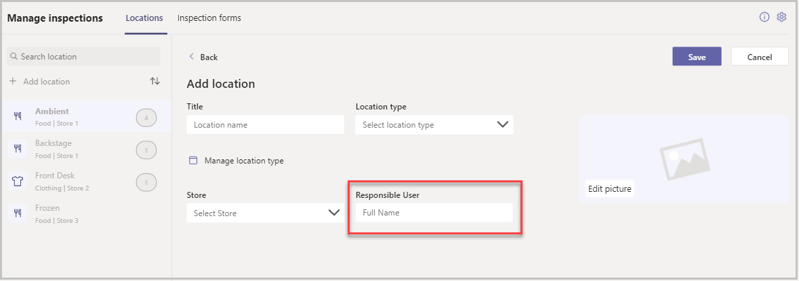

1. Select the **Save** button, and on the **OnSelect** property, add the following formula to the Patch functions `, 'Responsible User': txtArea_EditResponsibleUser in the two places shown below -`.

    

    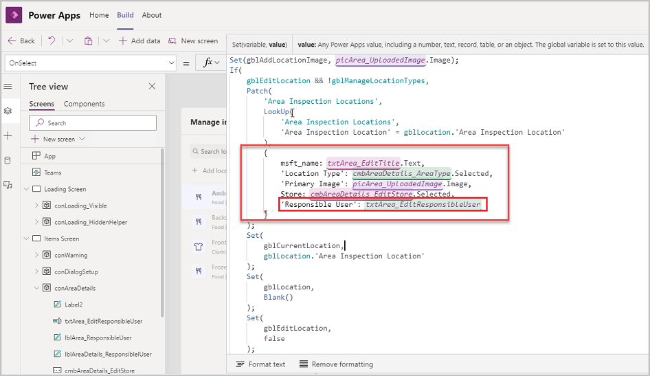

Whenever a location is created or updated now, the **Responsible User** value will also be captured and saved on the **Location** record.

### Publish the Manage Inspections app

All the changes to the Manage Inspections app are completed. The app can now be published by selecting the **Publish to Teams** button on the top-right.

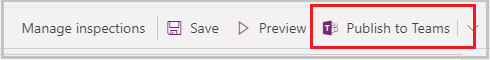

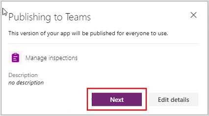

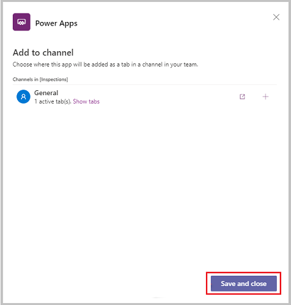

## Edit the inspection app

Now that we've added the field to the Manage Inspections app, we'll create a process to notify the manager of the responsible user when there's an issue.

After publishing the Manage Inspections app, select the **Back** button to go back to the **Build** > **Installed Apps** screen > Select **Inspection**.

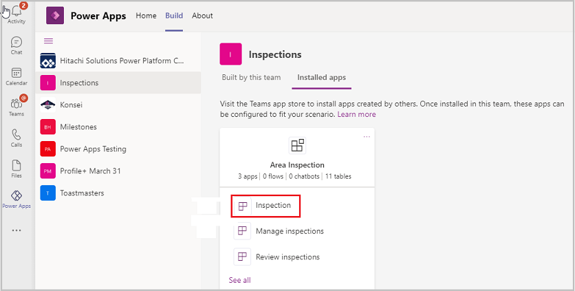

### Add a Flow to send an Email to the Manager

1. From the Tree View, select the **Review Screen**.

1. Select the **Continue Inspection** (btnContinueSubmitInspection) button.

1. Select the OnSelect property option, copy the entire formula from the formula bar, and then paste it in a text editor.

1. Select the **Continue Inspection** button, and select **...** (ellipsis) on the top, and then select **Power Automate**.

    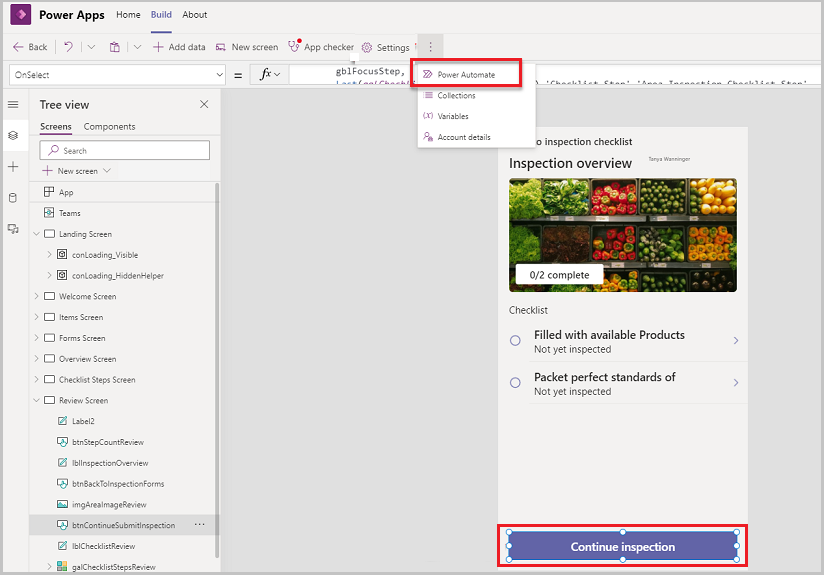

1. Select **+ Create** to create a new flow on [Power Automate](https://flow.microsoft.com).

### Create a Flow to send an email to the Manager of the Responsible User

1. Select the Power Apps trigger from the list.

1. Create the flow **Send Manager Notification of Completion of Inspection**.

1. Select **Ask in Power Apps** option for the **Get Inspection Record** – Row ID step, and for the **Send an Email** – To step.

    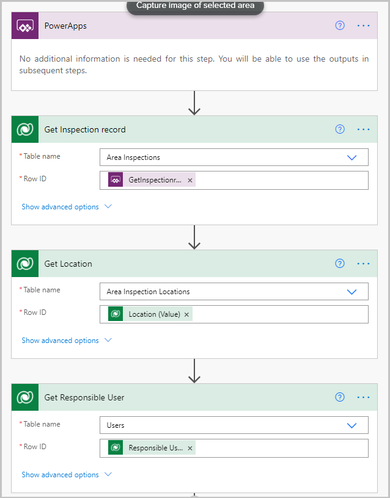

    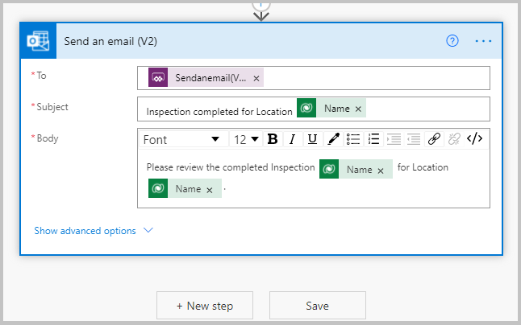

1. Save the flow.

1. Go back to the Power App Studio in Teams.

1. Select this flow created from the available flows list. Most likely, the existing formula on the button will get erased out.

1. Update the **Run Flow** formula as shown below.

    ```powerapps-dot
    SendManagerNotificationofCompletionofInspection.Run(If(
    !IsBlank(gblSelectedLocation.'Responsible User'.'Primary Email'),
    Office365Users.ManagerV2(gblSelectedLocation.'Responsible User'.'Primary
    Email').mail
    ),gblLastInspection.'Area Inspection');
    ```

1. Copy the old Continue button formula back from the text editor from Step 3 of the **Add a Flow to send an Email to the Manager** section before the flow formula used in the previous step.

1. Save the app.

### Publish the Inspection app

All the changes to the Inspection app are completed. The app can now be published by selecting the **Publish to Teams** button on the top-right.

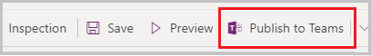


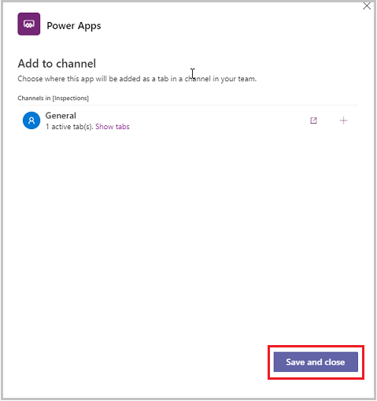

## Verify that a manager exists for the Responsible User

1. Open the link admin.microsoft.com.

1. Select Edit a user.

    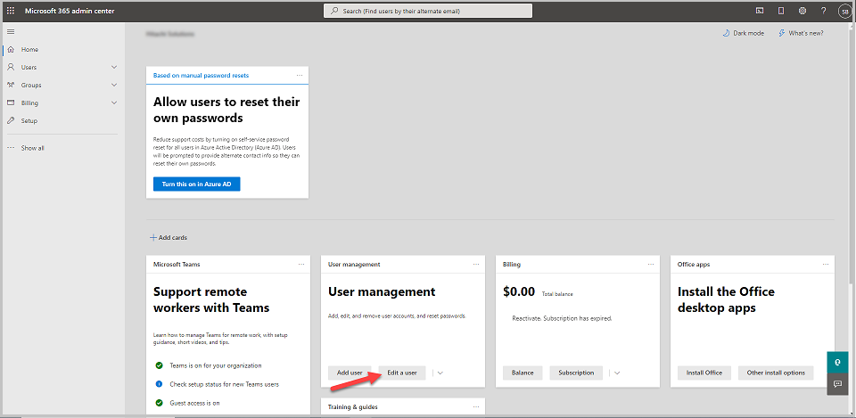

1. Select a User and confirm that the user has a Manager assigned.

    > [!NOTE] If you're working on your organization’s environment, then you'd most likely not need this step. But if working from a trial environment, it is better to create another trial user and add that user as the manager to the Responsible user.

## Test the app

1. Select the Welcome screen from the Tree view in the Editor.

1. Select the **Preview** button to run the app.

    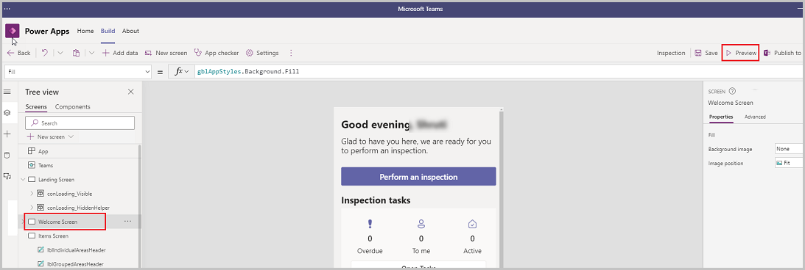

1. Select **Perform an Inspection**.

    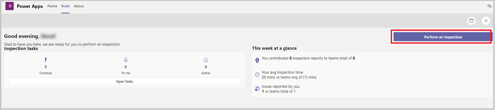

1. Perform the inspection as shown below.

    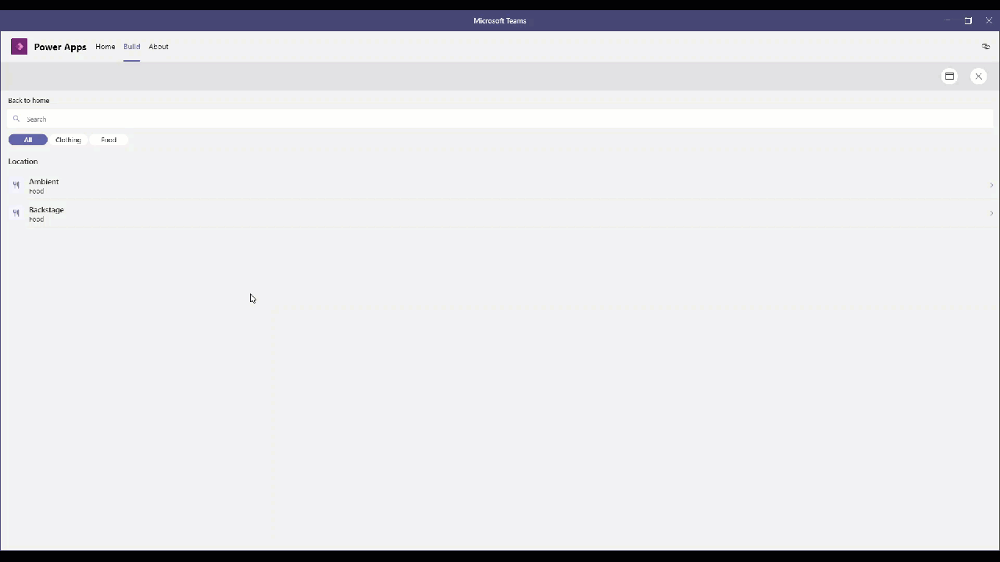

    The flow should run after the Submit Inspection button is selected.

1. The easiest way to confirm if the flow ran fine is by opening the Power Automate flow and checking the last run.

    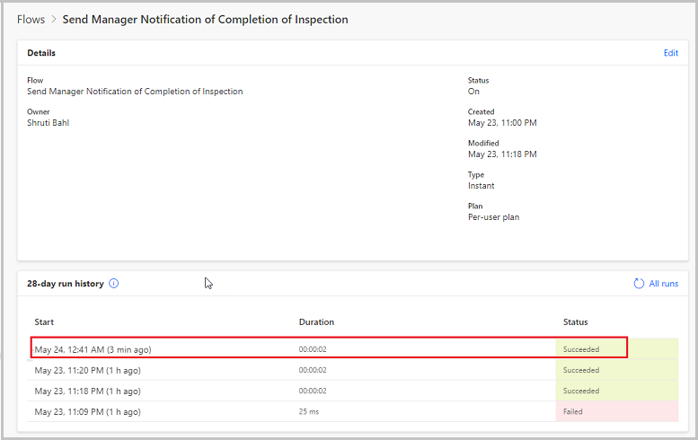

    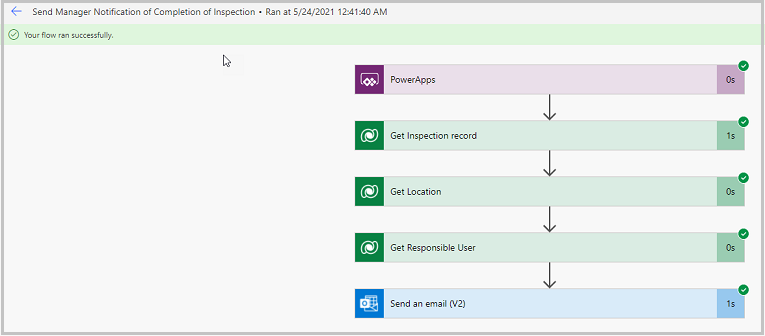

1. Confirm that the email was sent to the right address by selecting and expanding the Send an email step from the flow results.

    The email received is as shown below.

    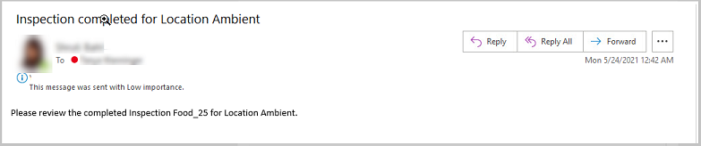

### See also

- [Understand Inspection sample apps architecture](inspection-architecture.md)
- [Customize Inspection sample app](customize-inspections.md)
- [Customize sample apps](customize-sample-apps.md)
- [Sample apps FAQs](sample-apps-faqs.md)
- [Use sample apps from the Microsoft Teams store](use-sample-apps-from-teams-store.md)

[!INCLUDE[footer-include](../includes/footer-banner.md)]