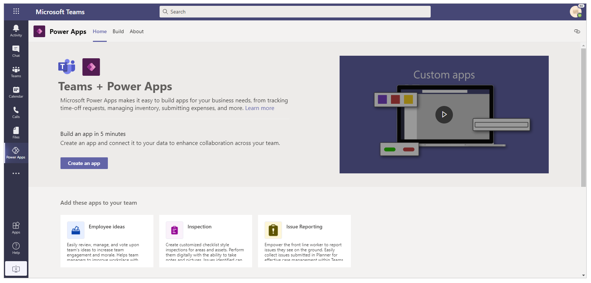
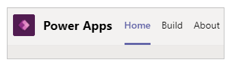
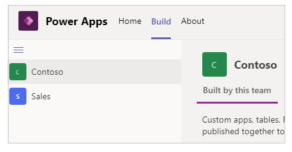
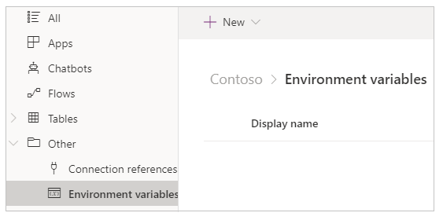
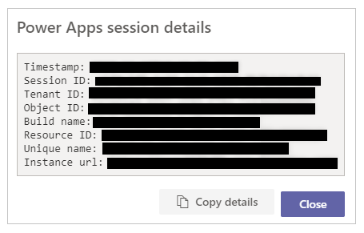

# Overview of the Power Apps app

[!INCLUDE [cc-beta-prerelease-disclaimer.md](../includes/cc-beta-prerelease-disclaimer.md)]

You can use the Power Apps app to create and manage apps across the available environments for the applicable teams. Select the Power Apps app from the left pane in Teams to open the Power Apps interface.

> [!NOTE]
> If the **Power Apps** app doesn't appear on the left pane, you can [install](install-personal-app.md) it. After you install the app, you need to [create your first app](create-first-app.md) to create an environment. For more details about a Power Apps environment, go to [About Teams environment](https://docs.microsoft.com/power-platform/admin/about-teams-environment).

There are three tabs available. **Home**, **Build**, and **About**. You can start creating a new app with the **Create an app** option on the **Home** tab.

Let’s understand each tab in detail.

## Home tab

The **Home** tab allows you to get started creating new apps using Power Apps. As you’ve learned from the earlier section about [creating your first app in Teams](create-first-app.md), a new environment is created for your team when you create a first app. Creating additional apps inside same team uses the environment already created for the selected team. You can use the Home tab as a one stop to view all the available apps that you can install, or play the video to get started.

## Build tab

Select **Build** tab to see the list of environments for each team that you’re member of, and the list of apps or objects created or installed.

1. **Environments** – Each Microsoft Teams team with an environment that you have access to shows in the list of environments.

    If you've more than one team with environments created, select the team or environment you want from the left pane.

    

    Select  to collapse/expand the environments list.

    

1. **Built by this team** – List of all Power Apps objects such as apps, flows, tables created in the selected environment (Team’s team). Selecting **New app** lets you create a new app. Selecting **See all** opens the solution explorer for the environment. For more information, see the following section about solution explorer.

    Select **See all** to view the all the components in the selected environment, and to create new apps or components.

    

1. **Installed apps** – Shows a list of installed apps in the environment (Team’s team) from the Teams app store.

    

## Power Apps solution explorer

When you select **See all** from the environments list on the **Build** tab, you’ll see the Power Apps solution explorer with the available components for the selected environment. To get started, select a component group from the left pane.

### All

Shows all available Power Apps objects such as apps, flows, chatbots in the selected environment.

1. **Back** takes you back to the **Build** tab with a list of environments.

1. **New** allows you to create new apps, flows, or tables.

    

1. **Publish all customizations** publishes customization changes.

### Apps

Shows the apps created using Power Apps. For more information about managing an app, go to Managing an app.

### Flows

Shows all the Power Automate flows in the selected team’s environment. Power Automate is a service that helps you create automated workflows between your
favorite apps and services to synchronize files, get notifications, collect data and more. There are different types of flows available. For more information
about Power Automate flows, go to [Get started with Power Automate](/power-automate/teams/overview.md).

### Tables

In Power Apps, a table defines information that you want to track in the form of records, which typically include properties such as company name, location,
products, email, and phone. You can then surface that data by creating an app that refers to the table. For more information about tables, go to [Tables
overview](../maker/common-data-service/entity-overview.md).

### Other - Connections Reference

Lists connections available to the environment. Data is stored in a data source, and you bring that data into your app by creating a connection. A Power Apps connection connects your app to such data source. Also, to the ability to connect to the Project Oakdale environment within the Team, there are several types of connectors available that you can use to create connections. For more information about connections, go to [Overview of canvas apps connectors](../maker/canvas-apps/connections-list.md).

### Other - Environment variables

Lists the environment variables for your selected team’s environment. Apps and flows often require different configuration settings across environments.
Environment variables as configurable input parameters allow management of data separately compared to hard-coding values within your customization or using additional tools. For more information about environment variables, go to [Environment variables overview](../maker/common-data-service/environmentvariables.md).

## About tab

Select the **About** tab to view the version of the installed Power Apps app.

You can get your current session details by selecting the **About** tab, and then selecting the **Session details** option. The session details include
useful information that you can then share with others when investigating an issue or working with support teams.

**Timestamp** – Date and time in UTC.

**Session ID** – Unique GUID representing the current Power Apps session.

**Tenant ID** – Tenant ID of the Teams and Power Apps.

**Object ID** – Object ID of the user account in Azure Active Directory.

**Build name** – Build and version details of Power Apps app.

## Canvas apps terminology reference and definitions

While creating canvas aps using Power Apps from the Teams interface, it becomes important to understand the terms and definitions of various objects, options, and actions inside an app. The following table defines such canvas app terms and definitions.

| **Component or action**                                                                                        | **Description**                                                                                                                                                                                              |
|----------------------------------------------------------------------------------------------------------------|--------------------------------------------------------------------------------------------------------------------------------------------------------------------------------------------------------------|
| [Power Apps Studio](https://docs.microsoft.com/powerapps/powerapps-overview#power-apps-for-app-makerscreators) | An application used to make or author a canvas app. Also referred to as canvas studio.                                                                                                                       |
| [Canvas app](https://docs.microsoft.com/powerapps/maker/canvas-apps/getting-started)                           | A Power Apps app that you can create from scratch or using any available template through the Power Apps Studio.                                                                                             |
| [Model-driven app](https://docs.microsoft.com/powerapps/maker/model-driven-apps/model-driven-app-overview)     | An application based on Common Data Service forms, views, tables, columns, and other components.                                                                                                                     |
| [Connector](https://docs.microsoft.com/connectors/connectors)                                                  | Connection object connecting an app with the data source. For example, connector for SharePoint, or a connector for OneDrive.                                                                                |
| [Control](https://docs.microsoft.com/powerapps/maker/canvas-apps/reference-properties#controls)                | An object that can be added on the canvas to provide certain app functionality.                                                                                                                              |
| [Property](https://docs.microsoft.com/powerapps/maker/canvas-apps/reference-properties#all-properties)         | Behaviors representing the controls available in an app.                                                                                                                                                     |
| [Function](https://docs.microsoft.com/powerapps/maker/canvas-apps/formula-reference)                           | Readily available functionality to extend behavior of a control or app.                                                                                                                                      |
| [Formula](https://docs.microsoft.com/powerapps/maker/canvas-apps/formula-reference)                            | Combination of one or more functions to accomplish a certain task or action.                                                                                                                                 |
| [Screen](https://docs.microsoft.com/powerapps/maker/canvas-apps/add-screen-context-variables)                  | Visible area of an app enclosing available visible controls. An app can have multiple screens.                                                                                                               |
| [Component](https://docs.microsoft.com/powerapps/maker/canvas-apps/create-component)                           | Reusable combinations of controls that can be defined, saved, and used for new apps, as defined by the maker or the user.                                                                                     |
| [Save an app](https://docs.microsoft.com/powerapps/maker/canvas-apps/save-publish-app#save-changes-to-an-app)  | Saving an app for the first time, or saving new changes to an app.                                                                                                                                           |
| [Publish an app](https://docs.microsoft.com/powerapps/maker/canvas-apps/save-publish-app#publish-an-app)       | Making an app available to the app store for general consumption.                                                                                                                                            |
| [Versions](https://docs.microsoft.com/powerapps/maker/canvas-apps/save-publish-app#identify-the-live-version)  | Each time an app is saved, a new version is created that you can [restore](https://docs.microsoft.com/powerapps/maker/canvas-apps/restore-an-app) with functionality available at the time of saving an app. |
| [Share an app](https://docs.microsoft.com/powerapps/maker/canvas-apps/share-app)                               | Allowing users or groups to use the app, as consumers or co-owners.                                                                                                                                          |

### See also

- [Understand Power Apps Studio](understand-power-apps-studio.md)
- [Create your first app](create-first-app.md)
