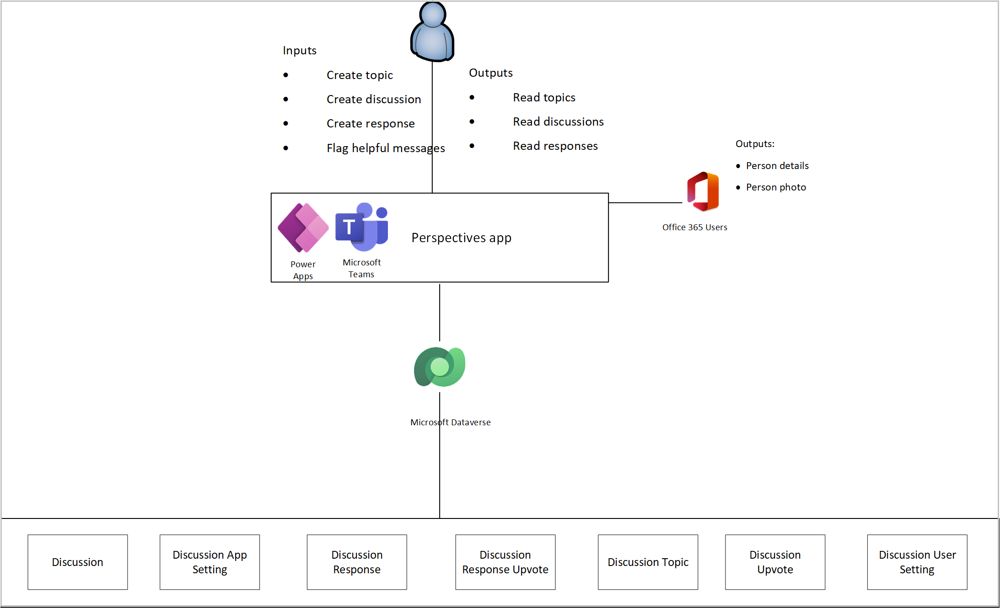
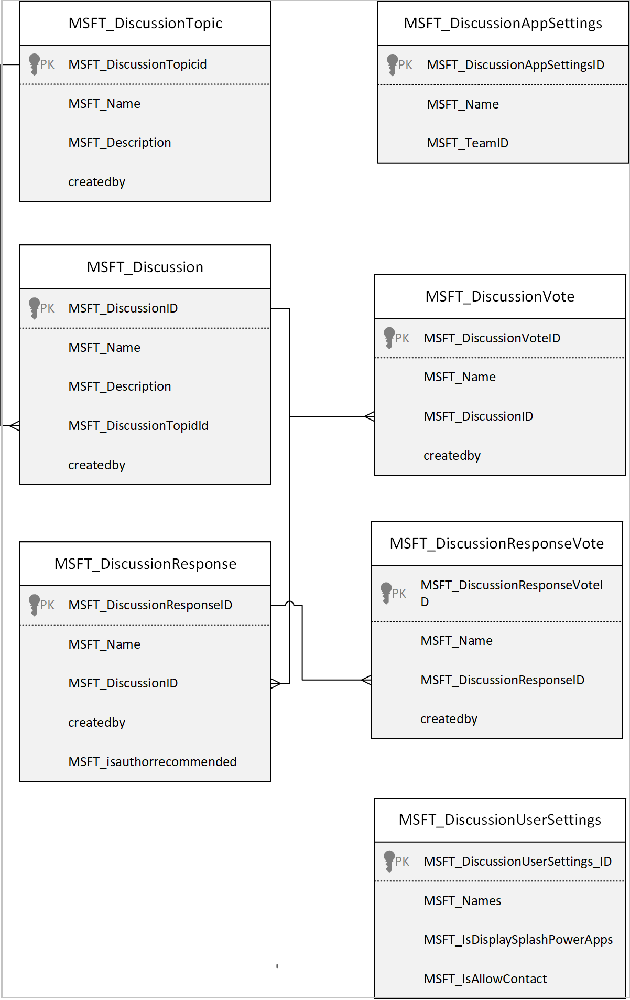

# Understand Perspectives sample apps architecture (Preview)

[This article is pre-release documentation and is subject to change.]

In this article, you'll learn about the collections and global variables used by the [Perspectives](perspectives.md) app, and understand how to use them effectively. If you want to learn more about how to install, and use the Inspection sample app instead, go to [Perspectives sample apps](perspectives.md).

## Prerequisites

To understand and use information in this article, you'll need to know about different controls, features, and capabilities of canvas apps.

- [Create and update a collection in a canvas app](../maker/canvas-apps/create-update-collection.md)
- [Collect, Clear, and ClearCollect functions in Power Apps](../maker/canvas-apps/functions/function-clear-collect-clearcollect.md)
- [Understand canvas-app variables in Power Apps](../maker/canvas-apps/working-with-variables.md)
- [Add and configure a canvas-app control in Power Apps](../maker/canvas-apps/add-configure-controls.md)
- [Add a screen to a canvas app and navigate between screens](../maker/canvas-apps/add-screen-context-variables.md)

You'll also need to know about how to [install](use-sample-apps-from-teams-store.md), and [use](perspectives.md) the Perspectives sample app.

> [!IMPORTANT]
>-   This is a preview feature.
>-   Preview features aren’t meant for production use and may have restricted functionality. These features are available before an official release so that customers can get early access and provide feedback.

## Architecture model 

The following diagram illustrates the way that users and systems interact with
data in this solution.

### Connectors

Perspectives app uses the following connectors

-   Microsoft Dataverse to read and write data to Dataverse tables.

-   Office 365 Users to read user profile data

## Data Model 

The following diagram explains the data model used by the Perspectives sample app.

### Tables

The following tables are used in the Perspectives app.

| Table name                                                  | Description                                                                                                                                                                                                             |
|-------------------------------------------------------------|-------------------------------------------------------------------------------------------------------------------------------------------------------------------------------------------------------------------------|
| Discussion (MSFT_Discussion)                                | The Discussion table contains Discussion Topics, Response Count and Upvote count for each discussion. This table has relationships with Discussion Response, Discussion Response Upvote, and Discussion Topics tables.  |
| Discussion Response (MSFT_DiscussionResponse)               | The Discussion Response table contains user response to the discussion and upvote count related to the response. This table has a relationship with Discussion Response Upvote table.                                    |
| Discussion Response Upvote (MSFT_DiscussionResponseUpvote)  | The Discussion Response Upvote table contains user response upvotes for active discussions.                                                                                                                              |
| Discussion Topic (MSFT_DiscussionTopic)                     | The Discussion Topic table contains topics of discussion along with cover images, cover icons, and cover colors related to the topic.                                                                                    |
| Discussion Upvote (MSFT_DiscussionUpvote)                   | The Discussion Upvote table contains user votes related to discussions and response.                                                                                                                                    |
| Discussion User Setting (MSFT_DiscussionUserSetting)        | The Discussion User Setting table stores user preferences pertaining to seeing the Power Apps splash screen every time they log in to the app.                                                                           |
| Discussion App Setting (MSFT_DiscussionAppSetting)          | The Discussion App Setting table stores the original Team ID.                                                                                                                                                           |

## Collections

The following collections are used in the Perspectives app.

| Collection name                 | Description                                                                                | Where used                  |
|---------------------------------|--------------------------------------------------------------------------------------------|-----------------------------|
| colLocalization                 | Used to build a Localization Collection based on the User Language.                         | OnStart property of the App |
| colUserSettings                 | Used to collect User Settings Dataverse record if it exists.                                     | OnStart property of the App |
| colStockIcons                   | Collection of stock board cover icons.                                                     |  All                        |
| colStockImages                  | Collection of stock board cover images.                                                    |  All                        |
| colTopicCoverColors             | Collection of topic cover colors.                                                          |  All                        |
| colGroupedResponsesByDiscussion | collection of responses grouped by discussion topic.                                       |  All                        |
| colDiscussionResponses          | collection of discussion responses.                                                        | All                         |
| colMostEngagingDiscussions      | collection of discussion with number of responses.                                         |  All                        |
| colCharWidth                    | Collection of widths for each character used for auto width labels.                        |  Topics                     |
| colAppSettings                  | Check app settings to check the team ID of the team where the app was originally installed. |  All                        |

## Global Variables

The following are the global variables used in the Perspectives app.

| Variable Name                      | Type    | Description                                                                                                               | Screen  |
|------------------------------------|---------|---------------------------------------------------------------------------------------------------------------------------|---------|
| gblAppLoaded                       | Boolean | To check whether the App is loaded.                                                                             | OnStart |
| gblUserLanguage                    | Text    | To check the logged in User’s Language.                                                                                    | OnStart |
| gblThemeDark                       | Boolean | To check whether the Teams theme is set to Dark.                                                                           | OnStart |
| gblThemeHiCo                       | Boolean | To check whether the Teams theme is set to High Contrast.                                                                  | OnStart |
| gblMobileMode                      | Boolean | To set the value to true if the Host client is Android or iOS.                                                            | OnStart |
| gblIsManager                       | Boolean | Global variable to store if the current user is a manager.                                                                | OnStart |
| gblTeamsTabContext                 | Boolean |                                                                                                                           | OnStart |
| gblIsHostClientWeb                 | Boolean |                                                                                                                           | OnStart |
| gblAppSetting_inputMobileOnWeb     | Boolean | Variables to Scale fonts for mobile-oriented apps, running in desktop.                                                     | OnStart |
| gblAppSetting_inputScaleFontsByCui | Number  | Use this variable for scaling all fonts by a fixed amount.                                                                 | OnStart |
| gblCurrUserEmail                   | Text    | To fetch the current User’s Email ID.                                                                                      | OnStart |
| gblCurrUser                        | Record  | To fetch the current User’s Record.                                                                                        | OnStart |
| gblAppSetting_inputMobile          | Boolean | Variables to Scale fonts for mobile-oriented apps.                                                                         | OnStart |
| gblFirstRun                        | Boolean | Variable to check whether the app is being run for the first time after installation.                                      | OnStart |
| gblRecordUserSettings              | Record  | Variable to use the Oldest Record in case multiple records exist.                                                          | OnStart |
| gblCurrentTeamId                   | Text    | global variable to store the current Team ID global variable to store the current team ID.                                | OnStart |
| gblIsOriginalInstallTeam           | Text    | if the original install Team id equals the current installed Team ID. confirm current team same as original install team.  | OnStart |
| gblIsAdmin                         | Boolean | if the current team is same as original team then current user is the team owner.                                         | OnStart |
| gblAppColors                       | Record  | Variable to set the Color value in the app.                                                                                | OnStart |
| gblAppSizes                        | Record  | Variable to set the Size values in the app.                                                                                | OnStart |
| gblOrginialInstallTeamId           | Text    | global variable to store the current Team ID global variable to store the current team ID.                                | OnStart |
| gblAppStyles                       | Record  | Variable to set the Styling values in the app.                                                                             | OnStart |
| gblDisplayWarning                  | Boolean | Variable to hide and show the Warning message while deleting the inspection.                                               | OnStart |

#### OnStart execution details

1.  When a user accesses the app, **gblAppLoaded** is set to false. The user’s
    language code is stored in **gblUserLanguage**, with English - US being the
    default one.

2.  The user’s language is then used to collect localized text used throughout
    the app (for example, label and button text) in **colLocalization**.

3.  User details from User Settings table are collected in **colUserSettings**.
    If no records exist, a new user setting record is created. This in turn
    controls the visibility of the splash dialog. If there are multiple project user settings records exist, the oldest record is selected and stored in the
    **gblRecordUserSettings** variable.

## App OnStart

This section explains the collections, variables, and execution details used
when the app starts.

### OnStart collections

The following collections are used when the app starts

| **Collection name** | **Description**                                                                             |
|---------------------|---------------------------------------------------------------------------------------------|
| colUserSettings     | Collection of the user Settings from Area Inspection User Settings table.                   |
| colLocalization     | Collection of localized text based on user's language.                                      |
| colAppSettings      | Check app settings to check the team ID of the team where the app was originally installed. |

### OnStart variables

| Variable name                    | Description                                                                                                              |
|----------------------------------|--------------------------------------------------------------------------------------------------------------------------|
| gblFirstRun                      | Variable to check whether the app is being run for the first time after installation.                                    |
| gblAppLoaded                     | Global variable to check if the app has loaded completely.                                                               |
| gblUserLanguage                  | Global variable to store the user's language.                                                                            |
| gblRecordUserSettings            | Global variable to store the latest User Settings records for the current user.                                          |
| gblOriginialInstalledTeamId      | Global variable to store the original installed Team ID.global variable to store the original installation team ID.      |
| gblCurrentTeamId                 | Global variable to store the current Team ID global variable to store the current team ID.                               |
| gblIsOriginialInstallTeam        | If the original install Team id equals the current installed Team ID. confirm current team same as original install team. |
| gblIsAdmin                       | If the current team is same as original team, then current user is the team owner.                                        |
| gblIsManager                     | Global variable to store if the current user is a manager.                                                               |
| locNavigationTimer               | If the navigation timer has been set to true after the time interval the app settings and sizes will be updated.         |
| gblAppSetting_inputMobileOnWeb   | Global variable to scale fonts for mobile                                                                                |
| gblAppSetting_inputMobile        | Global variable to scale fonts for mobile                                                                                |
| gblAppSetting_inputScaleFontsBy  | Global variable for scaling all fonts by a fixed amount.global variable for scaling all fonts by a fixed amount.         |
| gblThemeDark                     | Global variable to store if Teams is running in dark mode.                                                               |
| gblThemeContrast                 | Global variable to store if Teams is running in contrast mode.                                                           |
| gblAppColors                     | Variable to set the Color value in the app global variable to set the Color value in the app.                            |
| gblAppSizes                      | Variable to set the size value in the app global variable to store the app sizes for app in mobile and mobile on web.    |
| gblAppStyles                     | Variable to set the Styling values in the app global variable to set the Styling values in the app.                      |
| locShowPowerAppsPrompt           | Local variable to indicate if the user has set the preference to see Power Apps prompt to yes or no.                     |
|  locShowFirstRun                 | Local variable to indicate of the current run of the app is the first run for the user.                                  |

## About Screen

This section explains the collections and execution details used on the about
screen

### About screen collections

The following collection is used on the about screen.

| **Collection name** | **Description**                                        |
|---------------------|--------------------------------------------------------|
| colLocalization     | Collection of localized text based on user's language. |

### About screen variables

No variables

## Topic screen

### Find topic

This section explains collections, global variables, and execution details used
when finding discussion topic. No collections are involved in finding discussion
topic process.

### Find topic variables

Variables used by topic screen:

| Variable name    | Description                              |
|------------------|------------------------------------------|
| locSelectedTopic | Local variable to store selected topic.  |

### Find topic execution details 

1.  On search of discussion topic from search bar app will fetch matching result
    from Dataverse in ascending order

2.  On select of discussion topic, **locSelectedTopic** is set to selected
    discussion topic and navigate to ‘Discussion Screen’

## Add topic screen

### Add a new topic

This section explains collections, global variables, and execution details used
when adding a new topic.

### Add topic collections

Collections used by new add topic screen:

| Collection name      | Description                                            |
|----------------------|--------------------------------------------------------|
| colLocalization      | Collection of localized text based on user's language. |
| colTopicCoverColors  | Collection of topic cover colors.                      |
| colStockIcons        | Collection of stock icons.                             |
| colStockImages       | Collection of stock images.                            |

### Add topic variables

Variables used by Add topic screen:

| Variable name              | Description                                            |
|----------------------------|--------------------------------------------------------|
| locDefaultBoardCoverColor  | Local variable to determine default board cover color. |
| locDefaultBoardCoverIcon   | Local variable to determine default board cover icon.  |

### Add topic execution details

1.  On select of **Add a Topic** button form Topic Screen, screen navigate to
    Add topic screen

2.  Once the required information is filled the **Save** button gets enabled.

3.  When **Save** button selected, Topic will be created.

## Edit topic screen

### Edit topic

This section explains collections, global variables, and execution details used
when editing a topic.

### Edit topic collections

Collections used by new edit topic screen:

| Collection name      | Description                                            |
|----------------------|--------------------------------------------------------|
| colLocalization      | Collection of localized text based on user's language. |
| colTopicCoverColors  | Collection of topic cover colors.                      |
| colStockIcons        | Collection of stock icons.                             |
| colStockImages       | Collection of stock images.                            |

### Edit topic variables

Variables used by edit topic screen:

| Variable name              | Description                                                    |
|----------------------------|----------------------------------------------------------------|
| locSelectedTopic           | Local variable to store selected topic.                        |
| locSelectedBoardColor      | Local variable to store selected board color.                  |
| locCoverImageSelected      | Local variable to store selected cover image.                  |
| locCustomImageSelected     | Local variable to store selected custom image.                 |
| locDefaultBoardCoverColor  | Local variable to determine default board cover color.         |
| locDeleteTopicWarning      | Local variable to control the visibility of the delete dialog. |

### Edit and Delete topic execution details

1.  On select of **Edit button** from the Discussion Screen,
    **locSelectedTopic** local variable will be updated with current topics
    context and screen will navigate to Edit topic screen.

2.  Existing record field will be populated from **locSelectedTopic** variable.
    such as topic, description, topic cover.

3.  The user can make update in topic such as topic, description, topic cover
    from edit topic screen

4.  After updating information in required fields user select the **Save**
    button. save process will use **locCoverImageSelected,
    locCustomImageSelected** variables to verify cover image and custom image
    are selected or not.

5.  If the user selects **Delete** button then a dialog appears to ask for
    confirmation, the visibility of this dialog is controlled by using
    **locDeleteTopicWarning**.

6.  The user needs to check the **I understand** checkbox to activate the
    **Delete** button.

7.  When the **Delete** button is selected, the current topic from Dataverse
    will be deleted.

8.  Once the delete process is complete the app navigates to Topic screen.

## Discussion screen

### Add a new discussion

This section explains collections, global variables, and execution details used
when adding a new discussion.

### Discussion collections

Collections used by new add discussion screen:

| Collection name              | Description                                            |
|------------------------------|--------------------------------------------------------|
| colSelectedTopicDiscussions  | Collection of selected discussion information.         |
| colLocalization              | Collection of localized text based on user's language. |

### Discussion variables

Variables used by Add discussion screen:

| Variable name          | Description                                            |
|------------------------|--------------------------------------------------------|
| locSelectedTopic       | Local variable storing selected topic.                 |
| locSelectedDiscussion  | Local variable containing discussion selected by user. |

### Discussion execution details

1.  On select of **New Discussion** button from Discussion Screen, screen will
    navigate to New Discussion screen

2.  Once the required information is filled the **Save** button gets enabled.

3.  When **Save** button selected, **locSelectedDiscussion** local variable that will be updated with currant discussion fields and Discussion record
    will be created in Dataverse against topic.

## Response screen

### Response

This section explains collections, global variables, and execution details used
in response screen.

### Response collections

Collections used by new add topic screen:

| Collection name              | Description                                            |
|------------------------------|--------------------------------------------------------|
| colSelectedTopicDiscussions  | Collection of selected discussion information.         |
| colLocalization              | Collection of localized text based on user's language. |

### Response variables

Variables used from response screen:

| Variable name                    | Description                                                                                               |
|----------------------------------|-----------------------------------------------------------------------------------------------------------|
| locAddResponse                   | Local variable to determine whether the response dialog should be used to add a new response.             |
| locEditResponse                  | Local variable to determine whether the response dialog should be used to edit an existing response.      |
| locSelectedDiscussion            | Local variable containing discussion selected by user.                                                    |
| locEditDiscussion                | Local variable to determine whether the response dialog should be used to edit an existing discussion.    |
| locAddDiscussion                 | Local variable to determine whether the response dialog should be used to add a new discussion.           |
| locFetchDiscussion               | Local variable to determine whether if the new discussion screen needs to be used fetch a new discussion. |
| locNavFromTopic                  | Local variable to determine whether user navigated from Topic screen or Discussion screen.                |
| locScreenReaderAnnouncedText     | Local variable to start the announcement of screen reader.                                                |
| locResponseCreatedByUserSetting  | Local variable to store the discussion user setting record of the user who created the response.          |
| locDeleteResponse                | Local variable to determine whether the response dialog should be used to delete an existing response.    |

### Add response execution details

1.  When response screen is loaded local variables **locAddResponse** and
    **locEditResponse** are set to false.

2.  When user selects **Add Response** button, value of local variable
    **locAddResponse** is set **True** and Add a response pop-up will be opened

3.  **locEditResponse** is local variable that is used to identify whether it
    is new response or editing existing response.

4.  Once user added response text in pop-up description, **Add** button will be
    activated.

5.  Once user selects the **Add** button response will be added in against
    discussion

### Edit response execution details

1.  User can select any discussion from discussion screen. Once discussion is selected from discussion screen, it will be navigated to Response screen.

2.  When response screen is loaded local variables **locAddResponse** and
    **locEditResponse** are set to false.

3.  **locEditResponse** is local variable that is used to identify whether it
    is new response or editing existing response

4.  On selecting of edit icon, User can able to edit only his responses.

5.  On selecting of edit icon pop-up window will open with existing repose
    text.

6.  Once user updated in response then **Update** button will be activated and
    response will be updated in Dataverse.

### Delete response execution details

1.  User can select any discussion from discussion screen. Once discussion is selected from discussion screen, it will be navigated to Response screen.

2.  When response screen is loaded local variables **locAddResponse** and
    **locEditResponse** are set to false.

3.  On selecting of **Delete** icon, User can able to delete only his responses.

4.  If the user selects **Delete** button then a dialog appears to ask for
    confirmation, the visibility of this dialog is controlled by using
    **locDeleteResponse**.

5.  The user needs to check the **I understand** checkbox to activate the
    **Delete** button.

6.  When the **Delete** button is selected, the current response from Dataverse
    will be deleted.

### See also

- [Perspectives (Preview) sample app](perspectives.md)
- [Customize sample apps](customize-sample-apps.md)
- [Sample apps FAQs](sample-apps-faqs.md)
- [Use sample apps from the Microsoft Teams store](use-sample-apps-from-teams-store.md)