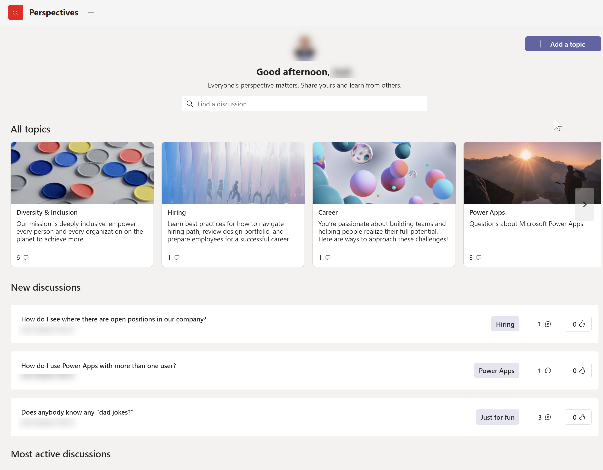
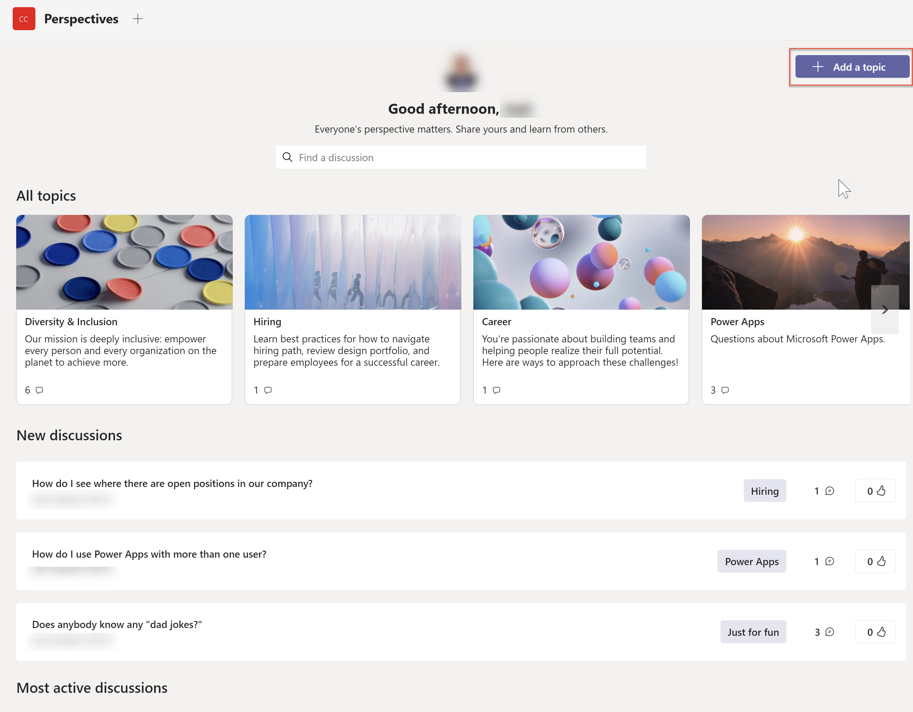
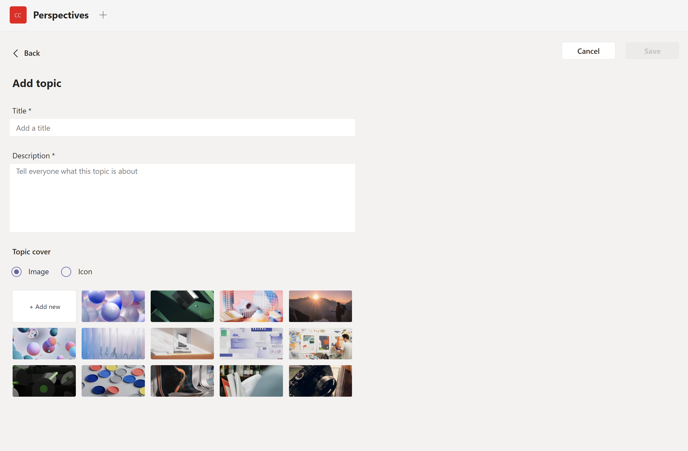
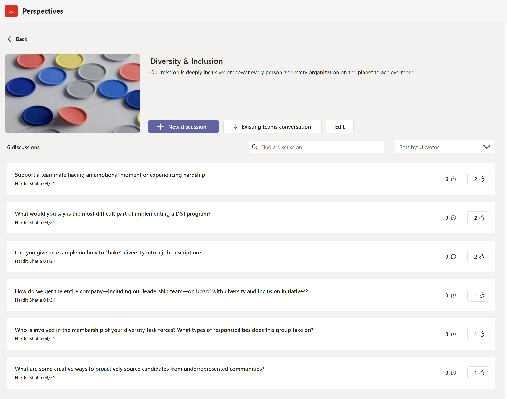
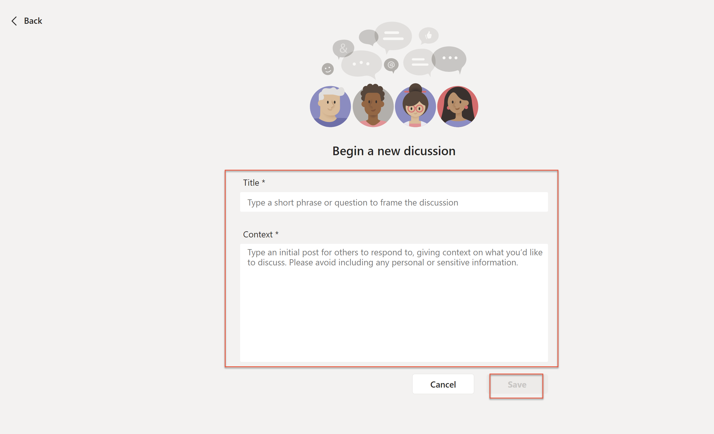
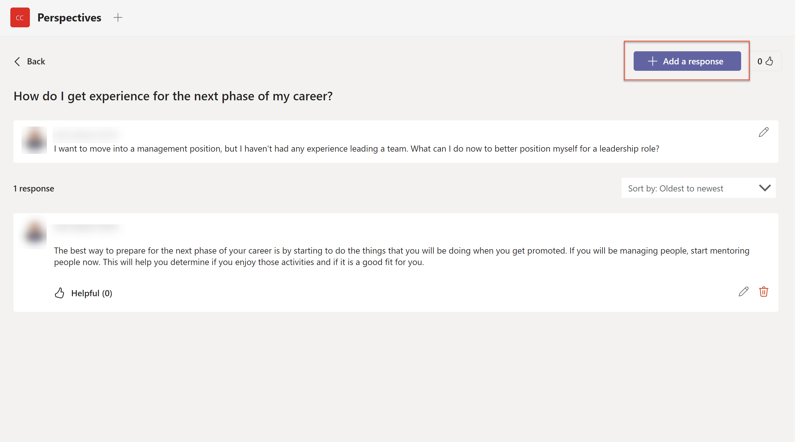
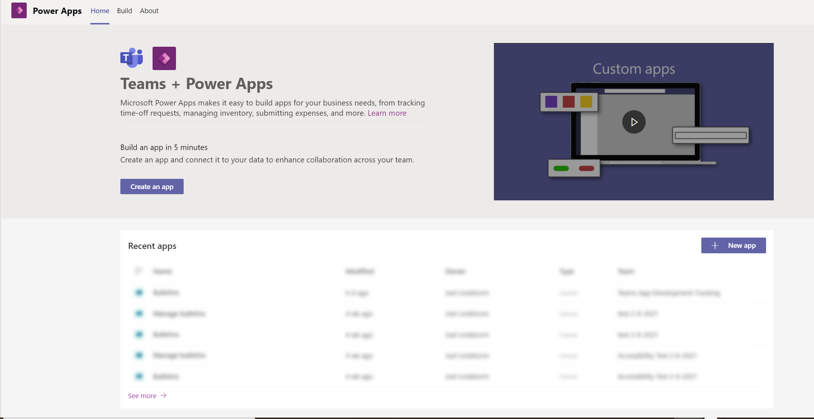
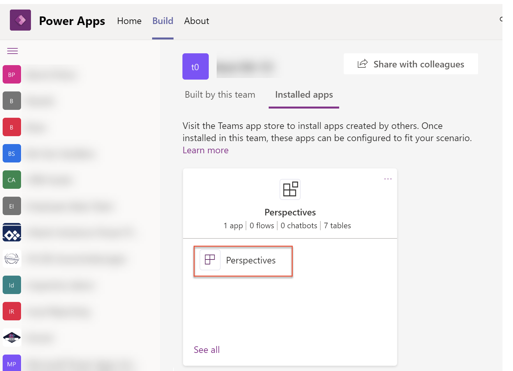

# Perspectives sample app

In this tutorial, you'll learn about configuring and using the **Perspectives** sample app.

## Overview

The Perspectives template app for Microsoft Teams provides a simple way to add topics and extend the topics with QA where anyone in the organization can have a perspective about the topic and have a discussion with the same in teams by adding the existing or new Teams Team to join

Benefits of using the Perspectives app:

-   Create discussions. 
-   Interact with colleagues.
-   Find interesting discussions.
-   Flag recommended discussions.

> [!NOTE]
> - Before you can use this app, you may be asked for your permissions to use the connection. More information: [Allow connections in sample apps](use-sample-apps-from-teams-store.md#step-1---allow-connections)
> - This app is available in three different Teams themes: Default, Dark and High contrast. When you [change the theme in Teams](https://support.microsoft.com/en-us/office/change-settings-in-teams-b506e8f1-1a96-4cf1-8c6b-b6ed4f424bc7), the app automatically updates to match the selected theme. More information: [Get the Teams theme using the Teams integration object](use-teams-integration-object.md#get-the-teams-theme)

> [!IMPORTANT]
>-   This is a preview feature.
>-   Preview features aren’t meant for production use and may have restricted functionality. These features are available before an official release so that customers can get early access and provide feedback.

## Prerequisites

Before using this app:

1. Install the app by side-loading the app manifest into Teams. You can get the app manifest at https://aka.ms/TeamsPerspectives.

2. Set up the app for the first use.

   

## Using Perspectives

In this section, you'll learn about the following capabilities in the Perspectives app:

- [Open the Perspectives app](#open-the-perspectives-app)
- [Understanding the Perspectives interface](#understanding-the-perspectives-interface)
- [Add a topic](#add-a-topic)
- [Find a topic](#find-a-topic)
- [View discussions](#view-discussions)
- [Add a discussion](#add-a-discussion)
- [Add a response](#add-a-response)
- [Edit a response](#edit-a-response)
- [Edit the Perspectives app in Power Apps](#edit-the-perspectives-app-in-power-apps)

## Open the Perspectives app

To open the Perspectives app:

1. Sign-in to Teams.

2. Select the Team in which the app is installed.

3. Select the channel where you installed the **Perspectives** app.

4. Select the **Perspectives** tab.

5. Select **Allow** if the app asks for your permissions to use the connectors.

## Understanding the Perspectives interface

The Perspectives app is a place to listen and be heard in your organization. A simple search-and-browse experience makes it easy to find interesting discussions, whether you're looking to share your perspective or tap into the collective knowledge of your team. The most relevant content rises to the top when team members upvote a response or the discussion's creator flags one as Recommended.  The app can be used for employee engagement, diversity and inclusion efforts, support systems, process Q&As, and more. 

 Let's explore the primary functions of the Perspectives app.

## Add a Topic

Do you have a topic that you would like to discuss? Add a topic to get started.

1. In Microsoft Teams, navigate to the team in which Perspectives is installed.

2. Select the Perspectives tab.

3. In right corner, click **Add a Topic**. 

4. Enter the Title 

5. Add Description

6. Select an Image or an Icon 

7. Click on **Save**

 

## Find a topic

If you want to find topics that interest you, you can search for them using the following steps:

1. In the Perspectives app, select the **Find a Topic** search field.

2. Type the name of the discussion you want to find.

3. Topics which match the search words will be displayed. Select the desired Topic.

## Edit a topic

If you want to change the name of a topic, you can rename it with the following steps:

1. Select a Topic.

2. Click on Edit. 

3. Change the title and description

4. Select the Image.

5.  Select **Save**.

## View discussions

You can view the discussions in a topic using the following steps:

1. From the Perspectives app, select a topic.
2.  View the discussions in the topic.

## Add a discussion

Within a topic, you can have multiple discussions. A discussion is a question or conversation starter. Other users respond to the discussion by adding perspectives.

 You can add new discussions using the following steps:

1. Select the Topic

2. Click on New Discussion

3. Enter Title.

4. Enter Context. 

5. Select **Save**.

  

 

## Add a response

Responses to discussions are displayed in a familiar conversation thread. You can add responses to a discussions using the following steps:

3. In the Boards app, select a topic..

4. Click on a discussion .

5. Click on **Add a response.**

6. Add relevant text to put your perspective for the discussion.

7. Click on **Add**. 
   

## Edit a response

You can Edit your response using the following steps:

1. In the Perspectives app, select a topic.

2. Click on a discussion.

3. Click on the Perspective which you have added.

4. Click on Edit.

5. Click on **Update** .  

​             

## Edit the Perspectives app in Power Apps

1.  In Microsoft Teams, add the Power Apps app from the Microsoft Teams store by selecting the elipses in the app menu, searching for Power Apps, and then selecting **install.**
2.  Right click on Power Apps icon and select **Pop out app** to open the app in a new window. This will ensure that you don't lose your changes if you navigate somewhere else in Microsoft Teams.
3.  Select **Build** tab.
4.  Select the team in which the Perspectives app is installed, then select **Installed apps.**
5.  In the Boards tile, select the Perspectives app to open it in Power Apps in Team.
6.  You may get prompted to authorize the app's connectors to connect. Select **Allow**.
7.  From here you can customize the app.

 

 

 