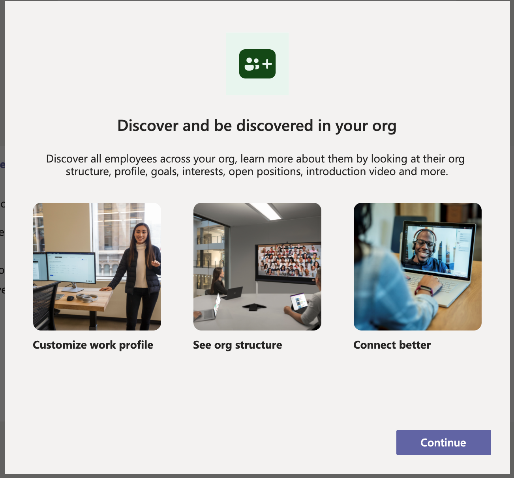
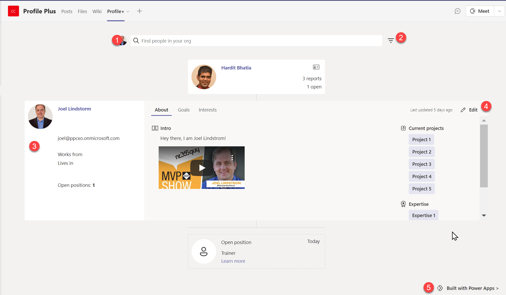
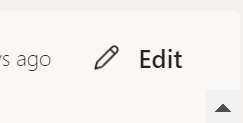
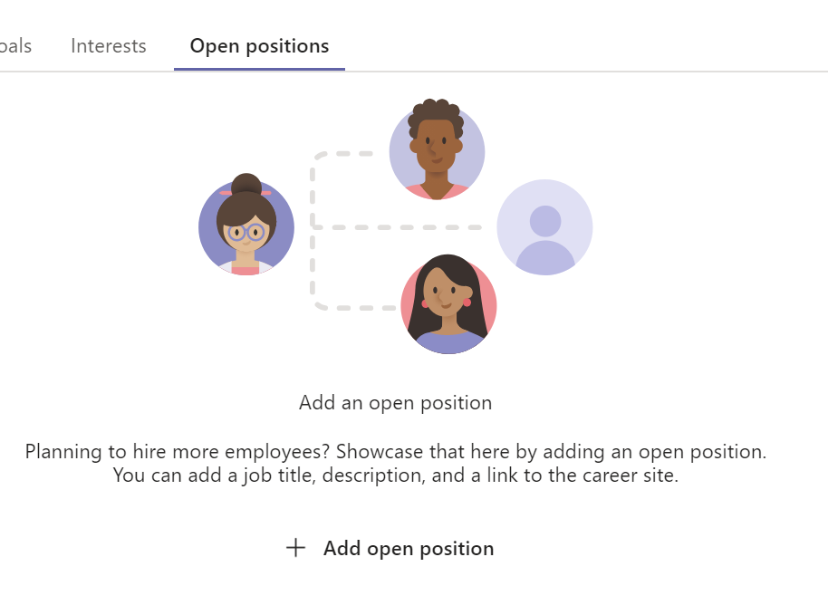
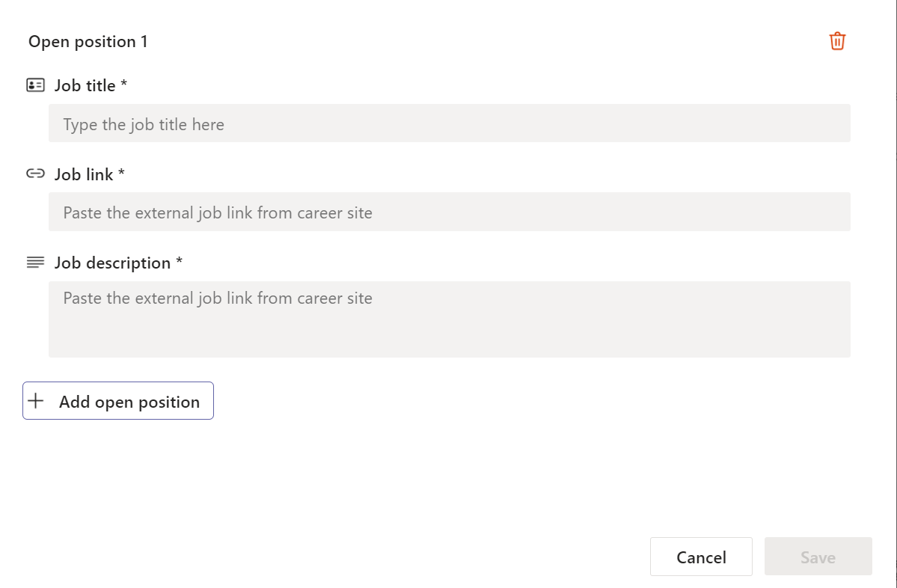
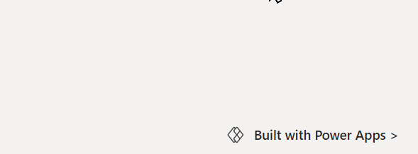
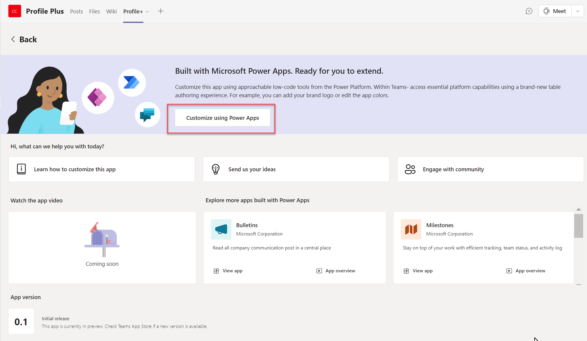
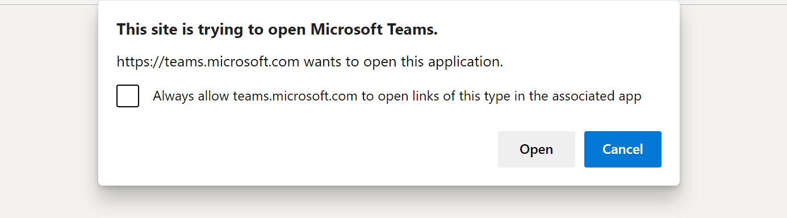

Overview
--------

The Profile+ template app for Microsoft Teams provides a simple way to browse
information about people in your organization and add additional detail to your
profile.

Benefits of using the Profile+ app:

-   Browse your organization hierarchy

-   View contact information for employees and colleagues

-   Add additional information about goals, related projects, and expertise

-   Create and view open positions

** Note**

-   Before you can use this app, you may be asked for your permissions to use
    the connection. More information: [Allow connections in sample
    apps](https://docs.microsoft.com/en-us/powerapps/teams/use-sample-apps-from-teams-store#step-1---allow-connections)

-   This app is available in three different Teams themes: Default, Dark and
    High contrast. When you [change the theme in
    Teams](https://support.microsoft.com/en-us/office/change-settings-in-teams-b506e8f1-1a96-4cf1-8c6b-b6ed4f424bc7),
    the app automatically updates to match the selected theme. More
    information: [Get the Teams theme using the Teams integration
    object](https://docs.microsoft.com/en-us/powerapps/teams/use-teams-integration-object#get-the-teams-theme)

** Important**

-   This is a preview feature.

-   Preview features aren’t meant for production use and may have restricted
    functionality. These features are available before an official release so
    that customers can get early access and provide feedback.

Prerequisites
-------------

Before using this app:

1.  Find the app in Teams store.

2.  Install the app.

3.  Set up the app for the first use.

For details about the above steps, go to [Use sample apps from the Teams
store](https://docs.microsoft.com/en-us/powerapps/teams/use-sample-apps-from-teams-store).

Open the Profile+ app
---------------------

To open the Milestones app:

1.  Sign-in to Teams.

2.  Select the Team.

3.  Select the channel where you installed the **Profile +** app.

4.  Select the **Profile +** tab.

5.  Select **Allow** if the app asks for your permissions to use the connectors.

6.  You can learn more about extending this app's capabilities on the splash
    screen. Select **Got it** to close the screen, and go to the app. To hide
    this message while opening this app again, select **Don't show this
    again** before you select **Got it**.

>   Graphical user interface, application Description automatically generated

Understand the Profile + interface
----------------------------------

The Profile + app gives you easy access to details about the people of your
company, details about their goals, projects, and open positions.

1.  **Search for people.** Find people in your organization

2.  **Filter profile.** Filter profiles based on projects and areas of
    expertise..

3.  **View your profile**

4.  **Edit your profile.**

    -   Add details about your position, including social media and interests

    -   Add tags for projects in areas of expertise

    -   Define goals

    -   Add a video with more information about your role

5.  **Edit the app in Power Apps**. Profile+ is build in Microsoft Power apps,
    and the app template can be edited using the Power Apps app in Microsoft
    Teams. Clicking the **Built with Power Apps** button will launch the Power
    Apps maker studio in Microsoft Teams, from which you can edit the Profile+
    app.

Search for a person
-------------------

To find a person in your organization, perform the following steps:

1.  Open Microsoft Teams and select the Team in which the Profile+ app is
    installed

2.  Select the **Profile+** tab

3.  Select the search field

4.  Type the name of the person you want to find

5.  People in your organization who match the search words will be displayed.
    Select the desired person.

6.  The profile of the selected person will be displayed. From this screen you
    can see information regarding the person’s goals, interests, projects, and
    areas of expertise. You can also view information about the selected
    person’s manager and people who report to the selected person, including any
    open positions.

Filter by project or expertise
------------------------------

You can filter the list of people in your organization based on project and area
of expertise. You can filter by project, expertise, or both project and
expertise.

1.  Select the filter button

2.  From the pop-up select project or expertise

3.  Click **Apply**

4.  People matching the selected filters will be displayed.

[./media/profile-app/image4.png](./media/profile-app/image4.png)
========================================

Edit your record
----------------

You can edit your record to add additional information about your goals,
projects, area of expertise, and interests.

1.  On your profile, click **Edit**

2.  Populate fields on the About, Goals, Interests, and Open Positions

3.  Click **Save**

Add an open position
--------------------

Open positions allow you to give visibility to positions needing to be filled,
making it easy for others in your organization to learn about open positions.

1.  Navigate to your profile

2.  Click **Edit**

3.  Open the **Open Positions** tab

4.  Click **Add open position**

5.  Enter the Job title, Job link, and Job description

6.  Click **Save**

Open positions now appear in Profile+ linked to the manager responsible for them

Edit the Profile+ app in Power Apps
-----------------------------------

1.  In Microsoft Teams, navigate to the team in which Profile+ is installed

2.  Open the Profile+ tab

3.  In lower right corner, click the **Built with Power Apps** app

4.  Click **Customize using Power Apps**

5.  A web browser will temporarily open, confirming if you wish to open the
    Power Apps Studio in Microsoft Teams. Click **Open**

6.  From the Maker Studio, open the Profile+ app to edit the app.

### See also

- [Customize sample apps](customize-sample-apps.md)
- [Sample apps FAQs](sample-apps-faqs.md)
- [Bulletins (Preview) sample apps](bulletins.md)
- [Employee ideas sample app](employee-ideas.md)  
- [Issue reporting sample apps](issue-reporting.md)
- [Milestones (Preview) sample app](milestones.md)
- [Use sample apps from the Microsoft Teams store](use-sample-apps-from-teams-store.md)

[!INCLUDE[footer-include](../includes/footer-banner.md)]
