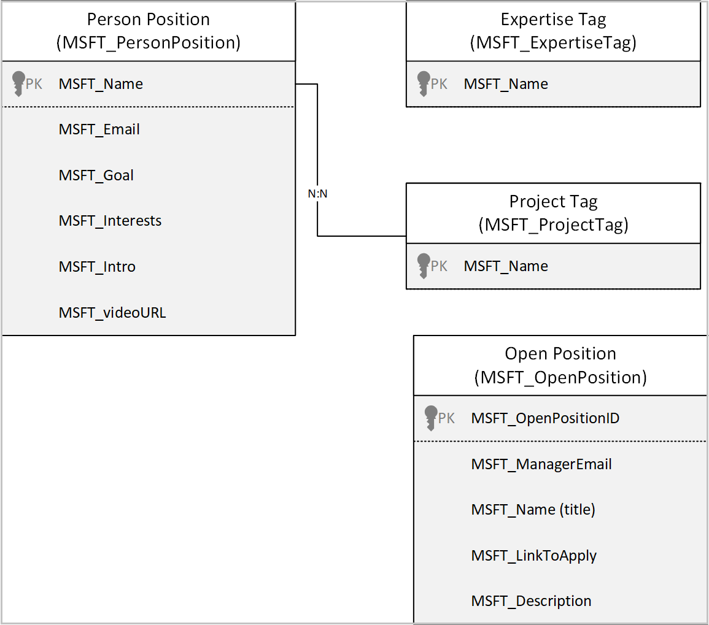

# Understand Profile+ sample apps architecture (preview)

[This article is pre-release documentation and is subject to change.]

In this article, you'll learn about the collections and global variables used by the [Profile +](profile-app.md) app, and understand how to use them effectively. If you want to learn more about how to install, and use the Inspection sample app instead, go to [Profile + sample apps](profile-app.md).

## Prerequisites

To understand and use information in this article, you'll need to know about different controls, features, and capabilities of canvas apps.

-   [Create and update a collection in a canvas app](../maker/canvas-apps/create-update-collection.md)
    
-   [Collect, Clear, and ClearCollect functions in Power Apps](../maker/canvas-apps/functions/function-clear-collect-clearcollect.md)
    
-   [Understand canvas-app variables in Power Apps](../maker/canvas-apps/working-with-variables.md)
    
-   [Add and configure a canvas-app control in Power Apps](../maker/canvas-apps/add-configure-controls.md)
    
-   [Add a screen to a canvas app and navigate between screens](../maker/canvas-apps/add-screen-context-variables.md)

You'll also need to know about how to [install](use-sample-apps-from-teams-store.md), and [use](profile-app.md) the
Profile + sample app.

## Application Data Flow

The following diagram shows the intersection of users, data, and systems.

The following connectors are used in the Issue Reporting app:

-   **Microsoft Dataverse** - Used to read and write data in Dataverse.

-   **Office 365 Users** - Used to read Microsoft 365 user profile data.

-   **Location** - Used to capture the user's location for Planner tasks.

-   **Microsoft Planner** - Used to create tasks.

## Data Model

## Tables

| Table name                | Description                                                                                                                                                                                                                                                                     |
|---------------------------|---------------------------------------------------------------------------------------------------------------------------------------------------------------------------------------------------------------------------------------------------------------------------------|
| Open Positions            | A table to store Open Positions. Details such as name, Manager Email, Description, and Link to Apply whom was it created or modified are stored under the Open entity.                                                                                                           |
| Expertise Tag             | An Expertise tag stores expertise records that are available to users to add to their profile.  Details such as name, the expertise tag unique ID to which it is associated to and the date when the expertise was created on, modified on are stored under Expertise entity.  |
| Project Tag               | A Project tags stores projects records that are available to users to add to their profile. Details such as the name, Project tag.                                                                                                                                              |
| Person Position           | Table to store people’s profile. Details such as intro, LinkedIn URL, Goal are stored under Person Position Entity.                                                                                                                                                             |
| Profile Plus User Setting | Table to store if a user has logged into the app or not and if they want others to send them requests details such as Name, Created By, Created On, Email is stored under User Settings Entity.                                                                                 |

## Collections

| Collection Name                     | Description                                                  | Screen Used                                                  |
| ----------------------------------- | ------------------------------------------------------------ | ------------------------------------------------------------ |
| colLocalization                     | Used to build a localization collection based on the user language. | OnStart property of the App                                  |
| colOldExpertise                     | Collection of expertise tags that were previously added by the user. | OnSelect Property of the Save My Profile button on the Profile Screen |
| colOpenPositions                    | Collection of all open positions.                            | OnSelect Property of the Add Open Positions on the Profile Screen |
| colFilteredProfiles                 | Collection of profiles returned by the selected filter.      | items property of galFilteredResults on the Profile Screen   |
| colFilteredProfileEmails            | Collection of emails of filtered profiles, used to populate colFilteredProfiles. | OnSelect property of the Apply button on the Profile Screen  |
| colFilteredProfileEmailsByExpertise | Collection of profile emails that have the selected expertise. | OnSelect property of the Apply button on the Profile Screen  |
| colFilteredProfileEmailsByProject   | Collection of profile emails that have the selected project. | OnSelect property of the Apply button on the Profile Screen  |
| colNewExpertise                     | Collection of new expertise tags that are  added by the user. | OnSelect Property of the Save My Profile Button on the Profile Screen |
| colFilteredUsers                    | Collection of filtered Users                                 |                                                              |
| colOldProjects                      | Collection of projects that were previously added by the user | OnSelect Property of the Save My Profile Button on the Profile Screen |
| colNewProjects                      | Collection of new projects that are added by the user.      | OnSelect Property of the Save button on the Profile screen   |
| colDeletedOpenPositions             | Positions being deleted by the user.                         | OnSelect Property of the Save My Profile button on the Profile Screen |
| colDirectReports                    | collection of direct reports of the selected user profile.   | OnSelect property of the Search Results button on the Profile Screen |
| colUserSettings                     | Collection of User Settings.                                 | OnSelect Property of the Save button on the Settings screen  |
| colCharWidth                        | Collection of width of characters.                           | OnStart property of the app                                  |
| colTeamMembers                      | collection of team members associated with  on the user who logged in. | OnSelect property of the Apply team member button on the Team Screen |
| colSelectedTeamMembers              | collection of selected team members.                         | OnSelect Property of the Start Team Members button           |
| colFilteredMembersEmailsByExpertise | Collection of team members filtered by expertise.            | OnSelect property of the Apply team member button on the Team Screen |
| colFilteredMembersEmailsByProject   | Collection of team members filtered with projects.           | OnSelect property of the Apply team member button on the Team Screen |
| colFilteredMembersEmails            | Collection of Team members filtered emails                   | OnSelect property of the Apply team member button on the Team Screen |
| colFilteredMembers                  | collection of filtered members                               | OnSelect property of the Apply team member button on the Team Screen |
| colSelectedProfiles                 | Collection of selected profiles.                             |                                                              |

## Global Variables

| Variable Name                   | Type    | Description                                                  |
| ------------------------------- | ------- | ------------------------------------------------------------ |
| gblAppLoaded                    | Boolean | To check whether the app is loaded.               |
| gblUserLanguage                 | Text    | To check the logged in user’s language.                      |
| gblHasProfileLoaded             | Table   | Used to store character width for different fonts, weights, and sizes. |
| gblThemeDark                    | Boolean | To check whether the Teams theme is set to dark.             |
| gblThemeHiCo                    | Boolean | To check whether the Teams theme is set to high contrast.    |
| gblMobileMode                   | Boolean | Variable to check whether the app is running on mobile.      |
| gblAppSetting_inputMobileOnWeb  | Boolean | Variables to scale fonts for mobile-oriented apps, running in desktop. |
| gblAppSetting_inputScaleFontsby | Number  | Use this variable for scaling all fonts by a fixed amount.   |
| gblFirstRun                     | Boolean | To check whether the app is being run for the first time.    |
| gblRecordUserSettings           | Record  | Variable to use the oldest record in case multiple records exist. |
| gblAppSetting_inputMobile       | Boolean | Variables to scale fonts for mobile-oriented apps.           |
| gblAppColors                    | Record  | Variable to set the color value in the app.                  |
| gblAppSizes                     | Record  | Variable to set the color value in the app.                  |
| gblAppStyles                    | Record  | Variable to set the styling values in the app.               |
| gblProject                      | Record  | Variable to store a project record that is in context.      |
| gblIsTeamsContext               | Boolean | Variable to check context of group of teams.                 |
| gblHasTeamLoaded                | Boolean | Variable to check the team has loaded.            |

### App OnStart

This section explains the collections, variables, and execution details used on start of the app.

##### OnStart collections

| **Collection name** | **Description**                                                     |
|---------------------|---------------------------------------------------------------------|
| colLocalization     | Collection of localized text based on user's language.              |
| colCharsWidth       | Collection of widths for each character used for auto width labels. |

##### OnStart variables

| **Variable name**                | **Description**                                                             |
|----------------------------------|-----------------------------------------------------------------------------|
| gblAppLoaded                     | Global variable to check if the app has loaded completely.                  |
| gblHasProfileLoaded              | Global variable to check if the user profile is loaded                      |
| gblUserLanguage                  | Global variable to store the user's language.                               |
| gblThemeDark                     | Global variable to store if Teams is running in dark mode.                  |
| gblThemeHiCo                     | Global variable to store if Teams is running in contrast mode.              |
| gblMobileMode                    | Global variable to store if the app is being accessed from a mobile device. |
| gblAppSetting_inputMobileOnWeb   | Global variable to scale fonts for mobile.                                   |
| gblAppSetting_inputMobile        | Global variable to scale fonts for mobile.                                   |
| gblAppSetting_inputScaleFontsBy  | Global variable for scaling all fonts by a fixed amount.                    |
| gblCurrUserEmail                 | Global variable to store the current user email address.                     |

##### OnStart execution details

1.  When a user accesses the app, **gblAppLoaded** is set to false. The user profile loading **gblHasProfileLoaded** is set to false. The user’s language
    code is stored in **gblUserLanguage**, with English - US being the default one.
    
2.  The user’s language is then used to collect localized text used throughout the app (for example, label and button text) in **colLocalization**.
    
3.  The label’s auto width is calculated and stored in **colCharsWidth**

4.  The user’s Teams theme/mode is checked to see if the theme is default, dark or high contrast. The **gblThemeDark** and **gblThemeHiCo** variables are
    set accordingly.

### Navigating to Profile Screen/ Team Screen

This section explains the collections, variables, and execution details used when navigating to the profile and team screens.

#### Profile screen navigation collections

No collections are used when navigating to the profile screen.

#### Profile screen navigation variables

The following variables are used when navigating to the profile screen.

| **Variable name**       | **Description**                                                                                            |
|-------------------------|------------------------------------------------------------------------------------------------------------|
| gblIsTeamsContext       | Global variable to store and show the team or org structure data in profile screen.                        |
| gblAppLoaded            | Global variable to check if the app has loaded completely.                                                 |
| gblAppStyles            | Global variable to store styling properties for all controls (set on the OnVisible of the Loading Screen). |
| gblAppContext           | Global variable to check the context of where the app is running.                                          |
| gblFirstRun             | Global variable to check whether the app is being run for the first time.                                  |
| gblRecordUserSettings   | Global variable to store the latest Project User Settings records for the current user.                    |
| locShowFirstRun         | Local variable to indicate if the current run of the app is the first run for the user.                    |
| locShowPowerAppsPrompt  | Local variable to indicate if the user has set the preference to see the Power Apps prompt to yes or no.   |

##### Profile screen navigation execution details

1.  If **gblAppLoaded** is true (which means the app’s OnStart has completed), **gblAppStyles** is not blank (which means the styling variable has been
    loaded), and **gblAppContext,** **gblIsTeamsContext** is true (which means the app is being accessed from within organization or Teams), then the user
    is navigated to the:
    -   Profile Screen if the hostClientType (device being used to access the app) is an Android or iOS.
        
    -   Team Screen if the hostClientType is not Android of iOS. Two variables are passed while navigating to the Team Screen:
        
        1.  **locShowFirstRun**: If the current run is the first run of the app as indicated by **gblFirstRun**, this is set to true, if not, then
            false.
            
        2.  **locShowPowerAppsPrompt:** If the latest Project User Settings record for the current user (stored in **gblRecordUserSettings**)
            has a value of Yes for ‘Display Splash (Power Apps)’ column, then this is set to true, if not, then false.
    
2.  If **gblAppContext** is false, then the user is navigated to the Welcome Dialog Screen.

### Profile Screen

#### Displaying the Welcome Dialog

The following execution details are used when displaying the welcome dialog.

##### Welcome dialog execution details

1.  The first screen will show only once when any user opens the app for the first time to show the detailed view about the app and once the user selects **Continue** the second screen will be shown on how the app has been created and two options are available.
    
2.  Don’t show this again once you check the user settings will be updated to not show this pop up and if the user doesn’t select the check box and
    select **Got it** then this pop up will be shown each time

#### Displaying the Organization structure

This section explains the collections, variables, and execution details are used
when displaying the organization structure.

##### Organization structure collections

The following collections are used when displaying the organization structure.

| **Collection name** | **Description**                                               |
|---------------------|---------------------------------------------------------------|
| colocalization      |  Collection of localized text based on user's language.       |
| colDirectReports    |  Collection of direct reporters of the selected user profile. |

##### Organization structure variables

The following variables are used when displaying the organization structure.

| Variable name                 | Description                                                                             |
|-------------------------------|-----------------------------------------------------------------------------------------|
| locSelectedProfilesEmail      | Local variable to store the selected profile email.                                     |
| locScreenReaderAnnouncedText  | Local variable to start the announcement of screen reader.                               |
| locShowConnectOptions         | Local variable to show the connections available for the user to connect with.           |
| locSelectedPerson             | Local variable to store the user profile.                                                |
| locFilterProfile              | Local variable to store the profile filter.                                             |
| locFilterApplied              | Local variable to store the profile filter.                                             |
| locProjectFilterChanged       | Local variable to store the project changed in the filter.                               |
| locExpertiseFilterChanged     | Local variable to store the expertise changed in the filter.                             |
| locProjectFilterSelected      | Local variable to store the project selected in the filter.                              |
| locExpertiseFilterSelected    | Local variable to store the expertise selected in the filter.                            |
| locProfileForViewing          | Local variable to store the profile selected for viewing.                                |
| locViewProfile                | Local variable to store the profile.                                                     |
| locViewProfileDetails         | Local variable to store the profile details.                                             |
| locViewingSearchResult        | Local variable to show the matching results after the search.                            |
| locSetFocusTimerStart         | Local variable to set the focus timer start based on a control.                          |
| locSetFocusControlTarget      | Local variable to save the control.                                                      |
| locSelectedPersonManager      | Local variable to store the manager of the user profile.                                 |
| locSelectedPersonProfile      | Local variable to store the user email address.                                         |
| locSelectedPersonHasManager   | Local variable to store as true if the user has manager else false.                     |
|  locShowFirstRun              | Local variable to indicate of the current run of the app is the first run for the user. |

##### Organization structure execution steps

1.  User Profile is displayed in this screen with all the details like About, Goals and Interests of the employee
    
2.  The galleries that list projects, Expertise’s, filtered results and direct reports and search results are:
    -   **galSelectedPersonExpertise** on the Profile Screen

    -   **galSelectedPersonCurrentProjects** on the Profile Screen

    -   **galFilteredResults** on the Profile Screen

    -   **galDirectReports** on the Profile Screen

    -   **galSearchResults** on the Profile Screen

3.  Selecting a profile photo card it will set the selected profile in **locSelectedPerson** and show the selected profile.
    
4.  The user profile will show the department and the place the user lives that are stored in **locViewProfileDetails**
    
5.  The current and existing projects will be stored in **galSelectedPersonCurrentProjects,** the expertise’s of the user/selected
    profile is stored in **galSelectedPersonExpertise.**
    
6.  Selecting the edit icon will show the editmyprofile screen where the user can update their goals, interests and about the employees this functionality
    will work only for the current user profile not for other selected profiles
    
7.  The profile screen will show the direct reports of the user and the employee reports which are shown in **galDirectReports**.

#### View Profile

This section explains the collections, variables, and execution details are used when viewing profile records.

##### Profile view collections

The following collection is used when viewing profiles.

| **Collection name** | **Description**                                        |
|---------------------|--------------------------------------------------------|
| colocalization      | Collection of localized text based on user's language. |

##### Profile view variables

The following variables are used when viewing profiles.

| **Variable name**             | **Description**                                               |
|-------------------------------|---------------------------------------------------------------|
| locProfileForViewing          | Local variable to store the profile selected for viewing.      |
| locViewingSearchResult        | Local variable to show the matching results after the search. |
| locViewProfileDetails         | Local variable to store the profile details.                  |
| locScreenReaderAnnouncedText  | Local variable to start the announcement of screen reader.    |

##### Profile view execution details

1.  The View profile is part of the **Profile Screen** which displays the selected user’s profile, the view profile shows the about, goals, and interests of the selected profile.
    
2.  The gallery **galViewProfileExpertise** shows the expertise the user has.

3.  The gallery **galViewProfileCurrentProjects** shows the current and previous projects the selected user has worked on

#### Filter Profile

This section explains the collections, variables, and execution details used
when filtering profiles.

##### Profile filtering collections

The following collections are used when filtering profiles.

| **Collection name**                  | **Description**                                                                 |
|--------------------------------------|---------------------------------------------------------------------------------|
| colFilteredProfiles                  | Collection of filtered profile.                                                 |
| colFilteredProfileEmailsByProject    | Collection of profile emails that have the selected project.                     |
| colFilteredProfileEmailsByExpertise  | Collection of profile emails that have the selected expertise.                   |
| colFilteredProfileEmails             | Collection of emails of filtered profiles, used to populate. colFilteredProfiles |
| colLocalization                      | Collection of localized text based on user's language.                          |

##### Profile filtering variables

The following variables are used when filtering profiles.

| **Variable name**             | **Description**                                                                                            |
|-------------------------------|------------------------------------------------------------------------------------------------------------|
| gblAppStyles                  | Global variable to store styling properties for all controls (set on the OnVisible of the Loading Screen). |
| locFilterProfile              | Local variable to store the profiles filter.                                                               |
| locFilterApplied              | Local variable to store the profiles filter.                                                               |
| locTagSelected                | Local variable to store the projects selected.                                                             |
| locSetFocusTimerStart         | Local variable to set the focus timer start based on a control.                                            |
| locSetFocusControlTarget      | Local variable to save the control.                                                                        |
| locScreenReaderAnnouncedText  | Local variable to start the announcement of screen reader.                                                 |

##### Filtering profile execution details

There are three options available:

-   Filter by project that shows the list of users who have worked in the project.
    
-   Filter by expertise that shows the list of users who have the same expertise.
    
-   Filter by project and expertise that shows the list of users who had worked in the project and filter the data with the expertise.

#### Edit My Profile

This section explains the collections, variables, and execution details used
when editing a profile.

##### Profile editing collections

The following collections are used when editing a profile.

| **Collection name**      | **Description**                                                                                                                    |
|--------------------------|------------------------------------------------------------------------------------------------------------------------------------|
| colOpenPositions         | Collection of all work items for the selected project.                                                                             |
| colLocalization          | Collection of widths for each character used for auto width labels.                                                                |
| colNewProjects           | Collection of new projects that are going to be added by the user and the new projects that are going to be created by user.     |
| colOldProjects           | Collection of projects that are previously added by the user.                                                                     |
| colNewExpertise          | Collection of new expertise that are going to be added by the user and the new expertise that are going to be created by user. |
| colOldExpertise          | Collection of expertise that are previously added by the user.                                                                  |
| colDeletedOpenPositions  | Positions that are going to be deleted by the user will be stored.                                                                |
| colDirectReports         | Collection of direct reporters of the selected user profile.                                                                       |
##### Profile editing variables

The following variables are used when editing a profile.

| Variable name                 | Description                                                                                                |
|-------------------------------|------------------------------------------------------------------------------------------------------------|
| locAddOpenPosition            | Local variable to store the new position.                                                                  |
| gblAppStyles                  | Global variable to store styling properties for all controls (set on the OnVisible of the Loading Screen). |
| locOpenPositionsEdited        | Local variable to control the open positions edited now.                                                   |
| locScreenReaderAnnouncedText  | Local variable to start the announcement of screen reader.                                                 |
| locSelectedPersonProfile      | Local variable to control visibility of work item filter dialog.                                           |
| locEditProfile                | Local variable to control if selected filters should be applied to work items.                             |
| locAboutEdited                | Local variable to control the text in the about space edited.                                              |
| locProjectsChanged            | Local variable to control the projects changed or updated.                                                 |
| locExpertiseChanged           | Local variable to control the expertise changed or updated.                                                |
| locGoalsEdited                | Local variable to control the goals changed or updated.                                                    |
| locInterestsEdited            | Local variable to control the interests changed or updated.                                                |
| locOpenPositionsEdited        | Local variable to control the interests changed or updated.                                                |
| locAddOpenPosition            | Local variable to add new open position and store.                                                         |

##### Profile editing execution details

Editing or updating the details of the current user to change or update the projects/expertise, goals and interests in **galOpenPositions** ,
**colOldProjects , colOldExpertise.**

-   Updating the intro text, intro video url and linked url will be updated to person positions entity.
    
    -   Updating the Goals, Interests that are going to be updated in the person positions entity.

#### View Open Position

This section explains the collections, variables, and execution details that are used when an open position is viewed.

##### Open position collections

The following collections are used when an open position is viewed.

| **Collection name** | **Description**                                        |
|---------------------|--------------------------------------------------------|
| colLocalization     | Collection of localized text based on user's language. |

##### Open position variables

The following variables are used when an open position is viewed.

| **Variable name**         | **Description**                                                                                            |
|---------------------------|------------------------------------------------------------------------------------------------------------|
| gblAppStyles              | Global variable to store styling properties for all controls (set on the OnVisible of the Loading Screen). |
| locSelectedPersonProfile  | Local variable to control visibility of work item filter dialog.                                           |
| locViewOpenPosition       | Local variable to control the data of the open positions.                                                   |

##### Open position execution details

Select the open position and the open positions will be visible that are created by the user stored in **locViewOpenPosition.**

### Team Screen

This section explains the collections, variables, and execution details used on the team screen.

#### Welcome Team

##### Welcome team execution details

1.  The first screen will show only once when any user opens the app for the first time to show the detailed view about the app and once the user selects **Continue** the second screen will be shown on how the app has been created and two options are available.
    
2.  Don’t show this again once you check the user settings will be updated to not show this pop up and if the user doesn’t select the check box and
    select **Got it** then this pop up will be shown each time

#### Team Members

This section explains the collections, variables, and execution details used
when displaying team members.

##### Team member collections

The following collections are used when viewing team members.

| **Collection name**     | **Description**                                                                                         |
|-------------------------|---------------------------------------------------------------------------------------------------------|
| colLocalization         | Collection of localized text based on user's language.                                                  |
| colSelectedTeamMembers  | Collection of selected team members who are selected.                                                   |
| colFilteredMembers      | Collection to store the filtered members that were selected by filtering the name of the team members. |
| colTeamMembers          | Collection of team members based on the user who logged in.                                             |

##### Team member variables

The following variables are used when viewing team members.

| Variable name                 | Description                                                                                                |
|-------------------------------|------------------------------------------------------------------------------------------------------------|
| locTagSelected                | Local variable to store the projects selected.                                                             |
| locProjectFilterSelected      | Local variable to store the project selected in the filter.                                                |
| locExpertiseFilterSelected    | Local variable to store the expertise selected in the filter.                                              |
| locFilterApplied              | Local variable to store the profiles filter.                                                               |
| locScreenReaderAnnouncedText  | Local variable to start the announcement of screen reader.                                                 |
| locSelectedTeamMembersEmail   | Local variable to store the selected team members email address.                                           |
| locShowConnectOptions         | Local variable to store the connection options chat, schedule a meeting.                                   |
| locNavFromTeam                | Local variable to store the Boolean value to navigate from team.                                           |
| locTeamMemberForViewing       | Local variable to control the team member for viewing the profile.                                         |
| locViewTeamMember             | Local variable to control the team member for viewing the profile.                                         |
| locViewTeamMemberDetails      | Local variable to store the team members details.                                                          |
| locSetFocusTimerStart         | Local variable to set the focus timer start based on a control.                                            |
| locSetFocusControlTarget      | Local variable to save the control.                                                                        |
| locDefaultProfileId           | Local variable to store the logged in user profile ID.                                                     |
| gblAppStyles                  | Global variable to store styling properties for all controls (set on the OnVisible of the Loading Screen). |
| gblHasProfileLoaded           | Local variable to control the user profile loading.                                                        |

##### Team member execution details

1.  The Team screen has options to connect with chat and schedule a team meeting

2.  User can select any team member profile and investigate the details of the profile
    
3.  User can **Select people to connect with** option to select multiple team members and option to choose to **Start a chat** or **Schedule a meeting**
    which are shown through the gallery item **galTeamMembers**
    
4.  User can find the team member by entering the name of the team member in **txtFindTeamMembers** which will filter the data and store the data in
    **colFilteredMembers**

#### Filter Team Members

This section explains the collections, variables, and execution details used
when team members are filtered

##### Team member filter collections

| **Collection name**                 | **Description**                                                               |
|-------------------------------------|-------------------------------------------------------------------------------|
| colFilteredMembers                  | Collection of filtered members.                                               |
| colFilteredMemberEmailsByProject    | Collection of member emails that have the selected project.                   |
| colFilteredMemberEmailsByExpertise  | Collection of member emails that have the selected expertise.                 |
| colFilteredMemberEmails             | Collection of emails of filtered member, used to populate colFilteredMembers. |
| colLocalization                     | Collection of localized text based on user's language.                        |

##### Team member filter variables

| **Variable name**             | **Description**                                                                                            |
|-------------------------------|------------------------------------------------------------------------------------------------------------|
| gblAppStyles                  | Global variable to store styling properties for all controls (set on the OnVisible of the Loading Screen). |
| locFilterProfile              | Local variable to store the profiles filter.                                                               |
| locFilterApplied              | Local variable to store the profiles filter.                                                               |
| locTagSelected                | Local variable to store the projects selected                                                              |
| locSetFocusTimerStart         | Local variable to set the focus timer start based on a control                                             |
| locSetFocusControlTarget      | Local variable to save the control                                                                         |
| locScreenReaderAnnouncedText  | Local variable to start the announcement of screen reader                                                  |

##### Team member filter execution details

>   There are 3 options available:

-   Filter by project that shows the list of members who had or working in the project mentioned.
    
-   Filter by expertise that shows the list of members who have the expertise mentioned.
    
-   Filter by project and expertise that shows the list of members who had worked in the project and filter the data with the expertise mentioned.

#### View Team Members

This section explains the collections, variables, and execution details are used when team members are viewed.

##### View team members collections

The following collection is used when team members are viewed.

| **Collection name** | **Description**                                        |
|---------------------|--------------------------------------------------------|
| colocalization      | Collection of localized text based on user's language. |

##### View team member variables

The following variables are used when team members are viewed.

| **Variable name**             | **Description**                                                                                            |
|-------------------------------|------------------------------------------------------------------------------------------------------------|
| locProfileForViewing          | Local variable to store the profile selected for viewing.                                                  |
| locViewingSearchResult        | Local variable to show the matching results after the search.                                              |
| locViewProfileDetails         | Local variable to store the profile details.                                                               |
| locScreenReaderAnnouncedText  | Local variable to start the announcement of screen reader.                                                 |
| gblHasProfileLoaded           | Local variable to control the user profile loading.                                                        |
| locNavFromTeam                | Local variable to store the Boolean value to navigate from team.                                           |
| locDefaultProfileId           | Local variable to store the logged in user profile ID.                                                     |
| locTeamMemberForViewing       | Local variable to control the team member for viewing the profile.                                         |
| gblCurrUserEmail              | Global variable to store the current user email.                                                           |
| gblAppStyles                  | Global variable to store styling properties for all controls (set on the OnVisible of the Loading Screen). |

##### View team member execution variables

-   The View Team Member is part of the **Team Screen** which displays the selected user’s profile, the view profile shows the About, Goals, Interests
    of the selected profile.
    
-   By selecting profile of the team member the screen will navigate to profile screen that will setup the value as true in **locNavFromTeam**

### About Screen

This section explains the collections, variables, and execution details used by processes on the about screen.

#### Navigation

This section explains the collections, variables, and execution details used when navigating the about screen.

##### About screen navigation collections

The following collection is used when navigating the about screen.

| **Collection name** | **Description**                                        |
|---------------------|--------------------------------------------------------|
| colocalization      | Collection of localized text based on user's language. |

##### About screen navigation variables

The following variable is used when navigating the about screen.

| **Variable name** | **Description**                                                                                            |
|-------------------|------------------------------------------------------------------------------------------------------------|
| gblAppStyles      | Global variable to store styling properties for all controls (set on the OnVisible of the Loading Screen). |

##### About screen navigation execution details

Selecting the back button on the **conNavigtion_About** container navigates back to the Team Screen.

#### Body

This section explains the collections, variables, and execution details used in the body of the about screen.

##### About screen body collections

The following variable is used in the body of the about screen.

| **Collection name** | **Description**                                        |
|---------------------|--------------------------------------------------------|
| colLocalization     | Collection of localized text based on user's language. |

##### Variables involved

| **Variable name** | **Description**                                                                                            |
|-------------------|------------------------------------------------------------------------------------------------------------|
| gblAppStyles      | Global variable to store styling properties for all controls (set on the OnVisible of the Loading Screen). |

##### Detailed steps

Selecting the links the websites will launch Microsoft documentation about the app.

### Admin screen

This section explains the collections, variables, and execution details used in the admin screen.

##### Admin screen collections

The following collection is used in the Admin screen.

| **Collection name** | **Description**                                        |
|---------------------|--------------------------------------------------------|
| colLocalization     | Collection of localized text based on user's language. |

##### Admin screen variables

The following variable is used in the Admin screen.

| **Variable name** | **Description**                               |
|-------------------|-----------------------------------------------|
| gblUserLanguage   | Global variable to store the user's language. |

##### Admin screen execution details

Admin Screen has toggles to change the user language and settings of Dark Mode or High Contrast.

### See also

- [Profile+ (preview) sample app](profile-app.md)
- [Customize sample apps](customize-sample-apps.md)
- [Sample apps FAQs](sample-apps-faqs.md)
- [Use sample apps from the Microsoft Teams store](use-sample-apps-from-teams-store.md)
