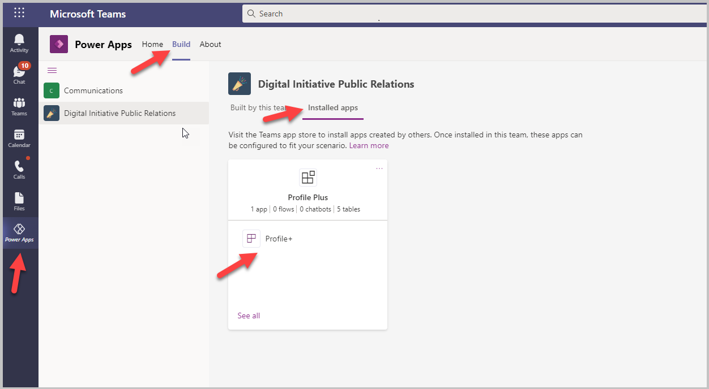
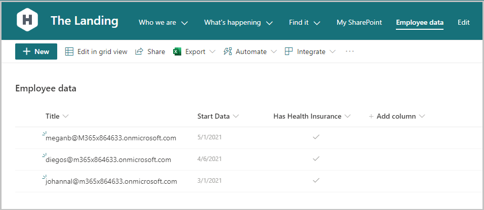
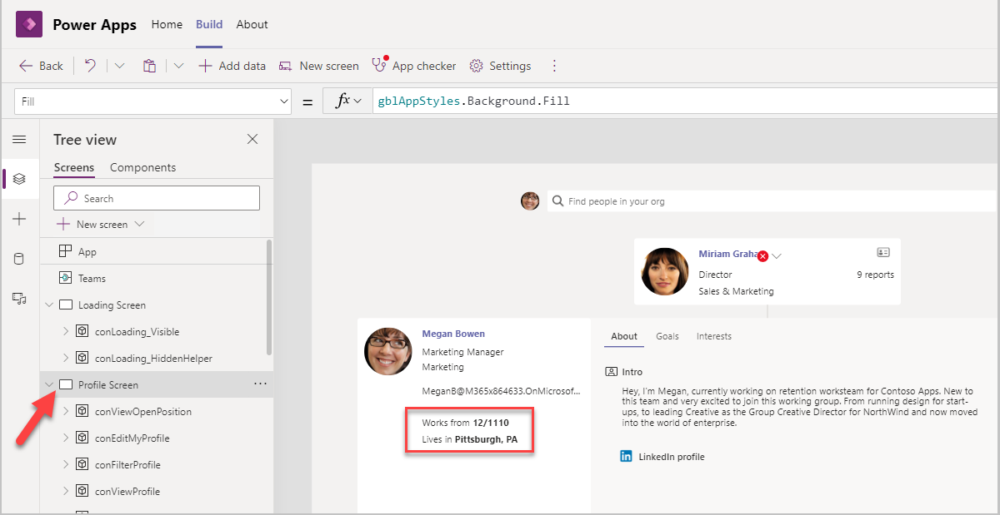
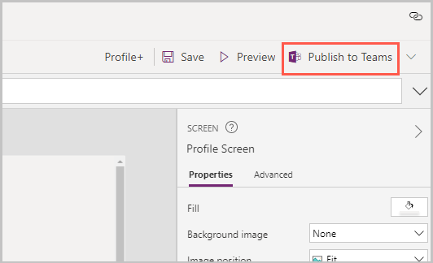
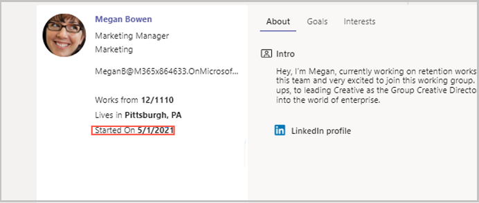

# Extend Profile+ app (Preview) with additional org-specific data

[This article is pre-release documentation and is subject to change.]

Profile+ solution helps you quickly look up colleagues, understand org structure and roles, and learn about open positions. You can update your profile right from within Microsoft Teams and express your personality by adding an introduction and even a video. You can add additional information that will help colleagues to know you better – such as your current projects, areas of expertise, goals, and interests. The ability to filter by project and expertise creates new opportunities for like-minded people to find one another and connect.

But what if you want to add data from another source that has additional information about the people in your organization? For example, you might have data in your accounting or HR system, and you can easily bring this data into the Profile + app.

In this article, we'll learn how to capture data from a different data source and display in the app. Power Apps can connect to hundreds of different data sources using out of the box connectors. In this tutorial, we'll pull data from a SharePoint list containing information about your employees, and display in the Profile+ app. This source could be any system that has employee data, such as your HR system or training database.

## Prerequisites

To complete this tutorial, you'll need the ability to sign in to Microsoft Teams, which will be available as part of select Microsoft 365 subscriptions. You'll also need to have the Profile+ sample app for Microsoft Teams installed. This app can be installed from https://aka.ms/TeamsProfilePlus.

> [!IMPORTANT]
> - This is a preview feature.
> - [!INCLUDE[cc_preview_features_definition](../includes/cc-preview-features-definition.md)]

## Log in into the Profile + app

1.  Select the Power Apps icon on the left. Right-click on Power Apps icon and select **Pop out app**.
2.  Go to the **Build** tab.
3.  Select **Installed apps**.
4.  Select Profile + to open the app.
5.  The Profile+ app opens.

## Add the data file as a data source connection to the app

Power Apps can connect to hundreds of different data sources. For this example, we'll use a SharePoint list that includes employee data.

To add this SharePoint list as a data source connection to the Profile + app:

1. Select Data from the left pane > **Add data** > **Connectors** > **SharePoint** > **Add a connection** (if SharePoint connection doesn't already exist) > select the option **Connect directly** > select the button **Connect**.
1.  Select the site, and then, select the SharePoint list that you want to connect to.

The SharePoint list shows up in the list of data sources

## Add data from the data source to the app

1.  Select the tree view from the left pane.
1.  Select the Profile screen.

    

1. Notice the two HTML text controls **Works from**  and **Lives in**. In our example, we'll replicate the HTML text and populate it with the **Started On** date from the SharePoint List.
1. Copy the HTML Text for **Works From** and paste it (copying it so that all the other properties are copied as well).
1. Update the following properties of the control:

   | Property   | Value                                                        |
   | ---------- | ------------------------------------------------------------ |
   | Name       | `htmSelectedPersonStartedOnDate`                               |
   | Y Position | `htmSelectedPersonResidence.Y + htmSelectedPersonResidence.Height – 5` |
   | HTMLText | `"Started On \<b\>" & Text(LookUp('Employee data', Title = locSelectedPerson.mail,'Start Date')) & "\</b\>"` |

1. Using the SharePoint connector and the Lookup function above, you're able to display data from the SharePoint List into the Profile + app.
1. Data from any connector can be pulled into the App with the method shown above.

### Publish the Profile+ app

All the changes to the Profile+ app are completed. The app can now be published by selecting the Publish to Teams button on the top right.

## Test the app

1.  On the Profile screen, once you make the change for the above listed scenario, select the **Preview** button to run the app.
1.  You should now see the new value **Started on** appear on the profile card.
1.  Make sure to check for responsiveness by shrinking the size of the screen when testing in the Window mode.

### See also

- [Profile+ (Preview) sample app](profile-app.md)
- [Customize sample apps](customize-sample-apps.md)
- [Sample apps FAQs](sample-apps-faqs.md)
- [Use sample apps from the Microsoft Teams store](use-sample-apps-from-teams-store.md)
