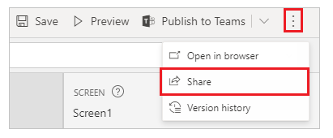
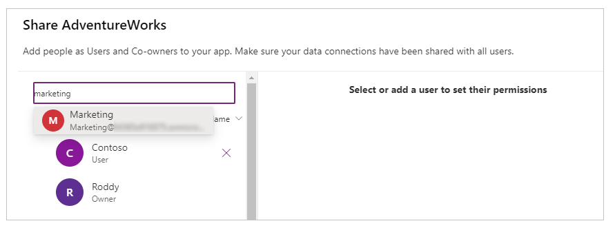
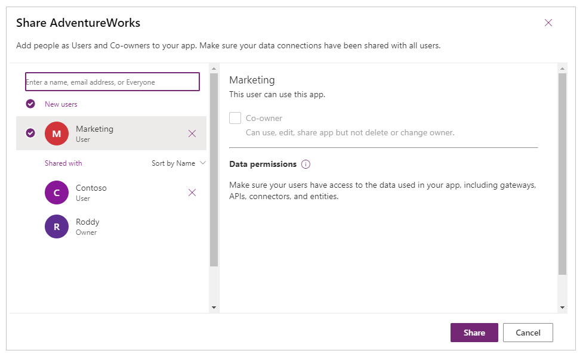

# Share and publish your app

[!INCLUDE [cc-beta-prerelease-disclaimer.md](../includes/cc-beta-prerelease-disclaimer.md)]

After you build a canvas app that addresses a business need, specify which users in your organization can run the app, and who can modify or even reshare it. Specify each user by name or specify a security group in Azure Active Directory. If everyone will benefit from your app, specify that your entire organization can run it.

When creating an app in Microsoft Teams, you need to share the app with the Microsoft 365 Group associated with the selected team.

## Share an app

To share an app, select  in the upper-right corner of Power Apps Studio, and then select **Share**.

If you haven't saved the latest changes to the app, you're asked to save it first. In the **Share** screen for the app, enter the Microsoft 365 Group name for the Teams team.

> [!TIP]
> If the Microsoft 365 Group you want to share the app with isn't available in the list, check whether the group is enabled for security. More information: [Share an app with Microsoft 365 Groups](../maker/canvas-apps/share-app.md#share-an-app-with-office-365-groups)

Select **Share**. When sharing the app with other users, you can also select **Co-owner** to make them co-owners of the app.

> [!IMPORTANT]
> When you share an app, some connections used by the app are *implicitly* shared&mdash;for example, a SQL Server connection saved with SQL Server<!--note from editor: Edit okay?--> or Windows authentication. Connections to Microsoft 365 applications, such as to OneDrive or a SharePoint site, are prompted for permissions at runtime to
connect within the context of the user that runs the app. More information: [Share app resources](../maker/canvas-apps/share-app-resources.md#connections)

More information: [Share an app](../maker/canvas-apps/share-app.md)

## Publish and add an app to Teams

Whenever you save changes to a canvas app, you automatically publish them only for yourself and anyone else who has permissions to edit the app. When you finish making changes, you must explicitly publish them to make them available to everyone the app is shared with.

### Publish and add an app to a Teams channel from Power Apps Studio

To publish an app, select **Publish to Teams** from the upper-right corner of Power Apps Studio.

Select **Next.** Publishing an app creates a new version of the app and makes the published version of the app available to everyone else the app is shared with.
<!--note from editor: Please fix the typo in this image ("Itenarary") -->

A list of all channels is displayed. You can add the app to one or more channels as a tab in the team.

Select **Add a tab** , and then select **Save.**

More information: [Publish an app](../maker/canvas-apps/save-publish-app.md#publish-an-app)

### Add a published app to a team's channel from Teams

If an app has been published and shared with the team, you can add it to your team's channel directly by selecting **Add a tab**.

To add a published app to your team:

1. Select the channel that you want to add the app to.

1. Select .
   
    

1. Select **Power Apps.**

   

1. Select the app that you want to add to the channel tab. By default, the **My apps** view appears, showing the apps you've created.

   

   If the app you're looking for isn't available in the **My apps** view, select a
  different view.

   

    -  **My apps**: Published apps that you've created.

    -  **All apps**: All published apps that you have access to.

    -  **Sample apps**: Sample app [templates](../maker/canvas-apps/get-started-test-drive.md) available in Power Apps by default.

    -  **Model driven apps**: All published model-driven apps shared with the selected team.

   You can also search for an app by name.

   

   When you select an app that you're an owner of, you're prompted to ensure the app is shared with the team before you add it to the channel's tab.

   

1. Select **Save**. The app is added to your selected channel as a tab.

   

You can now run the app in the Teams channel and switch across posts, files, wikis, and other options.

### See also

[Use sample apps from Teams store](use-sample-apps-from-teams-store.md)  
[Manage your apps](manage-your-apps.md)
