# Share an app

After you build a canvas app that addresses a business need, specify which users in your organization can run the app and which can modify and even reshare it. Specify each user by name or specify a security group in Azure Active Directory. If everyone would benefit from your app, specify that your entire organization can run it.

When creating an app inside Teams, you need to share the app with the Microsoft 365 Group associated for the selected team.

## Share an app

To share an app, select  button from the top-right side of the Power Apps Studio. And then, select **Share**.

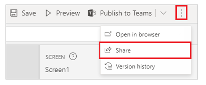

If you haven’t saved latest changes to the app, you’re asked to save first. In the share app screen, enter the name of the Teams team’s Microsoft 365 Group name.

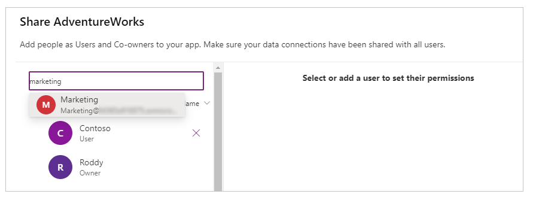

> [!TIP]
> If the Microsoft 365 Group you want to share the app with isn’t available in the list, check if the group is enabled for security. For more details, go to [share an app with Microsoft 365 Groups](../maker/canvas-apps/share-app.md#share-an-app-with-office-365-groups).

Select **Share** to share the app. When sharing the app with other users, you can also select **Co-owner** make them co-owners of the app.

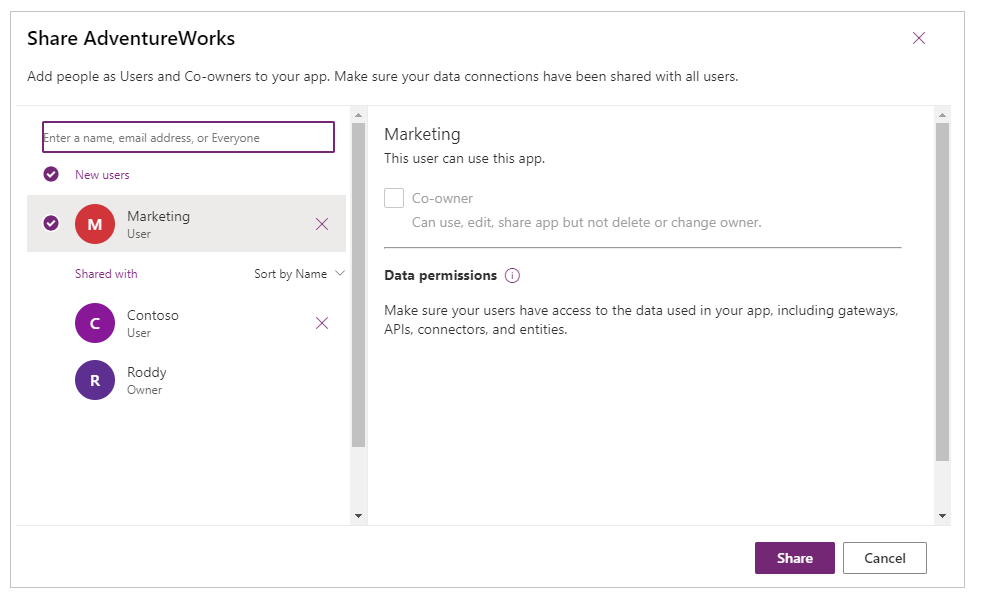

> [!IMPORTANT]
> When you share an app, some connections used by the app are **implicitly shared**. For example, SQL Server connection saved with SQL or Windows authentication. Connections to Microsoft 365 applications, such as to OneDrive or a SharePoint site, are prompted for permissions at runtime to
connect within the context of user that runs the app. For more information about sharing app resources, go to [share app resources](../maker/canvas-apps/share-app-resources.md#connections).

For more information about sharing an app, go to [share an app](../maker/canvas-apps/share-app.md).

## Publish and add an app to Teams

Whenever you save changes to a canvas app, you automatically publish them only for yourself and anyone else who has permissions to edit the app. When you finish making changes, you must explicitly publish them to make them available to everyone the app is shared with.

### Publish and add app to Teams channel from Power Apps Studio

To publish an app, select the **Publish to Teams** button from the top-right side of the Power Apps Studio.

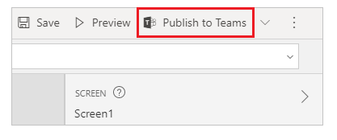

Select **Next.** Publishing an app creates a new version of the app and makes the published version of the app available to everyone else the app is shared with.

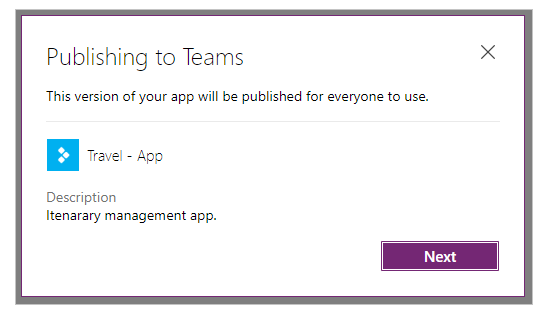

A list of all channels is displayed. You can add the app to one or more channels as a tab inside the team.

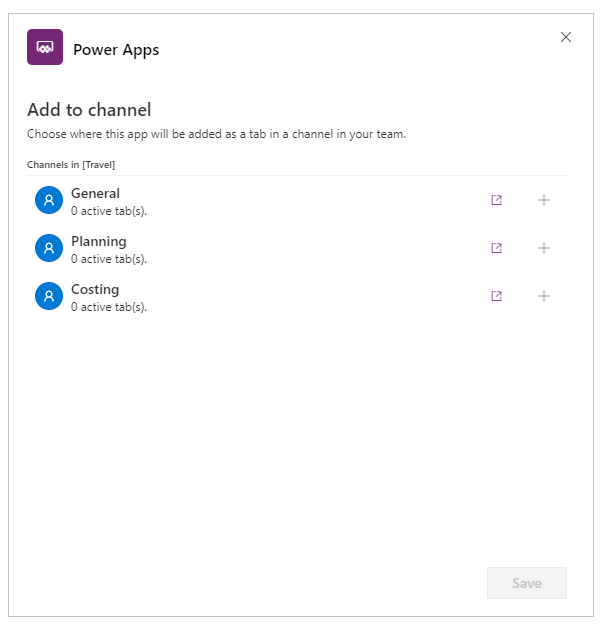

Select **+** to add the app as a tab and **Save.**

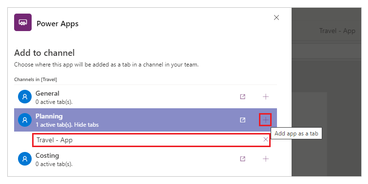

For more information about publishing an app and versions, go to [publish an app](../maker/canvas-apps/save-publish-app.md#publish-an-app).

### Add published app to Teams channel from Teams

You can add apps to your team’s channel directly using the **Add a tab** option if the app is published and shared with the team.

To add a published app to your team:

1. Select the channel that you want to add the app to.

1. Select 
   
    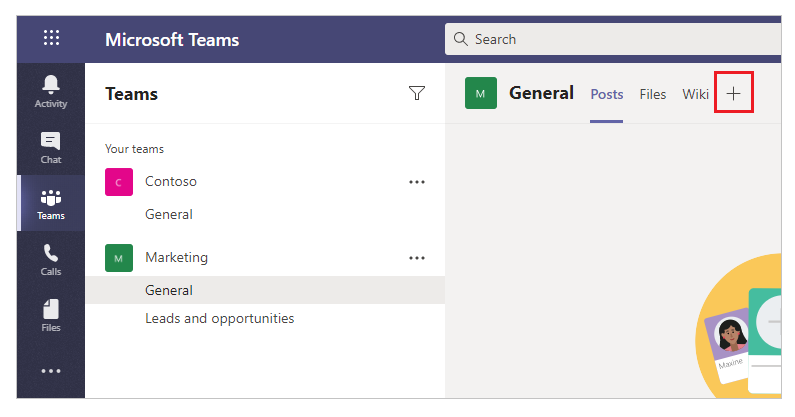

1. Select **Power Apps.**

   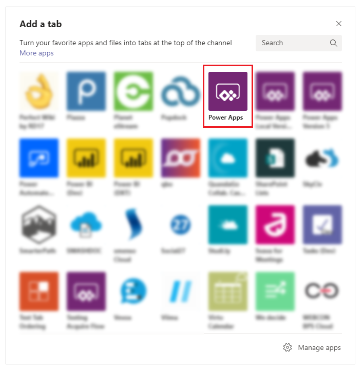

1. You can select the app that you want to add to the channel tab. The available apps by default show apps you’ve created, with the selected view as **My apps**.

   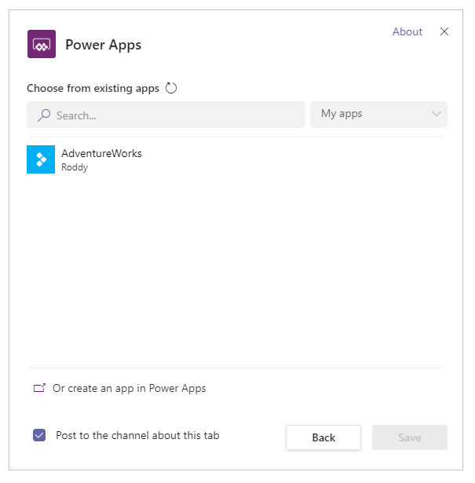

   If the app you’re looking for isn’t available in **My apps** view, select a
  different view.

   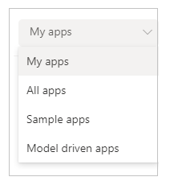

    -  **My apps** – published apps that you’ve created.

    -  **All apps** – all published apps that you have access to.

    -  **Sample apps** – sample app [templates](../maker/canvas-apps/get-started-test-drive.md) available in Power Apps by default.

    -  **Model driven apps** - all published model-driven apps shared with the selected team.

   You can also search for an app by the name.

   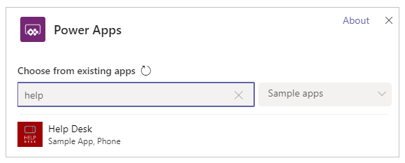

   When you select an app that you're an owner of, you’re prompted to ensure the app is shared with the team before you add it to the channel’s tab.

   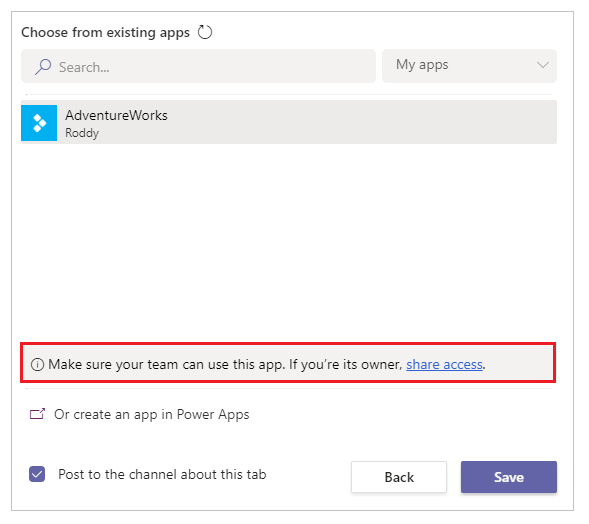

1. Select **Save** and the app is added to your selected channel as a tab.

   

You can now run the app inside the Teams channel and switch across posts, files, Wiki, and other options.

### See also

- [Use sample apps from Teams store](use-sample-apps-from-teams-store.md)
- [Manage your apps](manage-your-apps.md)
