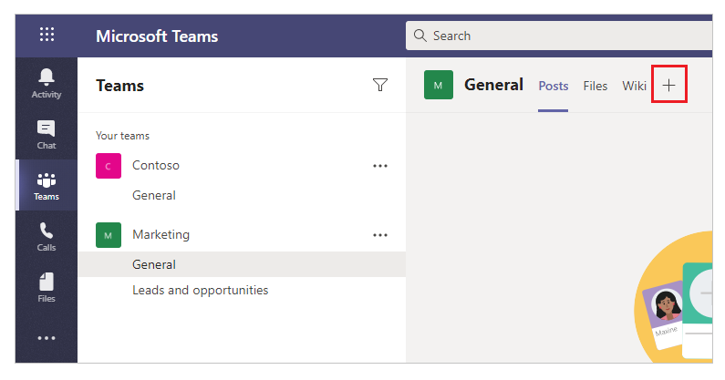
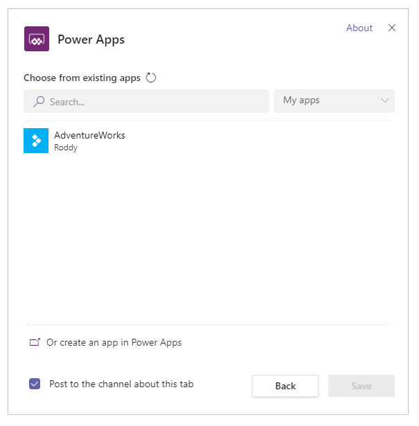
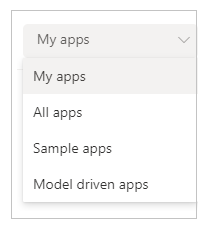
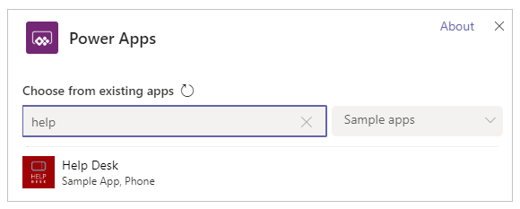
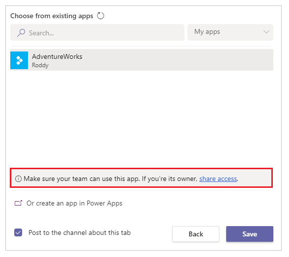
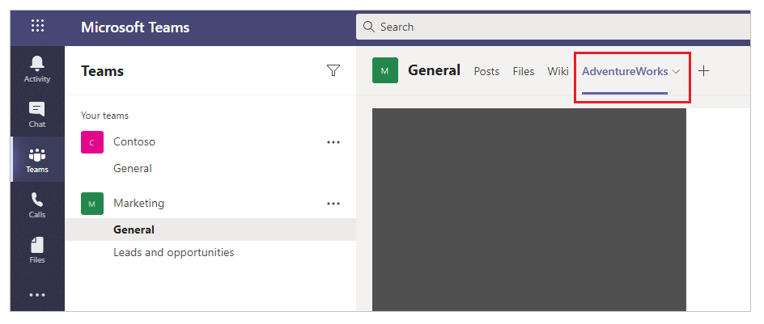

# Publish and share your app

[!INCLUDE [cc-beta-prerelease-disclaimer.md](../includes/cc-beta-prerelease-disclaimer.md)]

In this article, learn about how you can publish and add apps to Microsoft Teams team.

## Publish and add an app to Teams

Whenever you save changes to a canvas app, you automatically publish them only for yourself and anyone else who has permissions to edit the app. When you finish making changes, you must explicitly publish them to make them available to everyone the app is shared with.

### Publish and add an app to a Teams channel from Power Apps Studio

To publish an app, select the **Publish to Teams** button from the top-right side of Power Apps Studio.

Select **Next.** Publishing an app creates a new version of the app and makes the published version of the app available to everyone else the app is shared with.

A list of all channels is displayed. You can add the app to one or more channels as a tab in the team.

Select **Add a tab** , and then select **Save.**

More information: [Publish an app](../maker/canvas-apps/save-publish-app.md#publish-an-app)

### Add a published app to a team's channel from Teams

If an app has been published and shared with the team, you can add it to your team's channel directly by selecting **Add a tab**.

To add a published app to your team:

1. Select the channel that you want to add the app to.

1. Select .
   
    

1. Select **Power Apps.**

   

1. Select the app that you want to add to the channel tab. By default, the **My apps** view appears, showing the apps you've created.

   

   If the app you're looking for isn't available in the **My apps** view, select a
  different view.

   

    -  **My apps**: Published apps that you've created.

    -  **All apps**: All published apps that you have access to.

    -  **Sample apps**: Sample app [templates](../maker/canvas-apps/get-started-test-drive.md) available in Power Apps by default.

    -  **Model driven apps**: All published model-driven apps shared with the selected team.

   You can also search for an app by name.

   

   When you select an app that you're an owner of, you're prompted to ensure the app is shared with the team before you add it to the channel's tab.

   

1. Select **Save**. The app is added to your selected channel as a tab.

   

You can now run the app in the Teams channel and switch across posts, files, wikis, and other options.

## Share an app

You can't share apps or data outside of a team currently. This capability is coming soon as a new **Share with your colleagues** experience.

### See also

[Use sample apps from Teams store](use-sample-apps-from-teams-store.md)  
[Manage your apps](manage-your-apps.md)
