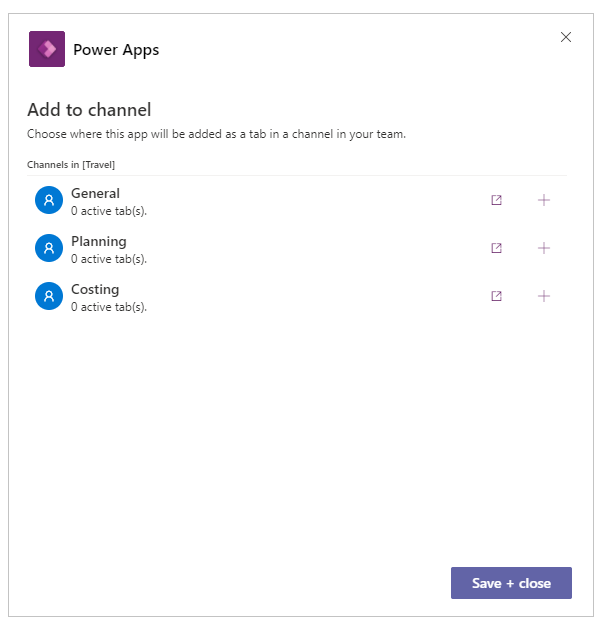

# Publish your app in Teams

In this article, learn about how you can publish and add apps to Microsoft Teams team.

## Publish and add an app to Teams

Whenever you save changes to a canvas app, you automatically publish them only for yourself and anyone else who has permissions to edit the app. When you finish making changes, you must explicitly publish them to make them available to everyone the app is shared with.

To publish an app, select the **Publish to Teams** button from the top-right side of Power Apps Studio.

Select **Next.** Publishing an app creates a new version of the app and makes the published version of the app available to everyone else the app is shared with.

A list of all channels is displayed. You can add the app to one or more channels as a tab in the team.

Select **Add a tab** , and then select **Save + close**.

> [!TIP]
> If the app is already published to a Teams channel as a tab, you'll have the option to **Show tabs**.   To publish updated version of an app to an existing active tab, select **Save + close** without adding a new tab.   To add published version of an app to a new tab in a different channel, Select **Add a tab**  for the channel you want, and then select **Save + close**.

More information: [Publish an app](../maker/canvas-apps/save-publish-app.md#publish-an-app)

## Move an app to another Teams channel in the same team

Moving an app to another Teams channel in the same team requires publishing the app to the new channel, and then, removing the app from the old channel.

- To publish an app to the new channel: Follow the steps to [publish and add an app to Teams](#publish-and-add-an-app-to-teams). But before you select **Save + close**, select **Add a tab**  for the new channel you want. And then, select **Save + close** to publish the app to the new channel.
- To remove the app from a channel: Follow the steps to [remove an app](remove-your-apps.md).

### See also

[Set permission and share apps with colleagues](set-perms-and-share.md)

[Manage your apps in Teams](manage-your-apps.md)

[!INCLUDE[footer-include](../includes/footer-banner.md)]