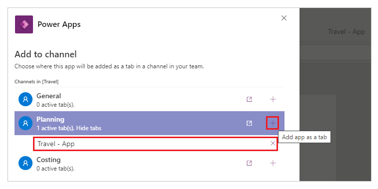
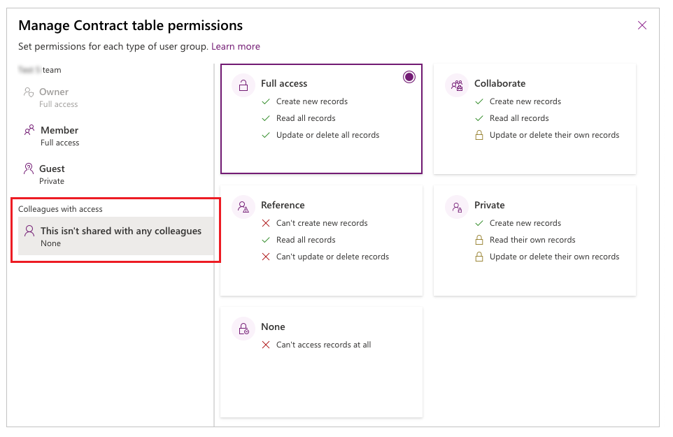

# Publish and share your app in Teams

In this article, learn about how you can publish and add apps to Microsoft Teams team.

## Publish and add an app to Teams

Whenever you save changes to a canvas app, you automatically publish them only for yourself and anyone else who has permissions to edit the app. When you finish making changes, you must explicitly publish them to make them available to everyone the app is shared with.

To publish an app, select the **Publish to Teams** button from the top-right side of Power Apps Studio.

Select **Next.** Publishing an app creates a new version of the app and makes the published version of the app available to everyone else the app is shared with.

A list of all channels is displayed. You can add the app to one or more channels as a tab in the team.

Select **Add a tab** , and then select **Save + close**.

> [!TIP]
> If the app is already published to a Teams channel as a tab, you'll have the option to **Show tabs**.   To publish updated version of an app to an existing active tab, select **Save + close** without adding a new tab.   To add published version of an app to a new tab in a different channel, Select **Add a tab**  for the channel you want, and then select **Save + close**.

More information: [Publish an app](../maker/canvas-apps/save-publish-app.md#publish-an-app)

## Move an app to another Teams channel in the same team

Moving an app to another Teams channel in the same team requires publishing the app to the new channel, and then, removing the app from the old channel.

- To publish an app to the new channel: Follow the steps to [publish and add an app to Teams](#publish-and-add-an-app-to-teams). But before you select **Save + close**, select **Add a tab**  for the new channel you want. And then, select **Save + close** to publish the app to the new channel.
- To remove the app from a channel: Follow the steps to [remove an app](remove-your-apps.md).

## Share broad distribution apps with colleagues

After collaboration with your team to build an app, as an owner of the team, you can share the app and its underlying data with other colleagues within your company that don't belong to your development team.

To share an app:

1. Assign the correct permissions for the tables in your app for the **Colleagues with access** role.

1. Select a security group you would like to assign to the **Colleagues with
access** role.

1. Choose which apps the **Colleagues with access** role should have access to.

Once you’re done sharing your apps, they’ll appear in the [Built for your
colleagues](https://docs.microsoft.com/microsoftteams/manage-power-platform-apps) section within the Teams app store. If you’re a Teams admin, you can also pin apps for users in the Teams app bar for even easier discovery.

> [!NOTE]
> - If your app doesn't appear in the **Built by your colleagues** section, your Teams app might be caching information. If this happens, try signing out, and sign back in if you're using the Teams desktop app. If you're using Teams web app, try refreshing your browser.
> - You need to be an owner within the team to share apps and edit table
permissions. If you are not an owner, the **Manage permission** and **Share with colleagues** options won't appear.

### Assign table permissions

By default, the **Colleagues with access** role has no access to the data inside any of the custom tables you built using Dataverse for Teams. If you would like users outside of your team to access this data, you'll need to change the default access to one of these four permission sets:

- **Full access** – Allows end users to see and edit all records in the table.

- **Collaborate** – Allows end users to see all records, but they can only edit their own records.

- **Reference** – Provides a read-only view of data for end users.

- **Private** ­– Allows end users to only view and edit their own data.

> [!NOTE]
> you can also use this experience to alter the default access rights for
members and guests within your team. By default, Team members are given **Full
access** and guests are given **Private** access to new custom tables.

To set the permissions of a table:

1. Select **Build** tab.

1. Select the team that contains the app and tables you want to share.

1. Select **See all** under the list of resources in the team.

1. Select **Tables** from the left pane.

1. Select the table you want to share.  

    

1. Select the **Manage permissions** in the command bar.

1. Under the **Colleagues with access** role, and select the permission set that you want to grant this role.  

    

    > [!TIP]
    > After you assign a security group to the **Colleagues with access** role, you'll see the name of the security group reflected in
    the table permission panel.

1. Select **Save**.

1. Repeat the above steps for the remaining tables in your app.

### Assign the Colleagues with access role to a security group and share the app

After you’ve completed setting the permissions to all your tables, you’re now
ready to share the app with an existing security group.

> [!NOTE]
> - You can share an app to a single security group.
> - If you want to share the app to a Microsoft 365 group, it must be [security enabled](../maker/canvas-apps/share-app.md#share-an-app-with-microsoft-365-groups).
> - You can only share apps to security groups with less than 1000 members.

To share an app:

1. Select **Build** tab.

1. Select the team that contains the app you want to share.

1. In the top-right, select the **Share with colleagues**.

    

1. Search for, and select the security group you want to share the apps and tables with.

    

1. Set **Colleague can use** toggle to **On** for the apps and tables that you want to share with the security group selected in the previous step.

    

1. Select **Save**.

The apps you selected will now appear in the [Built for your
colleagues](https://docs.microsoft.com/microsoftteams/manage-power-platform-apps) section within the Teams app store.

#### Optional: Pin the app to the app bar as a tenant administrator

If you're a tenant administrator, you can go one step forward and pin the apps for end users in Teams. To pin apps in Teams, follow the steps to [add an app to the app catalog](embed-teams-app.md), and then, [edit or create a new Teams app setup policy](https://docs.microsoft.com/microsoftteams/teams-app-setup-policies) with your app.

| Teams desktop client | Teams mobile client |
| - | - |
|  |   |

### See also

[Use sample apps from Teams store](use-sample-apps-from-teams-store.md)  
[Manage your apps](manage-your-apps.md)

[!INCLUDE[footer-include](../includes/footer-banner.md)]