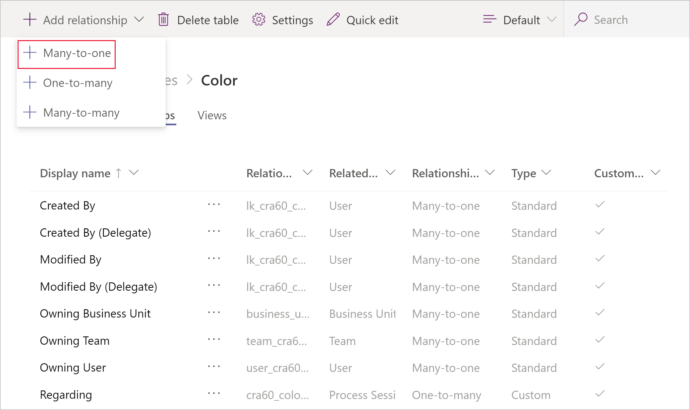

# Work with table relationships

Table relationships define the ways that table records can be associated with records from other tables or the same table. There are three types of table relationships. Dataverse for Teams allows for the creation of the same relationship types as Dataverse does:

- **One-to-many relationships**. In this type of relationship, each row in table A can match more than one row in table B, but each row in table B can match only one row in table A. For example, a class of students have a single classroom.

- **Many-to-one relationships**. In this type of relationship, each row in table B can match more than one row in table A, but each row in table A can match only one row in table B. For example, one single teacher teaches many classes.

- **Many-to-many relationships**. In this type of relationship, each row in table A can match more than one row in table B, and vice versa. For example, students attend many classes, and each class can have multiple students.

More information: [Entity relationships](../maker/data-platform/create-edit-entity-relationships.md)

## Create a table relationship

To add a lookup relation to a table, create a relation on the **Relationships** tab and specify the table with which you want to create a relationship.

1. In the **Power Apps** section of Microsoft Teams, select the table to create a relationship. This can be done by opening the table and selecting the **Relationships** tab.

   > [!div class="mx-imgBorder"] 
   >  

   Or, on the left pane, expand **Tables**, expand the table you want, and then select **Relationships**.  

 <!--   > [!div class="mx-imgBorder"] 
    >  -->

2. When the relationships page is open, select **Add relationship**, and then select the type of relationship you want to create (for example, **Many-to-one**).

   > [!div class="mx-imgBorder"] 
   > 

More information: [Create a relationship between entities](../maker/data-platform/data-platform-entity-lookup.md) 

> [!NOTE]
> When defining columns of type lookup within a table, a many-to-one relationship is created automatically.

## Edit a table relationship

Editing relationships in Dataverse for Teams works the same as Dataverse except that you can't manage collaboration functions, such as allowing feedback or enabling SharePoint document management. More information: [Relationship actions](../maker/data-platform/create-edit-entity-relationships.md#actions)

## Delete a table relationship

While viewing table relationships, select the table relationship you want to delete, and then do one of the following:

- Select **Delete relationship** on the command bar.

   

- Select **…** next to the relationship, and then select **Delete relationship**.
   > [!div class="mx-imgBorder"] 
   >  

### See also

[Work with table columns](table-columns.md)

[!INCLUDE[footer-include](../includes/footer-banner.md)]