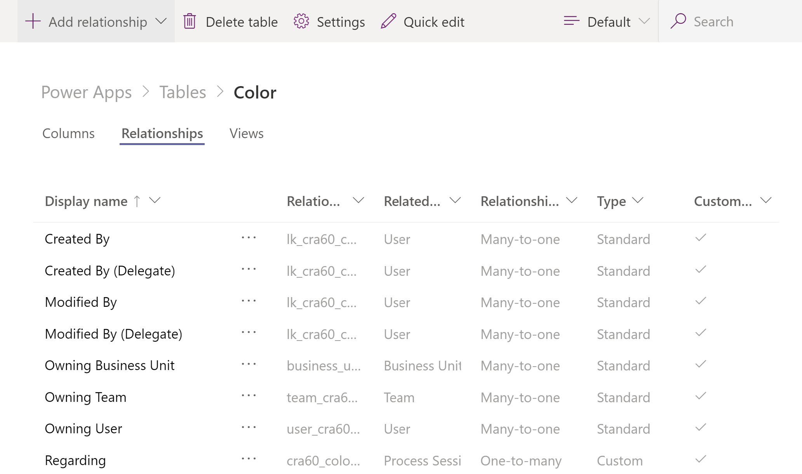
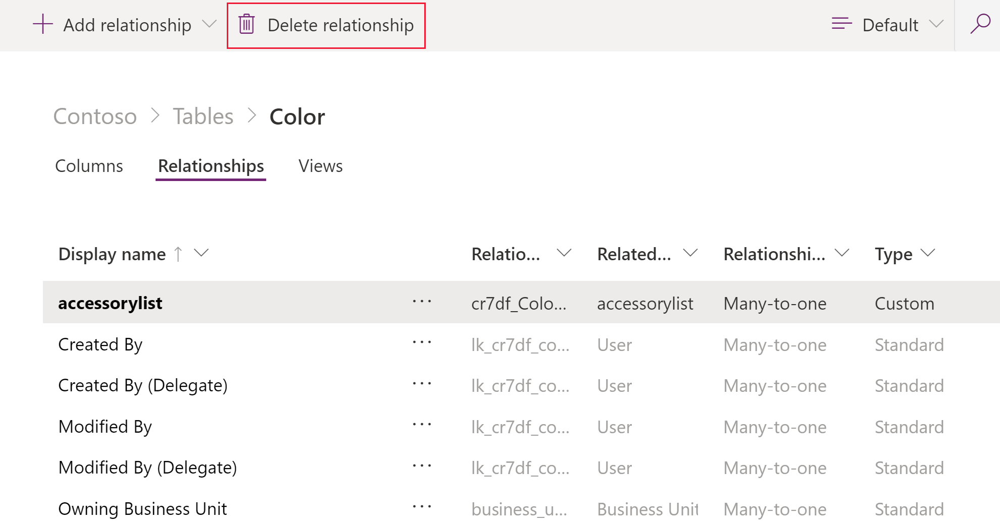

# Work with table relationships
Table relationships define the ways that table records can be associated with records from other tables or the same table. There are three types of table relationships. Microsoft Dataflex allows for the creation of the same relationship types as Microsoft Dataflex Pro:
- One-to-many relationships. In this type of relationship, each row in table A can match more than one row in table B, but each row in table B can match only one row in table A. For example, a class of students have a single classroom.
- Many-to-one relationships. In this type of relationship, each row in table B can match more than one row in table A, but each row in table A can match only one row in table B. For example, one single teacher teaches many classes.
- Many-to-many relationships. In this type of relationship, each row in table A can match more than one row in table B, and vice versa. For example, students attend many classes, and each class can have multiple students.

For more information about relationships, see [Entity relationships overview](../maker/common-data-service/create-edit-entity-relationships.md). 

## Create a table relationship
To add a lookup relation to a table, create a relation under the **Relationships** tab and specify the table with which you want to create a relationship.
1. In the **Power Apps** section of Teams, select the table to create a relationship. This can be done by opening the table and selecting the **Relationships** tab.

    
   
   Or, in the left-hand pane, select the **Tables** dropdown, select the down arrow on your desired table, and then select **Relationships**.  
   
    
2. Once the relationships page is open select Add relationship, and then select the type of relationship you would like to create, such as **Many-to-one**.
   

The rest of the process is nearly identical to Dataflex Pro with the exception that none of the collaboration features are available as in Dataflex Pro, such as allow feedback or enable SharePoint document management. More information: [Create a relationship between entities](../maker/common-data-service/data-platform-entity-lookup.md) 

## Edit a table Relationship
Editing relationships in Dataflex works the same as Dataflex Pro except you can’t manage the collaboration functions, such as allow feedback or enable SharePoint document management. More information: [Relationship actions](/maker/common-data-service/create-edit-entity-relationships#actions)

## Delete a table Relationship
While viewing table relationships, select the table relationship you want to delete and then do one of the following:

Select **Delete** relationship on the command bar.

Or, select **…** next to the relationship, and then select **Delete relationship**.

### See also
[Work with table columns](table-columns.md)