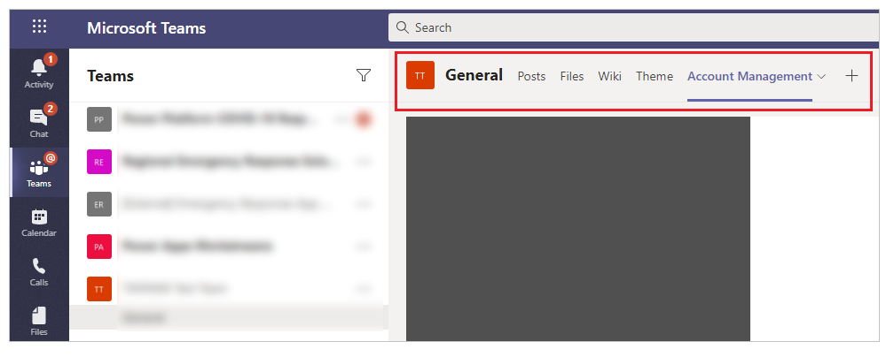
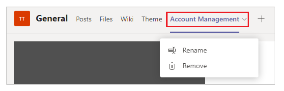
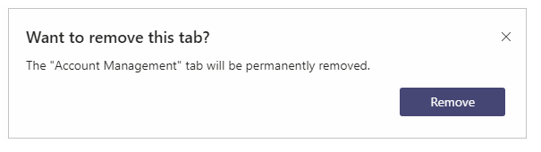
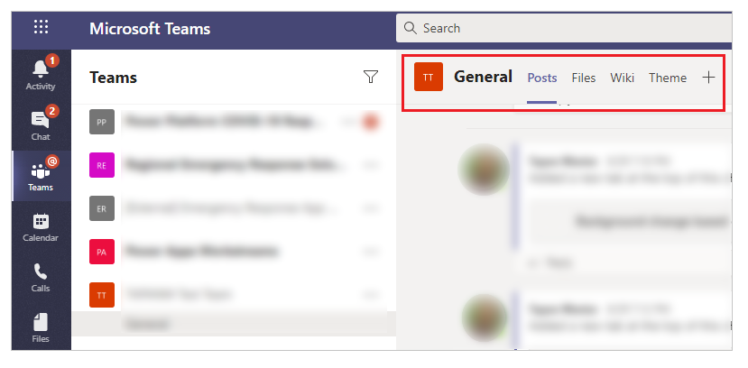

# Remove an app from your team

Removing an app that was added as a tab from a Microsoft Teams channel makes it inaccessible from the Teams tab for all members of the Teams channel.

To remove an app from your team:

1. Go to the team that you added the app to.

    

2. Select the drop-down for the tab.

    

3. Select **Remove**.

4. Confirm **Remove**.

    

The app is now removed from your Teams channel.

### See also

[Uninstall the Power Apps personal app](uninstall-personal-apps.md)  

[!INCLUDE[footer-include](../includes/footer-banner.md)]