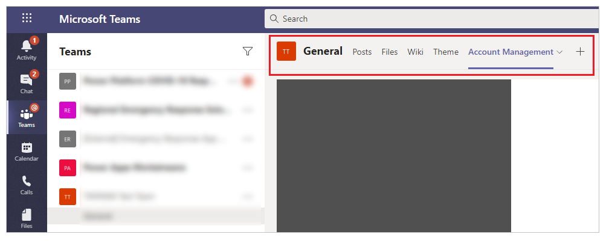
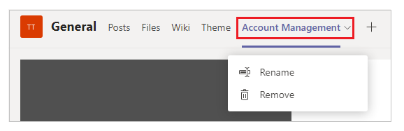
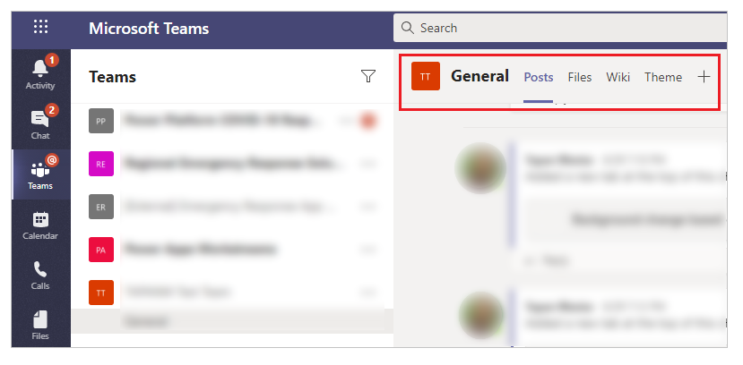

# Remove an app from your team

Removing an app added as a tab from a Teams channel makes it inaccessible from the Teams tab for all members of the Teams channel.

To remove an app from your team:

1. Go to the team that you have the app added to.

    

2. Select the drop-down for the tab.

    

3. Select **Remove**.

4. Confirm **Remove**.

    

The app is now removed from your Teams channel.

### See also

- [Uninstall Power Apps personal app from Teams](uninstall-personal-apps.md)
- [Add published app to Teams channel from teams](publish-and-share-apps.md#add-published-app-to-teams-channel-from-teams)
