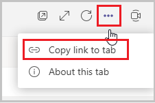

# Replace notification with adaptive card to increase collaboration

In this topic, we will be changing the notifications that come from the Employee Ideas app from HTML-based messages in Teams to adaptive cards in Teams. Currently, Teams notifications are initiated from within the app and are sent as a message posted to the Teams channel. We will replace this Teams channel notification with an adaptive card notification that will be initiated using a Power Automate Flow.

## Prerequisites

To complete this lesson, we would need the ability to login into Microsoft Teams which will be available as part of select Microsoft 365 subscriptions and will also need to have the Employee Ideas power apps template for Microsoft Teams installed. This app can be installed from aka.ms/TeamsEmployeeIdeas. (Confirm link)

## Create the Power Automate Flow to generate the adaptive card

To get started, let’s create a flow to replace the current notification with an adaptive card.

Open the Power Apps for Teams personal app and locate the Employee Ideas app. For ease of use, you can right click on the Power Apps logo in Teams and select **Pop out app** to work with the Power Apps studio in its own window. Select the Ideas app to open the Power Apps studio in Teams and begin editing the app. In the top menu bar, select the vertical ellipsis to the right of the **Settings** option. This will reveal three options: **Power Automate**, **Collections**, and **Variables**.

Choose **Power Automate** to open the **Data** sidebar menu on the right. You will see any Flows that are available here.

Choose **Create a new flow**. This will launch the Power Automate studio in a separate browser window. Check to ensure that you are in the correct environment for the Team containing the app you are trying to change before continuing.

In the upper left-hand area, you will see that the Flow has a name of **Untitled**. Select that text to change the name to **Employee Ideas Adaptive
Card To Teams**.

Add the Power Apps trigger. This will allow us to trigger the Flow from Power Apps as well as to add values to pass from Power Apps to Power Automate.

Select +New step to add a new step – select the action Get a row by ID and for Row ID, select the Value field area to reveal the Dynamic content menu. Select **Ask in Power Apps**. This will create a variable in the Power Apps trigger to allow passing data from the app to Power Automate.


Next, add two **Initialize Variable** actions. These will be used to store information from Power Apps and to store a link to the Ideas app which will be
used in the adaptive card to link straight to the record. Rename each of the actions as follows:

-   Initialize variable - Card Title

    -   Name = varCardTitle

    -   Type = String

-   Initialize variable – Campaign

    -   Name = varCampaign

    -   Type = String

Set each of the Type values to String and add a Name for each: varCardTitle, varCampaign, and varReviewIdeasLink, respectively.

For the Card Title and Campaign actions, select the Value field area to reveal the Dynamic content menu. Select **Ask in Power Apps**. This will create a
variable in the Power Apps trigger to allow passing data from the app to Power Automate.


For the Review Ideas Link action, we will use the link to the app. To find this link, navigate to the Team where the Ideas app resides and copy the link for tab in which the app is installed. You can copy the link to the tab by opening the tab, then selecting the ellipses (…) in the upper right corner.



Your URL will look something like the following:

<https://teams.microsoft.com/l/entity/b7fad6ce-2e23-4aba-b209-859a59ca230e/_djb2_msteams_prefix_1434832750?context=%7B%22subEntityId%22%3Anull%2C%22channelId%22%3A%2219%3AJoXQe3Zkcr7pYwjk5H6AOQjFgYVMBaI6rFx7EmHc5k81%40thread.tacv2%22%7D&groupId=051aa62a-26d4-4cbd-9843-f7f87dad9f07&tenantId=e85feadf-11e7-47bb-a160-43b98dcc96f1>

To continue, copy the part of the URL that comes after **context=** and go to the website <https://www.urldecoder.org/>.

Paste the copied text in the box highlighted below and hit Decode.

The decoded text appears in the textbox below the Decode button.


Copy that text and go back to the Power Automate Flow.

Add a new step to the flow to initialize a variable.

- Rename the step to Initialize variable – Review Ideas Link

- Set Name = varReviewIdeasLink

- Select Type = String

- Enter Value = *{paste the text copied from the url above}*


Add a new step with the action Compose and in the Inputs field paste the following:

```
replace(replace(replace(variables('varReviewIdeasLink'),'{','%7B'),'"','%22'),'}','%7D')
```


Add a **Post adaptive card in a chat or channel** action. Set the **Post as** value to *User* and the **Post in** value to *Channel*. In the **Team** and
**Channel** fields, select the Team and Channel that you would like to post the adaptive card to.

The code below is provided here for convenience. You can learn more about adaptive cards at <https://adaptivecards.io/> and design their own cards in a
visual editor at <https://adaptivecards.io/designer/> In the **Adaptive Card** field, copy and paste the following:

> NOTE: The code is provided here for convenience. You can learn more about adaptive cards at [ht](https://adaptivecards.io/)[tps://adaptivecards.io/](https://adaptivecards.io/)
> and design your own cards in a visual editor at <https://adaptivecards.io/designer/>

```
{

"type": "AdaptiveCard",

"body": [

{

"type": "TextBlock",

"size": "large",

"weight": "Bolder",

"text": "@{variables('varCardTitle')}",

"wrap": true

},

{

"type": "TextBlock",

"text": "A new idea has been submitted!",

"wrap": true

},

{

"type": "TextBlock",

"text": "For the campaign: @{variables('varCampaign')}",

"wrap": true

}

],

"actions": [

{

"type": "Action.OpenUrl",

"title": "View @{variables('varCardTitle')}",

"url":
"https://teams.microsoft.com/l/entity/b7fad6ce-2e23-4aba-b209-859a59ca230e/_djb2_msteams_prefix_1434832750?context=@{outputs('Compose')}"

}

],

"\$schema": "http://adaptivecards.io/schemas/adaptive-card.json",

"version": "1.2"

}
```

In the Subject field, copy and paste the following:

```
New idea submitted for @{variables('varCampaign')} Campaign
```


This will set the adaptive card’s characteristics and use the variables from Power Apps in the adaptive card.

Save and Test the Flow to ensure it works properly. Selecting Manually from the Test Flow sidebar will allow you to enter the Card Title, Campaign, and Review Ideas Link variables.

## Add the Flow to the Ideas app

Once you have verified that the Flow is working properly, you can add it to the Ideas app.

Navigate back to the Power Apps studio where the Ideas app was being edited. In the Tree View on the left-hand side, select the Campaign Detail Screen. Next, select the Submit idea button (named btnCampaignIdeaControls_Submit in the Tree View). We will add the Power Automate Flow we just created to this button.


First, we will copy the code currently in the OnSelect property of the button. One issue with adding Power Automate Flows to controls in Power Apps is that any existing code on the control will be removed. To work around this, paste the copied code into a text editor, such as Notepad, and edit it to paste back in the OnSelect property when done. After pasting the code, ensure that all the code was added.

With the button still selected, select the vertical ellipsis to the right of the Settings in the upper menu bar. Select Power Automate, which will reveal the
**Data** sidebar. You should now see the **Employee Ideas Adaptive Card To Teams** Flow in the Available flows section. Select it to add it to the button.

You will now need to edit the pasted code. Find and remove the following text:

```
Notify(

If(tglIdeaDetailControls_PostToTeams.Value,

If(

IsError(

MicrosoftTeams.PostMessageToChannelV3(

gblSettingTeamId,

gblSettingNotificationChannelId,

{

content: Concatenate(

"A new employee idea has been created!",

"\<br\>\<br\>",

"\<b\>Description\</b\>",

"\<br\>",

locFormRecordIdea.Description

),

contentType: "html"

},

{subject: locFormRecordIdea.Title}

)

),

"Message was not posted. You may not have access to the Team and/or Channel.
Contact the app administrator.",

NotificationType.Warning

)

)

);
```

Where the removed text was, put the following:

```
If(tglIdeaDetailControls_PostToTeams.Value,
EmployeeIdeasAdaptiveCardToTeams.Run(locFormRecordIdea.Title,gblSelectedRecordCampaign.Title,locFormRecordIdea.'Employee
Idea',locFormRecordIdea.'Employee Idea'));
```

This contains the reference to the Flow we just added as well as the variables to pass to Power Automate.

Copy the entirety of the text that was just edited and paste it back into the OnSelect property of the Submit inspection button. Verify that there are no
errors on the button.

## Update App to open the actual record using the Adaptive Card link

Now we will update the app to accept the hyperlink parameter and support deep linking to records.

The Adaptive card has a link that should take us back to the Idea record that was created. We need to make some changes to the Loading page of the app to load the appropriate data.

From the Tree view, select Loading screen. Then select the container conLoading_HiddenHelper and under that select tmrLoadingDelay. Select the
OnTimerEnd property of the timer control and notice that there is an IF condition saying If(gblAppLoaded,----------)

Replace that whole IF condition with the following IF condition (added a few more checks in addition to the original checks)

> NOTE: This is edited to include deep linking to the specific idea record in case the app is opened from the adaptive card. There are a few collections/values that need to be defined before the screen loads if we want it to deep link to the specific idea record directly

```
If(

gblAppLoaded,

If(

!IsBlank(Param("subEntityId")), //check if the parameter is blank or not, if
not, populate the relevant variables and collections to make deep linking work

Set(

gblRecordCampaignIdea,

LookUp(

'Employee Ideas',

'Employee Idea' = GUID(Param("subEntityId"))

)

);

ClearCollect(

colResponses,

Filter(

'Employee Idea Responses',

Idea.msft_employeeideaid = gblRecordCampaignIdea.msft_employeeideaid

)

);

ClearCollect(

colFiles,

Filter(

'Employee Idea Files',

'Employee Idea Files'[@Idea].'Employee Idea' = gblRecordCampaignIdea.'Employee
Idea'

)

);

Set(

gblSelectedRecordCampaign,

LookUp(

'Employee Idea Campaigns',

'Employee Idea Campaign' = gblRecordCampaignIdea.Campaign.'Employee Idea
Campaign'

)

);

ClearCollect(

colIdeas,

Filter(

'Employee Ideas',

'Employee Ideas'[@Campaign].'Employee Idea Campaign' =
gblSelectedRecordCampaign.'Employee Idea Campaign'

)

);

If( //check if the user is on a mobile device or desktop/web and redirect the
user accordingly to deep link into the specific idea

Or(

Param("hostClientType") = "android",

(Param("hostClientType") = "ios" And Parent.Width \< 800)

),

Navigate(

'Campaign Detail Screen',

ScreenTransition.None,

{

locVisibleCampaignIdea: true,

locVisibleCampaignView: false,

locCreateNewIdea: false

}

),

Navigate(

'Mobile Idea Screen',

ScreenTransition.None,

{

locVisibleCampaignIdea: true,

locVisibleCampaignView: false,

locCreateNewIdea: false

}

)

),

If( //if the parameter is blank, check if the user is on a mobile device or
desktop/web and redirect the user accordingly

Or(

Param("hostClientType") = "android",

(Param("hostClientType") = "ios" And Parent.Width \< 800),

tglAdmin_Mobile.Value// Studio Testing

),

Navigate(

'Mobile Landing Screen',

ScreenTransition.None,

{locShowSetup: false}

),

Navigate(

'Campaign Summary Screen',

ScreenTransition.None,

{

locShowModal: (gblRecordUserSettings.'Display Splash (Power Apps)?' = 'Display
Splash (Power Apps)? (Employee Ideas User Settings)'.Yes),

locShowPowerAppsPrompt: gblRecordUserSettings.'Display Splash (Power Apps)?' =
'Display Splash (Power Apps)? (Employee Ideas User Settings)'.Yes

}

)

)

)

)


```

This should load all the required data appropriately after the app opens. When the user clicks on the record in the adaptive card, he should be taken to the appropriate idea.

## Publish the Ideas App

1.  All the changes to the Ideas app are completed.

2.  The app can now be published by selecting the Publish to Teams button on the top right.

## Test the app

1.  Login into Teams and navigate to Team where the Ideas app is installed.

2.  Click on the Ideas tab on the top.

3.  The Ideas app opens.

4.  Click on one of the Campaigns – say Workplace Safety.

5.  Click on the Submit an idea button.

6.  Enter Title and Description.

7.  Select ratings for the listed questions.

8.  Add any other information needed.

9.  Hit the Submit idea button once all details are populated.

10. The idea gets submitted.

11. A notification is sent to the Team in which the app is installed.

12. Click on the link in the notification and verify that the idea record opens.


