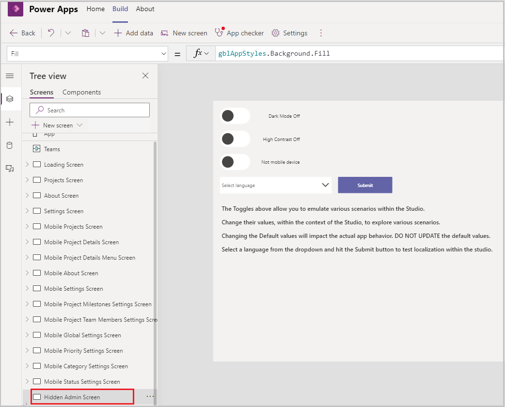
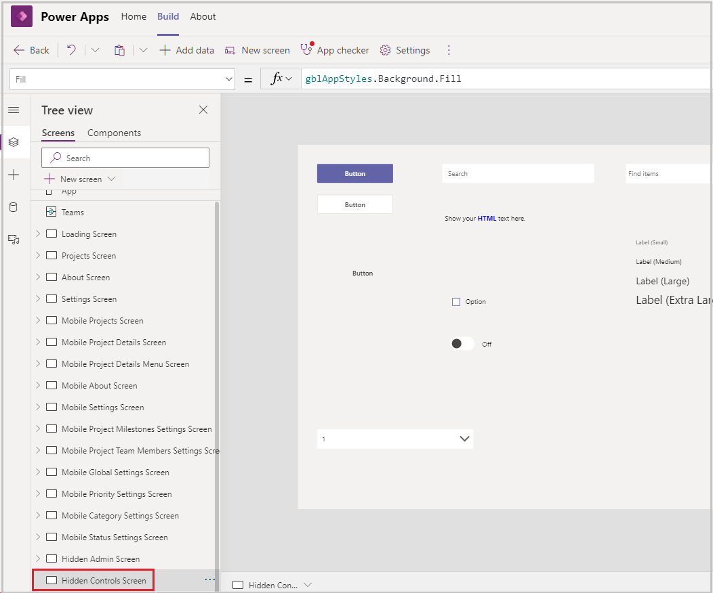
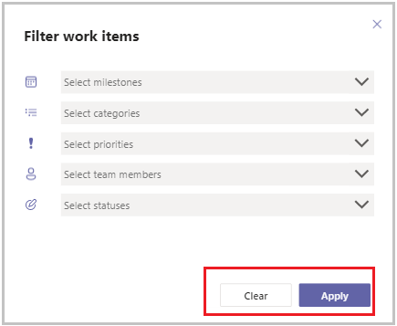
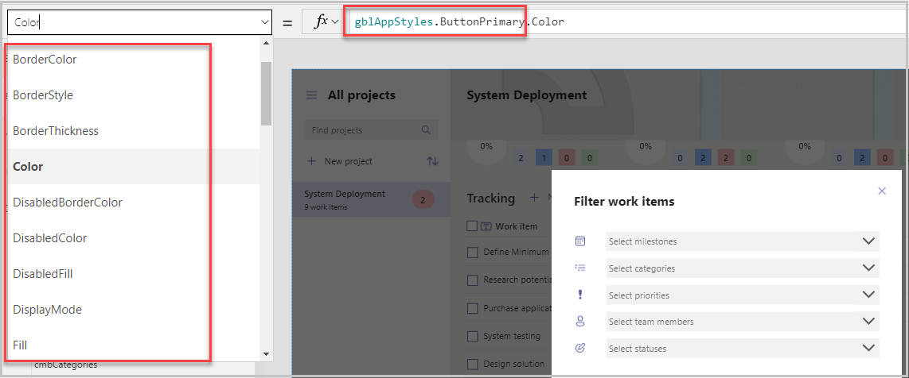
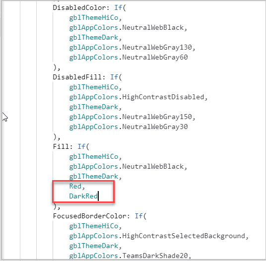
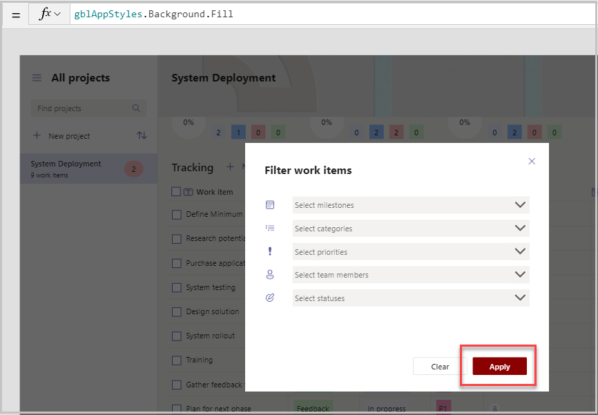
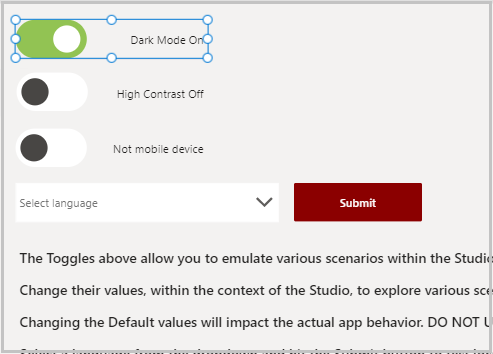
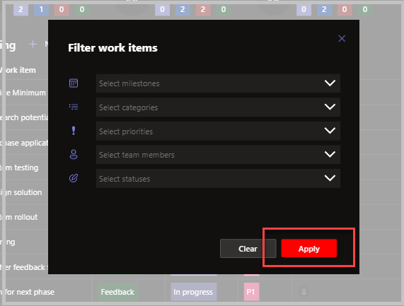

# Theming in sample apps

The most attractive feature about canvas apps is the ability to customize the user interface per the user or organization’s branding and liking. Theming strategy provides us with the ability to create apps that match the organizational brand. A **theme** contains a collection of styles that define multiple design properties for controls and components such as colors, fonts, and borders.

In this article, we'll learn how to use global variables to define themes, and how the colors and properties can be easily changed throughout the app by just updating the global variables.

## Prerequisites

To complete this lesson, we'd need the ability to create apps within Microsoft Teams that will be available as part of select Microsoft 365 subscriptions. You'll also need the Milestones sample app for Microsoft Teams installed in your Team. You can install it in your team at <https://aka.ms/TeamsMilestones>.

## Defining the theming strategy

In this example, we'll see how global variables have been used to define colors and styles for theming in the Milestones app. The following global variables have been defined in the **OnVisible** property of the **Loading screen**.

- **gblAppColors** to define colors so they can be referenced easily
- **gblAppSizes** to define different sizes of fonts for mobile and web apps
- **gblAppStyles** properties of every single control using **gblAppColors**
- **gblThemeDark** set to true when the Teams theme is dark so all controls adapt to the dark theme
- **gblThemeHiCo** set to true when the Teams theme is high contrast so all controls adapt to the high contrast high contrast

## Testing the theming Strategy

Two hidden screens have been defined for testing the theming strategy:

- Hidden Admin Screen – This screen has two toggles defined  **tglAdmin_DarkMode** and **tglAdmin_ContrastMode**. This screen helps with quick testing of dark and contrast modes without having to  change the theme of teams for testing

    

- Hidden Controls Screen – This screen has every single control with properties set using gblAppStyles.

    - Helps in testing out theme changes.
    - Helps in copying a particular control and pasting it on the required screen so that the formula for the control doesn't need to be typed repeatedly.
    
      

## Using the theming variables for a sample app

1. To understand the usage of theming in the Milestones app, select  **Projects Screen** in the Tree view to open the screen and then select **+New Project**.

1. Select the **Color** property of **+New Project**.

    Notice that the formula references **gblAppStyles** > **ButtonTransparent** > **Color** formula from the **OnVisible** property of the Loading screen.

    So now, if the theme of the app is High Contrast, then the color defined in **gblAppColors** > **HighContrastHyperlinks** formula will be used.

1. Another example would be to look at the Primary and Secondary buttons.

    - Select the Project Screen in the editor.

    - Hold down the Alt key and select the Filter icon on the Projects Screen.

        The Filter work items pop-up opens up. Notice the two buttons: **Clear** and **Apply**.

      

      **Apply** is an example of a primary button and **Clear** is an example of a secondary button.

1. Select the **Apply** button, and select any Border/Thickness/Color related property and notice the formula defined.

    

1. The **Apply** button is defined as the Primary button and uses all the properties defined on **Loading Screen** > **OnVisible**> **ButtonPrimary** formula.

    Depending on the theme and color variables selected in the ButtonPrimary formula, the styling properties of the button will get updated.

    Similarly, **Clear** is defined as a Secondary button and uses all properties defined under **gblAppStyles** > **ButtonSecondary**.

    > [!NOTE]
    > Another possible extension to the app would be to add Font as a Property, either as one variable to be used across all controls, or once per control (like how the other styling properties are defined separately for primary buttons, or secondary buttons). The font throughout the Milestones app is Segoe UI and there was no need identified for theming of the font.

## Updating the theme in the sample app

In this section, we'll see how we can change a property of a particular control and how the control gets updated across various screens. In our example, we'll update the Fill property of the Primary button and see how the button color changes in the Dark mode, and the Default mode.

1. Go to the **Loading Screen** and select the OnVisible property in the dropdown.

1. Expand the formula bar and scroll down to the **ButtonPrimary** > **Fill** function.

1. Update the last two parameters to Red and DarkRed.

   

1. Go to another screen and then back to Loading Screen for the **OnVisible** function to run.

1. Go to the **Projects** screen, select the **Filter** button to open the Filter pop-up and notice the color of the Apply button is now DarkRed.

   

1. Go to the **Hidden Admin Screen**, hold **Alt** key on the keyboard, and select the **Dark Mode On** toggle.

   

1. Go to the Loading Screen again for the function to load and then come back to the Projects screen. Notice the screen is now in dark mode (with the  background dark), and the Apply button color has now changed to **Red**.

   

1. Similarly, changing properties of the **SecondaryButton** would have changed colors for the secondary button, such as the **Clear** button.

    > [!NOTE]
    > Updating the fill function directly is a quick way of testing theming as shown earlier. If the color needs to be changed for not just the Primary Button control but for all other controls where it is being used as well, then the color palette under the variable gblAppColors should be updated with the formula of the desired colors and names that makes the most sense to your organization. For example,`companynameDefaultHeader: ColorValue("#30D5C8")` would be the formula for turquoise blue.

### See also

- [Boards (Preview) sample app](boards.md)
- [Bulletins sample app](bulletins.md)
- [Employee ideas sample app](employee-ideas.md)
- [Get connected sample app](get-connected.md)  
- [Inspection sample apps](inspection.md)  
- [Issue reporting sample apps](issue-reporting.md)
- [Milestones sample app](milestones.md)
- [Perspectives (Preview) sample app](perspectives.md)
- [Profile+ (Preview) sample app](profile-app.md)
- [Customize sample apps](customize-sample-apps.md)
- [Sample apps FAQs](sample-apps-faqs.md)

[!INCLUDE[footer-include](../includes/footer-banner.md)]