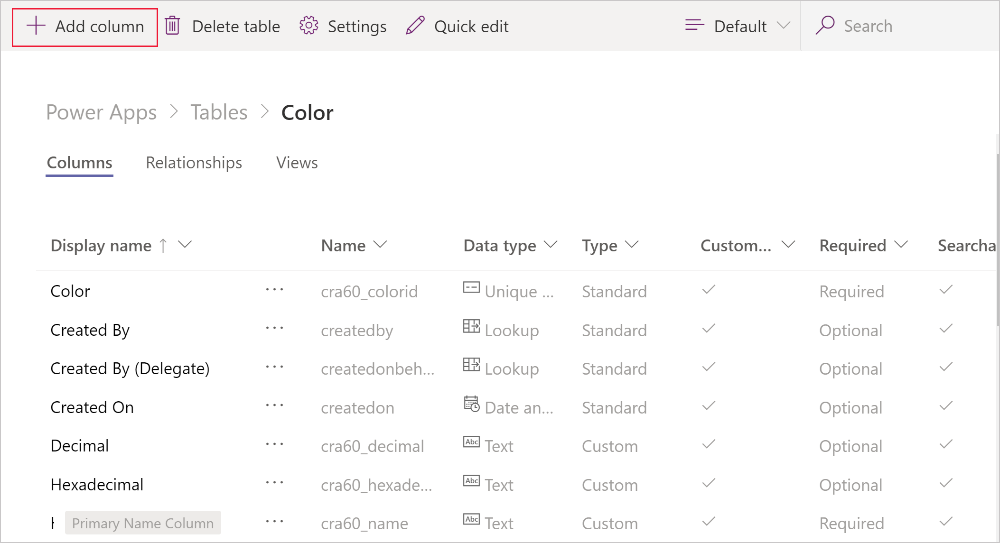

# Work with table columns

With the exception of the Customer column, all column types in Dataverse are available in Dataverse for Teams as *columns*. This article covers the content you'll need for working with table columns in Dataverse for Teams.

Watch this video for a quick overview about column data types in Dataverse for Teams:
> [!VIDEO https://www.microsoft.com/en-us/videoplayer/embed/RWErxo]

Notice that the currency feature will always use the default currency for the country that was selected during Dataverse for Teams environment creation. This can't be changed, and additional transaction currencies or exchange rates can't be added. However, you can upgrade from Dataverse for Teams to Dataverse for full currency functionality.

For more information about the columns available, see these Dataverse articles:

- [Columns overview](../maker/data-platform/fields-overview.md)
- [Create and edit global option sets overview](../maker/data-platform/create-edit-global-option-sets.md)
- [Autonumber columns](../maker/data-platform/autonumber-fields.md)
- [Set managed properties for columns](../maker/data-platform/set-managed-properties-for-field.md)
- [Behavior and format of the Date and Time column](../maker/data-platform/behavior-format-date-time-field.md)

## Create a column

Watch this video to learn how to create columns in Dataverse for Teams:
> [!VIDEO https://www.microsoft.com/en-us/videoplayer/embed/RWE7js]

1. On the **Build** tab, select **See all**, and then expand **Tables**. 
2. Select the table you want to add a column to, and then select **Add column** on the command bar.
    > [!div class="mx-imgBorder"] 
    > 

The rest of the process to add and manage columns is the same as in Dataverse, which is documented in these articles:
- [Create and edit columns for Dataverse using Power Apps portal](../maker/data-platform/create-edit-field-portal.md)
- [Manage custom columns in an entity](../maker/data-platform/data-platform-manage-fields.md)

## Choice columns

In Dataverse for Teams, choices can only be created as a column within a table. Creating choices is otherwise the same as creating an option set in Dataverse. More information: [Create an Option set](../maker/data-platform/custom-picklists.md)

## Calculated and rollup columns

Calculated columns and rollup columns are not currently supported in Dataverse for Teams.

### See also

[Create a table](create-table.md)

[!INCLUDE[footer-include](../includes/footer-banner.md)]
