# Tutorial: Build an app to retrieve Power Platform videos for readiness

In this lab, you’ll build a solution that retrieves, lists, and displays content that can be used for readiness.

> [!div class="mx-imgBorder"]
> 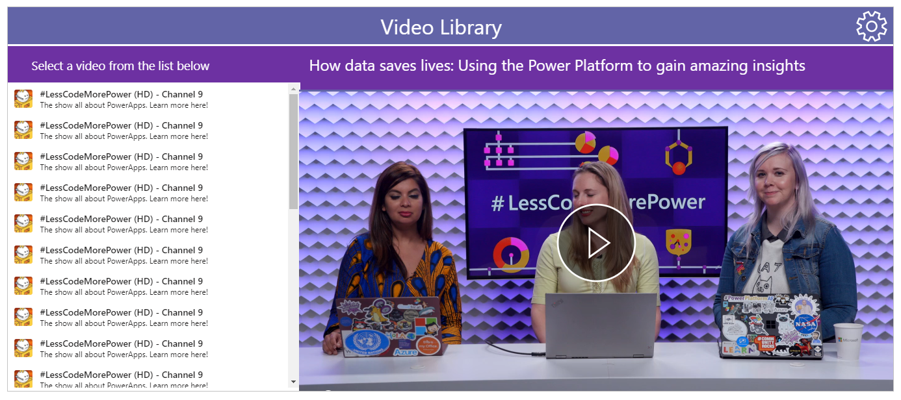

The focus of this lab will be on finding, retrieving, browsing, and playing video content available on YouTube or RSS Feeds with MP4 video files.  It will continually monitor these channels and feeds for new content, and send a message to a specified Microsoft Team when new content is available.

The channels and feeds in the lab will focus on Power Platform content but can easily be used for other topics.

In this lab, you’ll use:

- Power Apps to build the application to specify the YouTube channels and RSS feeds.
- Power Automate to retrieve information about new and existing videos.
- Microsoft Dataverse for Teams to create tables to store the feed and video information.
- Power Automate to send a message to Microsoft Teams when a new video is delivered.

## Prerequisites

- Identify an existing Microsoft Team or create a new Microsoft Team that you’ll build your app for.

- Identify an existing channel or create a new channel within Microsoft Teams to post the messages sent, to specify that a new video has been retrieved.

If you’re unfamiliar with how to create a Team or a channel in a Team, see [Create a channel in Teams](https://support.microsoft.com/office/create-a-channel-in-teams-fda0b75e-5b90-4fb8-8857-7e102b014525).

Note that in this lab we will use a channel named "Readiness".

## Install and pin Power Apps in Teams

In this section, you’ll install the Power Apps app in Teams and pin it to the left rail so you can easily access it. To learn how to do this, see [Install the Power Apps personal app in Microsoft Teams](https://docs.microsoft.com/powerapps/teams/install-personal-app).

If you’ve already done this, you can skip to the next step.

## Create the app

In this section, you’ll take the initial steps to create the application.

1. Select the Power Apps app.

1. Select the **Build** tab at the top of the screen.

1. Select **Create** shown in the lower-left of the screen.

    This will display the "Create an app" dialog box.

1. Select the name of the team from the drop-down list and select **Create**.

    > [!div class="mx-imgBorder"]
    > 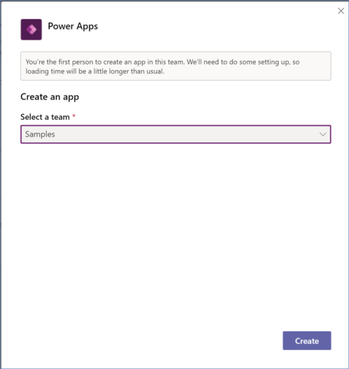

    > [!NOTE]
    > If this is the first time you’ve tried to create an app in this Microsoft Teams team, it will take a moment to set up.

1. When prompted for the name of the app, enter **Video Library** and select **Save**.

## Create the table for the feeds

In this section, you will create a table to store the names and details for the feeds that will be used by the application.

1. Select **Create new table** on the left side of the screen.

1. When prompted for the name of the table, enter **Feeds**.

### Edit the Name column

1. In the table designer, select the drop-down menu for the **Name** column and then **Edit Column**.

1. Change the name to *Title*.

1. Select **Advanced options** and then change the value for **Max length** to *255*.

1. Select **Save**.

### Create the Description column

1. Select **+** to create a new column.

1. Specify the name as *Description*.

1. For **Type**, select **Text** from the list.

1. Select **Advanced options** and then change the value for **Max length** to *255*.

1. Click **Create**.

### Create the Image Link column

1. Select **+** to create a new column.

1. Specify the name as *Image Link*.

1. For **Type**, select **URL** from the list.

1. Select **Advanced options** and then change the value for **Max length** to *255*.

1. Select **Create**.

### Create the Image Title column

1. Select **+** to create a new column.

1. Specify the name as *Image Title*.

1. For **Type**, select **Text** from the list.

1. Select **Advanced options** and then change the value for **Max length** to *255*.

1. Select **Create**.

### Create the Last Retrieved column

1. Select **+** to create a new column.

1. Specify the name as *Last Retrieved*.

1. For **Type**, select **Text** from the list.

1. Select **Create**.

### Create the Link column

1. Select **+** to create a new column.

1. Specify the name as *Link*.

1. For **Type**, select **URL** from the list.

1. Select **Advanced options** and then change the value for **Max length** to *255*.

1. Select **Create**.

### Create the Published On column

1. Select **+** to create a new column.

1. Specify the name as *Published On*.

1. For **Type**, select **Text** from the list.

1. Select **Create**

### Add a row

In the table designer, add a row for the Microsoft show "\#LessCodeMorePower" that will be used in testing.

| **Title**       | \#LessCodeMorePower (HD) - Channel 9                     |
|-----------------|----------------------------------------------------------|
| **Description** | The show all about PowerApps. Learn more here!           |
| **Image Link**  | https://sec.ch9.ms/content/feedimage.png                 |
| **Image Title** | \#LessCodeMorePower (HD) - Channel 9                     |
| **Link**        | https://s.ch9.ms/Shows/Less-Code-More-Power/feed/mp4high |

> [!NOTE]
> Leave the **Published On** column empty.

The table designer should resemble the image below.

> [!div class="mx-imgBorder"]
> 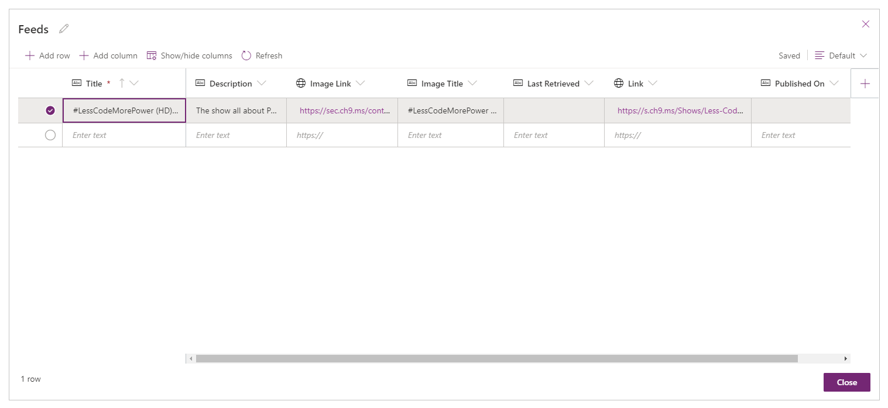

1. Close the table designer.

The screen created automatically in the app, named **Screen1**, should automatically bind to the table, displaying the fields in the table and the record you added.

The screen should resemble the image below.

> [!div class="mx-imgBorder"]
> 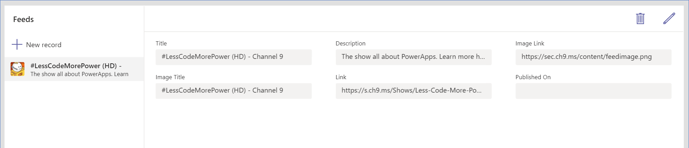

## Create the table for the feed items

In this section, you will create a table to store the details for the videos stored in the Feed Items for the You Tube channel or RSS feed.

1. Select **Add data** on the left side of the screen.

1. Select **Create new table**.

    > [!div class="mx-imgBorder"]
    > 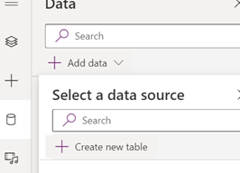

1. When prompted for the name of the table, enter *Feed Items*.

### Edit the Name column

1. In the table designer, select the drop-down for the the **Name** column, and then select **Edit Column**.

1. Change the name to *Feed Item ID*.

1. Select **Advanced options** and then change the value for **Max length** to *255*.

1. Select **Save**.

### Create the Feed column

1. Select **+** to create a new column.

1. Specify the name as *Feed*.

1. For **Type**, select **Lookup** from the list.

1. For the table, select **Feeds** from the list

1. Select **Create**.

### Create the Title column

1. Select **+** to create a new column.

1. Specify the name as *Title*.

1. For **Type**, select **Text** from the list.

1. Select **Advanced options** and then change the value for **Max length** to *255*.

1. Select **Create**.

### Create the Description column

1. Select **+** to create a new column.

1. Specify the name as *Description*.

1. For **Type**, select **Text** from the list.

1. Select **Advanced options** and then change the value for **Max length** to *2000*.

1. Select **Create**.

### Create the Primary Feed Link column

1. Select **+** to create a new column.

1. Specify the name as *Primary Feed Link*.

1. For **Type**, select **URL** from the list.

1. Select **Advanced options** and then change the value for **Max length** to *255*.

1. Select **Create**.

### Create the Video Link column

1. Select **+** to create a new column.

1. Specify the name as *Video Link*.

1. For **Type**, select **URL** from the list.

1. Select **Advanced options** and then change the value for **Max length** to *255*.

1. Select **Create**.

### Create the Published On column

1. Select **+** to create a new column.

1. Specify the name as *Published On*

1. For **Type**, select **Text** from the list.

1. Select **Create**.

Close the table designer (select **X** in the upper-right corner).

Now that you’ve created the required tables, select **Save** on the upper-right corner to save the app and close the Power Apps Studio.

## Create flows to get the video details for configured feeds

In this section, you'll create flows in Power Automate to retrieve videos for each of the configured feeds. This flow will monitor the RSS feeds for the addition of new videos, retrieve details for the videos, and save those details in the database.

When you’ve completed this section, your flow should resemble the diagram below.

> [!div class="mx-imgBorder"]
> 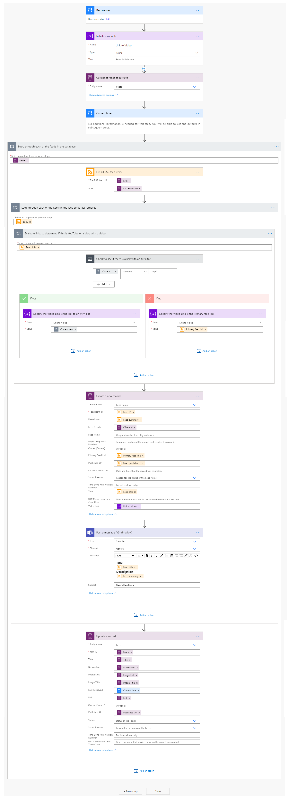

> [!div class="mx-imgBorder"]
> 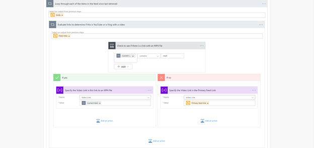

> [!div class="mx-imgBorder"]
> 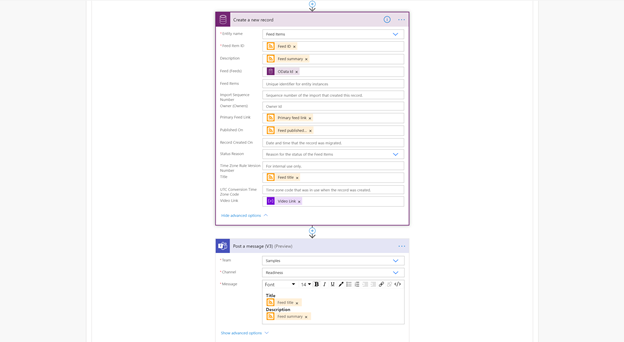

> [!div class="mx-imgBorder"]
> 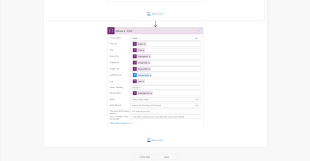

> [!NOTE]
> Power Automate has a trigger that allows you to detect when a new item is added to a feed for an individual feed. When tracking multiple feeds, this would require multiple feeds and would require the same number of flows to match the number of feeds. The approach taken in this lab is more complex but with the benefit of having a single flow that supports any number of configured feeds in a single flow.

### Create the flow

1. Select the **Build** tab.

1. Select on the name of your team in the list on the left column.

1. Select **See all** under the *Built by this Team* tab.

1. Select **New**.

1. Select **Flow** > **Scheduled**.

    > [!div class="mx-imgBorder"]
    > 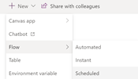

1. In the **Build a scheduled flow** dialog,

    1. Enter the name as "Retrieve Videos".

    1. Select **Day** as the frequency.

    1. Select **Create**.

    > [!div class="mx-imgBorder"]
    > 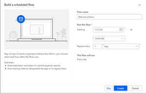

### Add the initialize variable action

1. Select **New Step**.

1. Enter *Initialize variable* in the search box, and select the initialize variable action.

1. Enter *Link to Video* in the **Name** field.

1. Select **String** in the drop-down for **Type**.

    > [!div class="mx-imgBorder"]
    > 

> [!NOTE]
> Don’t enter any value in the Value field.

### Add the List Records action

1. Select **New Step**.

1. Enter *Common Data Service (current environment)* in the search box and select the action named **List records**.

1. Select **Feeds** in the **Entity name** property.

1. Select ellipsis (…) in the header of the action and select **Rename**.

1. Rename the action to *Get list of feeds to retrieve*.

    > [!div class="mx-imgBorder"]
    > 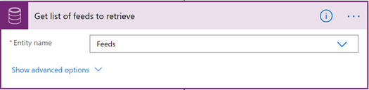

### Add the Current time action

1. Select **New Step**.

1. Enter "Date Time" in the search box and select the action named *Current time*.

    > [!div class="mx-imgBorder"]
    > 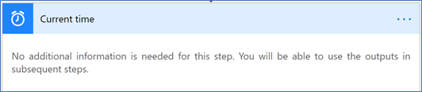

### Add the Apply to each action

1. Select **New Step**.

1. Enter *Apply to each* in the search box, and then select the action named **Apply to each**.

1. Select the text box under **Select output from previous steps**.

1. In the **Dynamic content** list, scroll down to the section **Get list of feeds to retrieve**, and select **value**.

1. Select ellipsis (…) in the header of the action and select **Rename**.

1. Rename the action to *Loop through each of the feeds in the database*.

    > [!div class="mx-imgBorder"]
    > 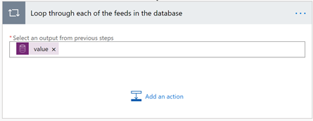

### Add the List all RSS Feed Items action

1. Select **Add an action**.

1. Enter "RSS" in the search box and select the action named **List all RSS feed items**.

1. Select the box for the property **The RSS feed URL**.

1. In the **Dynamic content**, scroll down to the section **Get list of feeds to retrieve**, and select **Link**.

1. Select in the box for the property "since" and select **Last Retrieved**.

    > [!div class="mx-imgBorder"]
    > 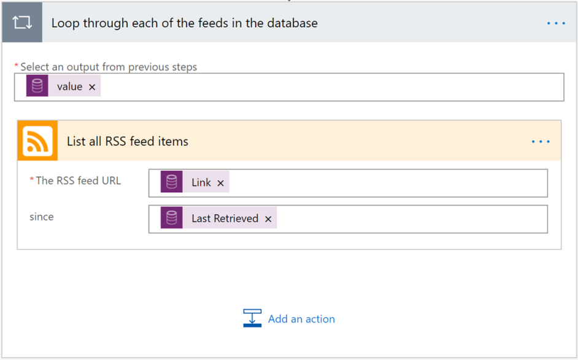

### Add the Apply to Each Action

1. Select **Add an action**.

1. Enter "Apply to each" in the search box and select the action named **Apply to each**.

1. Select the text box under **Select output from previous steps**.

1. In the **Dynamic content** list, scroll down to the section called **List all RSS feed items** and select **Value**.

1. Select ellipsis (…) in the header of the action, and then select **Rename**.

1. Rename the action to *Loop through each of the items in the feed since last retrieved*.

### Add the Apply to Each action

1. Select **Add an action**.

1. Enter *Apply to each* in the search box and select the action named **Apply to each**.

1. Select the text box under **Select output from previous steps**.

1. In the **Dynamic content** list, scroll down to the section **List all RSS feed items** and select **Feed links**.

1. Select ellipsis (…) in the head of the action, and then select **Rename**.

1. Rename the action to *Evaluate links to determine if this is YouTube or a Vlog with a video*.

### Add the Condition action

1. Select **Add an action**.

1. Enter *Condition* in the search box, and select the action named **Condition**.

1. Select the text box containing text **Choose a value**.

1. In the **Dynamic content** list that is displayed, scroll down to the section called **Evaluate links to determine if this is YouTube or a Vlog with a video**, and then select **Current item**.

1. Select the drop-down that shows **is equal to**, and select **contains**.

1. Select the text box text **Choose a value** and enter the value *.mp4*.

1. Select ellipsis (…) in the header of the action, and then select **Rename**.

1. Rename the action to *Check to see if there is a link with an MP4 file*.

1. In the **If yes**" path on the left, select **Add an action**.

    1. Enter **Set variable** in the search box, and select the action named **Set Variable**.

    1. Select **Video Link** in the drop-down for the *Name* property.

    1. Select the textbox for the **Value** property.

    1. In the **Dynamic content** list, scroll down to the section called **Evaluate links to determine if this is YouTube or a Vlog with a video** and select **Current item**.

    1. Select ellipsis (…) in the header of the action, and then select **Rename**

    1. Rename the action to *Specify the Video Link is this link to an MP4 File*.

1. In the **If No** path on the left, select **Add an action**.

    1. Enter **Set variable** in the search box, and select the action named **Set Variable**.

    1. Select **Video Link** in the drop-down for the **Name** property.

    1. Select the textbox for the **Value** property.

    1. In the **Dynamic content** list, scroll down to the section **List all RSS feed items** and select **Primary feed link**.

    1. Select ellipsis (…) in the header of the action, and then select **Rename**.

    1. Rename the action to *Specify the Video Link is the Primary feed link*.

        > [!div class="mx-imgBorder"]
        > 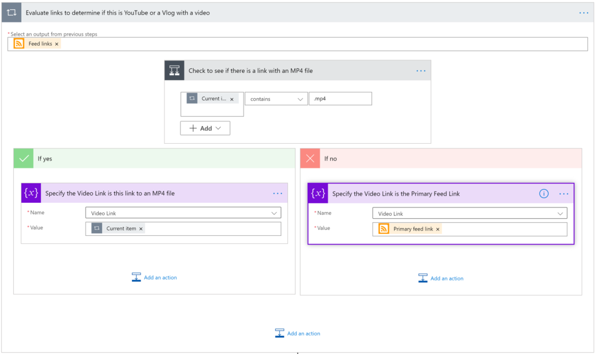

    Select the header of the action to show the title of **Evaluate links to determine if this is YouTube or a Vlog with a video**.

### Add the Create a New Record action

1. Under **List all RSS feed items** action, select **Add an action**.

1. Enter "Common Data Service (current environment)" in the search box, and then select the action called **Create a record**.

1. Select **Feed Items** in the *Entity name* property.

1. Select **Show advanced options** link in the action to display all the fields in  the table.

1. Select the textbox next to *Field Item ID*.

1. In the **Dynamic content** list scroll down to the section **List all RSS feed items**, and then select **Feed Item ID**.

1. In **Dynamic content** list, scroll down to the section **List all RSS feed items**, and then select **Feed summary**.

1. Select **Description**.

1. In the **Dynamic content** list, scroll down to the section called **List all RSS feed items** and select **Feed summary**.

1. Select **Feeds**.

1. In the **Dynamic content** list, scroll down to the section **Get list of feeds to retrieve**, and then select **Feeds**.

1. Select **Primary Feed Link**.

1. In the **Dynamic content** list scroll down to the section **List all RSS feed items**, and then select **Primary feed link**.

1. Select **Published On**.

1. In the **Dynamic content** list, scroll down to the section **List all RSS feed items**, and then select **Feed published on**.

1. Select **Title**.

1. In the **Dynamic content** list, scroll down to the section called **List all RSS feed items**, and then select **Feed title**.

1. Select **Primary Feed Link**.

1. In the **Dynamic content** list scroll down to the section **List all RSS feed items** and select **Primary feed link**.

1. Select **Video Link**.

1. In the **Dynamic content** list select **Video Link**.

    > [!div class="mx-imgBorder"]
    > 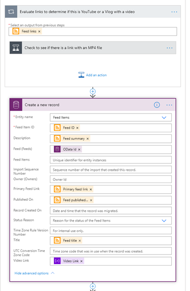

### Add the Set Variable action

1. Select **New step**.

1. Enter **Teams** in the search box, and select the **Post a Message (V3) (Preview) action**.

1. In the drop-down for the **Team** property, select the team to send the message.

1. In the drop-down for the **Channel** property, select the channel to send the message.

1. Select **Show advanced options** link.

1. In the *Message* property, create a message with details about the item. An example message is shown in the image below.

    > [!div class="mx-imgBorder"]
    > 

Select the the header of the action to show the title of **Loop through each of the items since last retrieved**.

### Add the Update Record action

1. Under "List all RSS feed items" action, select **Add an action**.

1. Enter "Common Data Service (current environment)" in the search box, and then select the action **Update a record**.

1. Select **Feeds** in the drop-down next to **Entity Name**.

1. Select **Item ID**.

1. In the **Dynamic content** list, scroll down to the section **Get list of feeds to retrieve**, and then select **Feeds**.

1. Select **Title**.

1. In the **Dynamic content** list, scroll down to the section **Get list of feeds to retrieve**, and then select **Title**.

1. **Description**

1. In the **Dynamic content** list, scroll down to the section **Get list of feeds to retrieve**, and then select **Description**.

1. Select **Image Link**.

1. In the **Dynamic content** list, scroll down to the section **Get list of feeds to retrieve**, and then select **Image Link**.

1. Select **Image Title**.

1. In the "Dynamic content" list, scroll down to the section **Get list of feeds to retrieve**, and then select **Image Title**.

1. Select **Last Retrieved**.

1. In the **Dynamic content** list, scroll down and select **Current time**.

1. Select **Link**.

1. In the **Dynamic content** list, scroll down to the section **Get list of feeds to retrieve**, and then select **Link**

1. Select **Published On**.

1. In **Dynamic content** list, scroll down to the section **Get list of feeds to retrieve**, and select **Published On**.

    > [!div class="mx-imgBorder"]
    > 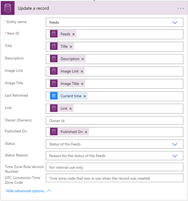

Your complete flow should look like the following:

> [!div class="mx-imgBorder"]
 > 

> [!div class="mx-imgBorder"]
> 

> [!div class="mx-imgBorder"]
> 

> [!div class="mx-imgBorder"]
> 

### Save the Flow

1. From the upper-right side of the screen, select **Save**.

1. Select the back arrow in the upper-left.

1. Select **Run** in the command bar.

1. From the panel on the right side of the screen, select **Run flow**.

1. Select **Done**.

1. Select the refresh button in the 28-day run history to show a successful run of the created flow.

If the flow doesn't show as succeeded, select **Run** and it will display the failed action with any associated error message.

## Edit the app

In this section, you'll create a new screen in the app that enables you and other members of the team to browse through videos, see the video details, and play them directly within Teams.

To start editing the app:

1. Select Power Apps from the left rail in Teams.

1. Select the **Build** tab.

1. Select the **Video Library** app.

Now create a new screen and configure the screen controls using the following steps.

### Create new screen

1. Select **Tree view**.

1. Select **New screen**.

1. Select **+** to begin adding controls to screen.

### Add the header

1. Enter **Rectangle** in the search box.

1. Drag the rectangle control onto the screen.

1. Set the following properties with these values:

    |Property  | Value |
    |----------|-------|
    | X  | 0  |
    | Y  | 0  |
    | Width  | 1365  |
    | Height  | 60  |
    | Color  | Purple  |

### Add the header label

1. Enter **Label** in the search box.

1. Drag the label onto the screen.

1. Set the following properties with these values:

    | Property  | Value  |
    |-----------|--------|
    | Text  | Video Library  |
    | Display Mode  | View  |
    | Font size  | 24  |
    | X  | 576  |
    | Y  | 0  |
    |Width | 191 |
    |Height | 61 |
    |Color | White |

### Add a rectangle for the Video List Header

1. Enter **Rectangle** in the search box.

1. Drag the rectangle control onto the screen.

1. Set the following properties with these values:

    |Property  | Value |
    |----------|-------|
    | X  | 0  |
    | Y  | 61  |
    | Width  | 1450  |
    | Height  | 58  |
    | Color  | Purple  |

### Add a label for the Video List Header

1. Enter **Label** in the search box.

1. Drag the label onto the screen.

1. Set the following properties with these values:

    | Property  | Value  |
    |-----------|--------|
    | Text  | Select a video from the list below  |
    | Display Mode  | View  |
    | Font size  | 14  |
    | X  | 39  |
    | Y  | 74  |
    |Width | 320 |
    |Height | 32   |
    |Color | White |

### Add a Vertical Gallery

1. Enter **Vertical Gallery** in the search box.

1. Drag the label onto the screen.

1. Set the following properties with these values:

    | Property  | Value  |
    |-----------|--------|
    | Name  | Video Library  |
    | Data Source  | Feed Items  |
    | Layout  | Image, title, and subtitle  |
    | X  | 0  |
    | Y  | 119  |
    |Width | 450 |
    |Height | 649 |

In the tree view on the left side of the screen, there are three controls underneath the Video Gallery with names starting with Subtitle, Title, and Image.

#### Set the Subtitle

1. Select the control that starts with **Subtitle**.

1. Select the **Advanced** tab in properties pane.

1. In the data section, set the **Text** property to *ThisItem.Feed.Title*

#### Set the Title

1. Select the control that starts with **Title**.

1. Select **Advanced** tab.

1. In the **Data** section, set the **Text** property to *ThisItem.Title*. <!--Tapan, is this correct? It is deleted in the markup-->

#### Set the Image

1. Select the control that starts with **Title**.

1. Select the **Advanced** tab in the properties pane.

1. In the **Data** section, set the **Text** property to *ThisItem.Feed.'Image Link'*.

### Add the background for the feed item

1. Enter **Rectangle** in the search box.

1. Drag the rectangle control onto the screen.

1. Set the following properties with these values:

    |Property  | Value |
    |----------|-------|
    | X  | 451  |
    | Y  | 61  |
    | Width  | 915  |
    | Height  | 707  |
    | Color  | Purple  |

### Add the feed item title header label

1. Enter **Label** in the search box.

1. Drag the label onto the screen.

1. Set the following properties with these values:

    | Property  | Value  |
    |-----------|--------|
    | Font size  | 18  |
    | X  | 466  |
    | Y  | 51  |
    |Width | 883 |
    |Height | 78   |
    |Color | White |

1. Select the **Advanced** tab.

1. Set the **Text** property to the following value: 

    *'Video Gallery'.Selected.Title*

### Add a Video Control

1. Enter **Vertical Gallery** in the search box.

1. Drag the label onto the screen.

1. Set the following properties with these values:

    | Property  | Value  |
    |-----------|--------|
    | Layout  | Image, title, subtitle  |
    | X  | 450  |
    | Y  | 129  |
    |Width | 916 |
    |Height | 523 |

1. Select the **Advanced** tab.

1. Set the **Media** property to the following value: 

    *'Video Gallery'.Selected.'Video Link'*

### Add the feed description HTML Text control

1. Enter **HTML text** in the search box.

1. Drag the HTML text control onto the screen.

1. Set the following properties with these values:

    | Property  | Value  |
    |-----------|--------|
    | Font size  | 14  |
    | X  | 458  |
    | Y  | 651  |
    |Width | 908 |
    |Height | 82        |
    |Color | White |

1. Select the **Advanced** tab.

1. Set the **Text** property to the following value: 

    *'Video Gallery'.Selected.Description*

### Add the Published On label

1. Enter **Label** in the search box.

1. Drag the Label onto the screen.

1. Set the following properties with these values:

    | Property  | Value  |
    |-----------|--------|
    | Font size  | 14  |
    | X  | 1153  |
    | Y  | 732  |
    |Width | 213 |
    |Height | 36        |
    |Color | White |

1. Select **Advanced** tab.

1. Set the **Text** property to the following value:

    *Concatenate("Published On ", Text('Video Gallery'.Selected.'Published Date'))*

### Enable toggle between screens

Currently there are two separate screens, but no way to toggle between them. The ability to toggle between the screens will be important to enable the addition of more feeds.

## Add the gear icon

1. Select **Screen2**.

1. Select **Add an icon** from the properties pane.

1. Select the **Settings** icon type.

1. Set the following properties with these values:

    | Property  | Value  |
    |-----------|--------|
    | X  | 1307 |
    | Y  | 6  |
    |Width  | 48 |
    |Height | 51   |

1. Select the **Advanced** tab.

1. In the **Action** section, set the **OnSelect** property to the following value:

    *Navigate(Screen1)*

### Configure the back button

1. Select **Screen1**.

1. Select the back button in the upper-left of the screen.

1. Select **Advanced** tab.

1. In the **Action** section, set the **OnSelect** property to the following value:

    *Navigate(Screen1)*

Selecting the gear icon will now display the form to edit the list of feeds. Selecting the back button will return to the list of videos.

## Test the app

Before publishing the application to teams, it’s important to test core functionality.

### Test the Power Automate Flow

1. Run the Power Automate flow.

1. Confirm that new items have been added to the **Feed Items** table.

1. Confirm that the flow has posted new messages to the Channel you specified when configuring the application.

### Test the app functionality

1. Open the app in Power Apps Studio.

1. From upper-right side of the screen, select **Preview**.

1. Select the list of feed items in the gallery on the left.

1. When you select an item, confirm that the Title, Description, Publish Date, and Video details are displayed.

1. Select the video and confirm the video plays.

### Test additions to the Feeds table

1. Add another feed to the **Feeds** table.

1. Re-run the Power Automate flow.

1. Repeat the above steps.

## Publish the app

1. Select the **Publish to Teams** icon in the upper-right.

1. Select **Next**.

1. Select **+** next to the Channels to add the app to.

1. Select **Save and close**.

    > [!div class="mx-imgBorder"]
    > 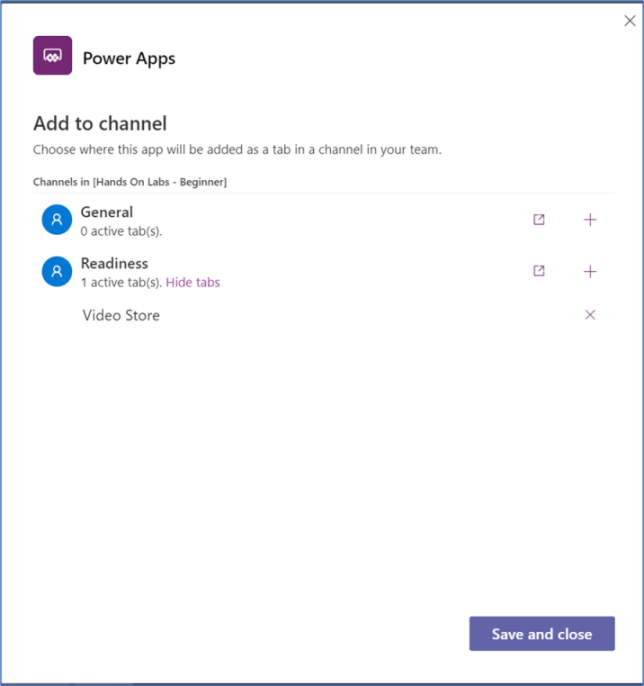
