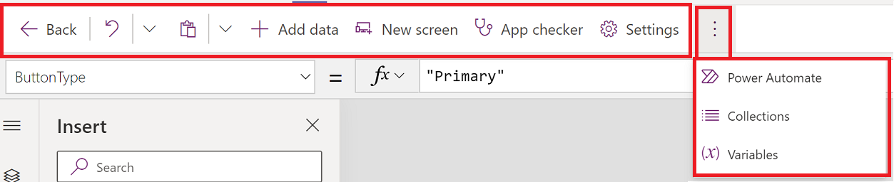
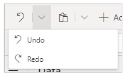
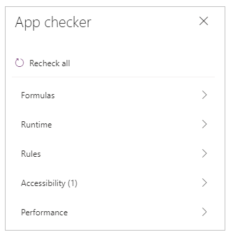
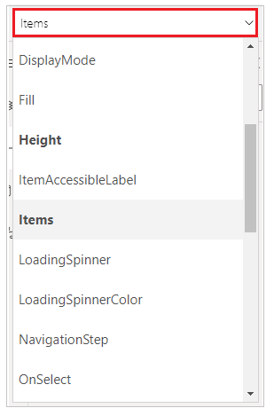
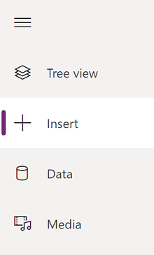

# Understand Power Apps Studio

[!INCLUDE [cc-beta-prerelease-disclaimer.md](../includes/cc-beta-prerelease-disclaimer.md)]

When you create a canvas app by using any method, you're taken to the canvas app
builder called Power Apps Studio. You can use Power Apps Studio to design, build, and manage your canvas app.

## Overview of Power Apps Studio

1. [Build hub](#1---build-hub) – select different tabs in the Power Apps app.

1. [Power Apps Studio options](#2--power-apps-studio-options) – options relevant to the settings in a Power Apps Studio session.

1. [App actions](#3--app-actions) - options to rename, save, preview, or publish the app.

1. [Properties list](#4--properties-list) - list of properties for the selected object.

1. [Formula bar](#5--formula-bar) - compose or edit a formula for the selected property with one
or more functions.

1. [Power Apps app](#6--power-apps-app) – Power Apps app in Microsoft Teams.

1. [App authoring menu](#7--app-authoring-menu) - selection pane to switch between data sources and
insert options.

1. [App authoring options](#8--app-authoring-options) - details pane with options relevant to the selected
menu item for authoring the app.

1. [Canvas/screen](#9--canvasscreen) - primary canvas for composing the app structure.

1. [Properties pane](#10--properties-pane) - properties list for the selected object in UI format.

1. [Screen selector](#11--screen-selector) - switch between different screens in an app.

1. [Change canvas screen size](#12--change-canvas-screen-size) - change the size of the canvas during an authoring experience in Power Apps Studio.

Let's understand each option in Power Apps Studio in detail.

## 1 - Build hub

Opening Power Apps Studio from the build hub opens an app authoring experience
that inherits the Teams interface and options. The **Home**, **Build**, and **About** tabs are described in [Overview of the Power Apps app](overview-of-the-power-apps-app.md).

## 2 – Power Apps Studio options

Power Apps Studio options are available on the menu in the upper-left corner. The
options are relevant to the current session and app-related settings.

### Undo and redo

- **Undo** – undo the last action.
- **Redo** – repeat the last action.

### Add data

- Create a new table by selecting **Create new table**.
- Select any other existing tables from the current environment.
- Search and select a connector, such as **SharePoint** or **SQL Server**.

### New screen

Add screens based on layouts or scenarios.

#### Layouts

Select a new screen to add to the app based on the layout of the screen.

#### Scenarios

Select a screen type based on the available scenarios, such as **Scrollable**, **List**, **Form**, **Success**, **Tutorial**, **Email**, **People**, **Meeting**, or **Calendar**.

### App checker

Runs the [App checker](https://powerapps.microsoft.com/blog/powerapps-checker-now-includes-app-checker-results-for-canvas-apps-in-solutions/) with available rules and shows the results.

### Settings

Configure the app's general settings.

| Setting name | Description |
| - | - |
| App name  | Shows the app name. To rename the app, select .  |
| License designation  | License designation of the app. More information: [How to check license designation for an app](../maker/canvas-apps/license-designation.md)  |
| Pass assignment  | Toggle switch for assigning passes for the app. More information: [About Power Apps per app plans](/power-platform/admin/about-powerapps-perapp.md)  |
| Preload app for enhanced performance  | Setting to let users download (preload) the app while authentication is in progress, enhancing the app load performance. More information: [Improve the performance of your app](../maker/canvas-apps/embed-teams-app.md#improve-the-performance-of-your-app)  |

### Power Automate

Create a new flow with Power Automate, or select any available flow.

More information: [Create flows using the Power Apps app in Teams](/power-automate/teams/create-flows-power-apps-app)

### Collections

List current [collections](../maker/canvas-apps/create-update-collection.md) used by the app.

### Variables

List current [variables](../maker/canvas-apps/working-with-variables.md) used by the app.

### Account details

Shows account details including session details, current Power Apps app build
version, and other session details. You can also turn the **Auto save** option **On** or **Off**.

> [!NOTE]
> We recommend that you keep the **Auto save** setting turned **On** and
save the changes to your app before closing Power Apps Studio.

## 3 – App actions

Use the options in the upper-right corner of Power Apps Studio to work with app-specific actions.

### App name editor

Select the name of the app to edit it.

### Save

Saves recent and unsaved changes you made to the app in Power Apps Studio. Each time you save changes, a new version is created.

### Preview

This will show a Preview version of the app in Teams that you can interact with.

### Publish to Teams

Publishes the app’s current version to a channel within Teams. For more
information about publishing an app, go to [Publish an app](publish-and-share-apps.md#publish-and-add-an-app-to-teams).

## 4 – Properties list

Shows the list of available properties for the selected object on the canvas.
The properties list changes based on your selection. For a complete list of all properties, go to [All properties](../maker/canvas-apps/reference-properties.md#all-properties).

## 5 – Formula bar

Use the formula bar to add, edit, or remove functions relevant to the selected
object and the property selected from the properties list. For example, select
the screen to update the background by using the [RGBA function](../maker/canvas-apps/functions/function-colors.md).

The formula bar is IntelliSense-enabled, and provides tips as you enter text to help you with the function syntax. If a formula returns an error, tips relevant to the syntax error and mitigation steps are displayed. When you start entering text that matches one or more functions, the formula bar shows inline function help and highlights help text relevant to the cursor position.

Similarly, you'll find help when working with complex functions, nested
functions, or when correcting a formula syntax.

For a quick and easy function reference, you can also select the formula drop-down menu.

Select an event type from the drop-down menu at the top of the dialog box, such as
**Action** instead of **Text**.

Select an action that you want to add a function for.

The available functions for the selected event type are dynamically updated
depending on the object you select. For example, if you selected a button on the
canvas, the available **Action** functions also include the function
*ClearCollect()*.

 selected")

You can read the description of the selected **Action** function. Double-clicking a function name adds it into the formula bar.

For a complete list of all canvas app functions, go to [Formula reference](../maker/canvas-apps/formula-reference.md).

## 6 – Power Apps app

The Power Apps app in Teams is described in detail in [Overview of the Power Apps app](overview-of-the-power-apps-app.md).

## 7 – App authoring menu

On the left pane in Power Apps Studio, you switch between options such as **Insert**, **Data Sources**, **Media**, and **Advanced tools**.

You can also select the expand button to expand the list to include names instead of just icons.

## 8 – App authoring options

The options for working with canvas apps change depending on the selection on the left pane, such as **Tree view**, **Insert**, **Data sources**, **Media**, or **Advanced tools**.

### Tree view

Select the tree view to show the screens available in the app,

> [!TIP]
> Select **App** in the tree view to work with app-specific controls or to
change app behavior, such as adding a formula on *OnStart* event of the app.

Switch to the **Components** tab to work with component library features. You can add
new components or reuse those that were already published from published
component libraries. More information: [Component library](../maker/canvas-apps/component-library.md)

### Insert

**Insert** shows all the popular objects or controls that you can
add on the selected screen in your canvas app. You can also expand other
choices or use the components option to insert controls from a component
library.

To insert controls on the canvas, you can drag the control to the canvas,
select the control, or select **(...)** and then select **Add to canvas**.

#### Popular controls
| **Name**      | **Description**                                                                                      |
|-----------------|------------------------------------------------------------------------------------------------------|
|*Label* | A box that shows data such as text, numbers, dates, or currency. |
|*Edit form*|Display, edit, or create a record in a data source.|
|*Text*|A box that shows text.|
|*Text box*|A box in which the user can enter text, numbers, and other data.|
|*Vertical gallery*|A control that contains other controls and shows a set of data.|
|*Add icon*|Graphics for which you can configure appearance and behavior properties.|
|*Rectangle*|A rectangular shape to configure the canvas appearance.|
|*Date Picker*|A control that the user can select to specify a date.|
|*Button*|A control that the user can select to interact with the app.|

For more information about the controls that you can insert, and their properties
and definitions, go to [Controls and properties in Power Apps](../maker/canvas-apps/reference-properties.md).

### Data

Add, refresh, or remove data sources from your canvas app. You
can add one or more
[connections](../maker/canvas-apps/connections-list.md)
by using data sources.  

In addition to data stored within Tables, there are a number of connectors available to interact with data in popular SaaS, services, and systems.

Select **Create new table** to create a new table in the Project Oakdale
environment.

To choose other connectors such as SharePoint, OneDrive, or SQL Server, you can
enter text in the data source search box or select from the list of connectors.

More information: [List of all Power Apps connectors](/connectors/connector-reference/connector-reference-powerapps-connectors)

### Visual editor

When you select **Create new table** and enter a name for the new table, you open the visual editor where you can design the table, add columns of different data types, enter data in rows, and save the changes.

To get started with the visual editor, select **Create new table** and enter
the table name.

> [!NOTE]
> You can use the visual editor in Power Apps Studio to quickly create a table while authoring an app. However, you can also use the [Build tab](edit-delete-table.md) to edit or delete the tables you create by using Power Apps Studio. Go to [Create tables in Microsoft Teams](create-table.md) for more information about creating tables by using the **Build** tab.

#### Understand the visual editor

##### Table name

Select **Edit**  to edit the name of the table.

##### Add row

Select **Add row** to add a new row to the table.

##### Add columns

Select **Add columns** to add new columns of the available column types
supported by the visual editor.

###### Supported column types

Visual editor supports specific data types as columns. The following options
are available when creating a new column using the visual editor inside Power Apps Studio:

> [!IMPORTANT]
> To add columns of types that aren't supported by the visual editor, such as file or image, [create a table](create-table.md) by using the build hub instead.

###### Advanced options

The advanced options for columns change depending on the type of column. For example, a **Text** column type has an advanced option for **Max length**. By contrast, an **Auto number** column type has options such as the type of auto-numbering, prefixes, and maximum number of digits. More information: [Types of fields](../maker/common-data-service/types-of-fields.md)

##### Show/hide columns

Use the **Show/hide columns** option to show or hide available columns, including columns automatically created as part of the table metadata.

##### Refresh

Refreshes the current table with data.

##### Save

To save changes to a table, select **Save.** When you change a table and try to close it without saving changes, you're prompted to discard changes.

To ensure that changes to the table are saved, you can select the next row inside the table, or select any other cell after editing a cell to trigger the auto-save functionality.

After you close a saved table, you'll see the table added to the list of
available data sources in **Data** on the left pane.

##### Visual editor view

Select from the options of **Compact**, **Default**, or **Comfortable** layouts to switch the view with columns and rows spacing to change the visual editor layout.

##### Row count

Shows the row counts in the table.

##### Column options

Select the drop-down menu next to the column heading to view column-related options.

| **Option**      | **Description**                                                                                      |
|-----------------|------------------------------------------------------------------------------------------------------|
| *Edit column*   | Edit the column name or advanced options. After it's created, you can't change the name of the column. |
| *Hide*          | Hide or unhide the column.                                                                           |
| *Insert column* | Insert a new column at the selected column location.                                                 |
| *A to Z*        | Sort records in ascending order.                                                                     |
| *Z to A*        | Sort records in descending order.                                                                    |
| *Filter by*     | Filter column data based on the filter criteria you define.                                                 |
| *Move left*     | Move the column to the left from the current position.                                               |
| *Move right*    | Move the column to the right from the current position.                                              |
| *Pin left*      | Pin the column to the left side of the table.                                                        |
| *Pin right*     | Pin the column to the right side of the table.                                                       |
| *Delete column* | Delete the column.                                                                                   |

##### Edit existing table

After you add rows and columns, and add data, you can close the table and use it as
the data source in your app. To edit content in the table, you can use
the app controls or go back to the visual editor.

To edit the table, select the table data source, and then select **Edit data** to
open the table in the visual editor.

After you close the visual editor, the data source is automatically refreshed
to reflect the updated data in Power Apps Studio. You can also select **Refresh**
to manually refresh Power Apps Studio to reflect the data in the controls you added on the canvas.

### Media

Select **Media** to add images, video, or audio files to your app. Adding media directly to your app uploads the files to the app and uses the app storage. Each file uploaded to the app as media must be 64 MB or smaller, and the size of all media files uploaded to an app can't exceed 200 MB.

If you want to reference additional media, consider using [audio and video controls with URLs](../maker/canvas-apps/add-images-pictures-audio-video.md#add-images-audio-or-video-using-the-controls),
using media from [Azure Media Services](../maker/canvas-apps/add-images-pictures-audio-video.md#add-media-from-azure-media-services),
or from [Microsoft Stream](../maker/canvas-apps/controls/control-stream-video.md#example).
More information: [Using multimedia files in Power Apps](../maker/canvas-apps/add-images-pictures-audio-video.md)

### Advanced tools

Go to **Advanced tools** to work with the canvas app Monitor and the Test Studio. Canvas app Monitor is useful when debugging a canvas app or when diagnosing a problem with the app&mdash;such as investigating performance degradation or a time delay when the app is used. With Test Studio, you can
develop and reuse tests specific to individual apps based on scenarios. These tests can be useful when automating canvas app testing during application lifecycle management (ALM) scenarios, such as releasing a new version of the app.

More information: [Debugging an app with canvas app Monitor](../maker/canvas-apps/monitor.md) and [Test Studio](../maker/canvas-apps/test-studio.md)

## 9 – Canvas/screen

The canvas shows the currently selected screen from the left pane.

## 10 – Properties pane

The properties pane shows properties and options available for the currently
selected object on the canvas. The **Properties** tab shows generic options such as the name, color, size, or position. The **Advanced** tab shows additional options for advanced customization. The advanced properties might sometimes be locked for editing, such as when working with data cards. You can select [Unlock to change properties](../maker/canvas-apps/working-with-cards.md#unlock-a-card) in such situations.

## 11 – Screen selector

Use the screen selector to switch between screens when your canvas app has multiple screens. You can also select a screen from the left pane by selecting the
tree view. If the current selection is inside a container, or inside an individual cell in a gallery, the selector shows the breadcrumbs for the parent elements at each level.

## 12 – Change canvas screen size

You can zoom in or zoom out while authoring the canvas app. Select **Ctrl**+**0**
**Fit to window** to fit the screen size
based on the current authoring window size. Note that the zoom percentage or screen size you use while
authoring a canvas app has no impact on the aspect ratio configured for the app when you preview your app or play a published app.

### See also

[Use the Fluent UI controls](use-the-fluent-ui-controls.md)  
[Overview of the Power Apps app](overview-of-the-power-apps-app.md)
