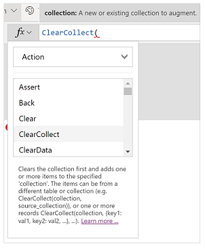
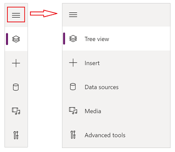
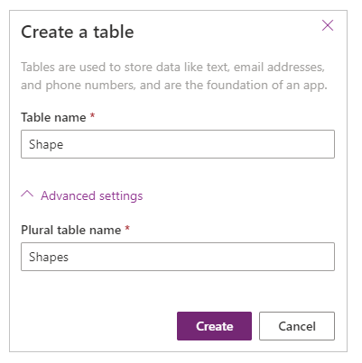
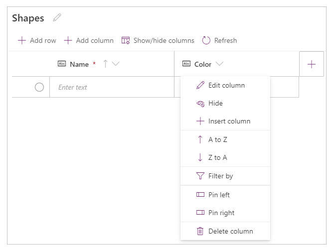
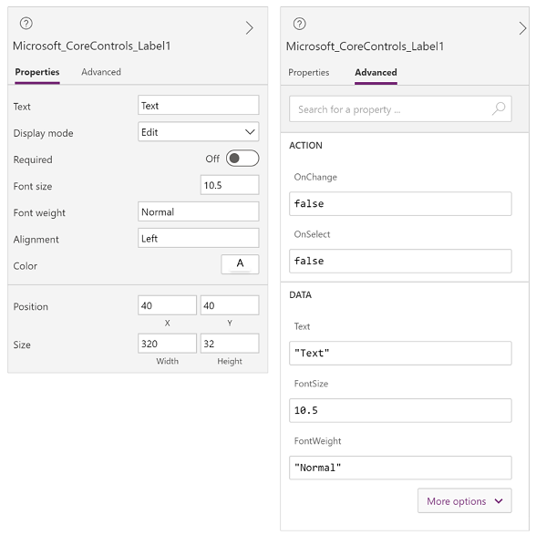

# Understand Power Apps Studio

When you create a canvas app using any method, you’re taken to the canvas app
builder called Microsoft Power Apps Studio. You can use Power Apps Studio to design, build, and manage your canvas app.

## Overview of Power Apps Studio

1. [Build hub](#1---build-hub) – select different tabs inside the Power Apps app.

1. [Power Apps Studio options](#2--power-apps-studio-options) – options relevant to the settings within Power Apps Studio session.

1. [App actions](#3--app-actions) - options rename, save, preview, or publish the app.

1. [Properties list](#4--properties-list) - list of properties for the selected object.

1. [Formula bar](#5--formula-bar) - compose or edit formula for the selected property with one
or more functions.

1. [Power Apps app](#6--power-apps-app) – Power Apps app in Teams.

1. [App authoring menu](#7--app-authoring-menu) - selection pane to switch between data sources and
insert options.

1. [App authoring options](#8--app-authoring-options) - details pane with options relevant to the selected
menu item for authoring the app.

1. [Canvas/screen](#9--canvasscreen) - primary canvas for composing the app structure.

1. [Properties pane](#10--properties-pane) - properties list for the selected object in UI format.

1. [Screen selector](#11--screen-selector) - switch between different screens within an app.

1. [Change canvas screen size](#12--change-canvas-screen-size) - change the size of the canvas during
authoring experience inside Power Apps Studio.

Let’s understand each option inside Power Apps Studio in detail.

## 1 - Build hub

Launching Power Apps Studio from the build hub opens the app authoring experience inside Teams interface
that inherits the Teams interface and options. The **Home**, **Build** and **About** tabs are explained earlier in the section [Overview of the Power Apps app](overview-of-the-power-apps-app.md).

## 2 – Power Apps Studio options

Power Apps Studio options available are available on top-left menu. The
options are relevant to the current session and app-related settings.

### Undo and redo

- Undo – undo the last action.
- Redo – repeat the last action.

### Add data

Allows you to:

- Create a new table using **Create new table** button.
- Select any other existing tables from the current environment.
- Search and select a connector, such as **SharePoint** or **SQL Server**.

### New screen

Allows you to add screens based on layouts or scenarios.

#### Layouts

Select a new screen to add to the app based on layout of the screen.

#### Scenarios

Select a screen type based on the available scenarios, such as *Scrollable,
List, Form, Success, Tutorial, Email, People, Meeting, or Calendar.*

### App checker

Runs the [App
checker](https://powerapps.microsoft.com/blog/powerapps-checker-now-includes-app-checker-results-for-canvas-apps-in-solutions/) with available rules and shows the results.

### Settings

Allows you to configure app’s genera settings and turn features on or off.

#### General settings

Launches app’s general settings and options such as the app name, icon, data row limit, and app icon fill colors.

#### Features

**Features** option allows you to turn *Preview* or *Experimental* features *On*
or *Off*.

For more information, go to [preview, experimental, or deprecated
features](../maker/canvas-apps/working-with-experimental-preview.md).

### Power Automate

Lets you create a new flow using Power Automate or select any already available
flow.

For more information about Power Automate, go to Working with flows.

### Collections

List current [collections](../maker/canvas-apps/create-update-collection.md) used by the app.

### Variables

List current [variables](../maker/canvas-apps/working-with-variables.md) used by the app.

### Account details

Shows account details including session details, current Power Apps app build
version, and other session details. You can also turn the **Auto save** option **On** or **Off**.

> [!NOTE]
> We recommend that you keep **Auto save** setting turned **On** and
save the changes to your app before closing Power Apps Studio.

## 3 – App actions

The options on top-right corner of Power Apps Studio allow you to work with app-specific actions.

### App name editor

Select the name of the app to edit it.

### Save

Saves recent and unsaved changes you made in Power Apps Studio to the app. Each time you save the changes, a new version is created.

### Preview

Preview the app inside Teams. Use preview option to run the app, similar to play but only within authoring session.

### Publish to Teams

Publishes the app’s current version to Teams for everyone to use. For more
information about publishing an app, go to Publish an app.

### Share

Allows you to share the app with other users or groups. For more information
about sharing an app, go to Share an app.

### Version history

Shows all the versions of the app. You can view app versions, version comments, and the currently published version. From the version history page, you can also restore an app to a particular version. For more information about version history, go to Restore an app.

## 4 – Properties list

Shows the list of available properties for the selected object on the canvas.
The properties list changes based on your selection. For a complete list of all properties, go to [properties reference](../maker/canvas-apps/reference-properties.md#all-properties).

## 5 – Formula bar

Use the formula bar to add, edit, or remove functions relevant to the selected
object and the property selected from the properties list. For example, select
the screen to update the background using the [RGBA function](../maker/canvas-apps/functions/function-colors.md).

The formula bar is IntelliSense enabled. IntelliSense provides tips as you enter text inside the formula bar to help you with the function syntax. If a formula returns an error, the IntelliSense also shows tips relevant to the syntax error and mitigation steps. When you start entering text that matches to one or more functions, the formula bar shows in-line function help and highlights help text relevant to the cursor position.

Similarly, use the IntelliSense when working with complex functions, nested
functions, or when correcting a formula syntax.

For a quick and easy function reference, you can also select the formula
drop-down.

Select an event type from the drop-down at the top of the dialog, such as
**Action,** instead of **Text**.

Select an action that you want to add a function for.

The available functions for the selected event type are dynamically updated
depending on the object you select. For example, if you selected a button on the
canvas, the available **Action** functions also include function
*ClearCollect()*.

You can read the description of the selected **Action** function and selecting
the function name twice adds the function into the formula bar.

For a complete list of all canvas app functions, go to [Formula
reference](../maker/canvas-apps/formula-reference.md).

## 6 – Power Apps app

The **Power Apps** app inside Teams. The app and app interface is explained in
more detail in [Overview of the Power Apps app](overview-of-the-power-apps-app.md).

## 7 – App authoring menu

The left pane on Power Apps Studio allows you to switch between options such as **Insert**, **Data Sources**, **Media, and **Advanced tools**.

You can also select the expand button to expand the list to include names,
instead of only icons.

## 8 – App authoring options

The options for working with canvas app change depending on the selection in the left pane, such as the **Tree view**, **Insert**, **Data sources**, **Media**, or **Advanced tools**.

### Tree view

Select the tree view to show the screens available in the app,

> [!TIP]
> Select **App** in tree view to work with app-specific controls, or to
change app behavior, such as adding a formula on *OnStart* event of the app.

Switch to the components to work with component library features. You can add
new components or reuse the already published components from published
component libraries. For more information, go to [working with component
libraries](../maker/canvas-apps/component-library.md).

### Insert

**Insert** shows all the popular objects or controls that you can
add on the selected screen in your canvas app. You can also expand other
choices or use the components option to insert controls from a component
library.

To insert controls on the canvas, you can drag and drop the control on canvas,
select the control, or use the ellipsis (…) option and then choose *Add to
canvas*.

#### Popular controls

*Label* - A box that shows data such as text, numbers, dates, or currency.

*Edit form* - Display, edit, and create a record in a data source.

*Text* – A box that shows text.

*Text box* - A box in which the user can type text, numbers, and other data.

*Vertical gallery* - A control that contains other controls and shows a set of
data.

*Add icon* - Graphics for which you can configure appearance and behavior
properties.

*Rectangle* – A rectangular shape to configure canvas appearance.

*Date Picker* - A control that the user can select to specify a date.

*Button* - A control that the user can select to interact with the app.

For more information about the controls that you can insert, their properties
and definitions, go to [controls and properties in Power
Apps](../maker/canvas-apps/reference-properties.md).

### Data

Data allows you to add, refresh, or remove data sources from your canvas app. You
can add one or more
[connections](../maker/canvas-apps/connections-list.md)
using data sources.

You can also use the tables created using the **Tables** option inside the
environment by expanding the **Tables** option.

Select **Create new table** to create a new table inside the ***REMOVED***
environment.

To choose other connectors such as SharePoint, OneDrive or SQL Server, you can
enter the text in data source search box or select from the list of connectors.

For more details about Power Apps Connectors, go to [list of all Power Apps
Connectors](https://docs.microsoft.com/connectors/connector-reference/connector-reference-powerapps-connectors).

### Table designer

When you select **Create new table** and enter a name for the new table, you can see the **Table designer**. Use the Table designer to design the table, add columns of different data types, enter data in rows, and save the changes.

To get started with the Table designer, select **Create new table** and enter
the table name.

> [!NOTE]
> **Table designer** inside Power Apps Studio allows you to quickly create a table while authoring an app. You can create tables quickly using the Table designer from Power Apps Studio. However, you can also use the [Build hub](edit-delete-table.md) to edit or delete the tables you create using Power Apps Studio. Go to [Create a Table](create-table.md) for more information about creating table using the build hub.

#### Understand Table designer

##### Table name

Select the  icon to edit the name of the table.

##### Add row

Select **Add row** to add a new row inside the table.

##### Add columns

Select **Add columns** to add new columns of the available column types
supported by the Table designer.

###### Supported column types

Table designer supports specific data types as columns. The following options
are available when creating a new column using the Table designer inside the
Power Apps Studio:

> [!IMPORTANT]
> To add columns not supported by the Table designer, [Create a Table](create-table.md) using the build hub instead of the Table designer.

###### Advanced options

The advanced options of columns change depending on the type of the column. For example, a **Text** column type has advanced option of **Max length.** **Auto number** column type instead has more options such as the type of auto numbering, prefixes, and maximum number of digits. For more information about the data types of columns in a ***REMOVED*** table, go to [types of
columns](../maker/common-data-service/types-of-fields.md).

##### Show/hide columns

Use the **Show/hide columns** option to show or hide available columns;
including columns automatically created as part of the table metadata.

##### Refresh

Refreshes the current table with data.

##### Save

To save the changes to table, select the **Save.** When you change table and try to close the table without saving changes, you’re prompted to discard changes.

To ensure the changes to the table are saved, you can select the next row inside the table, or select any other cell after editing a cell to trigger the auto save functionality.

After you close a saved table, you’ll see the table added to the list of
available data sources inside the **Data** option in Power Apps Studio.

##### Table designer view

Select from the options of **Compact**, **Default**, or **Comfortable** layouts to switch the view with columns and rows spacing to change the Table designer
layout.

##### Row count

Shows the row counts inside the table.

##### Column options

Select the drop-down option at the top of the column name to view column-related options.

| **Option**      | **Description**                                                                                      |
|-----------------|------------------------------------------------------------------------------------------------------|
| *Edit column*   | Edit the column name or the advanced options. Once created, you can’t change the name of the column. |
| *Hide*          | Hide or unhide the column.                                                                           |
| *Insert column* | Insert a new column at the selected column location.                                                 |
| *A to Z*        | Sort records in ascending order.                                                                     |
| *Z to A*        | Sort records in descending order.                                                                    |
| *Filter by*     | Filter column data based on filter criteria defined.                                                 |
| *Move left*     | Move the column to the left from the current position.                                               |
| *Move right*    | Move the column to the right from the current position.                                              |
| *Pin left*      | Pin the column to the left side of the table.                                                        |
| *Pin right*     | Pin the column to the right side of the table.                                                       |
| *Delete column* | Delete the column.                                                                                   |

##### Edit existing table

Once you add rows, columns and add data, you can close the table and use it as
the data source inside your app. To edit content inside the table, you can use
the app controls, or go back to the Table designer to edit the table.

To edit the table, select the table data source and then select **Edit data** to
open the table inside Table designer.

After you close the Table designer, the data source is automatically refreshed
to reflect the updated data inside Power Apps Studio. You can also select **Refresh**
to manually refresh Power Apps Studio to reflect the data inside the controls added on the canvas.

### Media

Use the **Media** option to add images, video, or audio files to your app. Adding media directly to your app uploads the files to the app and uses the app storage. Each file uploaded to the app as media can’t exceed 64 MB and the size of all media files uploaded to an app can’t exceed 200 MB.

If you want to reference additional media, consider using [audio and video controls with URLs](../maker/canvas-apps/add-images-pictures-audio-video.md#add-images-audio-or-video-using-the-controls),
using media from the [Azure Media Services](../maker/canvas-apps/add-images-pictures-audio-video.md#add-media-from-azure-media-services),
or from [Microsoft Stream](../maker/canvas-apps/controls/control-stream-video.md#example).
For more details about **Media**, go to [add multimedia files to Power Apps](../maker/canvas-apps/add-images-pictures-audio-video.md).

### Advanced tools

Go to **Advanced tools** to work with the canvas app **Monitor** and the **Test Studio**. Canvas app **Monitor** is useful when debugging a canvas app, or when
diagnosing a problem with the app – such as to investigate performance degradation or time delay when using the app. **Test Studio** allows you to
develop and reuse tests specific to individual apps based on scenarios. These tests can be useful when automating canvas app testing during application lifecycle management (ALM) scenarios, such as when releasing a new version of the app.

For more information about Monitor and Test Studio, go to [debugging an app with canvas app Monitor](../maker/canvas-apps/monitor.md) and [Canvas app Test Studio](../maker/canvas-apps/test-studio.md).

## 9 – Canvas/screen

The canvas shows the currently selected screen from the left pane.

## 10 – Properties pane

The properties pane shows properties and options available for the currently
selected object on the canvas. **Properties** tab shows generic options, such as the name, color, size, or position. **Advanced** tab shows additional options for advanced customization. The advanced properties may sometimes be locked for editing, such as when working with data cards. You can select [Unlock to change properties](../maker/canvas-apps/working-with-cards.md#unlock-a-card) in such situations while working with advanced customization.

## 11 – Screen selector

Use the screen selector to switch between screens when your canvas app has multiple screens. You can also select a screen from the left pane using the
**Tree view**. If the current selection is inside a container, or an individual cell inside a gallery, the selector shows the breadcrumbs for the parent elements at each level.

## 12 – Change canvas screen size

You can zoom in or zoom out while authoring the canvas app. Use **Ctrl+0**
keyboard combination or select the **Fit to window** to fit the screen size
based on current authoring window size. Note the zoom or screen size while
authoring a canvas app has no impact on the aspect ratio configured for the app when you preview your app or play a published app.

### See also

- [Use the Fluent UI controls](use-the-fluent-ui-controls.md)
- [Overview of the Power Apps app](overview-of-the-power-apps-app.md)
