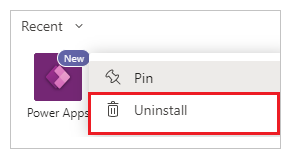

# Uninstall the Power Apps personal app

Uninstalling the Power Apps app removes the app as a personal app available to your account. Uninstalling the Power Apps app doesn't uninstall or remove the apps created by using Power Apps from the respective Microsoft Teams channels.

To uninstall the Power Apps personal app:

1. Select  on the left pane in Teams.

    

2. Find the Power Apps app by using search, if it's not visible in your most recent view.

3. Right-click to select **Power Apps** app, and then select **Uninstall** from the shortcut menu.

    

5. In the window that appears, select **Uninstall**.

    

The Power Apps app is now uninstalled from Teams.

### See also

[Install the Power Apps personal app](install-personal-app.md)

[!INCLUDE[footer-include](../includes/footer-banner.md)]