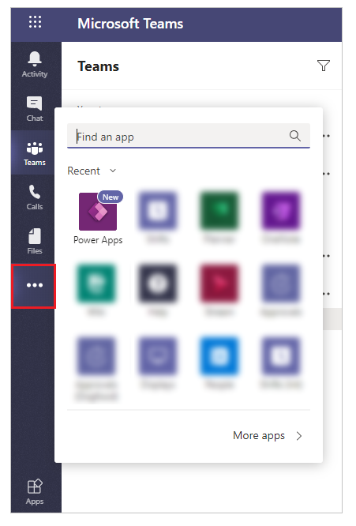

# Uninstall Power Apps personal app

Uninstalling Power Apps app removes the app as a personal app available to your account. Uninstalling Power Apps app doesn’t uninstall or remove the apps created using Power Apps from the respective Teams channels.

To uninstall Power Apps personal app:

1. Select 
from the left pane inside Teams.

    

2. Find the Power Apps app using search, if not visible in recent view.

3. Right-click on **Power Apps** app.

    

4. Select **Uninstall**.

5. Confirm **Uninstall**.

    

Power Apps app is now uninstalled from your Teams.

