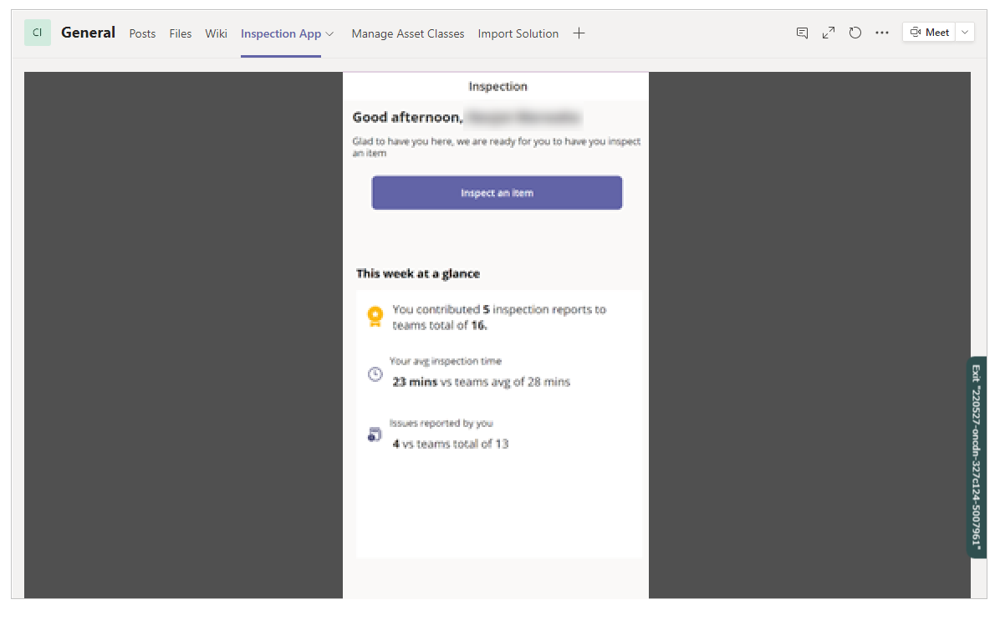
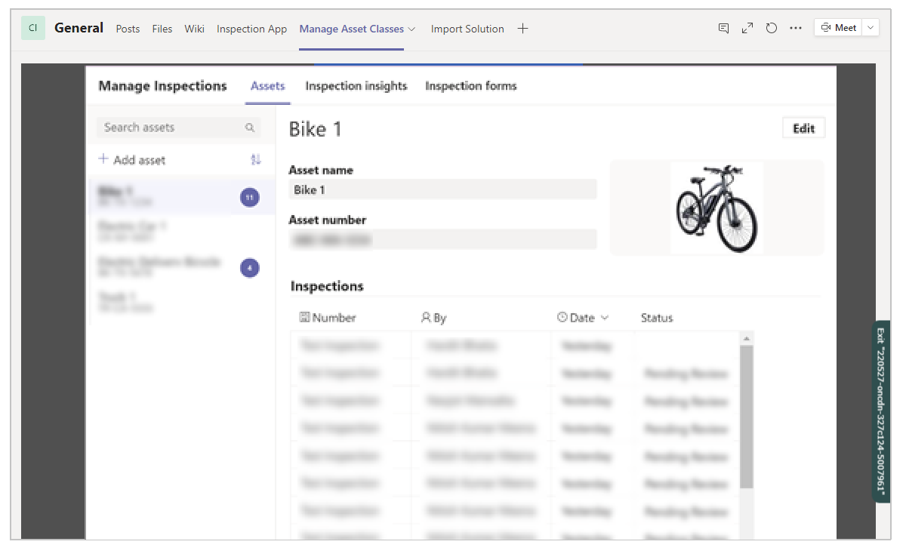

# Install sample Power Apps app in Teams

[!INCLUDE [cc-beta-prerelease-disclaimer.md](../includes/cc-beta-prerelease-disclaimer.md)]

Sample apps created using Power Apps are available in the Teams store. You can select the sample app that best fits your business requirement and quickly install to get started. In this article, you'll learn about one such sample application that helps inspect vehicles. Sample apps created using Power Apps and published to the Teams store may consist of multiple components such as apps, flows, and tables.

The sample app you'll learn in this article consists of several tables and two apps, **Inspection App** and **Manage Asset Classes**. After you install the sample app, you can go to the team that you added the app to and use the tabs for the apps just like other features such as **Post**, **Files**, or **Wiki**.

> [!IMPORTANT]
> Installing the sample app automatically enables the selected team’s Microsoft 365 Group for security. For more information about Microsoft 365 Group and security, go to [enable security for the selected team’s Microsoft 365 Group](../maker/canvas-apps/share-app.md#share-an-app-with-office-365-groups).

## Install sample app

To get started with installing the sample Power Apps app in Teams:

1. Select **Apps** at the bottom of left pane inside Teams.

2. Search for **Inspection App**.

3. Select the **Inspection App**.

4. Select **Add to a team**.

    

5. Search for the Teams channel that you want to add the apps to.

    

6. Select **Set up a tab**.

   

7. Select **Save** to confirm and start the installation.

    

    > [!NOTE]
    > You can keep **Post to the channel about this tab** selected to
    communicate the addition of the app. Unchecking will not announce the
    addition of the app on the selected channel as a post.

8. Installation of the app begins. Installation may take a while and you can continue
    with other activities.

    

    > [!NOTE]
    > If the selected Teams team doesn’t already have an environment created, a new environment is created at this stage. For more information about environment lifecycle, go to [Environment lifecycle](/power-platform/admin/about-teams-environment.md).

9. After the app installs, you’ll see two tabs added, **Inspection App** and **Manage Asset Classes.** Upon completion of installation, you can remove the **Installing App** tab.

    

## Run the sample app

To run the installed app, select app from the available tabs inside the Teams channel that you added the app to.

For example, to run the **Inspection App**, select the app from the available
tabs on your Teams channel.

Likewise, select **Manage Asset Classes** to run the asset class management app.

### Add Asset Types

To start with the **Inspection App**, you’ll need to add **Asset Types**. The
Asset Types define the classes of different assets that can be added to the app
for inspection.

To add asset types:

1. Go to **Asset Manager** tab in Teams.

2. Select **Assets** tab inside the app.

3. Add asset types, such as Bike, Car, or a Truck.

### Add Assets

Assets are the individual items or vehicles that you want to inspect.

To add assets:

1. Go to **Manage Asset Classes** tab in Teams.

2. Select **Assets** tab inside the app.

3. In the form that opens, fill in the asset details such as the asset name, unique ID, and asset class.

### Add Inspection Forms

Inspections forms are tied to asset types. You can define more than one inspection form for each asset type. For example, you can define a “Daily Car Inspection” and a “Daily Car Inspection” form for the asset type “Car”.

To add Inspection Forms:

1. Go to **Manage Asset Classes** tab in Teams.

2. Select **Inspection Forms** tab inside the app.

3. Select **Add a form** on left-side of the screen.

You can enter one or more checks for this inspection form. Each check can have a *Title*, *Detailed Instructions*, and an *Image*. Each checklist item can also have up to three action buttons associated, reflecting “Pass”, “Fail” and “Not Applicable” outcomes. The labels of the buttons can be customized.

### Associate forms to asset types

To associate forms to the asset types:

1. Go to **Asset Manager** tab in Teams.

2. Select **Assets** tab inside the app.

3. Associate the inspection form to the asset type.

## Edit the sample app

You can further customize and edit the components of an installed Power Apps app in Teams. To edit and manage the installed Power Apps Teams app in Teams, go to [Manage your apps](manage-your-apps.md).

### Report installation errors

If you get any errors during the installation process, you can help us troubleshoot the problem much more effectively with the session details using CTRL+ALT+A on the keyboard. To learn more about the session details, go to [About tab](overview-of-the-power-apps-app.md#about-tab).

### See also

- [Install Power Apps personal app](install-personal-app.md)
- [Create your first app](create-first-app.md)
- [Create additional apps](create-additional-apps.md)
