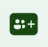

# Use sample apps from the Microsoft Teams store

Sample apps that were created by using Power Apps are available in the Teams store. You can select the sample app that best fits your business requirement and quickly install it to get started. In this article, you'll learn about one such sample app that helps manage campaigns and ideas. Sample apps created with Power Apps and published to the Teams store can consist of multiple components such as apps, flows, and tables.

In this tutorial, you'll learn how to search for a sample app in the Teams store and add it to your team channel. After you install the sample app, you can go to the team that you added the app to and use the tabs for the app just as you use other features such as **Post**, **Files**, or **Wiki**.

> [!IMPORTANT]
> Installing the sample app automatically enables the selected team's Microsoft 365 Group for security. More information: [Enable security for the selected team's Microsoft 365 Group](../maker/canvas-apps/share-app.md#share-an-app-with-microsoft-365-groups)

## Available sample apps

Several sample apps are available from the Teams store that you can add to your Teams channels and use for different purposes.

:::row:::
   :::column span="":::
      ")   [Boards (preview)](boards.md)   A simple way to connect and share with people in your organization with similar interests.
   :::column-end:::
   :::column span="":::
         [Bulletins](bulletins.md)   Manager and user apps for company communications.
   :::column-end:::
   :::column span="":::
         [Employee ideas](employee-ideas.md)   App for campaigns and ideas.
   :::column-end:::
:::row-end:::
:::row:::
   :::column span="":::
      ")   [How to](how-to.md)   Learn how to be a Power Apps maker.
   :::column-end:::
   :::column span="":::
         [Inspection](inspection.md)   Manager and user apps for area inspections.
   :::column-end:::
   :::column span="":::
         [Issue reporting](issue-reporting.md)   Manager and user apps for issue reporting.
   :::column-end:::
:::row-end:::
:::row:::
   :::column span="":::
         [Milestones](milestones.md)   App to keep track of projects, and initiatives.
   :::column-end:::
    :::column span="":::
      ")   [Perspectives (preview)](perspectives.md)   A simple way to add topics and extend the topics with Q&A for discussions.
   :::column-end:::
   :::column span="":::
         [Profile+ (preview)](profile-app.md)   Quickly find out about people in your organization.
   :::column-end:::
:::row-end:::
:::row:::
   :::column span="":::
       [Get connected (preview)](get-connected.md)   Connect with people in your organization with similar skills.
   :::column-end:::
   :::column span="":::
    :::column-end:::
   :::column span="":::
    :::column-end:::
:::row-end:::

The following tutorial shows how to install the Employee ideas app. You can use similar steps to install other sample apps.

## Install the sample app

> [!TIP]
> If you don't see the sample apps, check whether the [app permission policies in Microsoft Teams](/microsoftteams/teams-app-permission-policies) are configured to block some, or all Microsoft apps.

1. Select **Apps** at the bottom of the left pane in Teams.

1. Search for **Employee ideas**.

    

1. Select the app.

1. Select **Add to a team**.

    

1. Search for the team channel that you want to add the app to.

    

1. Select **Set up a tab**.

   

1. Select **Save** to confirm and start the installation.

    

    > [!NOTE]
    > You can keep **Post to the channel about this tab** selected to post an announcement
    to the channel that the app has been added. If you clear this check box, the addition of the app won't be announced.

1. Installation of the app begins. Installation might take a while; you can continue
    with other activities.

    

    > [!NOTE]
    > - If the selected Teams team doesn't already have an environment created, a new environment is created at this stage. More information: [Environment lifecycle](/power-platform/admin/about-teams-environment)
    > - Environment creation will fail if the Teams team that you selected has *Hiddenmembership* enabled. If this happens, try creating the app in a different team. More information: [Hidden membership groups](known-issues-limitations.md#hidden-membership-groups)

1. After the app is installed, you'll see a tab named **Employee ideas** added to the team channel that you selected earlier.

    

Similarly, you can find other apps in the Teams store and add them to your team channel.

## Run the sample app

To run the installed app, select the **Employee ideas** tab from the team channel.

### Step 1 - Allow connections

Before you can use the app, it might ask your permission to use connections.

> [!NOTE]
> The list of connections you see below is an example. The number and types of connections asking for your permissions may vary depending on the app you install.

Select **Allow**, so the app can use connections.

### Step 2 - Select the channel

Select the channel (in this example, the channel is populated automatically), and then select **Let's go**.

### Step 3 - Use the app

The **Employee ideas** app is now open and ready for your use.

For more details about using the **Employee ideas** app, go to [Employee ideas](employee-ideas.md).

## Edit the sample app

You can further customize and edit the components of an installed Power Apps app in Teams. More information: [Manage your apps](manage-your-apps.md)

## Report installation errors

If you get any errors during the installation process, you can help us troubleshoot the problem much more effectively by selecting **Ctrl**+**Alt**+**A** on the keyboard to get the session details. For more information about session details, go to [About tab](overview-of-the-power-apps-app.md#about).

## Sample app updates

Updates to the sample apps are published immediately. If you already have a sample app in use when this happens, a new version of the app is created with these updates and published as the live version. If you [customized a sample app](customize-sample-apps.md), you can [restore the app to a previous version](manage-your-apps.md#restore-an-app) with your customizations, or recreate the customizations on top of the updated live version. When restoring the app to preserve your customizations, ensure to check the app functionality for compatibility with the updates.

## Sample apps FAQs

For Frequently Asked Questions about sample apps, go to [Sample apps FAQs](sample-apps-faqs.md).

### See also

- [Boards (preview) sample app](boards.md)
- [Bulletins sample app](bulletins.md)
- [Employee ideas sample app](employee-ideas.md)  
- [Inspection sample apps](inspection.md)  
- [Issue reporting sample apps](issue-reporting.md)
- [Milestones sample app](milestones.md)
- [Perspectives (preview) sample app](perspectives.md)
- [Profile+ (preview) sample app](profile-app.md)
- [Get Connected (preview) sample app](get-connected.md)
- [Customize sample apps](customize-sample-apps.md)
- [Sample apps FAQs](sample-apps-faqs.md)

[!INCLUDE[footer-include](../includes/footer-banner.md)]