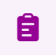

# Use sample app templates in Microsoft Teams

Several sample app templates are available for use in Microsoft Teams that you can download from [here](https://github.com/microsoft/teams-powerapps-app-templates). You can choose the sample app template that best fits your business requirement and quickly install it to get started. Sample app templates created with Power Apps typically consist of multiple components such as apps, flows, and tables.

> [!IMPORTANT]
> Sample app templates available for [download](https://github.com/microsoft/teams-powerapps-app-templates) are provided as-is. For any issues, feedback, support, or changes related to sample app templates, go to https://github.com/microsoft/teams-powerapps-app-templates/issues and submit an issue or a pull request.

## Available sample app templates

The following table lists sample app templates available for [download](https://github.com/microsoft/teams-powerapps-app-templates).

:::row:::
   :::column span="":::
         [Boards](https://github.com/microsoft/teams-powerapps-app-templates/tree/main/Boards)   A simple way to connect and share with people in your organization with similar interests.
   :::column-end:::
   :::column span="":::
         [Bulletins](https://github.com/microsoft/teams-powerapps-app-templates/tree/main/Bulletins)   Manager and user apps for company communications.
   :::column-end:::
   :::column span="":::
         [Employee ideas](https://github.com/microsoft/teams-powerapps-app-templates/tree/main/EmployeeIdeas)   App for campaigns and ideas.
   :::column-end:::
:::row-end:::
:::row:::
   :::column span="":::
         [How to](https://github.com/microsoft/teams-powerapps-app-templates/tree/main/HowTo)   Learn how to be a Power Apps maker.
   :::column-end:::
   :::column span="":::
         [Inspection](https://github.com/microsoft/teams-powerapps-app-templates/tree/main/Inspection)   Manager and user apps for area inspections.
   :::column-end:::
   :::column span="":::
         [Issue reporting](https://github.com/microsoft/teams-powerapps-app-templates/tree/main/IssueReporting)   Manager and user apps for issue reporting.
   :::column-end:::
:::row-end:::
:::row:::
   :::column span="":::
         [Milestones](https://github.com/microsoft/teams-powerapps-app-templates/tree/main/Milestones)   App to keep track of projects, and initiatives.
   :::column-end:::
    :::column span="":::
         [Perspectives](https://github.com/microsoft/teams-powerapps-app-templates/tree/main/Perspectives)   A simple way to add topics and extend the topics with Q&A for discussions.
   :::column-end:::
   :::column span="":::
         [Profile+](https://github.com/microsoft/teams-powerapps-app-templates/tree/main/ProfilePlus)   Quickly find out about people in your organization.
   :::column-end:::
:::row-end:::
:::row:::
   :::column span="":::
       [Get connected](https://github.com/microsoft/teams-powerapps-app-templates/tree/main/GetConnected)   Connect with people in your organization with similar skills.
   :::column-end:::
   :::column span="":::
    :::column-end:::
   :::column span="":::
    :::column-end:::
:::row-end:::

The following tutorial shows how to install the Employee ideas app. You can use similar steps to install other sample app templates.

## Install the sample app template

To learn about installing sample app templates, go to https://github.com/microsoft/teams-powerapps-app-templates.

> [!NOTE]
> - Installing sample app templates automatically enables the selected team's Microsoft 365 Group for security. More information: [Enable security for the selected team's Microsoft 365 Group](../maker/canvas-apps/share-app.md#share-an-app-with-microsoft-365-groups)
> - If you can't upload or install uploaded sample app templates, check your [app permission policies in Microsoft Teams](/microsoftteams/teams-app-permission-policies).

## Run the sample app template

To run the installed app, select the app's tab from the team channel. In this example, we'll use **Employee ideas**.

### Step 1 - Allow connections

Before you can use the app, it might ask your permission to use connections.

> [!NOTE]
> The list of connections you see below is an example. The number and types of connections asking for your permissions may vary depending on the app you install.

Select **Allow**, so the app can use connections.

### Step 2 - Select the channel

Select the channel (in this example, the channel is populated automatically), and then select **Let's go**.

### Step 3 - Use the app

The **Employee ideas** app is now open and ready for your use.

For more details about using the **Employee ideas** app, go to [Employee ideas](employee-ideas.md).

## Edit the sample app template

You can further customize and edit the components of an installed Power Apps app in Teams. More information: [Manage your apps](manage-your-apps.md)

## Report installation errors

If you get any errors during the installation process, you can help us troubleshoot the problem much more effectively by selecting **Ctrl**+**Alt**+**A** on the keyboard to get the session details. For more information about session details, go to [About tab](overview-of-the-power-apps-app.md#about).

For issues related to the sample app templates, report an issue at https://github.com/microsoft/teams-powerapps-app-templates.

## Sample app template updates

Updates to the sample app templates are published immediately. If you already have a sample app template in use when this happens, a new version of the app is created with these updates and published as the live version. If you [customized a sample app](customize-sample-apps.md), you can [restore the app to a previous version](manage-your-apps.md#restore-an-app) with your customizations, or recreate the customizations on top of the updated live version. When restoring the app to preserve your customizations, ensure to check the app functionality for compatibility with the updates.

## Sample app templates FAQs

For Frequently Asked Questions about sample app templates, go to [Sample app templates FAQs](sample-apps-faqs.md).

[!INCLUDE[footer-include](../includes/footer-banner.md)]