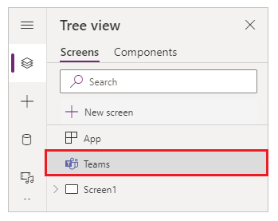

# Microsoft Teams integration object

You can use the Teams integration object to easily find and access the Teams integration features and use the improved usability of expressions while integrating your canvas app with Teams. The availability of a *Teams integration object* can be validated by checking the presence of **Teams** control from the tree view.



There are two features available with the integration of Power Apps with Teams. You can get a Teams theme inside a canvas app, and you can filter data depending on the team or channel context.

> [!NOTE]
> To further integrate with Teams, you can use the [Microsoft Teams connector](/connectors/teams/) with actions such as post a message, create a Teams meeting, list channels, and more.

## Get the Teams theme

Teams uses three themes: *Default*, *Dark*, and *High contrast.* When using the expressions to retrieve theme names, you can use the names as *Default*, *Dark*, and *Contrast* in the Power Apps formula bar.

To retrieve a theme name, use the following formula.

```powerapps-dot
Switch(
    Teams.Theme.Name,
    TeamsTheme.Default,
    Color.DimGrey,
    TeamsTheme.Dark,
    Color.White,
    TeamsTheme.Contrast,
    Color.Black
    )
```

In the above formula, the expression *Teams.Theme.Name* is used to evaluate theme names of *Default*, *Dark*, or *Contrast* and the color of the selected
canvas app object is changed depending on the color entered in the formula.

The [Switch() function](../maker/canvas-apps/functions/function-if.md) evaluates a formula and determines whether the result matches any value in a sequence that you specify.

")

This function results in changing the background of canvas app, depending on the change in the theme selection in Teams.


For example, use this formula in the [*Fill* property](../maker/canvas-apps/controls/properties-color-border.md#normal) of a control (such as, a rectangle) to change the fill color based on the selected Teams theme.

| **Teams theme**                               | **App background**                       |
|-----------------------------------------------|------------------------------------------|
| *Default (App background color: DimGrey)*     |  |
| *Dark (App background color: White)*          |  |
| *High contrast (App background color: Black)* |  |

## Get the Teams channel name to filter app data

You can get the Teams channel name in canvas app functions, such as [function Filter()](../maker/canvas-apps/functions/function-filter-lookup.md). To get a Teams channel name, use the following syntax:

```powerapps-dot
Teams.ThisChannel.DisplayName
```

For example, you can add a label and set the *Text* property to display the name of the Teams channel.


For example, [connecting to a list hosted on a SharePoint site](../maker/canvas-apps/connections/connection-sharepoint-online.md), you can list the items in a default gallery.


The list shows all items and a column representing the Teams channel name.


Considering the Teams channel name as *General*, you can use the following formula to filter the gallery content depending on the name of the channel.

*Filter('Colors', Channel = Teams.ThisChannel.DisplayName)*


For more information about the Teams client SDK, go to [Context interface](/javascript/api/@microsoft/teams-js/microsoftteams.context). For more information about using context from Teams, go to [Use context from teams](./embed-teams-app.md#use-context-from-teams).

### See also

[Manage your apps](manage-your-apps.md)  
[Understand Power Apps Studio](understand-power-apps-studio.md)


[!INCLUDE[footer-include](../includes/footer-banner.md)]