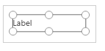

# Use Fluent UI controls

Creating apps that look great in Microsoft Teams will be easier with our new components. Built on the [Fluent UI framework](https://www.microsoft.com/design/fluent/#/), the new components will look great with Teams styles and will automatically adjust to the Teams default theme. The new controls are Button, Check box, Combo box, Date picker, Label, Radio group, Rating, Slider, Text box, and Toggle.

Let's take a look at each Fluent UI control and its most useful properties. For a complete list of controls and properties in Power Apps, go to [Controls and properties in Power Apps](../maker/canvas-apps/reference-properties.md).

## Button

A control that the user can select to interact with the app.

### Description

Configure the OnSelect property of a **Button** control to run one or more formulas when the user selects the control.

### Key properties

*ButtonType* – The style of button to show, Standard, or Primary. Default value: **Standard**.

*OnSelect* – How the app responds when the user selects a control.

*Text* – Text that appears on a control or that the user enters into a control.

## Check box

A control that the user can select or clear to set its value to **true** or
**false**.

### Description

The user can specify a Boolean value by using this familiar control, which has
been widely used in the user interface.

### Key properties

*Box side* – The side of the control on which the check box is displayed.

*Label* – Text that appears on a control.

*Checked* – Whether the control is checked or not.

## Combo box

A control that allows users to make selections from provided choices. Supports
search and multiple selections.

### Description

A **Combo box** control allows a user to search for items to select. The search
is done server-side on the *SearchField* property, so performance isn't
affected by large data sources.

Single-select or multiple-select mode is configured via the *SelectMultiple* property.

### Key properties

*Items* – The source of data from which selections can be made.

*DefaultSelectedItems* – The items that are initially selected before the user interacts with the control.

*SelectMultiple* – Whether the user can select a single item or multiple items.

*IsSearchable* – Whether the user can search for items before selecting.

## Date picker

A control that the user can select to specify a date.

### Description

If you add a **Date picker** control instead of a text input control, you
help ensure that the user specifies a date in the correct format.

### Key properties

*Value* – The date currently selected in a date control. This date is
represented in local time.

## Label

A box that shows data such as text, numbers, dates, or currency.

### Description

A label shows data that you specify as a literal string of text or as a formula that evaluates to a string of text. Labels often appear outside of any other control (such as a banner that identifies a screen), as a label that identifies another control (such as a rating or audio control), or in a gallery to show a specific type of information about an item.

### Key properties

*Color* – The color of text in a control.

*Font* – The name of the family of fonts in which text appears.

*Text* – The text that appears on a control.

## Radio group

An input control that shows multiple options, only one of which users can select at a time.

### Description

A **Radio group** control, a standard HTML input control, is best used with only a
few, mutually exclusive options.

### Key properties

*Items* – The source of data that appears in a control such as a gallery, a
list, or a chart.

*Selected* – The data record that represents the selected item.

## Rating

A control with which users can indicate a value from 0 through a maximum number
that you specify.

### Description

In this control, the user can indicate, for example, how much they liked
something by selecting a certain number of stars.

### Key properties

*Value* – The initial value of a control before it's changed by the user.

*Max* – The maximum value to which the user can set a slider or a rating.

## Slider

A control with which the user can specify a value by dragging a handle.

### Description

The user can indicate a value, between a minimum and a maximum value that you
specify, by dragging the handle of a slider left to right or up and down, depending on the direction that you choose.

### Key properties

*Max* – The maximum value to which the user can set a slider or a rating.

*Min* – The minimum value to which the user can set a slider.

*Value* – The value of an input control.

*Layout* – Whether a control is displayed horizontally or vertically.

*Show value* – Whether a control should display the value.

## Text box

A box in which the user can enter text, numbers, and other data.

### Description

The user can specify data by typing into a **Text box** control. Depending on how
you configure the app, that data might be added to a data source, used to
calculate a temporary value, or incorporated in some other way.

### Key properties

*Font* – The name of the family of fonts in which text appears.

*Text* – Text that appears on a control or that the user enters into a control.

## Toggle

A control that the user can turn on or off by moving its handle.

### Description

A **Toggle** control is designed for the modern user interface, but behaves the same way as a check box.

### Key properties

*Checked* – Whether the control is checked or not.

*OffText* – The text of the off state.

*OnText* – The text of the on state.

## Difference between Fluent UI and classic controls

Properties of controls have been simplified for the ease of use. The following table lists differences between Fluent UI controls and classic control property names.

| Control type | Classic | Fluent UI |
|---------|:-------:|:------:|
|Button|Fill Background TabIndex|ColorFill ColorBackground AcceptsFocus|
|Check box|Default TabIndex|Checked AcceptsFocus|
|Combo box|InputTextPlaceholder TabIndex|Text AcceptsFocus|
|Date picker|SelectedDate TabIndex|Value AcceptsFocus|
|Label|Size|FontSize|
|Radio group|TabIndex|AcceptsFocus|
|Rating|Default TabIndex|Value AcceptsFocus|
|Slider|Default TabIndex|Value AcceptsFocus|
|Text box|Color Default Fill SpellCheck TabIndex|ColorText Value ColorBackground EnableSpellCheck AcceptsFocus|
|Toggle|Size Default TabIndex|FontSize Checked AcceptsFocus|

### See also

[Create additional apps](create-additional-apps.md)  
[Understand Power Apps Studio](understand-power-apps-studio.md)

[!INCLUDE[footer-include](../includes/footer-banner.md)]
