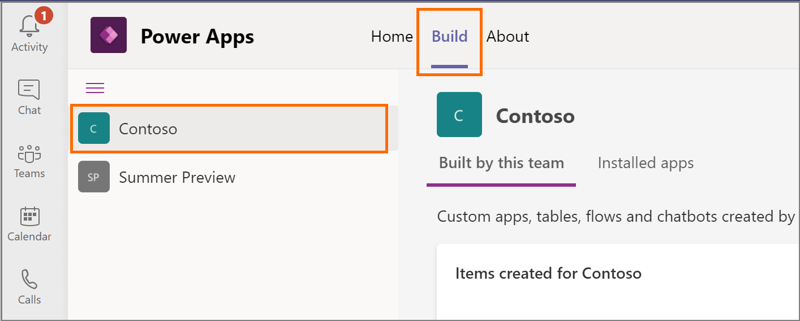
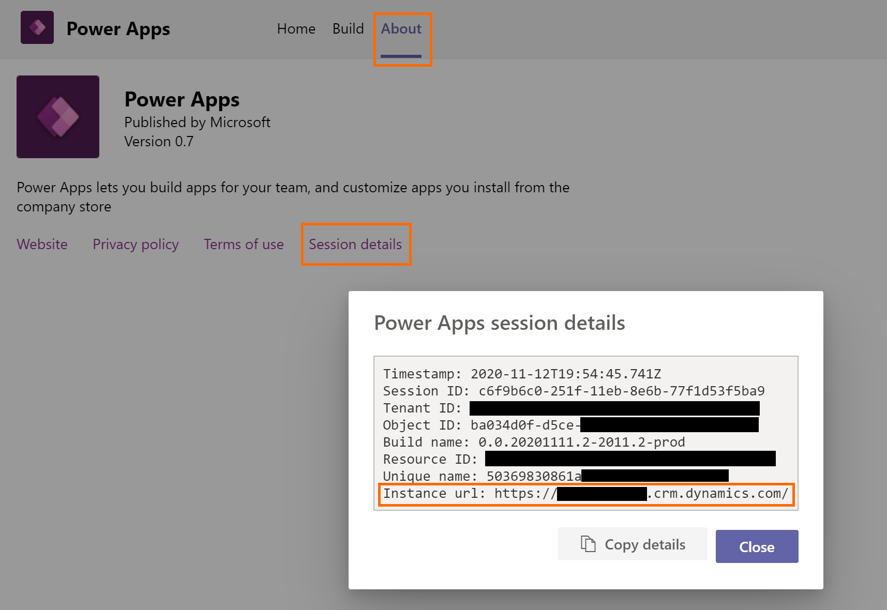
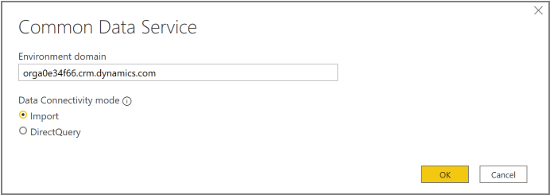
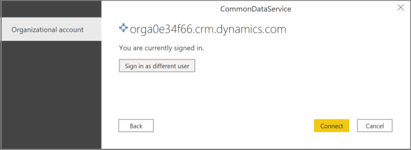

# View Dataverse for Teams table data in Power BI Desktop (Preview)

[!INCLUDE [cc-beta-prerelease-disclaimer](../includes/cc-beta-prerelease-disclaimer.md)]

You can use Power BI Desktop to view data from tables in Dataverse for Teams. This enables you to create sophisticated reports to analyze data from your Dataverse for Teams tables. This is possible using a new connector that can use direct query mode for real-time data while enforcing the Dataverse for Teams security model when accessing data. Additionally, the connector automatically maps relationships.

> [!IMPORTANT]
> - This is a preview feature.
> - [!INCLUDE[cc_preview_features_definition](../includes/cc-preview-features-definition.md)]
> - This feature is enabled only for the Dataverse for Teams environments created with the General Availability release. Dataverse for Teams environments created during the Public Preview release will be enabled later.

## Prerequisites

You must have the appropriate Power BI [license](/power-bi/admin/service-admin-licensing-organization) to build and share Power BI reports.

## Step 1: Get the environment URL

Follow the steps to get the URL of your Dataverse for Teams environment, which is required to connect from the Power BI Desktop.

1. Start Teams, and sign in.

1. In the left pane, select **Power Apps**, and then select the **Build** tab.

1. Select the team in the left pane that contains the data you want to view in Power BI.

    

1. Select the **About** tab, and then select **Session Details** to display the session details information.  Copy the Instance url value to notepad. This is the environment URL of your Dataverse for Team environment. For example: `https://orga0e34f66.crm.dynamics.com/`

    

## Step 2: View the table data in Power BI

1. Open Power BI Desktop, and sign in. Don’t have Power BI
    Desktop? [Get it now](https://powerbi.microsoft.com/downloads/).

1. Select **Get data**.

1. On the **Get Data** page, select **Power Platform** > **Common Data Service (Beta)**. Select **Connect**.

    

1. Read the preview disclaimer and select **Continue**.
 
1. On the next page, specify the environment URL that you copied earlier. Make sure you remove `https://` and the trailing `/` from the URL. So, in this case you will add `orga0e34f66.crm.dynamics.com`. Select the data connectivity mode and select **OK**.

    

1.  On the next page, select **Sign in**. You'll be prompted to specify your credentials to sign in to your Dataverse for Teams environment. Specify your credentials and submit.
 
1. On successful sign in, the **Connect** button becomes available. Select **Connect**. 

   

    The environment appears in the Power BI Desktop **Navigator** window. Expand it to view the tables available to analyze. Select a table to view its data.

   

For more information about working with Power BI Desktop, see [Get started with Power BI Desktop](/power-bi/desktop-getting-started).

### See also

[View Dataverse table data in Power BI Desktop (Preview)](../maker/data-platform/view-entity-data-power-bi.md)  
[Dataverse for Teams FAQs](data-platform-faqs.md)

[!INCLUDE[footer-include](../includes/footer-banner.md)]