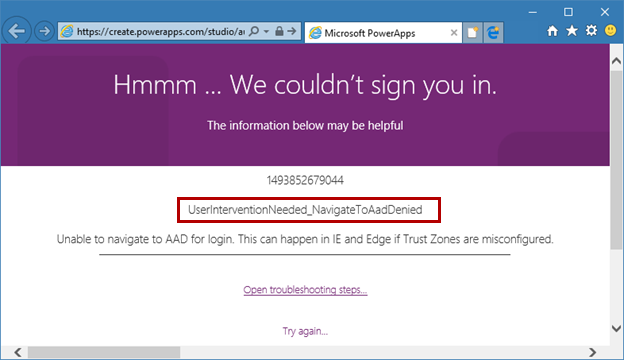

# Troubleshooting startup issues for Power Apps

This troubleshooting article helps fix common configuration problems that prevent [Power Apps](https://make.powerapps.com) from starting.

## Common errors

- When you receive the following error message related to cookie settings:

    ```
    Hmmm... Something went wrong.
    thirdPartyCookiesBlocked
    Please enable third party-cookies and site data in your browser settings. If you are using Chrome's Incognito mode, you can uncheck the 'Block third-party cookies' option on the Incognito langing page.
    Try again
    ```

    **Resolution**: [Enable third-party cookies and local data](#enable-storage-of-third-party-cookies-and-local-data-in-your-browser).

- When you sign in to Power Apps - especially using the *InPrivate* or *incognito* experience, you receive the following error:

    ```
    Sign in required
    Please select sign in to continue.
    Session ID: xxxxxxxx-xxxx-xxxx-xxxx-xxxxxxxxxxxx
    
    AADSTS50058: A silent sign-in request was sent but no user is signed in. The cookies used to represent the user's session were not sent in the request to Azure AD. This can happen if the user is using Internet Explorer or Edge, and the web app sending the silent sign-in request is in different IE security zone than the Azure AD endpoint (login.microsoftonline.com).
    Trace ID: xxxxxxxx-xxxx-xxxx-xxxx-xxxxxxxxxxxx
    Correlation ID: xxxxxxxx-xxxx-xxxx-xxxx-xxxxxxxxxxxx
    Timestamp: xxxx-xx-xx xx:xx:xxZ

    ```

    **Resolution**: [Enable third-party cookies and local data](#enable-storage-of-third-party-cookies-and-local-data-in-your-browser).

- When you receive a “Hmmm … We couldn’t sign you in” error message and identifier that resembles the following image:

    

    **Resolution**: Check [Resolutions for common errors](#resolutions-for-common-errors) for different error variations and resolutions.
    
- When you try to create an app from a SharePoint list, you receive the following "abnormal termination" error message
    ```
    WebAuthoring abnormal termination.

    Client date/time: <Client Time>Thh:mm:ss.sssZ
    Version: 2.0.602
    Session ID: xxxx-xxxxx-xxxxxxx--xxxxxxxx
    description: {"error":{"detail":{"exception":{}},"colno":0,"filename":"https://paaeuscdn.azureedge.net/v2.0.602.0/studio/openSource/modified/winjs/js/base.js?v=39de0f2edf1...",
    "lineno":0,"message":"Script error","initErrorEvent":"[function]","bubbles":false,"cancelBubble":false,"cancelable":false,"currentTarget":"[window]","defaultPrevented":true,
    "eventPhase":2,"isTrusted":true,"srcElement":"[window]","target":"[window]","timeStamp":1490711965955,"type":"error","initEvent":"[function]","preventDefault":"[function]",
    "stopImmediatePropagation":"[function]","stopPropagation":"[function]","AT_TARGET":2,"BUBBLING_PHASE":3,"CAPTURING_PHASE":1},"errorLine":0,"errorCharacter":0,
    "errorUrl":"https://paaeuscdn.azureedge.net/v2.0.602.0/studio/openSource/modified/winjs/js/base.js?v=39de0f2edf1... error","setPromise":"[function]","exception":{}}
    stack: null
    errorNumber: 0
    errorMessage: Script error
    ```

To resolve the issues listed above, read [Resolutions for common errors](#resolutions-for-common-errors), and try one of the listed resolutions.

## Resolutions for common errors

| Error | Microsoft Edge | Google Chrome | Microsoft Internet Explorer 11* |  Safari (iOS) |
| - | - | - | - | - |
| <ul> <li> Sign in required </li> <li> UserInterventionNeeded_CookiesBlocked </li> <li> UserInterventionNeeded_StorageBlocked </li> </ul> | [Enable third-party cookies and local data](#instructions-for-microsoft-edge) | [Enable third-party cookies and local data](#instructions-for-google-chrome) | [Enable third-party cookies and local data](#instructions-for-internet-explorer-11) | [Enable third-party cookies and local data](#instructions-for-safari-ios) |
| <ul> <li> UserInterventionNeeded_NavigateToAadTimeout </li> </ul> | Possible network problem | Possible network problem | Possible network problem | Possible network problem |
| <ul> <li> UserInterventionNeeded_NavigateToAadDenied </li> <li> UserInterventionNeeded_StorageLost </li> </ul> | Not applicable | Not applicable | [Configure Trust Zones](#configure-trust-zones-for-internet-explorer) | Not applicable |
| <ul> <li> AadError </li> </ul> | [Azure Active Directory Errors](#azure-active-directory-errors) | [Azure Active Directory Errors](#azure-active-directory-errors) | [Azure Active Directory Errors](#azure-active-directory-errors) | [Azure Active Directory Errors](#azure-active-directory-errors) |

*Microsoft Internet Explorer 11 support for Power Apps is deprecated. We recommend that you use Microsoft Edge. More information: [Deprecation announcement](https://docs.microsoft.com/power-platform/important-changes-coming#internet-explorer-11-support-for-dynamics-365-and-microsoft-power-platform-is-deprecated)

## Enable storage of third-party cookies and local data in your browser or app

Power Apps stores some data such as user identity and preferences locally leveraging your browser's capabilities. Problems occur if the browser blocks storage of such local data, or third-party cookies set by Power Apps.

Most browsers allow settings to reflect the changes immediately. You may also need to close all the browser windows and reopen instead.

To enable this setting for the Power Apps and Dynamics 365 mobile apps for iOS you need to work through the iOS settings linked to the app rather than through the browser settings fpr iOS. 

### Instructions for Microsoft Edge

- **Option 1: Enable storage of third-party cookies and local data for all sites**

    1. Select **Settings**.
    1. Select **Cookies and site permissions**.
    1. Expand **Cookies and site data**.
    1. Ensure the setting **Block third-party cookies** is disabled.
    1. If present, remove the following sites from the site-specific cookie configuration under **Block**, and **Clear on exit**:
        - `https://create.powerapps.com`
        - `https://*.create.powerapps.com`
        - `https://make.*.powerapps.com`
        - `https://make.powerapps.com`
        - `https://login.microsoftonline.com`
        - `https://apps.*.powerapps.com`
        - `https://apps.powerapps.com`

- **Option 2: Create exceptions to allow storage of third-party cookies and local data for Power Apps and associated services.**
    
    > [!NOTE]
    > The following steps require your Edge browser version to be **87 or above**.

    1. Select **Settings**.
    1. Select **Cookies and site permissions**.
    1. Expand **Cookies and site data**.
    1. Select **Add** under **Allow** and add:
        - `[*.]powerapps.com`
    1. Select **Clear browsing data on close**.
    1. Ensure **Cookies and other site data** is disabled. If you want to keep it enabled, select **Add** instead, and add:
        - `[*.]powerapps.com`

### Instructions for Google Chrome

- **Option 1: Enable storage of third-party cookies and local data for all sites**

    1. Select **Settings**.
    1. Select **Privacy and security**.
    1. Expand **Cookies and other site data**.
    1. Make sure that **Block third-party cookies** or **Block all cookies** isn't selected.
    1. If present, remove the following sites from the site-specific cookie configuration under **Sites that can always use cookies**, and **Always clear cookies when windows are closed**:
        - `https://create.powerapps.com`
        - `https://*.create.powerapps.com`
        - `https://make.*.powerapps.com`
        - `https://make.powerapps.com`
        - `https://login.microsoftonline.com`
        - `https://apps.*.powerapps.com`
        - `https://apps.powerapps.com`

- **Option 2: Create exceptions to allow storage of third-party cookies and local data for Power Apps and associated services**

    1. Select **Settings**.
    1. Select **Privacy and security**.
    1. Expand **Cookies and other site data**.
    1. Use **Add** for **Sites that can always use cookies** and add:
        - `[*.]powerapps.com`
    1. Ensure that you check the **Including third-party cookies on this site** option when adding the site.

### Instructions for Safari (iOS)

1. In Safari app, select **Safari**.
1. Select **Preferences**.
1. Select **Privacy**.
1. Ensure **Block all cookies** isn't selected.
1. Ensure **Prevent cross-site tracking** isn't selected.

### Instructions for Internet Explorer 11

- **Option 1: Enable local data for all sites**

    1. Close all Internet Explorer and Microsoft Edge windows.
    2. Select **OK** to close the **Internet Options** dialog box.
    3. Select **OK**.
    4. Remove any entries for `powerapps.com`.
    5. In the **Settings** section, select **Sites**.
    6. Select **OK**.
    7. Select **Accept** for third-party cookies.
    8. Select **Accept** for first-party cookies.
    9. In the **Settings** section, select **Advanced**.
    10. Select the **Privacy** tab.
    11. Select **Internet Options**.
    12. On the browser toolbar, select the gear icon.
    13. Open Internet Explorer.

- **Option 2: Create exceptions to enable local data for Power Apps and associated services**
    1. Open Internet Explorer.
    2. On the browser toolbar, select the gear icon.
    3. Select **Internet Options**.
    4. Select the **Privacy** tab.
    5. In the **Settings** section, select **Sites**.
    6. Add an entry to “Allow” `powerapps.com`.
    7. Select **OK**.
    8. Select **OK** to close the Internet Options dialog box.
    9. Close all Internet Explorer and Microsoft Edge windows.

### Instructions for Dynamics 365 for phones or Dynamics 365 for tablets app on iOS
1. On iOS select **Settings**.
1. Scroll down to **Dynamics 365**. 
1. Toggle on **Allow Cross-Website Tracking**.
    
### Instructions for Power Apps app on iOS
1. On iOS select **Settings**.
1. Scroll down to **Power Apps**. 
1. Toggle on **Allow Cross-Website Tracking**.

## Configure Trust Zones for Internet Explorer

Internet Explorer uses *Trust Zones*. Problems can occur if services on which Power Apps relies are in different Trust Zones in your browser settings.  (You might need assistance from your IT administrator to change some of these settings.)

> [!NOTE]
> Microsoft Internet Explorer 11 support for Power Apps is deprecated. We recommend that you use Microsoft Edge. More information: [Deprecation announcement](https://docs.microsoft.com/power-platform/important-changes-coming#internet-explorer-11-support-for-dynamics-365-and-microsoft-power-platform-is-deprecated)

- **Option 1: Add the required Power Apps domains to the Trusted Sites zone**
    1. On the browser toolbar, select the gear icon.
    1. Select **Internet Options**.
    1. Select the **Security** tab.
    1. Select **Trusted sites**.
    1. Select **Sites**.
    1. Add the following sites by typing the address and selecting **Add** for each:
        - `https://create.powerapps.com`
        - `https://*.create.powerapps.com`
        - `https://make.*.powerapps.com`
        - `https://make.powerapps.com`
        - `https://login.microsoftonline.com`
        - `https://apps.*.powerapps.com`
        - `https://apps.powerapps.com`
        - `https://*.powerapps.com`
    1. Select **Close**.
    1. Select **OK**.
    1. Close all Internet Explorer windows.

- **Option 2: Remove all the Power Apps domains from the Trusted Sites zone**
    1. On the browser toolbar, select the gear icon.
    1. Select **Internet Options**.
    1. Select the **Security** tab.
    1. Select **Trusted sites**.
    1. Select **Sites**.
    1. Remove all existing entries for the following sites:
        - `https://create.powerapps.com`
        - `https://*.create.powerapps.com`
        - `https://make.*.powerapps.com`
        - `https://make.powerapps.com`
        - `https://login.microsoftonline.com`
        - `https://apps.*.powerapps.com`
        - `https://apps.powerapps.com`
        - `https://*.powerapps.com`
        - Any other address that ends in `powerapps.com` or `create.powerapps.com`.
    1. Select **Close**.

## Azure Active Directory Errors

Azure Active Directory (Azure AD) is the technology on which the Power Apps relies for user authentication and authorization.

The error page that you see might contain additional information that can help diagnose and fix the problem.

To resolve Azure AD errors, you might need assistance from your IT department.

### See also

- [Common issues and resolutions](maker/canvas-apps/common-issues-and-resolutions.md)
- [Power Apps Support](https://powerapps.microsoft.com/support/)


[!INCLUDE[footer-include](includes/footer-banner.md)]
